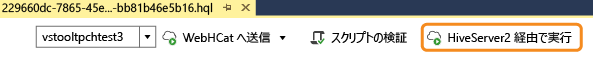
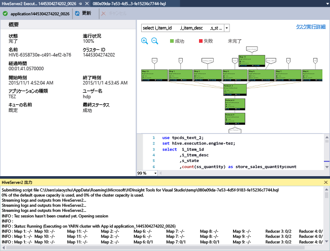
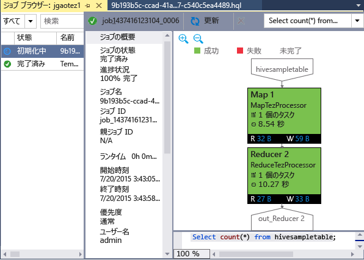

<properties
	pageTitle="HDInsight Tools for Visual Studio を使用する方法 | Microsoft Azure"
	description="Visual Studio Hadoop Tools for HDInsight をインストールして、Hadoop クラスターに接続し、Hive クエリを実行する方法について説明します。"
	keywords="Hadoop ツール, Hive クエリ, Visual Studio"
	services="HDInsight"
	documentationCenter=""
	tags="azure-portal"
	authors="mumian"
	manager="paulettm"
	editor="cgronlun"/>

<tags
	ms.service="hdinsight"
	ms.devlang="na"
	ms.topic="get-started-article"
	ms.tgt_pltfrm="na"
	ms.workload="big-data"
	ms.date="09/21/2015"
	ms.author="jgao"/>

# HDInsight Tools for Visual Studio を使用して Hive クエリを実行する

HDInsight Tools for Visual Studio を使用して HDInsight クラスターに接続し、Hive クエリを送信する方法について説明します。HDInsight の使用に関する詳細については、「[HDInsight での Hadoop 入門][hdinsight.introduction]」と「[HDInsight の概要][hdinsight.get.started]」をご覧ください。Storm クラスターへの接続に関する詳細については、「[Visual Studio を使用して HDInsight で Apache Storm の C# トポロジを開発する][hdinsight.storm.visual.studio.tools]」をご覧ください。

**前提条件**

このチュートリアルを完了して、Visual Studio で Hadoop ツールを使用するには、次が必要になります。

- Azure HDInsight クラスター: Linux ベースまたは Windows ベースのクラスターは、このドキュメントの手順で動作します。クラスター作成の詳細については、次のいずれかをご覧ください。

	- [Hadoop チュートリアル: Linux 上の HDInsight で Hive と Hadoop を使用する](hdinsight-hadoop-linux-tutorial-get-started.md)
	- [Hadoop のチュートリアル: Windows 上の HDInsight で Hadoop と Hive クエリを使用する](hdinsight-hadoop-tutorial-get-started-windows.md)

- 次のソフトウェアを搭載したワークステーション

	- Windows 8.1、Windows 8、Windows 7
	- 下記のいずれかのバージョンの Visual Studio
		- Visual Studio 2013 Community/Professional/Premium/Ultimate の[アップデート 4](https://www.microsoft.com/download/details.aspx?id=44921)
		- Visual Studio 2015 (Community/Enterprise)

	>[AZURE.NOTE]現時点では HDInsight Tools for Visual Studio は英語版のみになります。

## HDInsight Tools for Visual Studio をインストールする

HDInsight Tools for Visual Studio と Microsoft Hive ODBC ドライバーは、Microsoft Azure SDK for .NET バージョン 2.5.1 以降に付属しています。または、[Web Platform Installer](http://go.microsoft.com/fwlink/?LinkId=255386) を使用してインストールすることもできます。お使いの Visual Studio バージョンに対応するものを選択する必要があります。Visual Studio がインストールされていない場合は、[Web Platform Installer](http://go.microsoft.com/fwlink/?LinkId=255386) または次のリンクを使用して、最新の Visual Studio Community と Azure SDK をインストールできます。

- [Visual Studio Community 2015 と Microsoft Azure SDK](https://www.microsoft.com/web/handlers/webpi.ashx/getinstaller/VS2015CommunityAzurePack.appids) 
- [Visual Studio Community 2013 と Microsoft Azure SDK](https://www.microsoft.com/web/handlers/webpi.ashx/getinstaller/VS2013CommunityAzurePack.appids) 
- [Microsoft Azure SDK for .NET (VS 2015)](https://www.microsoft.com/web/handlers/webpi.ashx/getinstaller/VWDOrVs2015AzurePack.appids) 
- [Microsoft Azure SDK for .NET (VS 2013)](https://www.microsoft.com/web/handlers/webpi.ashx/getinstaller/VWDOrVs2013AzurePack.appids) 

![Hadoop ツール: HDinsight Tools for Visual Studio Web Platform installer][1]

## Azure サブスクリプションに接続する
HDInsight Tools for Visual Studio を使用して、HDInsight クラスターへの接続、いくつかの基本的な管理操作の実行、Hive クエリの実行が可能です。

>[AZURE.NOTE]HDInsight Emulator の使用法については、「[HDInsight Emulator の概要](../hdinsight-get-started-emulator.md/#vstools)」をご覧ください。

>[AZURE.NOTE]汎用の Hadoop クラスター (プレビュー) に接続する方法の詳細については、「[Visual Studio を使用した Hive クエリの書き込みと送信 (ブログの投稿)](http://blogs.msdn.com/b/xiaoyong/archive/2015/05/04/how-to-write-and-submit-hive-queries-using-visual-studio.aspx)」をご覧ください。

**Azure サブスクリプションに接続するには**

1.	Visual Studio を開きます。
2.	**[ビュー]** メニューで、**[サーバー エクスプローラー]** をクリックして、サーバー エクスプローラー ウィンドウを開きます。
3.	**[Azure]** を展開して、**[HDInsight]** を展開します。

	>[AZURE.NOTE]**[HDInsight タスク一覧]** ウィンドウが開きます。ウィンドウが表示されない場合は、**[ビュー]** メニューで **[その他のウィンドウ]** をクリックし、次に **[HDInsight タスク一覧ウィンドウ]** をクリックします。  
4.	Azure サブスクリプションの資格情報を入力し、**[サインイン]** をクリックします。この操作は、このワークステーションで、まだ一度も Visual Studio から Azure サブスクリプションに接続していない場合にのみ必要です。
5.	サーバー エクスプローラーに、既存の HDInsight クラスターの一覧が表示されます。クラスターが 1 つもない場合は、Azure プレビュー ポータル、Azure PowerShell、HDInsight SDK を使用してプロビジョニングできます。詳細については、「[HDInsight クラスターのプロビジョニング][hdinsight-provision]」をご覧ください。

	![Hadoop ツール: HDInsight Tools for Visual Studio サーバー エクスプローラー クラスターの一覧][5]
6.	HDInsight クラスターを展開します。**Hive データベース**、既定のストレージ アカウント、リンクされたストレージ アカウント、**Hadoop サービス ログ**が表示されます。さらに、エンティティを展開できます。

Azure サブスクリプションに接続した後で、次を実行できます。

**Visual Studio から Azure ポータルに接続するには**

- サーバー エクスプローラーで、**[Azure]**、**[HDInsight]** の順に展開し、[HDInsight クラスター] を右クリックして、**[Manage Cluster in Azure Portal]** をクリックします。

**Visual Studio から質問をしたりフィードバックを提供したりするには**

- **[ツール]** メニューで、**[HDInsight]**、**[MSDN フォーラム]** の順にクリックして質問するか、**[Give Feedback]** をクリックします

## リンクしているリソースへの移動

サーバー エクスプローラーで、既定のストレージ アカウント、すべてのリンクされたストレージ アカウントを確認できます。既定のストレージ アカウントを展開すると、そのストレージ アカウントのコンテナーを表示できます。既定のストレージ アカウントと既定のコンテナーがマークされます。コンテナーのいずれかの右クリックしてコンテンツを表示できます。

![HDInsight Tools for Visual Studio サーバー エクスプローラー クラスターの一覧][2]

## Hive クエリを実行する
[Apache Hive][apache.hive] は Hadoop に構築されるデータ ウェアハウス基盤であり、データを集約、照会、分析できます。HDInsight Tools for Visual Studio は Visual Studio からの Hive クエリの実行をサポートします。Hive の詳細については、「[HDInsight での Hive の使用][hdinsight.hive]」を参照してください。

HDInsight クラスターに対して Hive スクリプトをテストするには、数分以上かかる場合があります。HDInsight Tools for Visual Studio では、ライブ クラスターに接続しなくても、Hive スクリプトをローカルで検証できます。

加えて、HDInsight Tools for Visual Studio では、特定の Hive ジョブの YARN ログを収集して表示することで、Hive ジョブの内容を見ることができます。

### **hivesampletable** の表示
すべての HDInsight クラスターには、*hivesampletable* という Hive テーブルのサンプルが付属します。このテーブルを使用して Hive テーブルの一覧表示、テーブル スキーマの表示、Hive テーブル内の行の一覧表示を行う方法を説明します。

**Hive テーブルを一覧表示し、Hive テーブル スキーマを表示するには**

1.	**サーバー エクスプローラー**から、**[Azure]**、**[HDInsight]**、任意のクラスター、**[Hive データベース]**、**[既定]**、**[hivesampletable]** の順に展開し、テーブル スキーマを表示します。
4.	**[hivesampletable]** を右クリックし、**[上位 100 行を表示]** をクリックして、行を一覧表示します。これは、Hive ODBC ドライバーを使用して、次の Hive クエリを実行することと同等です。

		SELECT * FROM hivesampletable LIMIT 100

	行カウントをカスタマイズできます。

	![Hadoop ツール: HDinsight Hive Visual Studio スキーマ クエリ][6]

### Hive テーブルの作成

GUI を使用して Hive テーブルを作成するか、Hive クエリを使用できます。Hive クエリの使用については、[Hive クエリの実行](#run.queries)をご覧ください。

**Hive テーブルを作成するには**

1. **サーバー エクスプローラー**から、**[Azure]**、**[HDInsight クラスター]**、HDInsight クラスター、**[Hive データベース]** の順に展開し、**[既定]** を右クリックして、**[テーブルの作成]** をクリックします。
2. テーブルを構成します。
3. **[テーブルの作成]** をクリックして、新しい Hive テーブルを作成するためのジョブを送信します。

	![Hadoop ツール: HDinsight Visual Studio ツールで Hive テーブルを作成する][7]

### Hive クエリの検証と実行
Hive クエリを作成して実行するには次の 2 つの方法があります。

- アドホック クエリを作成する
- Hive アプリケーションを作成する

**アドホック クエリを作成、検証、実行するには**

1. **サービス エクスプローラー**から、**[Azure]**、**[HDInsight クラスター]** の順に展開します。
2. クエリを実行するクラスターを右クリックして、**[Hive クエリの作成]** をクリックします。
3. Hive クエリを入力します。Hive エディターは Intellisense をサポートしています。HDInsight Tools for Visual Studio で、Hive スクリプトの編集時にリモート メタデータの読み込みがサポートされます。たとえば、"SELECT * FROM" と入力すると、Intellisense には推奨されるテーブル名が一覧表示されます。テーブル名を指定すると、列名が Intellisense に一覧表示されます。ツールは、ほとんどすべての Hive の DML ステートメント、サブクエリ、および組み込みの UDF をサポートします。

	![Hadoop ツール: HDInsight Visual Studio Tools Intellisense][13]

	![Hadoop ツール: HDInsight Visual Studio Tools Intellisense][14]

	> [AZURE.NOTE]クラスターのメタデータのうち、HDInsight のツール バーで選択したものだけが推奨として表示されます。
4. (任意) **[Validate Script]** をクリックして、スクリプトの構文エラーを確認します。

	![Hadoop ツール: HDinsight Tools for Visual Studio ローカル検証][10]

4. **[送信]** または** [(高度な) 送信]** をクリックします。高度な送信オプションの場合は、スクリプトの**ジョブ名**、**引数**、**追加の構成**、**ステータス ディレクトリ**を構成します。

	![HDinsight Hadoop の Hive クエリ][9]

	ジョブを送信すると、**[Hive ジョブの概要]** ウィンドウが表示されます。

	![HDInsight Hadoop の Hive クエリの概要][8]
5. **[更新]** ボタンを使用して、ジョブのステータスが **[完了]** に変更されるまで、ステータスを更新します。
6. ウィンドウ下部のリンクをクリックして次の **[ジョブ クエリ]**、**[ジョブ出力]**、**[ジョブのログ]** または **[Yarn ログ]** を表示します。

**Hive ソリューションを作成し、実行するには**

1. **[ファイル]** メニューの **[新規作成]** をポイントし、**[プロジェクト]** をクリックします。
2. 左側のウィンドウから **[HDInsight]** を選択し、中央のウィンドウで **[Hive アプリケーション]** を選択して、プロパティを入力し、**[OK]** をクリックしします。

	![Hadoop ツール: HDinsight Visual Studio ツール新しい Hive プロジェクト][11]
3. **ソリューション エクスプローラー**で、**Script.hql** をダブルクリックして開きます。
4. Hive スクリプトを検証するには、**[Validate Script]** ボタンをクリックするか、Hive エディターでスクリプトを右クリックしてコンテキスト メニューから **[Validate Script]** をクリックします。

### Hive ジョブの表示
Hive ジョブのジョブ クエリ、ジョブ出力、ジョブのログ、Yarn ログを表示できます。詳細については、先のスクリーンショットをご覧ください。

最新版のツールでは、YARN ログを収集して表示することで、Hive ジョブの内容を確認できます。YARN ログは、パフォーマンス問題の検証に役立ちます。HDInsight での YARN ログの収集に関する詳細については、「[プログラムで HDInsight アプリケーション ログにアクセスする][hdinsight.access.application.logs]」をご覧ください。

**Hive ジョブの表示**

1. **サーバー エクスプローラー**から、**[Azure]**、**[HDInsight]** の順に展開します。
2. HDInsight クラスターを右クリックし、**[ジョブの表示]** をクリックします。クラスター上で実行した Hive ジョブの一覧が表示されます。
3. ジョブの一覧でジョブをクリックして選択し、**[Hive ジョブの概要]** ウィンドウを使用して **[ジョブ クエリ]**、**[ジョブ出力]**、**[ジョブのログ]**、または **[Yarn ログ]** を開きます。

	![Hadoop ツール: HDinsight Visual Studio ツールで新しい Hive ジョブを表示する][12]

### HiveServer2 による Hive 実行の高速化

>[AZURE.NOTE]この機能は、HDInsight クラスター バージョン 3.2 以降のみで動作します。

HDInsight Tools は、WebHCat (Templeton とも呼ばれます) を使用して Hive ジョブを送信するために使用され、ジョブの詳細やエラー情報を返すのに長い時間がかかります。このようなパフォーマンスの問題を解決するために、HDInsight Tools では、HiveServer2 を使用して直接クラスターで Hive ジョブを実行するため、RDP/SSH は経由されません。パフォーマンスが向上するだけでなく、ユーザーは、Hive on Tez のグラフやタスクの詳細を表示することもできます。

HDInsight クラスター バージョン 3.2 以降では、**[HiveServer2 から実行]** ボタンが表示されます。

ログがリアルタイムでストリーミングされていることを確認できます。また、Hive クエリが Tez で実行されている場合はジョブ グラフも確認できます。
 

### Tez Hive ジョブのパフォーマンス グラフ

HDInsight Tools for Visual Studio は Tez 実行エンジンで実行された Hive ジョブのパフォーマンス グラフの表示をサポートしています。Tez を有効にする方法については、[HDInsight での Hive の使用][hdinsight.hive]に関するページを参照してください。Visual Studio で Hive ジョブを送信した後、ジョブが完了すると、Visual Studio にグラフが表示されます。最新のジョブの状態を取得するには、**[更新]**ボタンをクリックする必要があります。

> [AZURE.NOTE]この機能はバージョン 3.2.4.593 以上の HDInsight クラスターでのみ使用でき、完了したジョブでのみ有効です。これは、Windows ベースと Linux ベースの両方のクラスターで機能します。

Hive クエリを理解しやすくするために、今回のリリースでツールに Hive 演算子表示機能が追加されました。ジョブ グラフの頂点をダブルクリックするだけで、頂点内のすべての演算子を表示できます。特定の演算子の上にマウス ポインターを置きことで、その演算子の詳細を表示することもできます。

### Hive on Tez ジョブのタスク実行ビュー

Hive on Tez ジョブのタスク実行ビューは、Hive ジョブの構造化および視覚化された情報の取得と、ジョブの詳細を取得に使用できます。パフォーマンスの問題が存在する場合は、このビューを使用して、さらなる詳細を確認することができます。たとえば、各タスクの動作や各タスクの詳細 (読み取られた/書き込まれたデータ、スケジュール時刻/開始時刻/終了時刻など) を確認できるため、視覚化された情報に基づいて、ジョブ構成やシステム アーキテクチャを調整できます。

## Pig のスクリプトを実行する

HDInsight Tools for Visual Studio は、Pig スクリプトの作成と、HDInsight クラスターへの送信をサポートしています。ユーザーは、テンプレートから Pig プロジェクトを作成して、HDInsight クラスターにスクリプトを送信できます。

## 次のステップ
この記事では、Hadoop ツール パッケージを使用して Visual Studio から HDInsight クラスターに接続し、Hive クエリを実行する方法を説明しました。詳細については、次を参照してください。

- [HDInsight での Hadoop Hive の使用][hdinsight.hive]
- [HDInsight で Hadoop を使用する][hdinsight.get.started]
- [HDInsight での Hadoop ジョブの送信][hdinsight.submit.jobs]
- [HDInsight での Hadoop を使用した Twitter データの分析][hdinsight.analyze.twitter.data]

<!--Anchors-->
[Installation]: #installation
[Connect to your Azure subscription]: #connect-to-your-azure-subscription
[Navigate the linked resources]: #navigate-the-linked-resources
[Run Hive queries]: #run-hive-queries
[Next steps]: #next-steps

<!--Image references-->
[1]: ./media/hdinsight-hadoop-visual-studio-tools-get-started/hdinsight.visual.studio.tools.wpi.png
[2]: ./media/hdinsight-hadoop-visual-studio-tools-get-started/hdinsight.visual.studio.tools.linked.resources.png
[5]: ./media/hdinsight-hadoop-visual-studio-tools-get-started/hdinsight.visual.studio.tools.server.explorer.png
[6]: ./media/hdinsight-hadoop-visual-studio-tools-get-started/hdinsight.visual.studio.tools.hive.schema.png
[7]: ./media/hdinsight-hadoop-visual-studio-tools-get-started/hdinsight.visual.studio.tools.create.hive.table.png
[8]: ./media/hdinsight-hadoop-visual-studio-tools-get-started/hdinsight.visual.studio.tools.run.hive.job.summary.png
[9]: ./media/hdinsight-hadoop-visual-studio-tools-get-started/hdinsight.visual.studio.tools.submit.jobs.advanced.png
[10]: ./media/hdinsight-hadoop-visual-studio-tools-get-started/hdinsight.visual.studio.tools.validate.hive.script.png
[11]: ./media/hdinsight-hadoop-visual-studio-tools-get-started/hdinsight.visual.studio.tools.new.hive.project.png
[12]: ./media/hdinsight-hadoop-visual-studio-tools-get-started/hdinsight.visual.studio.tools.view.hive.jobs.png
[13]: ./media/hdinsight-hadoop-visual-studio-tools-get-started/hdinsight.visual.studio.tools.intellisense.table.names.png
[14]: ./media/hdinsight-hadoop-visual-studio-tools-get-started/hdinsight.visual.studio.tools.intellisense.column.names.png

<!--Link references-->
[hdinsight-provision]: ../hdinsight/hdinsight-provision-clusters.md
[hdinsight.introduction]: ../hdinsight-introduction.md
[hdinsight.get.started]: ../hdinsight-get-started.md
[hdinsight.hive]: ../hdinsight/hdinsight-use-hive.md
[hdinsight.submit.jobs]: ../hdinsight/hdinsight-submit-hadoop-jobs-programmatically.md
[hdinsight.analyze.twitter.data]: ../hdinsight/hdinsight-analyze-twitter-data.md
[hdinsight.storm.visual.studio.tools]: ../hdinsight/hdinsight-storm-develop-csharp-visual-studio-topology.md
[hdinsight.access.application.logs]: ../hdinsight/hdinsight-hadoop-access-yarn-app-logs.md

[apache.hive]: http://hive.apache.org

<!---HONumber=Nov15_HO3-->