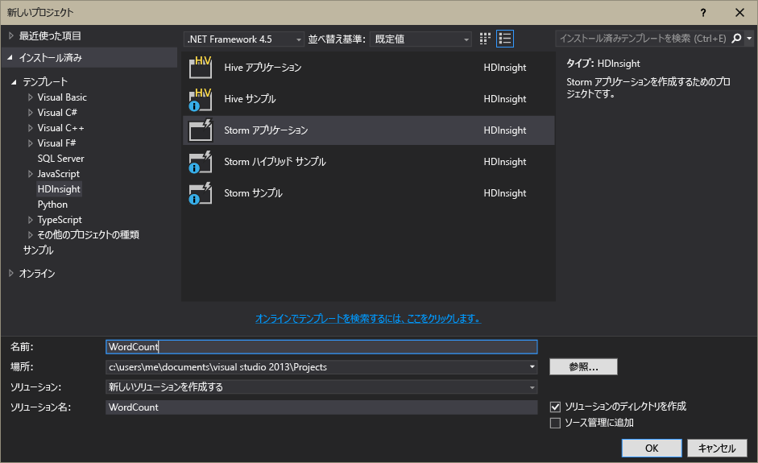

<properties
	pageTitle="HDInsight での Apache Storm の概要 |Microsoft Azure"
	description="Apache Storm の概要と、HDInsight で Storm を使用した、クラウドでのリアルタイムのデータ分析ソリューションを構築する方法について説明します。"
	keywords="apache storm,real time analytics"
	services="hdinsight"
	documentationCenter=""
	authors="Blackmist"
	manager="paulettm"
	editor="cgronlun"/>

<tags
   ms.service="hdinsight"
   ms.devlang="na"
   ms.topic="article"
   ms.tgt_pltfrm="na"
   ms.workload="big-data"
   ms.date="07/06/2015"
   ms.author="larryfr"/>

#HDInsight での Apache Storm の概要: Hadoop のリアルタイム分析

HDInsight の Apache Stormでは、[Apache Hadoop](http://hadoop.apache.org) を使用して Azure 環境に分散型の分析ソリューションをリアルタイムで作成できます。

##Apache Storm とは

Apache Storm は、Hadoop を使用して、リアルタイムでデータを処理できる、フォールト トレランスに優れたオープン ソースの分散型計算システムです。また、Storm のソリューションは、最初に正常に処理されなかったデータを再生する機能を備え、保証されたデータ処理を実現します。

##HDInsight で Apache Storm を使用する理由

HDInsight の Apache Storm は、管理されるクラスターとして、Azure 環境に統合されて提供されます。次の主要な利点を提供します。

* 稼働時間 99.9% の SLA を使用した管理されたサービスとして実行します。

* 好みの言語を使用できます: **Java**、**C#**、**Python** で書かれた Storm コンポーネントのサポートを提供します。

	* さまざまなプログラミング言語をサポートしています: Java を使用してデータを読み取り、C# を使用して処理できます。

	* **Trident** Java インターフェイスを使用して、メッセージの「厳密に 1 回」処理、「トランザクション」のデータストア永続化、一般的なストリーム分析操作のセットをサポートする Storm トポロジを作成します。

* 組み込みのスケールアップとスケールダウン機能 が含まれています。Storm トポロジの実行に影響を及ぼさずに、HDInsight クラスターを拡張します。

* Event Hub、Azure Virtual Network、SQL Database、Blob ストレージ、DocumentDB などの他の Azure のサービスと統合します。

	* Azure Virtual Network を使用して複数の HDInsight クラスターの機能を組み合わせることができます。HDInsight、HBase、Hadoop クラスターを使用する分析パイプラインを作成します。

リアルタイムの分析ソリューション用の Apache Storm を使用している企業の一覧については、「[Companies Using Apache Storm (Apache Stormを使用している企業)](https://storm.apache.org/documentation/Powered-By.html)」をご覧ください。

Storm の使用方法については、「[HDInsight での Storm の使用][gettingstarted]」をご覧ください。

###プロビジョニングのしやすさ

HDInsight クラスター上に新しい Storm を数分でプロビジョニングできます。クラスター名、サイズ、管理者アカウント、ストレージ アカウントを指定します。Azure は、トポロジのサンプルや Web 管理ダッシュボードを含む、クラスターを作成します。

Azure ポータルを使用して、HDInsight クラスター上の Storm をプロビジョニングする例を次に示します。[Azure PowerShell](../install-configure-powershell.md) を使用して、Storm クラスターをプロビジョニングすることもできます。

要求を送信すると、15 分以内には、新しい Storm クラスターが実行され、最初のリアルタイム分析のパイプラインの準備が完了します。

###使いやすさ

Visual Studio を使用する場合、HDInsight Tools for Visual Studio で C# とハイブリッド C# /Java トポロジを作成し、それらを HDInsight クラスター上の Storm に送信できます。

HDInsight Tools for Visual Studio は、クラスター上の Storm トポロジを監視し、管理することができるインターフェイスも提供しています。

HDInsight を使用して Storm アプリケーションを作成する例については、「[Visual Studio を使用して HDInsight で Apache Storm の C# トポロジを開発する](hdinsight-storm-develop-csharp-visual-studio-topology.md)」をご覧ください。

HDInsight Tools for Visual Studio に関する詳細については、「[HDInsight Tools for Visual Studio の使用開始](../HDInsight/hdinsight-hadoop-visual-studio-tools-get-started.md)」をご覧ください。

HDInsight クラスター上の各 Storm には、クラスターで実行されている Storm トポロジを送信、監視、管理することができる Web ベースの Storm ダッシュボードも用意されています。

Storm ダッシュボードの使用に関する詳細については、「[HDInsight での Apache Storm トポロジのデプロイと管理](hdinsight-storm-deploy-monitor-topology.md)」をご覧ください。

HDInsight Storm では、**Event Hub Spout** を介して Azure Event Hubs と簡単に統合できます。これは、**%STORM_HOME%\examples\eventhubspout\eventhubs-storm-spout-0.9-jar-with-dependencies.jar** の各 Storm クラスターで使用できます。Storm トポロジでのこのスパウトの使用例については、「[Event Hubs の使用](service-bus-event-hubs-c-storm-getstarted.MD)」と「[Storm と HBase を使用したセンサー データの分析](hdinsight-storm-sensor-data-analysis.MD)」をご覧ください。

###信頼性

Apache Storm ストームは、データ分析が多数のノードにまたがる場合でも、各着信メッセージを完全に処理することを常に保証します。

**Nimbus ノード**は Hadoop JobTracker に同様の機能を提供し、**Zookeeper** を介して、タスクをクラスターの他のノードに割り当てます。Zookeeper ノードは、クラスターに調整を提供し、Nimbus と ワーカー ノードの **Supervisor** 処理間の通信を容易にします。処理中のノードの 1 つがダウンした場合、Nimbus ノードに通知され、タスクと関連付けられているデータが別のノードに割り当てられます。

Apache Storm の既定の構成では、Nimbus ノードは 1 つだけです。HDInsight の Storm では、2 つの Nimbus ノードを実行します。プライマリ ノードが失敗すると、プライマリ ノードが復旧中は、HDInsight クラスターはセカンダリ ノードに切り替わります。

###スケール

作成中にクラスター内のノード数を指定できますが、ワークロードに一致するようにクラスターを拡大、縮小できます。すべての HDInsight クラスターで、データの処理中でも、クラスター内のノード数を変更できます。

###サポート

HDInsight の Storm には、完全なエンタープライズ レベルの 24 時間 365 日のサポートが付属します。HDInsight の Storm では、99.9% の SLA も保証されています。つまり、クラスターは、99.9% 以上の時間において外部に接続されることを保証します。

##リアルタイム分析の一般的なユース ケース

以下に、HDInsight で Apache Storm を使用する一般的なシナリオをいくつか示します。実際のシナリオの詳細については、「[how companies are using Storm (企業での Storm の使用事例)](https://storm.incubator.apache.org/documentation/Powered-By.html)」をご覧ください。

* モノのインターネット(IoT)
* 不正行為の検出
* ソーシャル分析
* Extract Transform Load (ETL)
* ネットワーク監視
* 検索
* Mobile Engagement  

##HDInsight Storm のデータの処理方法

Apache Storm は、HDInsight や Hadoop から使用することが一般的な MapReduce ジョブではなく、**トポロジ**を処理します。HDInsight クラスターの Storm には、**Nimbus** を実行するヘッド ノードと **Supervisor** を実行するワーカー ノードの 2 種類のノードが含まれます。

* **Nimbus** - Hadoop の JobTracker 同様、クラスター全体へのコードの配布、仮想マシンへのタスクの割り当て、障害の監視を処理します。HDInsight は 2 つの Nimbus ノードを提供するため、HDInsight の Storm クラスターに単一障害点が生じません。

* **Supervisor**: 各ワーカー ノードの supervisor は、ノードの**ワーカー プロセス**の開始と停止を処理します。

* **ワーカー プロセス**: **トポロジ**のサブセットを実行します。実行中のトポロジは、クラスター内の多くのワーカー プロセスに分散されます。

* **トポロジ**: データ **ストリーム**を処理する計算処理のグラフを定義します。MapReduce ジョブとは異なり、トポロジは停止されるまで実行されます。

* **ストリーム**: **タプル**のバインドされていないコレクション。ストリームは、**スパウト**と**ボルト**により生成され、**ボルト**によって利用されます。

* **タプル**: 動的に型指定される値の名前付きのリスト

* **スパウト**: データ ソースのデータを利用し、1 つ以上の**ストリーム**を発します。

	> [AZURE.NOTE]多くの場合、データは、Kafka、Azure Service Bus queues、Event hubs などのキューから読み取られます。システムが停止した場合、キューが確実にデータを保持します。

* **ボルト**: **ストリーム**を利用し、**タプル**に対して処理を実行します。**ストリーム**を発する場合もあります。ボルトは、キュー、HDInsight HBase、BLOB、その他のデータ ストアなどの、外部ストレージへのデータの書き込みも処理します。

* **Apache Thrift**: 拡張性のある、多言語サービス開発のためのソフトウェア フレームワークです。これを使用すると、C++、Java、Python、PHP、Ruby、Erlang、Perl、Haskell、C#、Cocoa、JavaScript、Node.js、Smalltalk、その他の言語の間で動作するサービスを構築できます。

	* **Nimbus** は Thrift サービスであり、**トポロジ**は Thrift の定義であるため、さまざまなプログラミング言語を使用してトポロジを開発できます。

Storm コンポーネントの詳細については、apache.org の「[Storm のチュートリアル][apachetutorial]」をご覧ください。

##使用できるプログラミング言語

HDInsight クラスターの Stormでは、C#、Java、Python のサポートを提供します。

### C (&) #35；

HDInsight Tools for Visual Studio では、.NET 開発者は、C# のトポロジを設計し、実装できます。Java と C# のコンポーネントを使用するハイブリッド トポロジを作成することもできます。

詳細については、「[Visual Studio を使用して HDInsight で Apache Storm の C# トポロジを開発する](hdinsight-storm-develop-csharp-visual-studio-topology.md)」をご覧ください。

###Java

目にすることがあるほとんどの Java の例は、プレーンな Java か Trident です。Trident は、結合、集計、グループ化、フィルタリングなどの実行を容易にするための、高レベルの抽象概念です。ただし、Trident は、タプルのバッチに作用し、ここでは未加工の Java ソリューションが 1 回に 1 タプルずつストリームを処理します。

Trident の詳細については、apache.org の「[Trident のチュートリアル](https://storm.incubator.apache.org/documentation/Trident-tutorial.html)」をご覧ください。

未加工の Java と Trident トポロジの例については、HDInsight Storm クラスターの **%storm_home%\contrib\storm-starter** ディレクトリをご覧ください。

##一般的な開発パターンの例

###メッセージの処理の保証

Storm は、さまざまなレベルでメッセージの処理を保証します。たとえば、基本的な Storm アプリケーションは "最低 1 回" の処理を保証できますが、Trident は "厳密に 1 回" の処理を保証できます。

詳細については、apache.org の「[Guarantees on data processing (データ処理の保証)](https://storm.apache.org/about/guarantees-data-processing.html)」をご覧ください。

###IBasicBolt

入力タプルを読み込み、0 個以上のタプルを発行し、実行メソッドの終了直後に入力タプルを確認するというパターンは一般的であるため、Storm は、[IBasicBolt](https://storm.apache.org/apidocs/backtype/storm/topology/IBasicBolt.html) インターフェイスを提供してこのパターンを自動化しています。

###結合

2 つのデータ ストリームの結合は、アプリケーションによって異なります。たとえば、複数のストリームの各タプルを 1 つの新しいストリームに結合したり、特定のウィンドウに対してのみタプルのバッチを結合したりする場合があります。いずれの場合も、結合は [fieldsGrouping](http://javadox.com/org.apache.storm/storm-core/0.9.1-incubating/backtype/storm/topology/InputDeclarer.html#fieldsGrouping%28java.lang.String,%20backtype.storm.tuple.Fields%29) を使用して実行されます。これは、ボルトへのタプルのルーティングの定義方法の 1 つです。

次の Java の例では、fieldsGrouping は、**MyJoiner** ボルトへの、コンポーネント "1"、"2"、"3" から発生したタプルのルーティングに使用されています。

	builder.setBolt("join", new MyJoiner(), parallelism) .fieldsGrouping("1", new Fields("joinfield1", "joinfield2")) .fieldsGrouping("2", new Fields("joinfield1", "joinfield2")) .fieldsGrouping("3", new Fields("joinfield1", "joinfield2"));

###バッチ処理

バッチ処理はいくつかの方法で実行できます。基本的な Storm Java トポロジでは、単純なカウンターを使用して、X 個のタプルをバッチ処理してから発したり、tick タプルと呼ばれる内部の時間調整メカニズムを使用して X 秒ごとにバッチを発したりできます。

tick タプルを使用する例については、「[Storm と HDInsight を使用したセンサー データの分析](hdinsight-storm-sensor-data-analysis.md)」をご覧ください。

Trident を使用している場合、これはタプルのバッチ処理を基盤とします。

###キャッシュ

メモリ内キャッシュは、頻繁に使用されるアセットをメモリ内に保持することで、処理速度を上げるためのメカニズムとしてよく使用されます。トポロジは、複数のノードにわたって、また各ノード内の複数のプロセスにわたって分散されるため、キャッシュの検索に使用されるフィールドを含むタプルが常に同じプロセスにルーティングされるように、[fieldsGrouping](http://javadox.com/org.apache.storm/storm-core/0.9.1-incubating/backtype/storm/topology/InputDeclarer.html#fieldsGrouping%28java.lang.String,%20backtype.storm.tuple.Fields%29) の使用を検討する必要があります。これにより、プロセス間でのキャッシュ エントリの重複が回避されます。

###トップ N のストリーミング

トポロジが、Twitter のトレンドのトップ 5 など、"トップ" N の値の計算に依存する場合、トップ N の値を同時に計算し、計算の出力をグローバル値に結合する必要があります。これには、[fieldsGrouping](http://javadox.com/org.apache.storm/storm-core/0.9.1-incubating/backtype/storm/topology/InputDeclarer.html#fieldsGrouping%28java.lang.String,%20backtype.storm.tuple.Fields%29) を使用し、並列のボルトにフィールド別にルーティングし、データをフィールド値で分割して、次に、トップ N の値を一括で決定するボルトにルーティングします。

この詳細については、「[RollingTopWords](https://github.com/nathanmarz/storm-starter/blob/master/src/jvm/storm/starter/RollingTopWords.java)」の例を参照してください。

##次のステップ

HDInsight で Apache Storm を使用したリアルタイム分析ソリューションの詳細について学習します。

* [HDInsight での Storm の使用][gettingstarted]

* [HDInsight 上の Storm に関するトポロジ例](hdinsight-storm-example-topology.md)

[stormtrident]: https://storm.incubator.apache.org/documentation/Trident-API-Overview.html
[samoa]: http://yahooeng.tumblr.com/post/65453012905/introducing-samoa-an-open-source-platform-for-mining
[apachetutorial]: https://storm.incubator.apache.org/documentation/Tutorial.html
[gettingstarted]: ../hdinsight-storm-getting-started.md

<!---HONumber=July15_HO4-->