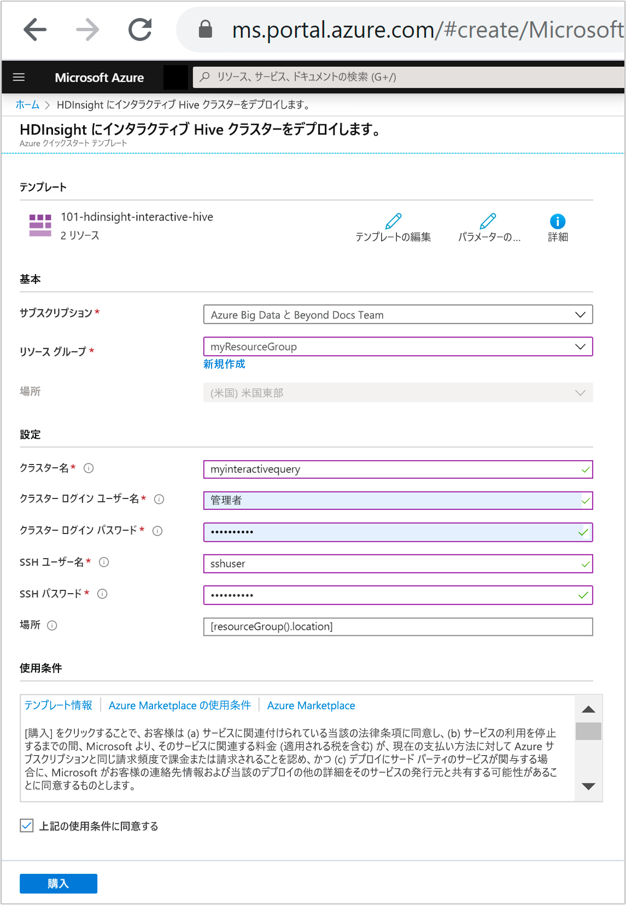
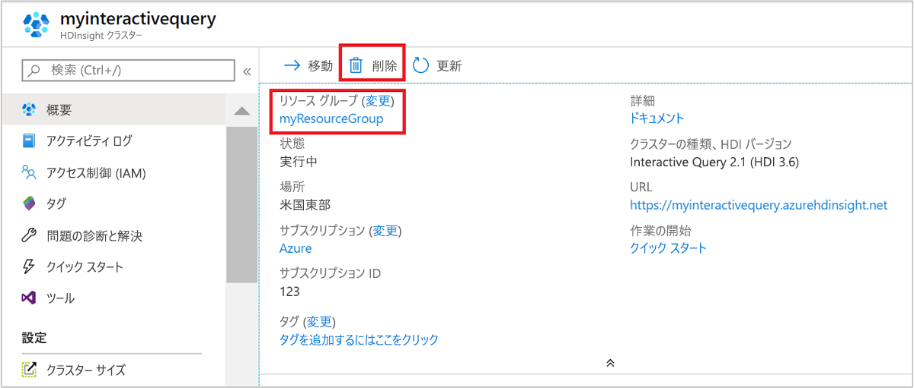

# クイック スタート:Resource Manager テンプレートを使用して Azure HDInsight 内に Interactive Query クラスターを作成する

このクイックスタートでは、Azure Resource Manager テンプレートを使用し、Azure HDInsight に [Interactive Query](./apache-interactive-query-get-started.md) クラスターを作成します。 対話型クエリ (別名 Apache Hive LLAP または [Low Latency Analytical Processing](https://cwiki.apache.org/confluence/display/Hive/LLAP)) は、Azure HDInsight の[クラスターの一種](../hdinsight-hadoop-provision-linux-clusters.md#cluster-type)です。

[!INCLUDE [About Azure Resource Manager](../../../includes/resource-manager-quickstart-introduction.md)]

Azure サブスクリプションをお持ちでない場合は、開始する前に [無料アカウント](https://azure.microsoft.com/free/?WT.mc_id=A261C142F) を作成してください。

## 対話型クエリ クラスターの作成

### テンプレートを確認する

このクイック スタートで使用されるテンプレートは [Azure クイック スタート テンプレート](https://github.com/Azure/azure-quickstart-templates/tree/master/101-hdinsight-interactive-hive)からのものです。

:::code language="json" source="~/quickstart-templates/101-hdinsight-interactive-hive/azuredeploy.json" range="1-158":::

テンプレートでは、次の 2 つの Azure リソースが定義されています。

* [Microsoft.Storage/storageAccounts](https://docs.microsoft.com/azure/templates/microsoft.storage/storageaccounts): Azure のストレージ アカウントを作成します。
* [Microsoft.HDInsight/cluster](https://docs.microsoft.com/azure/templates/microsoft.hdinsight/clusters): HDInsight クラスターを作成します。

### テンプレートのデプロイ

1. 下の **[Azure へのデプロイ]** ボタンを選択して Azure にサインインし、Resource Manager テンプレートを開きます。

    

1. 次の値を入力または選択します。

    |プロパティ |説明 |
    |---|---|
    |サブスクリプション|ドロップダウン リストから、このクラスターに使用する Azure サブスクリプションを選択します。|
    |Resource group|ドロップダウン リストから既存のリソース グループを選択するか、 **[新規作成]** を選択します。|
    |場所|この値には、リソース グループに使用される場所が自動入力されます。|
    |クラスター名|グローバルに一意の名前を入力します。 このテンプレートの場合、使用できるのは小文字と数字のみです。|
    |[Cluster Login User Name]\(クラスター ログイン ユーザー名\)|ユーザー名を指定します。既定値は **admin** です。|
    |[クラスター ログイン パスワード]|パスワードを指定します。 パスワードは 10 文字以上で、数字、大文字、小文字、英数字以外の文字 (' " ` を除く) が少なくとも 1 つずつ含まれる必要があります。 |
    |SSH ユーザー名|ユーザー名を指定します。既定値は sshuser です。|
    |SSH パスワード|パスワードを指定します。|

    

1. 「**使用条件**」をご確認ください。 次に **[上記の使用条件に同意する]** を選択し、 **[購入]** を選択します。 ご自分のデプロイの進行状況が通知されます。 クラスターの作成には約 20 分かかります。

## デプロイされているリソースを確認する

クラスターが作成されると、 **[リソースに移動]** リンクを含む**デプロイ成功**通知を受け取ります。 ご自分の [リソース グループ] ページに、ご自分の新しい HDInsight クラスターと、そのクラスターに関連付けられている既定のストレージが一覧表示されます。 各クラスターには、[Azure Storage アカウント](../hdinsight-hadoop-use-blob-storage.md)または [Azure Data Lake Storage アカウント](../hdinsight-hadoop-use-data-lake-store.md)との依存関係があります。 このアカウントを、既定のストレージ アカウントと呼びます。 HDInsight クラスターとその既定のストレージ アカウントは、同じ Azure リージョンに配置されている必要があります。 クラスターを削除しても、ストレージ アカウントは削除されません。

## リソースをクリーンアップする

このクイックスタートを完了したら、必要に応じてクラスターを削除できます。 HDInsight を使用すると、データは Azure Storage に格納されるため、クラスターは、使用されていない場合に安全に削除できます。 また、HDInsight クラスターは、使用していない場合でも課金されます。 クラスターの料金は Storage の料金の何倍にもなるため、クラスターを使用しない場合は削除するのが経済的にも合理的です。

Azure portal からお使いのクラスターに移動し、 **[削除]** を選択します。

リソース グループ名を選び、リソース グループ ページを開いて、 **[リソース グループの削除]** を選ぶこともできます。 リソース グループを削除すると、HDInsight クラスターと既定のストレージ アカウントの両方が削除されます。

## 次のステップ

このクイック スタートでは、Resource Manager テンプレートを使用して HDInsight で Interactive Query クラスターを作成する方法を学習しました。 次の記事では、Apache Zeppelin を使用して Apache Hive クエリを実行する方法について説明します。

> [!div class="nextstepaction"]
> [Azure HDInsight で Apache Zeppelin を使用して Apache Hive クエリを実行する](./hdinsight-connect-hive-zeppelin.md)
