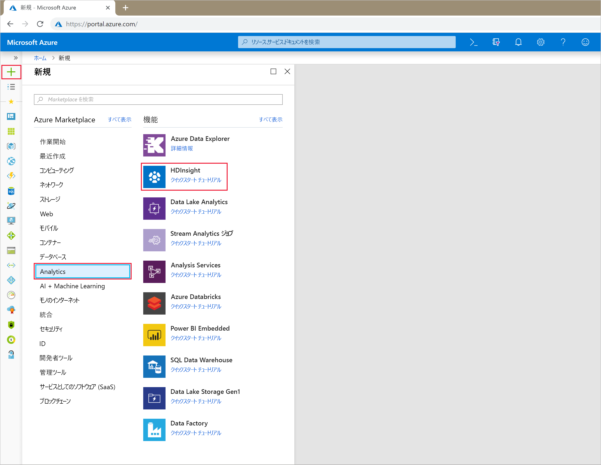
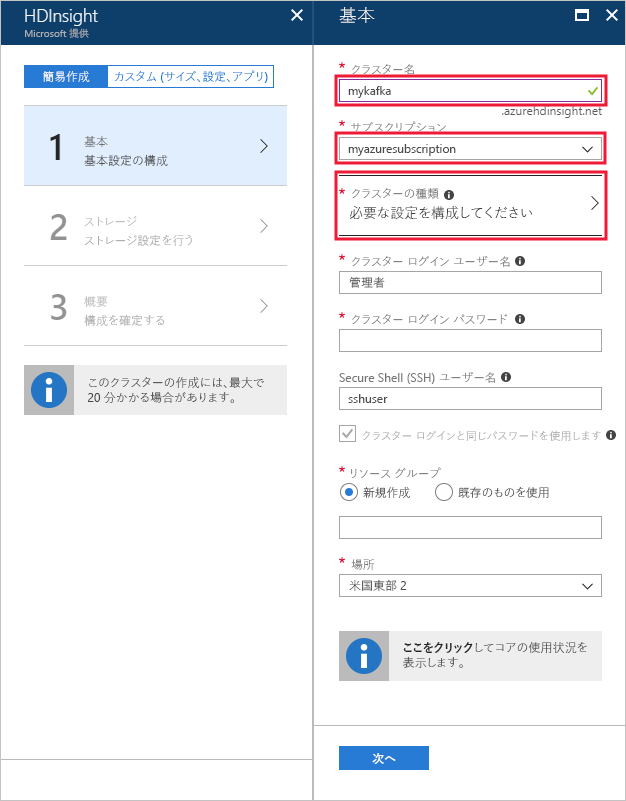
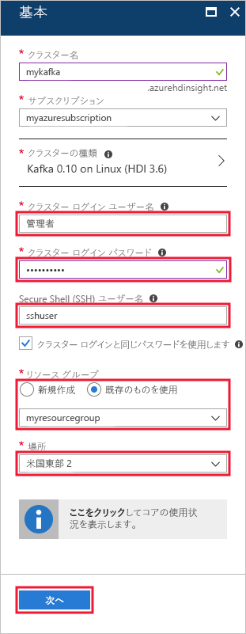
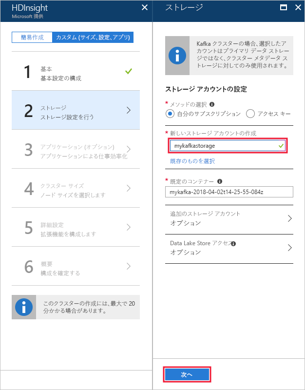
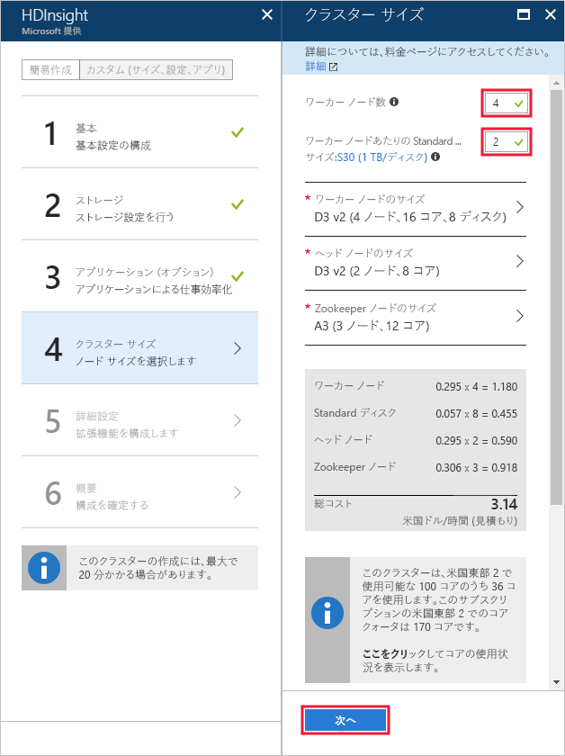
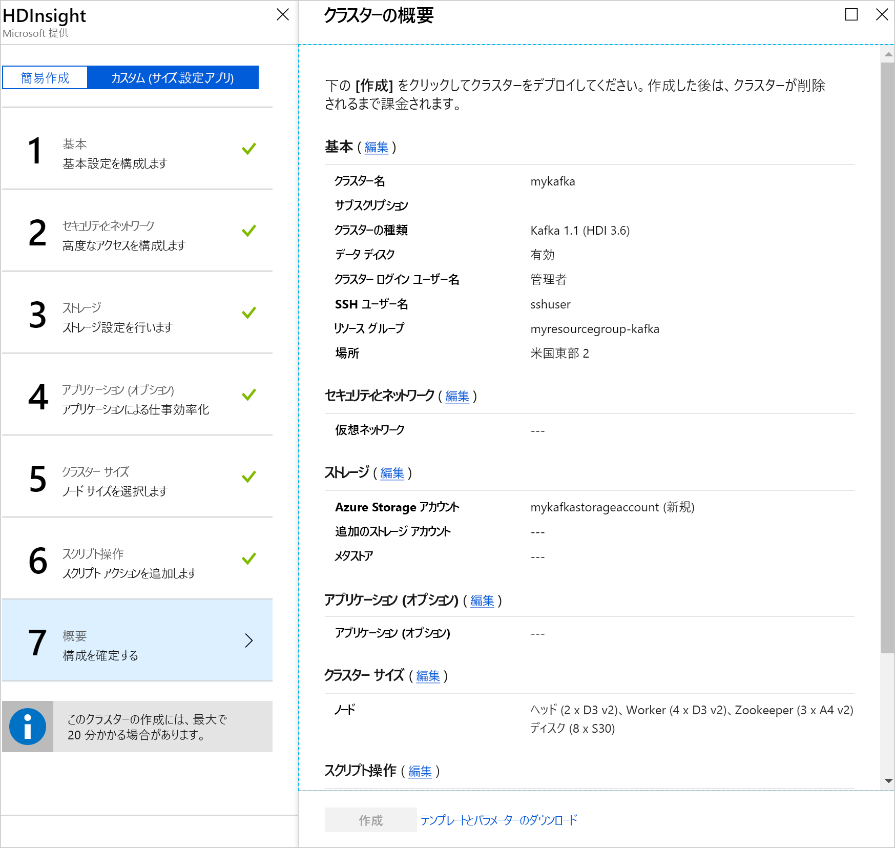

# <a name="quickstart-create-a-kafka-on-hdinsight-cluster"></a>クイック スタート: HDInsight クラスターに Kafka を作成する

Kafka は、オープンソースの分散ストリーミング プラットフォームです。 発行/サブスクライブ メッセージ キューと同様の機能を備えているため、メッセージ ブローカーとして多く使われています。 

このクイックスタートでは、Azure Portal を使用して [Apache Kafka](https://kafka.apache.org) クラスターを作成する方法について説明します。 Kafka を使用して、付属のユーティリティでメッセージを送受信する方法についても説明します。

[!INCLUDE [delete-cluster-warning](../../../includes/hdinsight-delete-cluster-warning.md)]

> [!IMPORTANT]
> Kafka API は、同じ仮想ネットワーク内のリソースによってのみアクセスできます。 このクイック スタートでは、SSH を使って直接クラスターにアクセスします。 他のサービス、ネットワーク、または仮想マシンを Kafka に接続するには、まず、仮想ネットワークを作成してから、ネットワーク内にリソースを作成する必要があります。
>
> 詳しくは、[仮想ネットワークを使用した Kafka への接続](apache-kafka-connect-vpn-gateway.md)に関するドキュメントをご覧ください。

## <a name="prerequisites"></a>前提条件

* Azure サブスクリプション。 Azure サブスクリプションがない場合は、開始する前に[無料アカウント](https://azure.microsoft.com/free/?WT.mc_id=A261C142F)を作成してください。

* SSH クライアント このドキュメントの手順では、SSH を使って、クラスターに接続します。

    Linux、Unix、および macOS システムでは、既定で `ssh` コマンドが用意されています。 Windows 10 では、次のいずれかの方法を使って、`ssh` コマンドをインストールします。

    * [Azure Cloud Shell](https://docs.microsoft.com/azure/cloud-shell/quickstart) を使います。 Cloud Shell は `ssh` コマンドを提供し、シェル環境として Bash または PowerShell を使うように構成できます。

    * [Windows Subsystem for Linux をインストールします](https://docs.microsoft.com/windows/wsl/install-win10)。 Microsoft Store から入手可能な Linux ディストリビューションでは、`ssh` コマンドが提供されています。

    > [!IMPORTANT]
    > このドキュメントの手順では、上記のいずれかの SSH クライアントを使っていることを前提としています。 別の SSH クライアントを使っていて、問題が発生した場合は、お使いの SSH クライアントのドキュメントを参照してください。
    >
    > 詳細については、[HDInsight での SSH の使用](../hdinsight-hadoop-linux-use-ssh-unix.md)に関するドキュメントを参照してください。

## <a name="create-a-kafka-cluster"></a>Kafka クラスターの作成

HDInsight クラスターで Kafka を作成するには、次の手順に従います。

1. [Azure Portal](https://portal.azure.com) で、**[+ リソースの作成]**、**[データ + 分析]**、**[HDInsight]** の順に選択します。
   
    

2. **[基本]** から次の情報を入力するか、選択します。

    | Setting | 値 |
    | --- | --- |
    | クラスター名 | HDInsight クラスターの一意の名前。 |
    | サブスクリプション | サブスクリプションを選択します。 |
    
    __[クラスターの種類]__ を選択して **[クラスターの構成]** を表示します。

    

3. __[クラスターの構成]__ から、次の値を選択します。

    | Setting | 値 |
    | --- | --- |
    | クラスターの種類 | Kafka |
    | Version | Kafka 1.0.0 (HDI 3.6) |

    **[選択]** ボタンを使用して、クラスターの種類の設定を保存し、__[基本]__ に戻ります。

    

4. __[基本]__ から次の情報を入力するか、選択します。

    | Setting | 値 |
    | --- | --- |
    | クラスター ログイン ユーザー名 | クラスターでホストされている Web サービスまたは REST API にアクセスするときのログイン名です。 既定値 (admin) を維持します。 |
    | クラスター ログイン パスワード | クラスターでホストされている Web サービスまたは REST API にアクセスするときのログイン パスワードです。 |
    | Secure Shell (SSH) ユーザー名 | SSH 経由でクラスターにアクセスする際に使用されるログイン。 既定では、このパスワードは、クラスター ログイン パスワードと同じです。 |
    | リソース グループ | クラスターが作成されるリソース グループ。 |
    | Location | クラスターが作成される Azure リージョン。 |

    > [!TIP]
    > 各 Azure リージョン (場所) は "_障害ドメイン_" を提供します。 障害ドメインとは、Azure データ センター内にある基になるハードウェアの論理的なグループです。 各障害ドメインは、一般的な電源とネットワーク スイッチを共有します。 HDInsight クラスター内のノードを実装する仮想マシンと管理ディスクは、これらの障害ドメインに分散されます。 このアーキテクチャにより、物理的なハードウェア障害の潜在的な影響が制限されます。
    >
    > データの高可用性を実現するために、__3 つの障害ドメイン__を含むリージョン (場所) を選択します。 リージョン内の障害ドメインの数については、[Linux 仮想マシンの可用性](../../virtual-machines/windows/manage-availability.md#use-managed-disks-for-vms-in-an-availability-set)に関するトピックを参照してください。

    

    __[次へ]__ ボタンを使用して、基本的な構成を完了します。

5. **[ストレージ]** で、ストレージ アカウントを選択または作成します。 このドキュメントの手順では、他のフィールドを既定値のままにします。 __[次へ]__ ボタンを使用して、ストレージの構成を保存します。 Data Lake Storage Gen2 の使用について詳しくは、「[クイック スタート: HDInsight のクラスターを設定する](../../storage/data-lake-storage/quickstart-create-connect-hdi-cluster.md)」をご覧ください。

    

6. __[アプリケーション (オプション)]__ で __[次へ]__ を選択して、既定の設定で続行します。

7. __[クラスター サイズ]__ で __[次へ]__ を選択して、既定の設定で続行します。

    > [!IMPORTANT]
    > HDInsight 上の Kafka の可用性を確保するため、__worker ノード数__ エントリを 3 以上に設定する必要があります。 既定値は 4 ですが、
    
    > [!TIP]
    > **ワーカー ノード エントリごとのディスクの数**は、HDInsight での Kafka のスケーラビリティを構成します。 HDInsight 上の Kafka は、クラスターの仮想マシンのローカル ディスクを使って、データを保存します。 Kafka は I/O が多いため、[Azure マネージド ディスク](../../virtual-machines/windows/managed-disks-overview.md)を使ってノードごとに高いスループットと多くの記憶域を提供します。 マネージド ディスクの種類は、__Standard__ (HDD) または __Premium__ (SSD) です。 ディスクの種類は、ワーカー ノード (Kafka ブローカー) によって使われる VM のサイズによって異なります。 DS および GS シリーズの VM では、Premium ディスクが自動的に使われます。 他の種類の VM はすべて Standard を使います。

    

8. __[詳細設定]__ で __[次へ]__ を選択し、既存の設定で続行します。

9. **[概要]** でクラスターの構成を確認します。 間違った設定を変更するには、__[編集]__ リンクを使用します。 最後に、__[作成]__ ボタンを使用してクラスターを作成します。
   
    
   
    > [!NOTE]
    > クラスターの作成には最大で 20 分かかります。

## <a name="connect-to-the-cluster"></a>クラスターへの接続

1. Kafka クラスターのプライマリ ヘッド ノードに接続するには、次のコマンドを使います。 `sshuser` を SSH ユーザー名で置き換えます。 `mykafka` を Kafka クラスターの名前に置き換えます

    ```bash
    ssh sshuser@mykafka-ssh.azurehdinsight.net
    ```

2. クラスターに初めて接続すると、ホストの信頼性を確立できないという警告が SSH クライアントに表示されることがあります。 プロンプトが表示されたら、「__yes__」と入力して、__Enter__ キーを押し、SSH クライアントの信頼済みサーバーの一覧にこのホストを追加します。

3. メッセージが表示されたら、SSH ユーザーのパスワードを入力します。

接続されると、次のテキストのような情報が表示されます。

```text
Authorized uses only. All activity may be monitored and reported.
Welcome to Ubuntu 16.04.4 LTS (GNU/Linux 4.13.0-1011-azure x86_64)

 * Documentation:  https://help.ubuntu.com
 * Management:     https://landscape.canonical.com
 * Support:        https://ubuntu.com/advantage

  Get cloud support with Ubuntu Advantage Cloud Guest:
    http://www.ubuntu.com/business/services/cloud

83 packages can be updated.
37 updates are security updates.


Welcome to Kafka on HDInsight.

Last login: Thu Mar 29 13:25:27 2018 from 108.252.109.241
ssuhuser@hn0-mykafk:~$
```

## <a id="getkafkainfo"></a>Zookeeper およびブローカーのホスト情報を取得する

Kafka を使うときは、*Zookeeper* ホストと "*ブローカー*" ホストについて理解しておく必要があります。 これらのホストは、Kafka の API や、Kafka に付属するユーティリティの多くで使用されます。

このセクションでは、クラスターで Ambari REST API からホスト情報を取得します。

1. クラスターへの SSH 接続から、次のコマンドを使って `jq` ユーティリティをインストールします。 このユーティリティは JSON ドキュメントを解析するためのものであり、ホスト情報の取得に役立ちます。
   
    ```bash
    sudo apt -y install jq
    ```

2. 環境変数をクラスター名に設定するには、次のコマンドを使用します。

    ```bash
    read -p "Enter the Kafka on HDInsight cluster name: " CLUSTERNAME
    ```

    プロンプトが表示されたら、Kafka クラスター名を入力します。

3. Zookeeper ホスト情報で環境変数を設定するには、次のコマンドを使用します。
    
    ```bash
    export KAFKAZKHOSTS=`curl -sS -u admin -G http://headnodehost:8080/api/v1/clusters/$CLUSTERNAME/services/ZOOKEEPER/components/ZOOKEEPER_SERVER | jq -r '["\(.host_components[].HostRoles.host_name):2181"] | join(",")' | cut -d',' -f1,2`
    ```

    > [!TIP]
    > このコマンドは、クラスター ヘッド ノード上の Ambari サービスを直接クエリします。 `https://$CLUSTERNAME.azurehdinsight.net:80/` のパブリック アドレスを使用して ambari にアクセスすることもできます。 一部のネットワーク構成は、パブリック アドレスへのアクセスを阻止します。 たとえば、ネットワーク セキュリティ グループ (NSG) を使用して、仮想ネットワークで HDInsight へのアクセスを制限します。

    プロンプトが表示されたら、クラスターのログイン アカウント (SSH アカウントではなく) のパスワードを入力します。

    > [!NOTE]
    > このコマンドはすべての Zookeeper ホストを取得してから、最初の 2 つのエントリのみを返します。 これは、1 つのホストに到達できない場合に、いくらかの冗長性が必要なためです。

4. 環境変数が正しく設定されていることを確認するには、次のコマンドを使用します。

    ```bash
     echo '$KAFKAZKHOSTS='$KAFKAZKHOSTS
    ```

    このコマンドでは、次のテキストのような情報が返されます。

    `zk0-kafka.eahjefxxp1netdbyklgqj5y1ud.ex.internal.cloudapp.net:2181,zk2-kafka.eahjefxxp1netdbyklgqj5y1ud.ex.internal.cloudapp.net:2181`

5. Kafka ブローカー ホスト情報で環境変数を設定するには、次のコマンドを使用します。

    ```bash
    export KAFKABROKERS=`curl -sS -u admin -G http://headnodehost:8080/api/v1/clusters/$CLUSTERNAME/services/KAFKA/components/KAFKA_BROKER | jq -r '["\(.host_components[].HostRoles.host_name):9092"] | join(",")' | cut -d',' -f1,2`
    ```

    プロンプトが表示されたら、クラスターのログイン アカウント (SSH アカウントではなく) のパスワードを入力します。

6. 環境変数が正しく設定されていることを確認するには、次のコマンドを使用します。

    ```bash   
    echo '$KAFKABROKERS='$KAFKABROKERS
    ```

    このコマンドでは、次のテキストのような情報が返されます。
   
    `wn1-kafka.eahjefxxp1netdbyklgqj5y1ud.cx.internal.cloudapp.net:9092,wn0-kafka.eahjefxxp1netdbyklgqj5y1ud.cx.internal.cloudapp.net:9092`

## <a name="manage-kafka-topics"></a>Kafka トピックの管理

Kafka は、"*トピック*" にデータのストリームを格納します。 `kafka-topics.sh` ユーティリティを使って、トピックを管理できます。

* **トピックを作成するには**、SSH 接続で次のコマンドを使います。

    ```bash
    /usr/hdp/current/kafka-broker/bin/kafka-topics.sh --create --replication-factor 3 --partitions 8 --topic test --zookeeper $KAFKAZKHOSTS
    ```

    このコマンドを使用すると、`$KAFKAZKHOSTS` に格納されているホスト情報を使用して Zookeeper に接続されます。 次に、**test** という名前の Kafka トピックが作成されます。 

    * このトピックに格納されるデータは、8 つのパーティションに分割されます。

    * 各パーティションは、クラスター内の 3 つのワーカー ノード間でレプリケートされます。

        > [!IMPORTANT]
        > 3 つの障害ドメインを提供する Azure リージョンにクラスターを作成した場合は、3 のレプリケーション係数を使います。 そうでない場合は、4 のレプリケーション係数を使います。
        
        3 つの障害ドメインがあるリージョンでは、3 のレプリケーション係数により、レプリカを障害ドメインに分散できます。 2 つの障害ドメインのリージョンでは、4 のレプリケーション係数により、ドメイン全体に均等にレプリカが分散されます。
        
        リージョン内の障害ドメインの数については、[Linux 仮想マシンの可用性](../../virtual-machines/windows/manage-availability.md#use-managed-disks-for-vms-in-an-availability-set)に関するトピックを参照してください。

        > [!IMPORTANT] 
        > Kafka は、Azure 障害ドメインを認識しません。 トピック用にパーティションのレプリカを作成すると、レプリカが適切に分散されず、高可用性が実現しない場合があります。

        高可用性を確保するには、[Kafka パーティション再調整ツール](https://github.com/hdinsight/hdinsight-kafka-tools)を使用してください。 このツールは、Kafka クラスターのヘッド ノードへの SSH 接続から実行する必要があります。

        Kafka データの最高の可用性のために、次のときにトピックのパーティションのレプリカを再調整する必要があります。

        * 新しいトピックまたはパーティションの作成

        * クラスターのスケールアップ

* **トピックの一覧を表示するには**、次のコマンドを使います。

    ```bash
    /usr/hdp/current/kafka-broker/bin/kafka-topics.sh --list --zookeeper $KAFKAZKHOSTS
    ```

    このコマンドは、Kafka クラスターで使用可能なトピックの一覧を表示します。

* **トピックを削除するには**、次のコマンドを使います。

    ```bash
    /usr/hdp/current/kafka-broker/bin/kafka-topics.sh --delete --topic topicname --zookeeper $KAFKAZKHOSTS
    ```

    このコマンドは、`topicname` という名前のトピックを削除します。

    > [!WARNING]
    > 前に作成した `test` トピックを削除した場合は、再作しなおす必要があります。 このドキュメントの後半で使います。

`kafka-topics.sh` ユーティリティで使用可能なコマンドの詳細については、次のコマンドを使用します。

```bash
/usr/hdp/current/kafka-broker/bin/kafka-topics.sh
```

## <a name="produce-and-consume-records"></a>レコードの生成および消費

Kafka では、トピック内に*レコード*が格納されます。 レコードは、*プロデューサー*によって生成され、*コンシューマー*によって消費されます。 プロデューサーとコンシューマーは "*Kafka ブローカー*" サービスと通信します。 HDInsight クラスターの各ワーカー ノードが、Kafka ブローカー ホストです。

先ほど作成した test トピックにレコードを格納し、コンシューマーを使用してそれらを読み取るには、次の手順に従います。

1. トピックにレコードを書き込むには、SSH 接続から `kafka-console-producer.sh` ユーティリティを使用します。
   
    ```bash
    /usr/hdp/current/kafka-broker/bin/kafka-console-producer.sh --broker-list $KAFKABROKERS --topic test
    ```
   
    このコマンドの後ろには空の行があります。

2. 空の行にテキスト メッセージを入力して、Enter キーを押します。 このようにメッセージをいくつか入力してから、**Ctrl + C** キーを使用して通常のプロンプトに戻ります。 各行が、個別のレコードとして Kafka トピックに送信されます。

3. トピックからレコードを読み取るには、SSH 接続から `kafka-console-consumer.sh` ユーティリティを使用します。
   
    ```bash
    /usr/hdp/current/kafka-broker/bin/kafka-console-consumer.sh --bootstrap-server $KAFKABROKERS --topic test --from-beginning
    ```
   
    このコマンドにより、レコードがトピックから取得され、表示されます。 `--from-beginning` を使用することで、すべてのレコードが取得されるように、コンシューマーにストリームの先頭から開始するように指示しています。

    > [!NOTE]
    > 以前のバージョンの Kafka を使っている場合、`--bootstrap-server $KAFKABROKERS` を `--zookeeper $KAFKAZKHOSTS` に置き換えます。

4. __Ctrl+C__ キーを使用してコンシューマーを停止します。

プロデューサーとコンシューマーをプログラムから作成することもできます。 この API の使用例については、[HDInsight における Kafka のプロデューサー API とコンシューマー API](apache-kafka-producer-consumer-api.md) に関するドキュメントを参照してください。

## <a name="clean-up-resources"></a>リソースのクリーンアップ

このクイックスタートで作成したリソースをクリーンアップするために、リソース グループを削除できます。 リソース グループを削除すると、関連付けられている HDInsight クラスター、およびリソース グループに関連付けられているその他のリソースも削除されます。

Azure Portal を使用してリソース グループを削除するには:

1. Azure Portal で左側のメニューを展開してサービスのメニューを開き、__[リソース グループ]__ を選択して、リソース グループの一覧を表示します。
2. 削除するリソース グループを見つけて、一覧の右側にある __[詳細]__ ボタン ([...]) を右クリックします。
3. __[リソース グループの削除]__ を選択し、確認します。

> [!WARNING]
> HDInsight クラスターの課金は、クラスターが作成されると開始し、クラスターが削除されると停止します。 課金は分単位なので、クラスターを使わなくなったら必ず削除してください。
> 
> HDInsight クラスター上の Kafka を削除すると、Kafka に格納されているすべてのデータが削除されます。

## <a name="next-steps"></a>次の手順

> [!div class="nextstepaction"]
> [Kafka で Apache Spark を使用する](../hdinsight-apache-kafka-spark-structured-streaming.md)

