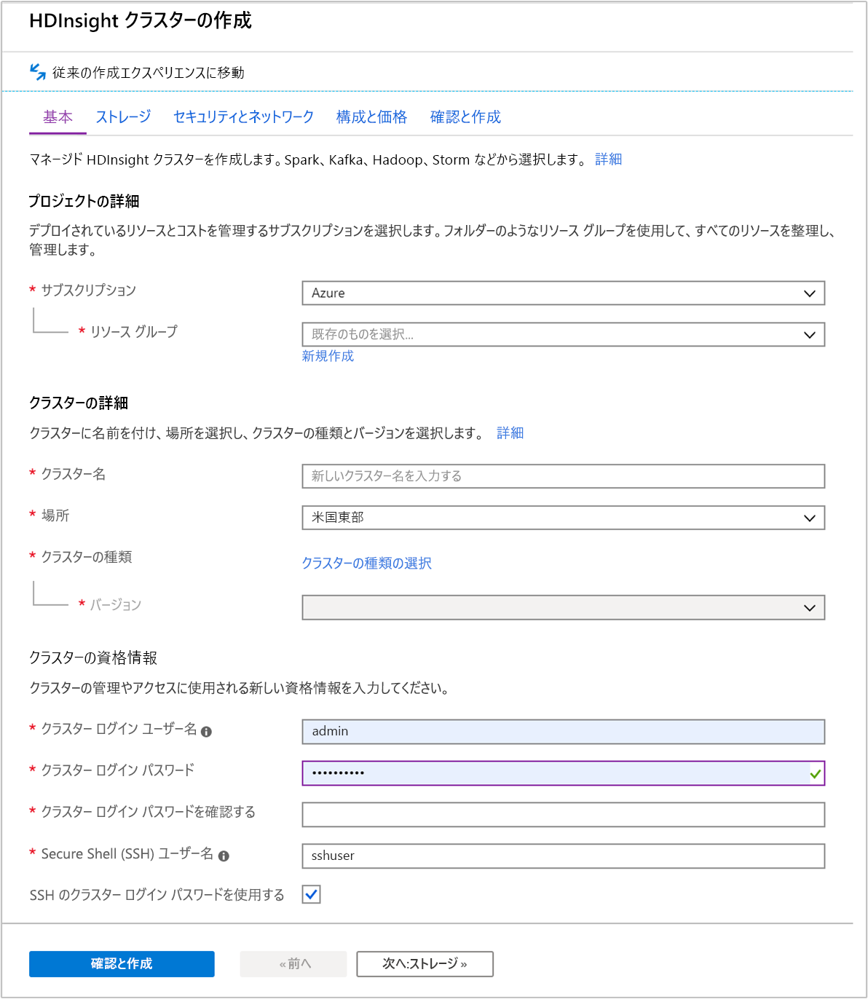
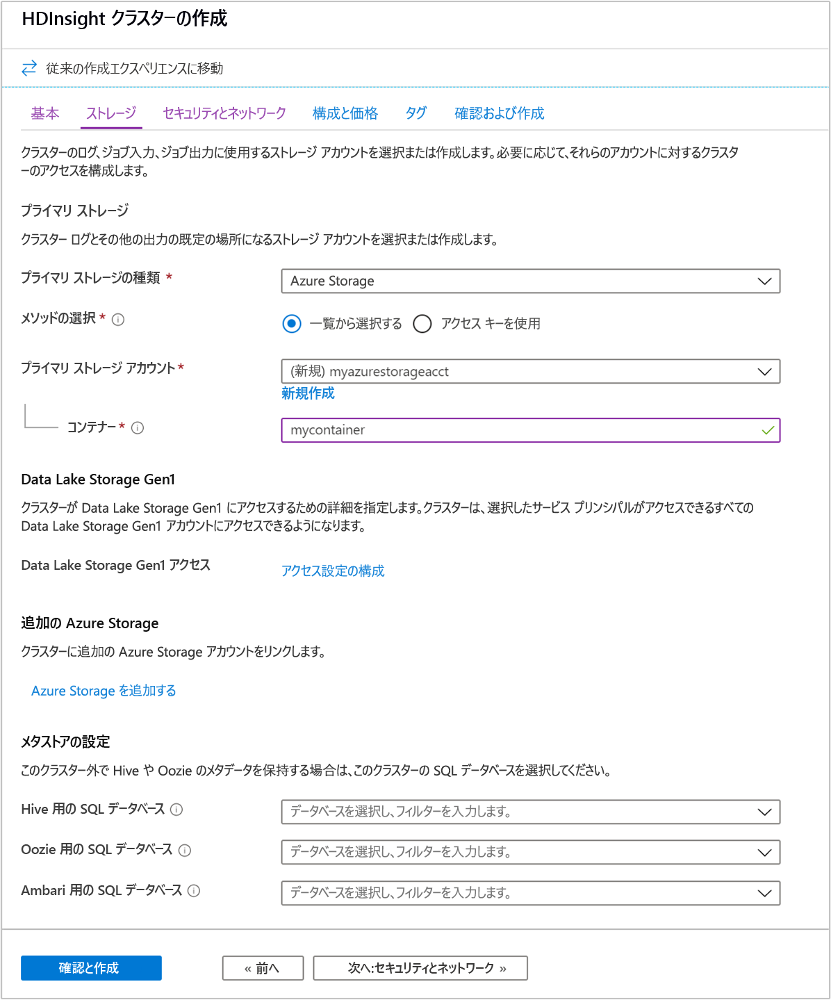
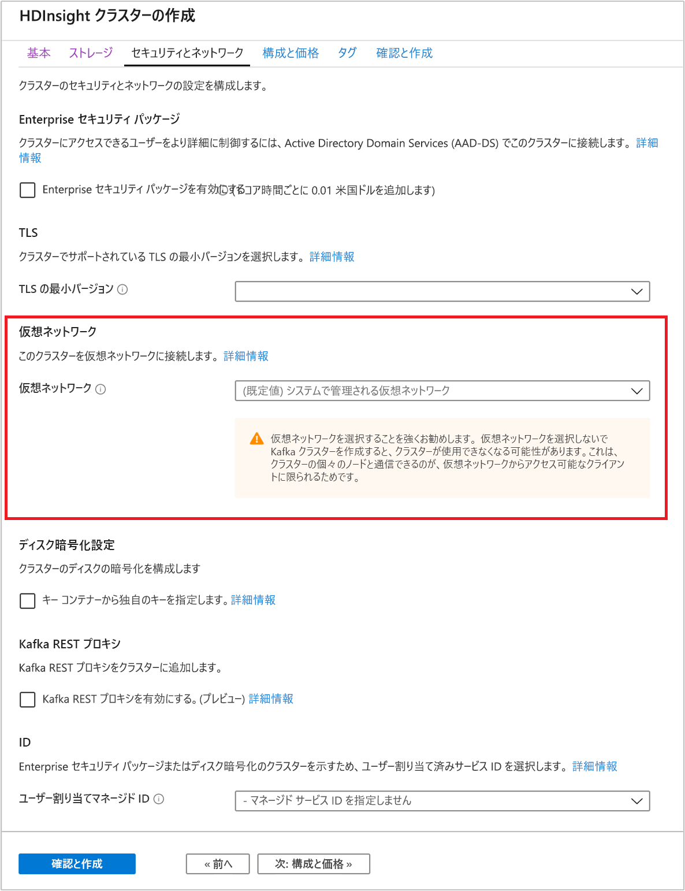
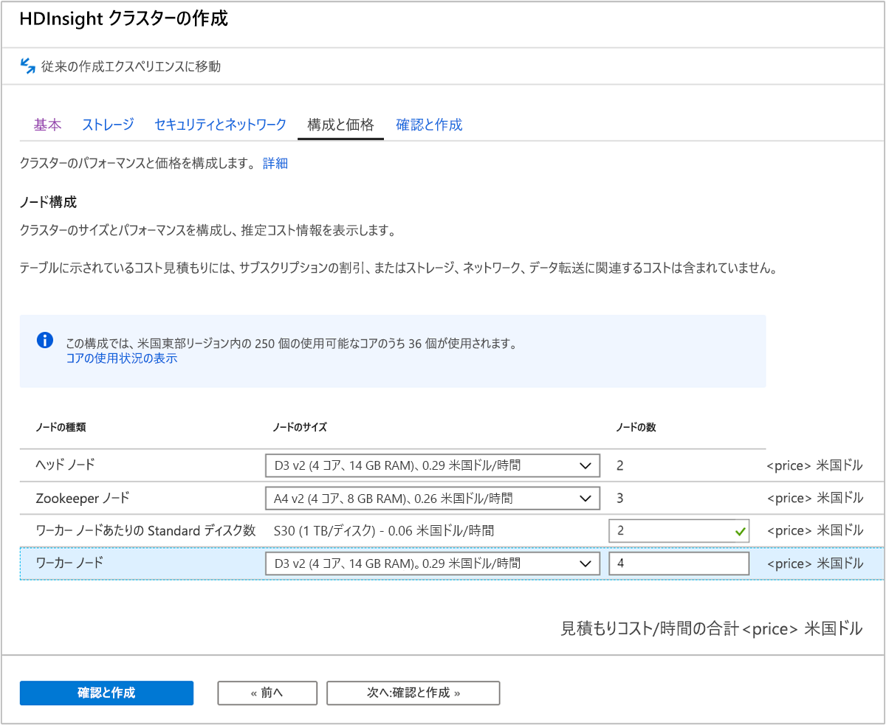
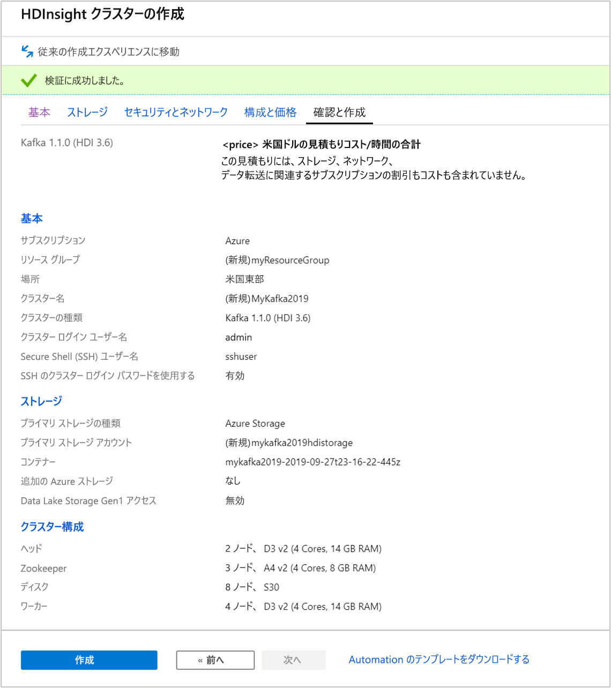

# <a name="quickstart-create-apache-kafka-cluster-in-azure-hdinsight-using-azure-portal"></a>クイック スタート:Azure portal を使用して Azure HDInsight 内に Apache Kafka クラスターを作成する

Apache Kafka は、オープンソースの分散ストリーミング プラットフォームです。 発行/サブスクライブ メッセージ キューと同様の機能を備えているため、メッセージ ブローカーとして多く使われています。

このクイックスタートでは、Azure Portal を使用して [Apache Kafka](https://kafka.apache.org) クラスターを作成する方法について説明します。 Apache Kafka を使って、付属のユーティリティでメッセージを送受信する方法についても説明します。

[!INCLUDE [delete-cluster-warning](../../../includes/hdinsight-delete-cluster-warning.md)]

Apache Kafka API は、同じ仮想ネットワーク内のリソースによってのみアクセスできます。 このクイック スタートでは、SSH を使って直接クラスターにアクセスします。 他のサービス、ネットワーク、または仮想マシンを Apache Kafka に接続するには、まず、仮想ネットワークを作成してから、ネットワーク内にリソースを作成する必要があります。 詳しくは、[仮想ネットワークを使用した Apache Kafka への接続](apache-kafka-connect-vpn-gateway.md)に関するドキュメントをご覧ください。

Azure サブスクリプションをお持ちでない場合は、開始する前に [無料アカウント](https://azure.microsoft.com/free/?WT.mc_id=A261C142F) を作成してください。

## <a name="prerequisites"></a>前提条件

SSH クライアント 詳細については、[SSH を使用して HDInsight (Apache Hadoop) に接続する方法](../hdinsight-hadoop-linux-use-ssh-unix.md)に関するページを参照してください。

## <a name="create-an-apache-kafka-cluster"></a>Apache Kafka クラスターを作成する

HDInsight クラスターで Apache Kafka を作成するには、次の手順に従います。

1. [Azure portal](https://portal.azure.com) にサインインします。

1. 左側のメニューから、 **[+ リソースの作成]**  >  **[Analytics]**  >  **[HDInsight]** に移動します。

    

1. **[基本]** で次の値を入力または選択します。

    |プロパティ  |説明  |
    |---------|---------|
    |サブスクリプション    |  Azure サブスクリプションを選択します。 |
    |Resource group     | リソース グループを作成するか、既存のリソース グループを選択します。  リソース グループとは、Azure コンポーネントのコンテナーです。  この場合、リソース グループには、HDInsight クラスターおよび依存する Azure ストレージ アカウントが含まれています。 |
    |クラスター名   | Hadoop クラスターの名前を入力します。 HDInsight のすべてのクラスターでは同じ DNS 名前空間が共有されるため、この名前は一意である必要があります。 この名前は、文字、数字、ハイフンを含む最大 59 文字で構成できます。 名前の先頭と末尾の文字をハイフンにすることはできません。 |
    |Location    | クラスターを作成する Azure の場所を選択します。  パフォーマンスを向上させるため、お近くの場所を選択してください。 |
    |クラスターの種類| **[クラスターの種類の選択]** を選択します。 クラスターの種類として **[Kafka]** を選択します。|
    |Version|クラスターの種類には、既定のバージョンが指定されます。 異なるバージョンを指定したい場合は、ドロップダウン リストから選択してください。|
    |クラスター ログイン ユーザー名とパスワード    | 既定のログイン名は **admin** です。パスワードは 10 文字以上で、数字、大文字、小文字、英数字以外の文字 (' " ` を除く\) が少なくとも 1 つずつ含まれる必要があります。 "Pass@word1" などのよく使われるパスワードを**指定していない**ことを確認してください。|
    |Secure Shell (SSH) ユーザー名 | 既定のユーザー名は **sshuser** です。  SSH ユーザー名に別の名前を指定できます。 |
    |SSH にクラスター ログイン パスワードを使用する| クラスター ログイン ユーザーに指定したのと同じパスワードを SSH ユーザーに使用する場合は、このチェック ボックスをオンにします。|

   

    各 Azure リージョン (場所) は "_障害ドメイン_" を提供します。 障害ドメインとは、Azure データ センター内にある基になるハードウェアの論理的なグループです。 各障害ドメインは、一般的な電源とネットワーク スイッチを共有します。 HDInsight クラスター内のノードを実装する仮想マシンと管理ディスクは、これらの障害ドメインに分散されます。 このアーキテクチャにより、物理的なハードウェア障害の潜在的な影響が制限されます。

    データの高可用性を実現するために、__3 つの障害ドメイン__ を含むリージョン (場所) を選択します。 リージョン内の障害ドメインの数については、[Linux 仮想マシンの可用性](../../virtual-machines/windows/manage-availability.md#use-managed-disks-for-vms-in-an-availability-set)に関するトピックを参照してください。

    ページの下部にある **[次へ: ストレージ >>]** タブを選択して、ストレージの設定に進みます。

1. **[ストレージ]** タブから次の値を指定します。

    |プロパティ  |説明  |
    |---------|---------|
    |プライマリ ストレージの種類|既定値の **[Azure Storage]** を使用します。|
    |メソッドの選択|既定値の **[一覧から選択する]** を使用します。|
    |プライマリ ストレージ アカウント|ドロップダウン リストを使用して既存のストレージ アカウントを選択するか、または **[新規作成]** を選択します。 新しいアカウントの作成時には、名前の長さは 3 から 24 文字とし、数字と小文字のみを使用できます|
    |コンテナー|自動入力されている値を使用します。|

    

    **[セキュリティとネットワーク]** タブを選択します。

1. このクイック スタートでは、既定のセキュリティ設定をそのまま使用します。 Enterprise セキュリティ パッケージの詳細については、「[Azure Active Directory Domain Services を使用して、Enterprise セキュリティ パッケージで HDInsight クラスターを構成する](../domain-joined/apache-domain-joined-configure-using-azure-adds.md)」を参照してください。 Apache Kafka のディスク暗号化に独自のキーを使用する方法については、「[Azure HDInsight で Apache Kafka 用に自分のキーを持ち込む](apache-kafka-byok.md)」を参照してください。

   クラスターを仮想ネットワークに接続したい場合は、 **[仮想ネットワーク]** ボックスの一覧からいずれかの仮想ネットワークを選択します。

   

    **[Configuration + pricing]\(構成と価格\)** タブを選択します。

1. HDInsight 上の Apache Kafka の可用性を確保するため、 **[ワーカー ノード]** の __[ノード数]__ エントリを 3 以上に設定する必要があります。 既定値は 4 ですが、

    **[Standard disks per worker node]\(ワーカー ノードごとの標準ディスク数\)** は、HDInsight における Apache Kafka のスケーラビリティを構成する項目です。 HDInsight 上の Apache Kafka は、クラスターの仮想マシンのローカル ディスクを使って、データを保存します。 Apache Kafka は I/O が多いため、[Azure Managed Disks](../../virtual-machines/windows/managed-disks-overview.md) を使ってノードごとに高いスループットと多くの記憶域を提供します。 マネージド ディスクの種類は、__Standard__ (HDD) または __Premium__ (SSD) です。 ディスクの種類は、ワーカー ノード (Apache Kafka ブローカー) によって使われる VM のサイズによって異なります。 DS および GS シリーズの VM では、Premium ディスクが自動的に使われます。 他の種類の VM はすべて Standard を使います。

   

    **[確認および作成]** タブを選択します。

1. クラスターの構成を確認します。 正しくない設定があれば変更します。 最後に、 **[作成]** を選択してクラスターを作成します。

    

    クラスターの作成には最大で 20 分かかります。

## <a name="connect-to-the-cluster"></a>クラスターに接続する

1. Apache Kafka クラスターのプライマリ ヘッド ノードに接続するには、次のコマンドを使用します。 `sshuser` を SSH ユーザー名で置き換えます。 `mykafka` を実際の Apache Kafka クラスターの名前に置き換えます。

    ```bash
    ssh sshuser@mykafka-ssh.azurehdinsight.net
    ```

2. クラスターに初めて接続すると、ホストの信頼性を確立できないという警告が SSH クライアントに表示されることがあります。 プロンプトが表示されたら、「__yes__」と入力して、__Enter__ キーを押し、SSH クライアントの信頼済みサーバーの一覧にこのホストを追加します。

3. メッセージが表示されたら、SSH ユーザーのパスワードを入力します。

    接続されると、次のテキストのような情報が表示されます。

    ```output
    Authorized uses only. All activity may be monitored and reported.
    Welcome to Ubuntu 16.04.4 LTS (GNU/Linux 4.13.0-1011-azure x86_64)

     * Documentation:  https://help.ubuntu.com
     * Management:     https://landscape.canonical.com
     * Support:        https://ubuntu.com/advantage

      Get cloud support with Ubuntu Advantage Cloud Guest:
        https://www.ubuntu.com/business/services/cloud

    83 packages can be updated.
    37 updates are security updates.


    Welcome to Apache Kafka on HDInsight.

    Last login: Thu Mar 29 13:25:27 2018 from 108.252.109.241
    ```

## <a id="getkafkainfo"></a>Apache Zookeeper およびブローカーのホスト情報を取得する

Kafka を使うときは、*Apache Zookeeper* ホストと "*ブローカー*" ホストについて理解しておく必要があります。 これらのホストは、Apache Kafka の API や、Kafka に付属するユーティリティの多くで使用されます。

このセクションでは、クラスターで Apache Ambari REST API からホスト情報を取得します。

1. コマンド ライン JSON プロセッサの [jq](https://stedolan.github.io/jq/) をインストールします。 このユーティリティは JSON ドキュメントを解析するためのものであり、ホスト情報の解析に役立ちます。 開いた SSH 接続から次のコマンドを入力して、`jq` をインストールします。

    ```bash
    sudo apt -y install jq
    ```

1. パスワード変数を設定します。 `PASSWORD` をクラスターのログイン パスワードに置き換えてから、次のコマンドを入力します。

    ```bash
    export password='PASSWORD'
    ```

1. 大文字と小文字が正しく区別されたクラスター名を抽出します。 クラスターの作成方法によっては、クラスター名の実際の大文字小文字の区別が予想と異なる場合があります。 このコマンドは、実際の大文字小文字の区別を取得し、変数に格納します。 次のコマンドを入力します。

    ```bash
    export clusterName=$(curl -u admin:$password -sS -G "http://headnodehost:8080/api/v1/clusters" | jq -r '.items[].Clusters.cluster_name')
    ```
    > [!Note]  
    > クラスターの外部からこのプロセスを実行している場合は、クラスター名を格納するための別の手順があります。 Azure portal からクラスター名を小文字で取得します。 その後、次のコマンドの `<clustername>` をクラスター名に置き換えて、`export clusterName='<clustername>'` を実行します。


1. Zookeeper ホスト情報で環境変数を設定するには、次のコマンドを使用します。 このコマンドはすべての Zookeeper ホストを取得してから、最初の 2 つのエントリのみを返します。 これは、1 つのホストに到達できない場合に、いくらかの冗長性が必要なためです。

    ```bash
    export KAFKAZKHOSTS=$(curl -sS -u admin:$password -G https://$clusterName.azurehdinsight.net/api/v1/clusters/$clusterName/services/ZOOKEEPER/components/ZOOKEEPER_SERVER | jq -r '["\(.host_components[].HostRoles.host_name):2181"] | join(",")' | cut -d',' -f1,2);
    ```

    > [!Note]  
    > このコマンドでは、Ambari アクセスが必要です。 クラスターが NSG の背後にある場合は、Ambari にアクセスできるコンピューターからこのコマンドを実行します。 

1. 環境変数が正しく設定されていることを確認するには、次のコマンドを使用します。

    ```bash
    echo $KAFKAZKHOSTS
    ```

    このコマンドでは、次のテキストのような情報が返されます。

    `zk0-kafka.eahjefxxp1netdbyklgqj5y1ud.ex.internal.cloudapp.net:2181,zk2-kafka.eahjefxxp1netdbyklgqj5y1ud.ex.internal.cloudapp.net:2181`

1. Apache Kafka ブローカー ホスト情報で環境変数を設定するには、次のコマンドを使用します。

    ```bash
    export KAFKABROKERS=$(curl -sS -u admin:$password -G https://$clusterName.azurehdinsight.net/api/v1/clusters/$clusterName/services/KAFKA/components/KAFKA_BROKER | jq -r '["\(.host_components[].HostRoles.host_name):9092"] | join(",")' | cut -d',' -f1,2);
    ```

    > [!Note]  
    > このコマンドでは、Ambari アクセスが必要です。 クラスターが NSG の背後にある場合は、Ambari にアクセスできるコンピューターからこのコマンドを実行します。 

1. 環境変数が正しく設定されていることを確認するには、次のコマンドを使用します。

    ```bash
    echo $KAFKABROKERS
    ```

    このコマンドでは、次のテキストのような情報が返されます。

    `wn1-kafka.eahjefxxp1netdbyklgqj5y1ud.cx.internal.cloudapp.net:9092,wn0-kafka.eahjefxxp1netdbyklgqj5y1ud.cx.internal.cloudapp.net:9092`

## <a name="manage-apache-kafka-topics"></a>Apache Kafka トピックの管理

Kafka は、"*トピック*" にデータのストリームを格納します。 `kafka-topics.sh` ユーティリティを使って、トピックを管理できます。

* **トピックを作成するには**、SSH 接続で次のコマンドを使います。

    ```bash
    /usr/hdp/current/kafka-broker/bin/kafka-topics.sh --create --replication-factor 3 --partitions 8 --topic test --zookeeper $KAFKAZKHOSTS
    ```

    このコマンドを使用すると、`$KAFKAZKHOSTS` に格納されているホスト情報を使用して Zookeeper に接続されます。 次に、**test** という名前の Apache Kafka トピックが作成されます。

    * このトピックに格納されるデータは、8 つのパーティションに分割されます。

    * 各パーティションは、クラスター内の 3 つのワーカー ノード間でレプリケートされます。

        3 つの障害ドメインを提供する Azure リージョンにクラスターを作成した場合は、3 のレプリケーション係数を使います。 そうでない場合は、4 のレプリケーション係数を使います。
        
        3 つの障害ドメインがあるリージョンでは、3 のレプリケーション係数により、レプリカを障害ドメインに分散できます。 2 つの障害ドメインのリージョンでは、4 のレプリケーション係数により、ドメイン全体に均等にレプリカが分散されます。
        
        リージョン内の障害ドメインの数については、[Linux 仮想マシンの可用性](../../virtual-machines/windows/manage-availability.md#use-managed-disks-for-vms-in-an-availability-set)に関するトピックを参照してください。

        Apache Kafka は、Azure 障害ドメインを認識しません。 トピック用にパーティションのレプリカを作成すると、レプリカが適切に分散されず、高可用性が実現しない場合があります。

        高可用性を確保するには、[Apache Kafka パーティション再調整ツール](https://github.com/hdinsight/hdinsight-kafka-tools)を使用してください。 このツールは、Apache Kafka クラスターのヘッド ノードへの SSH 接続から実行する必要があります。

        Apache Kafka データの最高の可用性のために、次のときにトピックのパーティションのレプリカを再調整する必要があります。

        * 新しいトピックまたはパーティションの作成

        * クラスターのスケールアップ

* **トピックの一覧を表示するには**、次のコマンドを使います。

    ```bash
    /usr/hdp/current/kafka-broker/bin/kafka-topics.sh --list --zookeeper $KAFKAZKHOSTS
    ```

    このコマンドは、Apache Kafka クラスターで使用可能なトピックの一覧を表示します。

* **トピックを削除するには**、次のコマンドを使います。

    ```bash
    /usr/hdp/current/kafka-broker/bin/kafka-topics.sh --delete --topic topicname --zookeeper $KAFKAZKHOSTS
    ```

    このコマンドは、`topicname` という名前のトピックを削除します。

    > [!WARNING]  
    > 前に作成した `test` トピックを削除した場合は、再作しなおす必要があります。 このドキュメントの後半で使います。

`kafka-topics.sh` ユーティリティで使用可能なコマンドの詳細については、次のコマンドを使用します。

```bash
/usr/hdp/current/kafka-broker/bin/kafka-topics.sh
```

## <a name="produce-and-consume-records"></a>レコードの生成および消費

Kafka では、トピック内に*レコード*が格納されます。 レコードは、*プロデューサー*によって生成され、*コンシューマー*によって消費されます。 プロデューサーとコンシューマーは "*Kafka ブローカー*" サービスと通信します。 HDInsight クラスターの各ワーカー ノードが、Apache Kafka ブローカー ホストです。

先ほど作成した test トピックにレコードを格納し、コンシューマーを使用してそれらを読み取るには、次の手順に従います。

1. トピックにレコードを書き込むには、SSH 接続から `kafka-console-producer.sh` ユーティリティを使用します。

    ```bash
    /usr/hdp/current/kafka-broker/bin/kafka-console-producer.sh --broker-list $KAFKABROKERS --topic test
    ```

    このコマンドの後ろには空の行があります。

2. 空の行にテキスト メッセージを入力して、Enter キーを押します。 このようにメッセージをいくつか入力してから、**Ctrl + C** キーを使用して通常のプロンプトに戻ります。 各行が、個別のレコードとして Apache Kafka トピックに送信されます。

3. トピックからレコードを読み取るには、SSH 接続から `kafka-console-consumer.sh` ユーティリティを使用します。

    ```bash
    /usr/hdp/current/kafka-broker/bin/kafka-console-consumer.sh --bootstrap-server $KAFKABROKERS --topic test --from-beginning
    ```

    このコマンドにより、レコードがトピックから取得され、表示されます。 `--from-beginning` を使用することで、すべてのレコードが取得されるように、コンシューマーにストリームの先頭から開始するように指示しています。

    以前のバージョンの Kafka を使っている場合、`--bootstrap-server $KAFKABROKERS` を `--zookeeper $KAFKAZKHOSTS` に置き換えます。

4. __Ctrl+C__ キーを使用してコンシューマーを停止します。

プロデューサーとコンシューマーをプログラムから作成することもできます。 この API の使用例については、[HDInsight における Apache Kafka Producer API と Consumer API](apache-kafka-producer-consumer-api.md) に関するドキュメントを参照してください。

## <a name="clean-up-resources"></a>リソースをクリーンアップする

このクイックスタートで作成したリソースをクリーンアップするために、リソース グループを削除できます。 リソース グループを削除すると、関連付けられている HDInsight クラスター、およびリソース グループに関連付けられているその他のリソースも削除されます。

Azure Portal を使用してリソース グループを削除するには:

1. Azure Portal で左側のメニューを展開してサービスのメニューを開き、 __[リソース グループ]__ を選択して、リソース グループの一覧を表示します。
2. 削除するリソース グループを見つけて、一覧の右側にある __[詳細]__ ボタン ([...]) を右クリックします。
3. __[リソース グループの削除]__ を選択し、確認します。

> [!WARNING]  
> HDInsight クラスターの課金は、クラスターが作成されると開始し、クラスターが削除されると停止します。 課金は分単位なので、クラスターを使わなくなったら必ず削除してください。
>
> HDInsight クラスター上の Apache Kafka を削除すると、Kafka に格納されているすべてのデータが削除されます。

## <a name="next-steps"></a>次のステップ

> [!div class="nextstepaction"]
> [Apache Kafka で Apache Spark を使用する](../hdinsight-apache-kafka-spark-structured-streaming.md)
