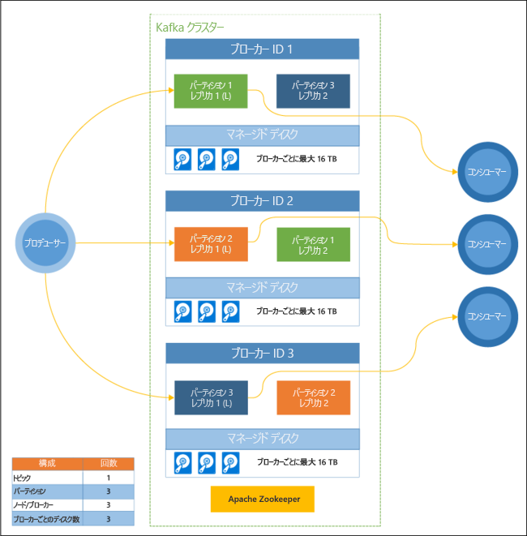

# HDInsight での Apache Kafka とは

[Apache Kafka](https://kafka.apache.org) はオープン ソースの分散ストリーム プラットフォームで、リアルタイムのストリーミング データ パイプラインとアプリケーションの構築に使用できます。 Kafka は、名前付きデータ ストリームへの公開および購読ができる、メッセージ キューと同様のメッセージ ブローカー機能も提供しています。 

以下に、HDInsight 上の Kafka の固有の特性を示します。

* これは、簡単な構成プロセスを提供する管理されたサービスです。 その結果は、Microsoft によってテスト済みのサポートされている構成になります。

* Microsoft は、kafka の稼働時間に対し、99.9 % のサービス レベル アグリーメント (SLA) を提供しています。 詳細については、「[HDInsight の SLA](https://azure.microsoft.com/support/legal/sla/hdinsight/v1_0/)」を参照してください。

* Kafka のバッキング ストアとして Azure Managed Disks を使用します。 Managed Disks は、Kafka ブローカーあたり最大 16 TB を提供できます。 HDInsight 上の Kafka でのマネージド ディスクの構成について詳しくは、「[HDInsight 上の Apache Kafka 用に記憶域とスケーラビリティを構成する](apache-kafka-scalability.md)」をご覧ください。

    マネージド ディスクについて詳しくは、「[Azure Managed Disks の概要](../../virtual-machines/windows/managed-disks-overview.md)」をご覧ください。

* Kafka はラックの 1 次元ビューで設計されています。 Azure は、更新ドメイン (UD) と障害ドメイン (FD) の 2 次元にラックを分割します。 Microsoft は、複数の UD と FD の間で Kafka のパーティションとレプリカを再調整するツールを提供しています。 

    詳細については、[HDInsight 上の Kafka による高可用性](apache-kafka-high-availability.md)に関するページを参照してください。

* HDInsight を使用すると、クラスターの作成後に、worker ノード (Kafka ブローカーをホストするノード) の数を変更することができます。 スケーリングは、Azure Portal、Azure PowerShell、およびその他の Azure 管理インターフェイスで実行できます。 Kafka では、スケーリング操作の後で、パーティションのレプリカを再調整する必要があります。 パーティションを再調整することで、Kafka は新しい数のワーカー ノードを活用することができます。

    詳細については、[HDInsight 上の Kafka による高可用性](apache-kafka-high-availability.md)に関するページを参照してください。

* Azure Log Analytics を使用して、HDInsight 上の Kafka を監視できます。 Log Analytics は、ディスクおよび NIC のメトリック、Kafka からの JMX メトリックなど、仮想マシン レベルの情報を表示します。

    詳細については、[HDInsight 上の Kafka のログの分析](apache-kafka-log-analytics-operations-management.md)に関するページを参照してください。

### HDInsight アーキテクチャ上の Kafka

次の図は、コンシューマー グループ、パーティション分割、レプリケーションを使ってイベントの並列読み取りとフォールト トレランスを実現する標準的な Kafka の構成を示しています。

Apache ZooKeeper は Kafka クラスターの状態を管理します。 Zookeeper は同時、耐障害性、および待機時間の短いトランザクション用に作成されています。 

Kafka では、**トピック**にレコード (データ) が格納されます。 レコードは、**プロデューサー**によって生成され、**コンシューマー**によって消費されます。 プロデューサーは Kafka **ブローカー**にレコードを送信します。 HDInsight クラスターの各ワーカー ノードが、Kafka のブローカーです。 

トピックは、ブローカー間でレコードを分割します。 レコードの使用時に、パーティションあたり最大 1 つのコンシューマーを使用して、データの並列処理を実現できます。

レプリケーションによって複数ノードにパーティションが複製されて、ノード (ブローカー) の機能不全に対する保護措置が講じられています。 *(L)* で示されたパーティションは、指定されたパーティションのリーダーです。 プロデューサー トラフィックは、ZooKeeper によって管理された状態に基づいて、各ノードのリーダーにルーティングされます。

## HDInsight で Apache Kafka を使用する理由

以下に、HDInsight 上の Kafka を使用して実行できる一般的なタスクと パターンを示します。

* **Kafka データのレプリケーション**: Kafka には、MirrorMaker ユーティリティが用意されています。このユーティリティは、Kafka クラスター間でデータをレプリケートします。

    MirrorMaker の使用方法については、[HDInsight 上の Kafka での Kafka トピックのレプリケート](apache-kafka-mirroring.md)に関するページを参照してください。

* **発行-購読のメッセージング パターン**: Kafka は、Kafka トピックにレコードを発行するためのプロデューサー API を提供します。 コンシューマー API は、トピックの購読に使用されます。

    詳細については、[HDInsight での Kafka の使用開始](apache-kafka-get-started.md)に関するページを参照してください。

* **ストリーム処理**: リアルタイムのストリーム処理には、通常、Kafka と共に Apache Storm または Spark が使用されます。 Kafka 0.10.0.0 (HDInsight バージョン 3.5 および 3.6) では、Storm や Spark を必要とせずに、ストリーミング ソリューションを構築できるストリーミング API が導入されました。

    詳細については、[HDInsight での Kafka の使用開始](apache-kafka-get-started.md)に関するページを参照してください。

* **水平スケール**: Kafka は、HDInsight クラスター内のノード間でストリームを分割します。 コンシューマー プロセスを各パーティションと関連付けることにより、レコード使用時の負荷分散を実現することができます。

    詳細については、[HDInsight での Kafka の使用開始](apache-kafka-get-started.md)に関するページを参照してください。

* **順番どおりに処理**: 各パーティション内で、レコードは、受信された順番にストリームに格納されます。 パーティションごとに 1 つのコンシューマー プロセスを関連付けることで、レコードが順番通りに確実に処理されるようになります。

    詳細については、[HDInsight での Kafka の使用開始](apache-kafka-get-started.md)に関するページを参照してください。

## ユース ケース

* **メッセージング**: Kafka は発行-購読のメッセージ パターンをサポートするため、メッセージ ブローカーとしてよく使用されます。

* **アクティビティの追跡**: Kafka ではレコードの受信順序のログ記録が提供されるため、アクティビティの追跡と再現に使用することができます。 たとえば、Web サイト上またはアプリケーション内のユーザー アクションです。

* **集計**: ストリーム処理を使用して異なるストリームからの情報を集計し、情報をまとめて運用データに一元化することができます。

* **変換**: ストリーム処理を使用して入力された複数のトピックからのデータを結合し、1 つまたは複数の出力トピックに変換することができます。

## 次の手順

次のリンクを使用することで、HDInsight で Apache Kafka を使用する方法を知ることができます。

* [クイック スタート: HDInsight への Kafka の作成](apache-kafka-get-started.md)

* [チュートリアル: HDInsight 上の Kafka で Apache Spark を使用する](../hdinsight-apache-spark-with-kafka.md)

* [チュートリアル: HDInsight 上の Kafka で Apache Storm を使用する](../hdinsight-apache-storm-with-kafka.md)
