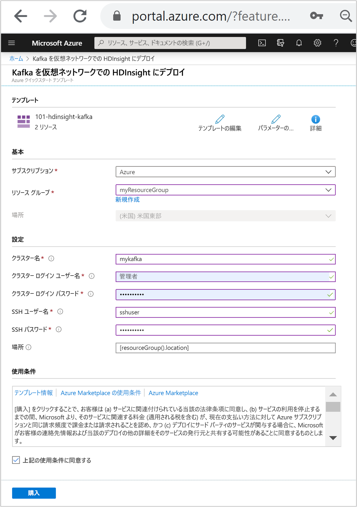
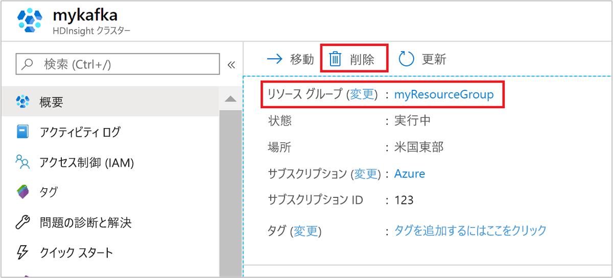

# <a name="quickstart-create-apache-kafka-cluster-in-azure-hdinsight-using-resource-manager-template"></a>クイック スタート:Resource Manager テンプレートを使用して Azure HDInsight 内に Apache Kafka クラスターを作成する

このクイックスタートでは、Azure Resource Manager テンプレートを使用して、Azure HDInsight に [Apache Kafka](./apache-kafka-introduction.md) クラスターを作成します。 Kafka は、オープンソースの分散ストリーミング プラットフォームです。 発行/サブスクライブ メッセージ キューと同様の機能を備えているため、メッセージ ブローカーとして多く使われています。

[!INCLUDE [About Azure Resource Manager](../../../includes/resource-manager-quickstart-introduction.md)]

Kafka API は、同じ仮想ネットワーク内のリソースによってのみアクセスできます。 このクイック スタートでは、SSH を使って直接クラスターにアクセスします。 他のサービス、ネットワーク、または仮想マシンを Kafka に接続するには、まず、仮想ネットワークを作成してから、ネットワーク内にリソースを作成する必要があります。 詳しくは、[仮想ネットワークを使用した Apache Kafka への接続](apache-kafka-connect-vpn-gateway.md)に関するドキュメントをご覧ください。

Azure サブスクリプションをお持ちでない場合は、開始する前に [無料アカウント](https://azure.microsoft.com/free/?WT.mc_id=A261C142F) を作成してください。

## <a name="create-an-apache-kafka-cluster"></a>Apache Kafka クラスターを作成する

### <a name="review-the-template"></a>テンプレートを確認する

このクイック スタートで使用されるテンプレートは [Azure クイック スタート テンプレート](https://github.com/Azure/azure-quickstart-templates/tree/master/101-hdinsight-kafka)からのものです。

:::code language="json" source="~/quickstart-templates/101-hdinsight-kafka/azuredeploy.json" range="1-150":::

テンプレートでは、次の 2 つの Azure リソースが定義されています。

* [Microsoft.Storage/storageAccounts](https://docs.microsoft.com/azure/templates/microsoft.storage/storageaccounts): Azure のストレージ アカウントを作成します。
* [Microsoft.HDInsight/cluster](https://docs.microsoft.com/azure/templates/microsoft.hdinsight/clusters): HDInsight クラスターを作成します。

### <a name="deploy-the-template"></a>テンプレートのデプロイ

1. 下の **[Azure へのデプロイ]** ボタンを選択して Azure にサインインし、Resource Manager テンプレートを開きます。

    <a href="https://portal.azure.com/#create/Microsoft.Template/uri/https%3A%2F%2Fraw.githubusercontent.com%2FAzure-Samples%2Fhdinsight-kafka-java-get-started%2Fmaster%2Fazuredeploy.json" target="_blank"></a>

1. 次の値を入力または選択します。

    |プロパティ |説明 |
    |---|---|
    |サブスクリプション|ドロップダウン リストから、このクラスターに使用する Azure サブスクリプションを選択します。|
    |Resource group|ドロップダウン リストから既存のリソース グループを選択するか、 **[新規作成]** を選択します。|
    |場所|この値には、リソース グループに使用される場所が自動入力されます。|
    |クラスター名|グローバルに一意の名前を入力します。 このテンプレートの場合、使用できるのは小文字と数字のみです。|
    |[Cluster Login User Name]\(クラスター ログイン ユーザー名\)|ユーザー名を指定します。既定値は **admin** です。|
    |[クラスター ログイン パスワード]|パスワードを指定します。 パスワードは 10 文字以上で、数字、大文字、小文字、英数字以外の文字 (' " ` を除く) が少なくとも 1 つずつ含まれる必要があります。 |
    |SSH ユーザー名|ユーザー名を指定します。既定値は **sshuser** です。|
    |SSH パスワード|パスワードを指定します。|

    

1. 「**使用条件**」をご確認ください。 次に **[上記の使用条件に同意する]** を選択し、 **[購入]** を選択します。 ご自分のデプロイの進行状況が通知されます。 クラスターの作成には約 20 分かかります。

## <a name="review-deployed-resources"></a>デプロイされているリソースを確認する

クラスターが作成されると、 **[リソースに移動]** リンクを含む**デプロイ成功**通知を受け取ります。 ご自分の [リソース グループ] ページに、ご自分の新しい HDInsight クラスターと、そのクラスターに関連付けられている既定のストレージが一覧表示されます。 各クラスターには、[Azure Storage アカウント](../hdinsight-hadoop-use-blob-storage.md)または [Azure Data Lake Storage アカウント](../hdinsight-hadoop-use-data-lake-store.md)との依存関係があります。 このアカウントを、既定のストレージ アカウントと呼びます。 HDInsight クラスターとその既定のストレージ アカウントは、同じ Azure リージョンに配置されている必要があります。 クラスターを削除しても、ストレージ アカウントは削除されません。

## <a name="get-the-apache-zookeeper-and-broker-host-information"></a>Apache Zookeeper およびブローカーのホスト情報を取得する

Kafka を使うときは、*Apache Zookeeper* ホストと "*ブローカー*" ホストについて理解しておく必要があります。 これらのホストは、Kafka の API や、Kafka に付属するユーティリティの多くで使用されます。

このセクションでは、クラスターで Ambari REST API からホスト情報を取得します。

1. [ssh コマンド](../hdinsight-hadoop-linux-use-ssh-unix.md)を使用してクラスターに接続します。 次のコマンドを編集して CLUSTERNAME をクラスターの名前に置き換えてから、そのコマンドを入力します。

    ```cmd
    ssh sshuser@CLUSTERNAME-ssh.azurehdinsight.net
    ```

1. SSH 接続から、次のコマンドを使って `jq` ユーティリティをインストールします。 このユーティリティは JSON ドキュメントを解析するためのものであり、ホスト情報の取得に役立ちます。

    ```bash
    sudo apt -y install jq
    ```

1. 環境変数をクラスター名に設定するには、次のコマンドを使用します。

    ```bash
    read -p "Enter the Kafka on HDInsight cluster name: " CLUSTERNAME
    ```

    プロンプトが表示されたら、Kafka クラスター名を入力します。

1. Zookeeper ホスト情報で環境変数を設定するには、次のコマンドを使用します。 このコマンドはすべての Zookeeper ホストを取得してから、最初の 2 つのエントリのみを返します。 これは、1 つのホストに到達できない場合に、いくらかの冗長性が必要なためです。

    ```bash
    export KAFKAZKHOSTS=`curl -sS -u admin -G https://$CLUSTERNAME.azurehdinsight.net/api/v1/clusters/$CLUSTERNAME/services/ZOOKEEPER/components/ZOOKEEPER_SERVER | jq -r '["\(.host_components[].HostRoles.host_name):2181"] | join(",")' | cut -d',' -f1,2`
    ```

    プロンプトが表示されたら、クラスターのログイン アカウント (SSH アカウントではなく) のパスワードを入力します。

1. 環境変数が正しく設定されていることを確認するには、次のコマンドを使用します。

    ```bash
     echo '$KAFKAZKHOSTS='$KAFKAZKHOSTS
    ```

    このコマンドでは、次のテキストのような情報が返されます。

    `zk0-kafka.eahjefxxp1netdbyklgqj5y1ud.ex.internal.cloudapp.net:2181,zk2-kafka.eahjefxxp1netdbyklgqj5y1ud.ex.internal.cloudapp.net:2181`

1. Kafka ブローカー ホスト情報で環境変数を設定するには、次のコマンドを使用します。

    ```bash
    export KAFKABROKERS=`curl -sS -u admin -G https://$CLUSTERNAME.azurehdinsight.net/api/v1/clusters/$CLUSTERNAME/services/KAFKA/components/KAFKA_BROKER | jq -r '["\(.host_components[].HostRoles.host_name):9092"] | join(",")' | cut -d',' -f1,2`
    ```

    プロンプトが表示されたら、クラスターのログイン アカウント (SSH アカウントではなく) のパスワードを入力します。

1. 環境変数が正しく設定されていることを確認するには、次のコマンドを使用します。

    ```bash
    echo '$KAFKABROKERS='$KAFKABROKERS
    ```

    このコマンドでは、次のテキストのような情報が返されます。

    `wn1-kafka.eahjefxxp1netdbyklgqj5y1ud.cx.internal.cloudapp.net:9092,wn0-kafka.eahjefxxp1netdbyklgqj5y1ud.cx.internal.cloudapp.net:9092`

## <a name="manage-apache-kafka-topics"></a>Apache Kafka トピックの管理

Kafka は、"*トピック*" にデータのストリームを格納します。 `kafka-topics.sh` ユーティリティを使って、トピックを管理できます。

* **トピックを作成するには**、SSH 接続で次のコマンドを使います。

    ```bash
    /usr/hdp/current/kafka-broker/bin/kafka-topics.sh --create --replication-factor 3 --partitions 8 --topic test --zookeeper $KAFKAZKHOSTS
    ```

    このコマンドを使用すると、`$KAFKAZKHOSTS` に格納されているホスト情報を使用して Zookeeper に接続されます。 次に、**test** という名前の Kafka トピックが作成されます。

    * このトピックに格納されるデータは、8 つのパーティションに分割されます。

    * 各パーティションは、クラスター内の 3 つのワーカー ノード間でレプリケートされます。

        3 つの障害ドメインを提供する Azure リージョンにクラスターを作成した場合は、3 のレプリケーション係数を使います。 そうでない場合は、4 のレプリケーション係数を使います。
        
        3 つの障害ドメインがあるリージョンでは、3 のレプリケーション係数により、レプリカを障害ドメインに分散できます。 2 つの障害ドメインのリージョンでは、4 のレプリケーション係数により、ドメイン全体に均等にレプリカが分散されます。
        
        リージョン内の障害ドメインの数については、[Linux 仮想マシンの可用性](../../virtual-machines/windows/manage-availability.md#use-managed-disks-for-vms-in-an-availability-set)に関するトピックを参照してください。

        Kafka は、Azure の障害ドメインを認識しません。 トピック用にパーティションのレプリカを作成すると、レプリカが適切に分散されず、高可用性が実現しない場合があります。

        高可用性を確保するには、[Apache Kafka パーティション再調整ツール](https://github.com/hdinsight/hdinsight-kafka-tools)を使用してください。 このツールは、Kafka クラスターのヘッド ノードへの SSH 接続から実行する必要があります。

        Kafka データの最高の可用性のために、次のときにトピックのパーティションのレプリカを再調整する必要があります。

        * 新しいトピックまたはパーティションの作成

        * クラスターのスケールアップ

* **トピックの一覧を表示するには**、次のコマンドを使います。

    ```bash
    /usr/hdp/current/kafka-broker/bin/kafka-topics.sh --list --zookeeper $KAFKAZKHOSTS
    ```

    このコマンドは、Kafka クラスターで使用可能なトピックの一覧を表示します。

* **トピックを削除するには**、次のコマンドを使います。

    ```bash
    /usr/hdp/current/kafka-broker/bin/kafka-topics.sh --delete --topic topicname --zookeeper $KAFKAZKHOSTS
    ```

    このコマンドは、`topicname` という名前のトピックを削除します。

    > [!WARNING]  
    > 前に作成した `test` トピックを削除した場合は、再作しなおす必要があります。 このドキュメントの後半で使います。

`kafka-topics.sh` ユーティリティで使用可能なコマンドの詳細については、次のコマンドを使用します。

```bash
/usr/hdp/current/kafka-broker/bin/kafka-topics.sh
```

## <a name="produce-and-consume-records"></a>レコードの生成および消費

Kafka では、トピック内に*レコード*が格納されます。 レコードは、*プロデューサー*によって生成され、*コンシューマー*によって消費されます。 プロデューサーとコンシューマーは "*Kafka ブローカー*" サービスと通信します。 HDInsight クラスターの各ワーカー ノードが、Kafka ブローカー ホストです。

先ほど作成した test トピックにレコードを格納し、コンシューマーを使用してそれらを読み取るには、次の手順に従います。

1. トピックにレコードを書き込むには、SSH 接続から `kafka-console-producer.sh` ユーティリティを使用します。

    ```bash
    /usr/hdp/current/kafka-broker/bin/kafka-console-producer.sh --broker-list $KAFKABROKERS --topic test
    ```

    このコマンドの後ろには空の行があります。

1. 空の行にテキスト メッセージを入力して、Enter キーを押します。 このようにメッセージをいくつか入力してから、**Ctrl + C** キーを使用して通常のプロンプトに戻ります。 各行が、個別のレコードとして Kafka トピックに送信されます。

1. トピックからレコードを読み取るには、SSH 接続から `kafka-console-consumer.sh` ユーティリティを使用します。

    ```bash
    /usr/hdp/current/kafka-broker/bin/kafka-console-consumer.sh --bootstrap-server $KAFKABROKERS --topic test --from-beginning
    ```

    このコマンドにより、レコードがトピックから取得され、表示されます。 `--from-beginning` を使用することで、すべてのレコードが取得されるように、コンシューマーにストリームの先頭から開始するように指示しています。

    以前のバージョンの Kafka を使っている場合、`--bootstrap-server $KAFKABROKERS` を `--zookeeper $KAFKAZKHOSTS` に置き換えます。

1. __Ctrl+C__ キーを使用してコンシューマーを停止します。

プロデューサーとコンシューマーをプログラムから作成することもできます。 この API の使用例については、[HDInsight における Apache Kafka Producer API と Consumer API](apache-kafka-producer-consumer-api.md) に関するドキュメントを参照してください。

## <a name="clean-up-resources"></a>リソースをクリーンアップする

このクイックスタートを完了したら、必要に応じてクラスターを削除できます。 HDInsight を使用すると、データは Azure Storage に格納されるため、クラスターは、使用されていない場合に安全に削除できます。 また、HDInsight クラスターは、使用していない場合でも課金されます。 クラスターの料金は Storage の料金の何倍にもなるため、クラスターを使用しない場合は削除するのが経済的にも合理的です。

Azure portal からお使いのクラスターに移動し、 **[削除]** を選択します。



リソース グループ名を選び、リソース グループ ページを開いて、 **[リソース グループの削除]** を選ぶこともできます。 リソース グループを削除すると、HDInsight クラスターと既定のストレージ アカウントの両方が削除されます。

## <a name="next-steps"></a>次のステップ

このクイック スタートでは、Resource Manager テンプレートを使用して HDInsight で Apache Kafka クラスターを作成する方法を学習しました。 次の記事では、Apache Kafka Streams API を使用するアプリケーションを作成し、HDInsight 上の Kafka でそれを実行する方法を説明します。

> [!div class="nextstepaction"]
> [Azure HDInsight で Apache Kafka Streams API を使用する](./apache-kafka-streams-api.md)
