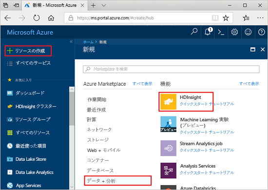
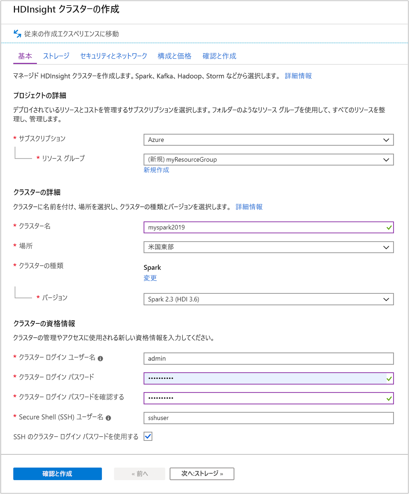
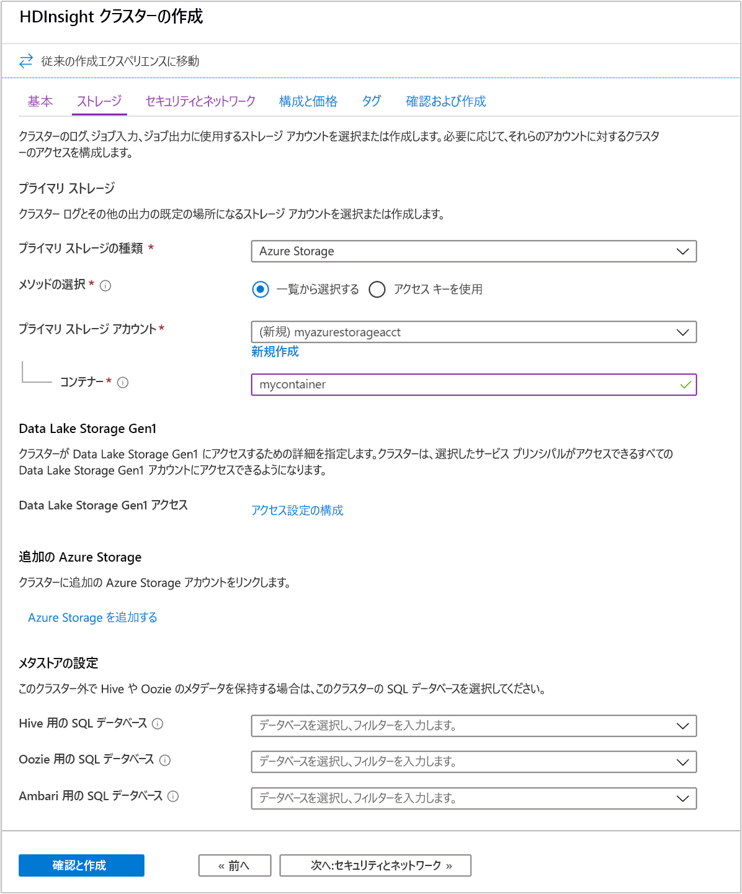

# <a name="quickstart-create-apache-spark-cluster-in-azure-hdinsight-using-azure-portal"></a>クイック スタート:Azure portal を使用して Azure HDInsight 内に Apache Spark クラスターを作成する

このクイックスタートでは、Azure portal を使用して Azure HDInsight に Apache Spark クラスターを作成します。 その後、Jupyter ノートブックを作成し、それを使用して、Apache Hive のテーブルに対する Spark SQL クエリを実行します。 Azure HDInsight は、全範囲に対応した、オープンソースのエンタープライズ向けマネージド分析サービスです。 HDInsight の Apache Spark フレームワークにより、メモリ内処理を使用した、高速の Data Analytics とクラスター コンピューティングが可能になります。 Jupyter ノートブックを使用すると、データを対話的に操作したり、コードと Markdown テキストとを結合したり、簡単な視覚化を行ったりすることができます。

[概要:Azure HDInsight の Apache Spark](apache-spark-overview.md) | [Apache Spark](https://spark.apache.org/) | [Apache Hive](https://hive.apache.org/) | [Jupyter Notebook](https://jupyter.org/)

## <a name="prerequisites"></a>前提条件

- アクティブなサブスクリプションが含まれる Azure アカウント。 [無料でアカウントを作成できます](https://azure.microsoft.com/free/?ref=microsoft.com&utm_source=microsoft.com&utm_medium=docs&utm_campaign=visualstudio)。

## <a name="create-an-apache-spark-cluster-in-hdinsight"></a>HDInsight での Apache Spark クラスターの作成

Azure portal を使用して、クラスター ストレージとして Azure Storage BLOB を使用する HDInsight クラスターを作成します。 Data Lake Storage Gen2 の使用法の詳細については、「[クイック スタート:HDInsight のクラスターを設定する](../../storage/data-lake-storage/quickstart-create-connect-hdi-cluster.md)」をご覧ください。

> [!IMPORTANT]  
> HDInsight クラスターの料金は、そのクラスターを使用しているかどうかに関係なく、分単位で課金されます。 使用後は、クラスターを必ず削除してください。 詳しくは、この記事の「[リソースのクリーンアップ](#clean-up-resources)」をご覧ください。

1. Azure Portal で、 **[リソースの作成]** を選択します。

    

1. **[新規]** ページで、 **[Analytics]**  >  **[HDInsight]** の順に選択します。

    

1. **[基本]** で次の値を指定します。

    |プロパティ  |説明  |
    |---------|---------|
    |サブスクリプション  | ドロップダウンから、このクラスターに使う Azure サブスクリプションを選びます。 このクイックスタートで使うサブスクリプションは **Azure** です。 |
    |Resource group | 新しいリソース グループを作成するか、既存のリソース グループを使用するかを指定します。 リソース グループは、Azure ソリューションの関連するリソースを保持するコンテナーです。 このクイックスタートで使うリソース グループ名は **myResourceGroup** です。 |
    |クラスター名 | HDInsight クラスターの名前を指定します。 このクイックスタートで使われるクラスターの名前は **myspark2019** です。|
    |Location   | リソース グループの場所を選びます。 テンプレートでは、この場所をクラスターの作成および既定のクラスター ストレージに使用します。 このクイックスタートで使う場所は**米国東部**です。 |
    |クラスターの種類| クラスターの種類として **[Spark]** を選択します。|
    |クラスターのバージョン|クラスターの種類が選択されると、このフィールドに既定のバージョンが自動的に入力されます。|
    |クラスター ログイン ユーザー名| クラスターのログイン ユーザー名を入力します。  既定の名前は *admin*です。クイック スタートの後半で、このアカウントを使って Jupyter Notebook にログインします。 |
    |クラスター ログイン パスワード| クラスターのログイン パスワードを入力します。 |
    |Secure Shell (SSH) ユーザー名| SSH ユーザー名を入力します。 このクイック スタートで使う SSH ユーザー名は **sshuser** です。 既定では、このアカウントは "*クラスター ログイン ユーザー名*" アカウントと同じパスワードを共有します。 |

    

    **ストレージ >>** を選択して **ストレージ** ページに進みます。

1. **[ストレージ]** で次の値を指定します。

    |プロパティ  |説明  |
    |---------|---------|
    |プライマリ ストレージの種類|既定値の **[Azure Storage]** を使用します。|
    |メソッドの選択|既定値の **[一覧から選択する]** を使用します。|
    |プライマリ ストレージ アカウント|自動入力されている値を使用します。|
    |コンテナー|自動入力されている値を使用します。|

    

    **[Review + create]\(確認と作成\)** を選択して続行します。

1. **[Review + create]\(確認と作成\)** を選択し、 **[作成]** を選択します。 クラスターの作成には約 20 分かかります。 次のセッションに進む前に、クラスターを作成する必要があります。

HDInsight クラスターを作成する際に問題が発生した場合は、適切なアクセス許可がない可能性があります。 詳細については、「[アクセス制御の要件](../hdinsight-hadoop-create-linux-clusters-portal.md)」を参照してください。

## <a name="create-a-jupyter-notebook"></a>Jupyter Notebook の作成

Jupyter Notebook は、さまざまなプログラミング言語をサポートする対話型のノートブック環境です。 ノートブックを使うと、データと対話し、Markdown テキストとコードを組み合わせて、簡単な視覚化を実行できます。

1. [Azure Portal](https://portal.azure.com)を開きます。

1. **[HDInsight クラスター]** を選び、作成したクラスターを選びます。

    

1. ポータルで **[クラスター ダッシュボード]** を選び、 **[Jupyter Notebook]** を選びます。 入力を求められたら、クラスターのログイン資格情報を入力します。

   

1. **[新規]**  >  **[PySpark]** を選んで、ノートブックを作成します。

   

   Untitled(Untitled.pynb) という名前の新しい Notebook が作成されて開かれます。

## <a name="run-apache-spark-sql-statements"></a>Apache Spark SQL ステートメントを実行する

SQL (構造化照会言語) は、データ照会とデータ定義のための言語として最も一般的かつ広く使用されています。 Spark SQL を Apache Spark の拡張機能として導入することで、使い慣れた SQL 構文を使って構造化データを扱うことができます。

1. カーネルの準備ができていることを確認します。 Notebook のカーネル名の横に白丸が表示されたら、カーネルの準備ができています。 黒丸は、カーネルがビジー状態であることを示します。

    

    Notebook を初めて起動すると、カーネルがバックグラウンドでいくつかのタスクを実行します。 カーネルの準備ができるまで待ちます。

1. 次のコードを空のセルに貼り付け、**Shift + Enter** キーを押してコードを実行します。 コマンドを実行すると、クラスター上の Hive テーブルが一覧表示されます。

    ```PySpark
    %%sql
    SHOW TABLES
    ```

    HDInsight クラスターで Jupyter Notebook を使用すると、Spark SQL を使用して Hive クエリを実行するために使用できるプリセット `sqlContext` が手に入ります。 `%%sql` により、プリセット `sqlContext` を使用して Hive クエリを実行するよう Jupyter Notebook に指示します。 クエリは、すべての HDInsight クラスターに既定で付属する Hive テーブル (**hivesampletable**) から先頭の 10 行を取得します。 結果が得られるまで約 30 秒かかります。 出力は次のようになります。

    

    Jupyter でクエリを実行するたびに、Web ブラウザー ウィンドウのタイトルに **[(ビジー)]** ステータスと Notebook のタイトルが表示されます。 また、右上隅にある **PySpark** というテキストの横に塗りつぶされた円も表示されます。

1. 別のクエリを実行して、`hivesampletable` のデータを確認します。

    ```PySpark
    %%sql
    SELECT * FROM hivesampletable LIMIT 10
    ```

    画面が更新され、クエリ出力が表示されます。

    

1. ノートブックの **[File]\(ファイル\)** メニューの **[Close and Halt]\(閉じて停止\)** を選びます。 Notebook をシャットダウンすると、クラスターのリソースが解放されます。

## <a name="clean-up-resources"></a>リソースをクリーンアップする

HDInsight はデータを Azure Storage または Azure Data Lake Storage に格納するので、クラスターが使われていないときは、クラスターを安全に削除できます。 また、HDInsight クラスターは、使用していない場合でも課金されます。 クラスターの料金は Storage の料金の何倍にもなるため、クラスターを使用しない場合は削除するのが経済的にも合理的です。 「[次のステップ](#next-steps)」で示されているチュートリアルにすぐに取り掛かる場合は、クラスターをそのままにしてもかまいません。

Azure portal に戻り、 **[削除]** を選びます。


リソース グループ名を選び、リソース グループ ページを開いて、 **[リソース グループの削除]** を選ぶこともできます。 リソース グループを削除すると、HDInsight クラスターと既定のストレージ アカウントの両方が削除されます。

## <a name="next-steps"></a>次のステップ

このクイックスタートでは、HDInsight に Apache Spark クラスターを作成し、基本的な Spark SQL クエリを実行する方法を学習しました。 HDInsight クラスターを使用してサンプル データに対話型のクエリを実行する方法については、次のチュートリアルに進みます。

> [!div class="nextstepaction"]
> [Apache Spark への対話型クエリの実行](./apache-spark-load-data-run-query.md)
