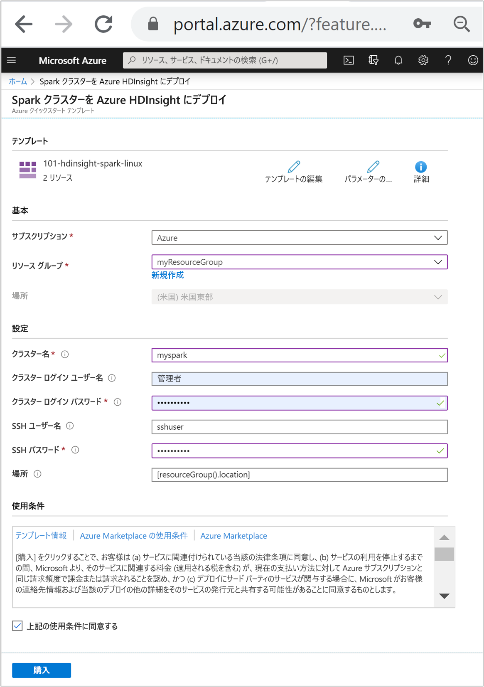

# <a name="quickstart-create-apache-spark-cluster-in-azure-hdinsight-using-resource-manager-template"></a>クイック スタート:Resource Manager テンプレートを使用して Azure HDInsight 内に Apache Spark クラスターを作成する

このクイック スタートでは、Azure Resource Manager テンプレートを使用して、Azure HDInsight に [Apache Spark](./apache-spark-overview.md) クラスターを作成します。 その後、Jupyter ノートブックを作成し、それを使用して、Apache Hive のテーブルに対する Spark SQL クエリを実行します。 Azure HDInsight は、全範囲に対応した、オープンソースのエンタープライズ向けマネージド分析サービスです。 HDInsight の Apache Spark フレームワークにより、メモリ内処理を使用した、高速の Data Analytics とクラスター コンピューティングが可能になります。 Jupyter ノートブックを使用すると、データを対話的に操作したり、コードと Markdown テキストとを結合したり、簡単な視覚化を行ったりすることができます。

複数のクラスターを一緒に使用している場合は、仮想ネットワークを作成する必要があります。また、Spark クラスターを使用している場合は、Hive Warehouse Connector を使用することもできます。 詳細については、「[Azure HDInsight 用の仮想ネットワークを計画する](../hdinsight-plan-virtual-network-deployment.md)」と「[Hive Warehouse Connector を使用して Apache Spark と Apache Hive を統合する](../interactive-query/apache-hive-warehouse-connector.md)」を参照してください。

[!INCLUDE [About Azure Resource Manager](../../../includes/resource-manager-quickstart-introduction.md)]

Azure サブスクリプションをお持ちでない場合は、開始する前に [無料アカウント](https://azure.microsoft.com/free/?WT.mc_id=A261C142F) を作成してください。

## <a name="create-an-apache-spark-cluster"></a>Apache Spark クラスターの作成

### <a name="review-the-template"></a>テンプレートを確認する

このクイック スタートで使用されるテンプレートは [Azure クイック スタート テンプレート](https://github.com/Azure/azure-quickstart-templates/tree/master/101-hdinsight-spark-linux)からのものです。

:::code language="json" source="~/quickstart-templates/101-hdinsight-spark-linux/azuredeploy.json" range="1-143":::

テンプレートでは、次の 2 つの Azure リソースが定義されています。

* [Microsoft.Storage/storageAccounts](https://docs.microsoft.com/azure/templates/microsoft.storage/storageaccounts): Azure のストレージ アカウントを作成します。
* [Microsoft.HDInsight/cluster](https://docs.microsoft.com/azure/templates/microsoft.hdinsight/clusters): HDInsight クラスターを作成します。

### <a name="deploy-the-template"></a>テンプレートのデプロイ

1. 下の **[Azure へのデプロイ]** ボタンを選択して Azure にサインインし、Resource Manager テンプレートを開きます。

    [](https://portal.azure.com/#create/Microsoft.Template/uri/https%3A%2F%2Fraw.githubusercontent.com%2FAzure%2Fazure-quickstart-templates%2Fmaster%2F101-hdinsight-spark-linux%2Fazuredeploy.json)

1. 次の値を入力または選択します。

    |プロパティ |説明 |
    |---|---|
    |サブスクリプション|ドロップダウン リストから、このクラスターに使用する Azure サブスクリプションを選択します。|
    |Resource group|ドロップダウン リストから既存のリソース グループを選択するか、 **[新規作成]** を選択します。|
    |場所|この値には、リソース グループに使用される場所が自動入力されます。|
    |クラスター名|グローバルに一意の名前を入力します。 このテンプレートの場合、使用できるのは小文字と数字のみです。|
    |[Cluster Login User Name]\(クラスター ログイン ユーザー名\)|ユーザー名を指定します。既定値は **admin** です。|
    |[クラスター ログイン パスワード]|パスワードを指定します。 パスワードは 10 文字以上で、数字、大文字、小文字、英数字以外の文字 (' " ` を除く) が少なくとも 1 つずつ含まれる必要があります。 |
    |SSH ユーザー名|ユーザー名を指定します。既定値は **sshuser** です。|
    |SSH パスワード|パスワードを指定します。|

    

1. 「**使用条件**」をご確認ください。 次に **[上記の使用条件に同意する]** を選択し、 **[購入]** を選択します。 ご自分のデプロイの進行状況が通知されます。 クラスターの作成には約 20 分かかります。

HDInsight クラスターを作成する際に問題が発生した場合は、適切なアクセス許可がない可能性があります。 詳細については、「[アクセス制御の要件](../hdinsight-hadoop-customize-cluster-linux.md#access-control)」を参照してください。

## <a name="review-deployed-resources"></a>デプロイされているリソースを確認する

クラスターが作成されると、 **[リソースに移動]** リンクを含む**デプロイ成功**通知を受け取ります。 ご自分の [リソース グループ] ページに、ご自分の新しい HDInsight クラスターと、そのクラスターに関連付けられている既定のストレージが一覧表示されます。 各クラスターには、[Azure Storage アカウント](../hdinsight-hadoop-use-blob-storage.md)または [Azure Data Lake Storage アカウント](../hdinsight-hadoop-use-data-lake-store.md)との依存関係があります。 このアカウントを、既定のストレージ アカウントと呼びます。 HDInsight クラスターとその既定のストレージ アカウントは、同じ Azure リージョンに配置されている必要があります。 クラスターを削除しても、ストレージ アカウントは削除されません。

## <a name="create-a-jupyter-notebook"></a>Jupyter Notebook の作成

[Jupyter Notebook](https://jupyter.org/) は、さまざまなプログラミング言語をサポートする対話型のノートブック環境です。 ノートブックを使用すると、データを対話的に操作したり、コードと Markdown テキストとを結合したり、簡単な視覚化を行ったりすることができます。

1. [Azure Portal](https://portal.azure.com)を開きます。

2. **[HDInsight クラスター]** を選び、作成したクラスターを選びます。

    

3. ポータルの **[クラスター ダッシュボード]** セクションで、 **[Jupyter Notebook]** を選択します。 入力を求められたら、クラスターのログイン資格情報を入力します。

   

4. **[新規]**  >  **[PySpark]** を選んで、ノートブックを作成します。

   

   Untitled(Untitled.pynb) という名前の新しい Notebook が作成されて開かれます。

## <a name="run-apache-spark-sql-statements"></a>Apache Spark SQL ステートメントを実行する

SQL (構造化照会言語) は、データ照会とデータ変換のための言語として最も一般的かつ広く使用されています。 Spark SQL を Apache Spark の拡張機能として導入することで、使い慣れた SQL 構文を使って構造化データを扱うことができます。

1. カーネルの準備ができていることを確認します。 Notebook のカーネル名の横に白丸が表示されたら、カーネルの準備ができています。 黒丸は、カーネルがビジー状態であることを示します。

    

    Notebook を初めて起動すると、カーネルがバックグラウンドでいくつかのタスクを実行します。 カーネルの準備ができるまで待ちます。

1. 次のコードを空のセルに貼り付け、**Shift + Enter** キーを押してコードを実行します。 コマンドを実行すると、クラスター上の Hive テーブルが一覧表示されます。

    ```sql
    %%sql
    SHOW TABLES
    ```

    HDInsight クラスターで Jupyter Notebook を使用すると、Spark SQL を使用して Hive クエリを実行するために使用できるプリセット `spark` セッションが手に入ります。 `%%sql` により、プリセット `spark` セッションを使用して Hive クエリを実行するよう Jupyter Notebook に指示します。 クエリは、すべての HDInsight クラスターに既定で付属する Hive テーブル (**hivesampletable**) から先頭の 10 行を取得します。 クエリの初回送信時に、Jupyter によってノートブック用の Spark アプリケーションが作成されます。 完了までに約 30 秒かかります。 Spark アプリケーションの準備が完了すると、約 1 秒後にはクエリが実行されて結果が生成されます。 出力は次のようになります。

    

    Jupyter でクエリを実行するたびに、Web ブラウザー ウィンドウのタイトルに **[(ビジー)]** ステータスと Notebook のタイトルが表示されます。 また、右上隅にある **PySpark** というテキストの横に塗りつぶされた円も表示されます。

1. 別のクエリを実行して、`hivesampletable` のデータを確認します。

    ```sql
    %%sql
    SELECT * FROM hivesampletable LIMIT 10
    ```

    画面が更新され、クエリ出力が表示されます。

    

1. ノートブックの **[File]\(ファイル\)** メニューの **[Close and Halt]\(閉じて停止\)** を選びます。 Notebook をシャットダウンすると、クラスターのリソース (Spark アプリケーションを含む) が解放されます。

## <a name="clean-up-resources"></a>リソースをクリーンアップする

このクイックスタートを完了したら、必要に応じてクラスターを削除できます。 HDInsight を使用すると、データは Azure Storage に格納されるため、クラスターは、使用されていない場合に安全に削除できます。 また、HDInsight クラスターは、使用していない場合でも課金されます。 クラスターの料金は Storage の料金の何倍にもなるため、クラスターを使用しない場合は削除するのが経済的にも合理的です。

Azure portal からお使いのクラスターに移動し、 **[削除]** を選択します。


リソース グループ名を選び、リソース グループ ページを開いて、 **[リソース グループの削除]** を選ぶこともできます。 リソース グループを削除すると、HDInsight クラスターと既定のストレージ アカウントの両方が削除されます。

## <a name="next-steps"></a>次のステップ

このクイックスタートでは、HDInsight に Apache Spark クラスターを作成し、基本的な Spark SQL クエリを実行する方法を学習しました。 HDInsight クラスターを使用してサンプル データに対話型のクエリを実行する方法については、次のチュートリアルに進みます。

> [!div class="nextstepaction"]
> [Apache Spark への対話型クエリの実行](./apache-spark-load-data-run-query.md)
