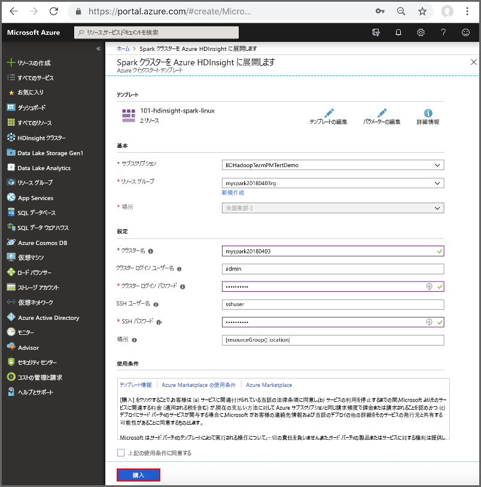
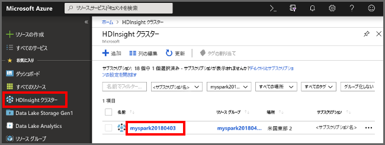
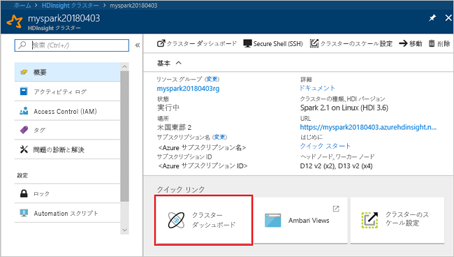
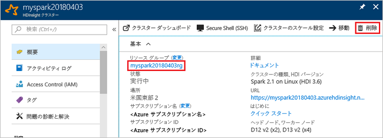

# <a name="quickstart-create-a-spark-cluster-in-hdinsight-using-template"></a>クイック スタート: テンプレートを使用した HDInsight での Spark クラスターの作成

Azure HDInsight で Apache Spark クラスターを作成し、Hive テーブルに対して Spark SQL クエリを実行する方法を説明します。 Apache Spark により、メモリ内処理を使用した、高速のデータ分析とクラスター コンピューティングが可能になります。 HDInsight での Spark について詳しくは、「[概要: Azure HDInsight での Apache Spark](apache-spark-overview.md)」を参照してください。

このクイックスタートでは、Resource Manager テンプレートを使用して HDInsight Spark クラスターを作成します。 クラスターは、クラスター記憶域として Azure Storage Blob を使います。 Data Lake Storage Gen2 の使用について詳しくは、「[クイック スタート: HDInsight のクラスターを設定する](../../storage/data-lake-storage/quickstart-create-connect-hdi-cluster.md)」をご覧ください。

> [!IMPORTANT]
> HDInsight クラスターの料金は、そのクラスターを使用しているかどうかに関係なく、分単位で課金されます。 使用後は、クラスターを必ず削除してください。 詳しくは、この記事の「[リソースのクリーンアップ](#clean-up-resources)」をご覧ください。

Azure サブスクリプションをお持ちでない場合は、開始する前に[無料アカウントを作成](https://azure.microsoft.com/free/)してください。

## <a name="create-an-hdinsight-spark-cluster"></a>HDInsight Spark クラスターを作成する

Azure Resource Manager テンプレートを使用して HDInsight Spark クラスターを作成します。 テンプレートは [GitHub](https://azure.microsoft.com/resources/templates/101-hdinsight-spark-linux/) から入手できます。 

1. 次のリンクを選択して、新しいブラウザー タブで、Azure Portal のテンプレートを開きます。         

    <a href="https://portal.azure.com/#create/Microsoft.Template/uri/https%3A%2F%2Fraw.githubusercontent.com%2FAzure%2Fazure-quickstart-templates%2Fmaster%2F101-hdinsight-spark-linux%2Fazuredeploy.json" target="_blank">Azure へのデプロイ</a>

2. 次の値を入力します。

    | プロパティ | 値 |
    |---|---|
    |**サブスクリプション**|このクラスターを作成するために使用する Azure サブスクリプションを選択します。 このクイックスタートで使用されるサブスクリプションは **&lt;Azure サブスクリプション名>** です。 |
    | **[リソース グループ]**|リソース グループを作成するか、既存のリソース グループを選択します。 リソース グループは、プロジェクトの Azure リソースを管理するために使用されます。 このクイックスタートで使用される新しいリソース グループ名は **myspark20180403rg** です。|
    | **場所**|リソース グループの場所を選びます。 テンプレートでは、この場所をクラスターの作成および既定のクラスター ストレージに使用します。 このクイック スタートで使う場所は **米国東部 2** です。|
    | **ClusterName**|作成する HDInsight クラスターの名前を入力します。 このクイックスタートで使用される新しいクラスター名は **myspark20180403** です。|
    | **クラスター ログイン名とパスワード**|既定のログイン名は admin です。クラスター ログイン用のパスワードを選択します。 このクイックスタートで使用されるログイン名は **admin** です。|
    | **SSH のユーザー名とパスワード**|SSH ユーザー用のパスワードを選択します。 このクイックスタートで使用される SSH ユーザー名は **sshuser** です。|

    

3. **[上記の使用条件に同意する]**、**[ダッシュボードにピン留めする]** の順に選択し、**[購入]** を選択します。 "**Template deployment のデプロイ中**" という新しいタイルが表示されます。 クラスターの作成には約 20 分かかります。 次のセッションに進む前に、クラスターを作成する必要があります。

HDInsight クラスターを作成する際に問題が発生した場合は、適切なアクセス許可がない可能性があります。 詳細については、「[アクセス制御の要件](../hdinsight-administer-use-portal-linux.md#create-clusters)」を参照してください。

## <a name="install-intellijeclipse-for-spark-application"></a>IntelliJ/Eclipse for Spark アプリケーションをインストールする
Azure Toolkit for IntelliJ/Eclipse プラグインを使用して Scala で記述された Spark アプリケーションを開発し、IntelliJ/Eclipse 統合開発環境 (IDE) から直接、Azure HDInsight Spark クラスターに送信します。 詳しくは、[IntelliJ を使用した Spark アプリケーションの作成/送信](./apache-spark-intellij-tool-plugin.md)および [Eclipse を使用した Spark アプリケーションの作成/送信](./apache-spark-eclipse-tool-plugin.md)に関する記事をご覧ください。

## <a name="install-vscode-for-pysparkhive-applications"></a>PySpark/Hive アプリケーション用の VSCode をインストールする
Azure HDInsight Tools for Visual Studio Code (VSCode) を使用して、Hive バッチ ジョブ、対話型 Hive クエリ、PySpark バッチ、および PySpark 対話型スクリプトを作成および送信する方法について説明します。 Azure HDInsight Tools は、VSCode でサポートされているプラットフォームにインストールできます。 これには、Windows、Linux、macOS が含まれます。 詳しくは、[VSCode を使用した PySpark アプリケーションの作成/送信](../hdinsight-for-vscode.md)に関する記事をご覧ください。

## <a name="create-a-jupyter-notebook"></a>Jupyter Notebook の作成

Jupyter Notebook は、さまざまなプログラミング言語をサポートする対話型のノートブック環境です。 ノートブックを使うと、データと対話し、Markdown テキストとコードを組み合わせて、簡単な視覚化を実行できます。 

1. [Azure Portal](https://portal.azure.com)を開きます。
2. **[HDInsight クラスター]** を選び、作成したクラスターを選びます。

    

3. ポータルで **[クラスター ダッシュボード]** を選び、**[Jupyter Notebook]** を選びます。 入力を求められたら、クラスターのログイン資格情報を入力します。

   

4. **[新規]** > **[PySpark]** を選んで、ノートブックを作成します。 

   

   Untitled(Untitled.pynb) という名前の新しい Notebook が作成されて開かれます。


## <a name="run-spark-sql-statements"></a>Spark SQL ステートメントを実行する

SQL (構造化照会言語) は、データ照会とデータ定義のための言語として最も一般的かつ広く使用されています。 Spark SQL を Apache Spark の拡張機能として導入することで、使い慣れた SQL 構文を使って構造化データを扱うことができます。

1. カーネルの準備ができていることを確認します。 Notebook のカーネル名の横に白丸が表示されたら、カーネルの準備ができています。 黒丸は、カーネルがビジー状態であることを示します。

    

    Notebook を初めて起動すると、カーネルがバックグラウンドでいくつかのタスクを実行します。 カーネルの準備ができるまで待ちます。 
2. 次のコードを空のセルに貼り付け、**Shift + Enter** キーを押してコードを実行します。 コマンドを実行すると、クラスター上の Hive テーブルが一覧表示されます。

    ```PySpark
    %%sql
    SHOW TABLES
    ```
    HDInsight Spark クラスターで Jupyter Notebook を使用すると、Spark SQL を使用して Hive クエリを実行するために使用できるプリセット `sqlContext` が手に入ります。 `%%sql` により、プリセット `sqlContext` を使用して Hive クエリを実行するよう Jupyter Notebook に指示します。 クエリは、すべての HDInsight クラスターに既定で付属する Hive テーブル (**hivesampletable**) から先頭の 10 行を取得します。 結果が得られるまで約 30 秒かかります。 出力は次のようになります。 

    

    Jupyter でクエリを実行するたびに、Web ブラウザー ウィンドウのタイトルに **[(ビジー)]** ステータスと Notebook のタイトルが表示されます。 また、右上隅にある **PySpark** というテキストの横に塗りつぶされた円も表示されます。
    
2. 別のクエリを実行して、`hivesampletable` のデータを確認します。

    ```PySpark
    %%sql
    SELECT * FROM hivesampletable LIMIT 10
    ```
    
    画面が更新され、クエリ出力が表示されます。

    

2. ノートブックの **[File]\(ファイル\)** メニューの **[Close and Halt]\(閉じて停止\)** を選びます。 Notebook をシャットダウンすると、クラスターのリソースが解放されます。

## <a name="clean-up-resources"></a>リソースのクリーンアップ
HDInsight はデータを Azure Storage または Azure Data Lake Store に格納するので、クラスターが使われていないときは、クラスターを安全に削除できます。 また、HDInsight クラスターは、使用していない場合でも課金されます。 クラスターの料金は Storage の料金の何倍にもなるため、クラスターを使用しない場合は削除するのが経済的にも合理的です。 「[次のステップ](#next-steps)」で示されているチュートリアルにすぐに取り掛かる場合は、クラスターをそのままにしてもかまいません。

Azure portal に戻り、**[削除]** を選びます。



リソース グループ名を選び、リソース グループ ページを開いて、**[リソース グループの削除]** を選ぶこともできます。 リソース グループを削除すると、HDInsight Spark クラスターと既定のストレージ アカウントの両方が削除されます。

## <a name="next-steps"></a>次の手順 

このクイックスタートでは、HDInsight Spark クラスターを作成し、基本的な Spark SQL クエリを実行する方法を学習しました。 HDInsight Spark クラスターを使用してサンプル データに対話型のクエリを実行する方法については、次のチュートリアルに進みます。

> [!div class="nextstepaction"]
>[Spark への対話型クエリの実行](./apache-spark-load-data-run-query.md)


