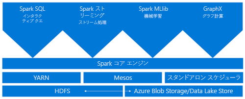
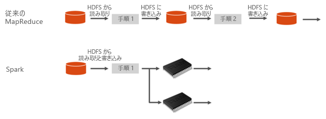
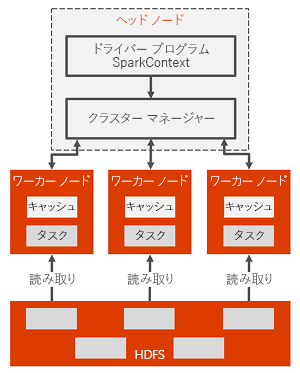

# Apache Spark とは - Azure HDInsight

*Apache Spark* ビッグ データ分析アプリケーションのパフォーマンスを向上させるメモリ内処理をサポートする並列処理フレームワーク。 Azure HDInsight の Apache Spark は、クラウドでの Apache Hadoop の Microsoft の実装です。 HDInsight により、Azure での Spark クラスターの作成と構成が簡単になります。 HDInsight の Spark クラスターは、Azure Storage および Azure Data Lake Store と互換性があります。 そのため、HDInsight Spark クラスターを使用して、Azure に格納されているデータを処理できます。 コンポーネントとバージョン情報については、[Azure HDInsight での Hadoop のコンポーネントとバージョン](../hdinsight-component-versioning.md)に関するページを参照してください。

## Spark とは

Spark には、クラスターの計算処理をインメモリで行うための基本的な要素が備わっています。 Spark ジョブは、データをメモリに読み込んでキャッシュし、それを繰り返しクエリできます。 メモリ内計算は、HDFS 経由でデータを共有する Hadoop などのディスク ベースのアプリケーションよりもはるかに高速です。 また Spark は、Scala プログラミング言語との親和性が高く、分散データ セットをローカル コレクションのように扱うことができます。 計算内容をすべて map 処理と reduce 処理に分ける必要がありません。

Azure HDInsight の Spark クラスターでは、フル マネージドの Spark サービスを利用できます。 以下の一覧は、HDInsight で Spark クラスターを作成する利点をまとめたものです。

| Feature | 説明 |
| --- | --- |
| 簡単な作成 |Azure Portal、Azure PowerShell、または HDInsight .NET SDK を使用すると、HDInsight に新しい Spark クラスターを数分で作成できます。 「 [HDInsight での Spark クラスターの概要](apache-spark-jupyter-spark-sql.md) |
| 使いやすさ |HDInsight の Spark クラスターには、Jupyter Notebook と Zeppelin Notebook が含まれています。 対話型のデータ処理と視覚化にこれらの Notebook を使用できます。|
| REST API |HDInsight の Spark クラスターには、ジョブの送信と監視をリモートで実行する REST API ベースの Spark ジョブ サーバーである [Livy](https://github.com/cloudera/hue/tree/master/apps/spark/java#welcome-to-livy-the-rest-spark-server) が含まれています。 |
| Azure Data Lake Store のサポート | HDInsight の Spark クラスターは、プライマリ ストレージまたは追加のストレージの両方として、Azure Data Lake Store を使用できます。 Data Lake Store の詳細については、「 [Azure Data Lake Store の概要](../../data-lake-store/data-lake-store-overview.md)」を参照してください。 |
| Azure サービスとの統合 |HDInsight の Spark クラスターには、Azure Event Hubs へのコネクタが付属しています。 Spark の一部として既に使用できる [Kafka](http://kafka.apache.org/) に加えて、Event Hubs を使用してストリーミング アプリケーションを作成できます。 |
| ML Server のサポート | HDInsight の ML Server のサポートは、クラスターの種類 **ML サービス**で提供されます。 ML サービス クラスターをセットアップして、Spark クラスターによって決められた速度で分散 R 計算を実行できます。 詳細については、[HDInsight での ML Server の使用開始](../r-server/r-server-get-started.md)に関するページをご覧ください。 |
| サード パーティ製 IDE との統合 | HDInsight は、アプリケーションを作成して HDInsight Spark クラスターに送信するために役立つ複数の IDE プラグインを備えています。 詳細については、[Azure Toolkit for IntelliJ IDEA の使用](apache-spark-intellij-tool-plugin.md)、[HDInsight for VS Code の使用](../hdinsight-for-vscode.md)、[Azure Toolkit for Eclipse の使用](apache-spark-eclipse-tool-plugin.md)に関する各ページを参照してください。|
| 同時クエリ |HDInsight の Spark クラスターでは同時クエリがサポートされます。 この機能により、1 人のユーザーからの複数のクエリまたは複数のユーザーおよびアプリケーションからの複数のクエリが、同じクラスター リソースを共有できます。 |
| SSD へのキャッシュ |データのキャッシュ先を、メモリまたはクラスター ノードに取り付けられている SSD から選択できます。 メモリ内キャッシュは、最高のクエリ パフォーマンスを発揮しますが、コストが高くなることがあります。 SSD へのキャッシュは、メモリ内のデータセット全体を収めるのに必要なサイズのクラスターを作成する必要なしにクエリのパフォーマンスを向上できる優れたオプションです。 |
| BI ツールとの統合 |HDInsight の Spark クラスターには、データ分析用の [Power BI](http://www.powerbi.com/) などの BI ツールへのコネクタが用意されています。 |
| 読み込み済みの Anaconda ライブラリ |HDInsight の Spark クラスターには、Anaconda ライブラリが事前にインストールされています。 [Anaconda](http://docs.continuum.io/anaconda/) は、機械学習、データ分析、視覚化などのための 200 個近いライブラリを提供します。 |
| スケーラビリティ | HDInsight により、クラスター ノードの数を変更できます。 また、すべてのデータは Azure Storage または Data Lake Store に格納されるため、Spark クラスターはデータの損失なしで削除できます。 |
| SLA |HDInsight の Spark クラスターでは、24 時間無休体制のサポートと、アップタイム 99.9% の SLA が提供されます。 |

HDInsight の Spark クラスターには、クラスターで使用できる以下のコンポーネントが既定で含まれています。

* [Spark Core](https://spark.apache.org/docs/1.5.1/)。 Spark Core、Spark SQL、Spark ストリーミング API、GraphX、MLlib が含まれます。
* [Anaconda](http://docs.continuum.io/anaconda/)
* [Livy](https://github.com/cloudera/hue/tree/master/apps/spark/java#welcome-to-livy-the-rest-spark-server)
* [Jupyter Notebook](https://jupyter.org)
* [Zeppelin Notebook](http://zeppelin-project.org/)

HDInsight の Spark クラスターでは、Microsoft Power BI などの BI ツールから HDInsight の Spark クラスターに接続するための [ODBC ドライバー](http://go.microsoft.com/fwlink/?LinkId=616229)も提供されます。

## Spark クラスターのアーキテクチャ

HDInsight クラスターで Spark を実行する方法を理解することで、Spark のコンポーネントを理解しやすくなります。

Spark アプリケーションは、メイン プログラム (ドライバー プログラムと呼ばれる) の SparkContext オブジェクトによって調整された、独立したプロセスのセットとしてクラスターで実行されます。

SparkContext は、アプリケーション間でリソースを割り当てる複数の種類のクラスター マネージャーに接続できます。 これらのクラスター マネージャーには、Apache Mesos、Apache YARN、または Spark クラスター マネージャーが含まれます。 HDInsight では、YARN クラスター マネージャーを使って Spark が実行されます。 接続されると、Spark はクラスター内の worker ノードで Executor を取得します。Executor は、アプリケーションの計算を実行し、データを格納するプロセスです。 次に、アプリケーション コード (SparkContext に渡される JAR ファイルまたは Python ファイルで定義された) を Executor に送信します。 最後に、SparkContext はタスクを Executor に送信して実行させます。

SparkContext は、ユーザーの main 関数を実行し、worker ノードでさまざまな並列処理を実行します。 その後、SparkContext は操作の結果を収集します。 ワーカー ノードによるデータの読み取りと書き込みは、Hadoop 分散ファイル システム (HDFS) との間で行われます。 また、ワーカー ノードは、変換後のデータを Resilient Distributed Dataset (RDD) としてメモリ内にキャッシュします。

SparkContext は Spark マスターに接続し、worker ノードの Executor プロセス内で実行される個々のタスクの有向グラフ (DAG) にアプリケーションを変換する処理を行います。 アプリケーションはそれぞれ独自の Executor プロセスを取得し、そのプロセスが、アプリケーション全体が終了するまで稼働し続けながら、複数のスレッドでタスクを実行します。

## HDInsight の Spark のユース ケース

HDInsight の Spark クラスターでは、以下に挙げる主なシナリオを実現できます。

- 対話型のデータ分析と BI

    HDInsight の Apache Spark では、Azure Storage または Azure Data Lake Store にデータが格納されます。 ビジネス エキスパートや重要な意思決定者は、そのデータを分析してレポートを作成し、分析されたデータから Microsoft Power BI を使用して対話型レポートを作成できます。 アナリストはクラスター ストレージ内の非構造化データや半構造化データから作業を開始し、そのデータのスキーマを Notebook を使用して定義してから、Microsoft Power BI を使用してデータ モデルを作成することができます。 また、HDInsight の Spark クラスターでは Tableau などの多数のサードパーティ製 BI ツールもサポートされるので、データ アナリストやビジネス エキスパート、重要な意思決定者にとって使いやすくなります。

    [チュートリアル: Power BI を使用して Spark データを視覚化する](apache-spark-use-bi-tools.md)
- Spark Machine Learning

    Apache Spark には、Spark を基に作成された機械学習ライブラリである [MLlib](http://spark.apache.org/mllib/) が付属し、HDInsight の Spark クラスターから使用できます。 HDInsight の Spark クラスターには、機械学習用のさまざまなパッケージを含む Python ディストリビューションである Anaconda も含まれています。 これと Jupyter および Zeppelin Notebook の組み込みサポートを組み合わせることにより、機械学習アプリケーションを作成するための環境が得られます。

    [チュートリアル: HVAC データを使用して建物の温度を予測する](apache-spark-ipython-notebook-machine-learning.md) [チュートリアル: 食品検査の結果を予測する](apache-spark-machine-learning-mllib-ipython.md)    
- Spark のストリーミングおよびリアルタイム データ分析

    HDInsight の Spark クラスターには、リアルタイム分析ソリューションを構築するための豊富なサポートが用意されています。 Spark には既に Kafka、Flume、Twitter、ZeroMQ、TCP ソケットなどの多数のソースからデータを取り込むためのコネクタがありますが、HDInsight の Spark では Azure Event Hubs からデータを取り込むためのファーストクラスのサポートが追加されます。 Event Hubs は、Azure で最も広く使用されているキュー サービスです。 Event Hubs 向けのサポートがすぐに利用できることから、HDInsight の Spark クラスターは、リアルタイム分析パイプラインを構築するうえで理想的なプラットフォームです。
    
## どこから始めるか

HDInsight の Spark の詳細については、次の記事を使用できます。

- [HDInsight での Spark クラスターの作成と Jupyter を使用した対話型クエリの実行に関するクイックスタート](./apache-spark-jupyter-spark-sql.md)
- [Jupyter を使用した Spark ジョブの実行に関するチュートリアル](./apache-spark-load-data-run-query.md)
- [BI ツールを使用したデータの分析に関するチュートリアル](./apache-spark-use-bi-tools.md)
- [Spark を使用した Machine Learning に関するチュートリアル](./apache-spark-ipython-notebook-machine-learning.md)
- [チュートリアル: IntelliJ を使用した Scala Maven アプリケーションの作成](./apache-spark-create-standalone-application.md)

## 次の手順

この概要では、Azure HDInsight の Apache Spark の基本について理解します。 次の記事に進む前に、HDInsight Spark クラスターを作成し、いくつかの Spark SQL クエリを実行する方法を確認します。

- [HDInsight での Spark クラスターの作成](./apache-spark-jupyter-spark-sql.md)

