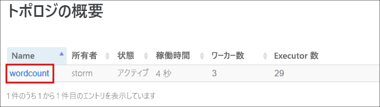
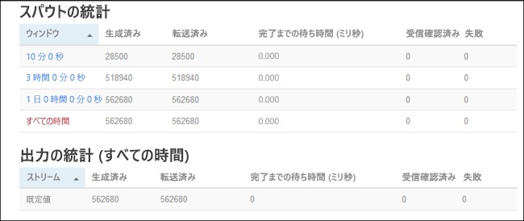

# <a name="quickstart-create-and-monitor-an-apache-storm-topology-in-azure-hdinsight"></a>クイック スタート:Azure HDInsight で Apache Storm トポロジを作成、監視する

Apache Storm は、データ ストリームの処理を目的とし、スケーラビリティとフォールト トレランスに優れた、分散型のリアルタイム計算システムです。 Azure HDInsight の Storm を使用して、Storm でリアルタイムで ビッグ データ分析を実行するクラウドベースの Storm クラスターを作成できます。

このクイック スタートでは、Apache [storm-starter](https://github.com/apache/storm/tree/v2.0.0/examples/storm-starter) プロジェクトの例を使用して、既存の Apache Storm クラスターに対して Apache Storm トポロジーを作成、監視します。

## <a name="prerequisites"></a>前提条件

* HDInsight 上の Apache Storm クラスター。 [Azure portal を使用した Apache Hadoop クラスターの作成](../hdinsight-hadoop-create-linux-clusters-portal.md)に関するページを参照し、 **[クラスターの種類]** で **[Storm]** を選択してください。

* SSH クライアント 詳細については、[SSH を使用して HDInsight (Apache Hadoop) に接続する方法](../hdinsight-hadoop-linux-use-ssh-unix.md)に関するページを参照してください。

## <a name="create-the-topology"></a>トポロジを作成する

1. Storm クラスターに接続します。 次のコマンドを編集して `CLUSTERNAME` を Storm クラスターの名前に置き換えてから、コマンドを入力します。

    ```cmd
    ssh sshuser@CLUSTERNAME-ssh.azurehdinsight.net
    ```

2. **WordCount** の例は、`/usr/hdp/current/storm-client/contrib/storm-starter/` で HDInsight クラスターに含まれています。 トポロジによりランダムな文が生成され、単語の出現回数がカウントされます。 次のコマンドを使用して、クラスターで **wordcount** トポロジを開始します。

    ```bash
    storm jar /usr/hdp/current/storm-client/contrib/storm-starter/storm-starter-topologies-*.jar org.apache.storm.starter.WordCountTopology wordcount
    ```

## <a name="monitor-the-topology"></a>トポロジの監視

Storm には、トポロジの実行を操作する Web インターフェイスがあり、HDInsight クラスターに含まれています。

次の手順により、Storm UI を使用してトポロジを監視します。

1. Storm UI を表示するには、Web ブラウザーで `https://CLUSTERNAME.azurehdinsight.net/stormui` を開きます。 `CLUSTERNAME` をクラスターの名前に置き換えます。

2. **[トポロジの概要]** で、 **[名前]** 列の **[wordcount]** エントリを選択します。 トポロジの情報が表示されます。

    

    新しいページに、次の情報が表示されます。

    |プロパティ | 説明 |
    |---|---|
    |トポロジの統計|時間枠で整理された、トポロジのパフォーマンスに関する基本的な情報。 特定の時間枠を選択すると、ページの他のセクションに表示される情報の時間枠に変更されます。|
    |スパウト|各スパウトによって返された最後のエラーを含む、スパウト関する基本的な情報。|
    |ボルト|ボルトに関する基本的な情報。|
    |トポロジの構成|トポロジの構成に関する詳細情報。|
    |アクティブ化|アクティブ化が解除されたトポロジの処理を再開します。|
    |非アクティブ化|実行中のトポロジを一時停止します。|
    |再調整|トポロジの並列処理を調整します。 クラスターのノード数を変更した場合は、実行中のトポロジを再調整する必要があります。 再調整によって、並列処理が、クラスター内のノード数の増減に合わせて調整されます。 詳細については、[Apache Storm トポロジの並列処理の理解](https://storm.apache.org/documentation/Understanding-the-parallelism-of-a-Storm-topology.html)に関するページを参照してください。|
    |強制終了|指定したタイムアウト後に Storm トポロジを停止します。|

3. このページで、 **[スパウト]** または **[ボルト]** セクションからエントリを選択します。 選択したコンポーネントに関する情報が表示されます。

    

    新しいページに次の情報が表示されます。

    |プロパティ | 説明 |
    |---|---|
    |スパウト/ボルトの統計|時間枠で整理された、コンポーネントのパフォーマンスに関する基本的な情報。 特定の時間枠を選択すると、ページの他のセクションに表示される情報の時間枠に変更されます。|
    |入力の統計 (ボルトのみ)|ボルトによって使用されるデータを生成するコンポーネントに関する情報。|
    |出力の統計|このボルトによって出力されるデータに関する情報。|
    |エグゼキュータ|このコンポーネントのインスタンスに関する情報。|
    |エラー|このコンポーネントで生成されたエラー。|

4. スパウトまたはボルトの詳細を表示したら、 **[エグゼキュータ]** セクションの **[ポート]** 列でエントリを選択して、コンポーネントの特定のインスタンスの詳細を表示します。

        2015-01-27 14:18:02 b.s.d.task [INFO] Emitting: split default ["with"]
        2015-01-27 14:18:02 b.s.d.task [INFO] Emitting: split default ["nature"]
        2015-01-27 14:18:02 b.s.d.executor [INFO] Processing received message source: split:21, stream: default, id: {}, [snow]
        2015-01-27 14:18:02 b.s.d.task [INFO] Emitting: count default [snow, 747293]
        2015-01-27 14:18:02 b.s.d.executor [INFO] Processing received message source: split:21, stream: default, id: {}, [white]
        2015-01-27 14:18:02 b.s.d.task [INFO] Emitting: count default [white, 747293]
        2015-01-27 14:18:02 b.s.d.executor [INFO] Processing received message source: split:21, stream: default, id: {}, [seven]
        2015-01-27 14:18:02 b.s.d.task [INFO] Emitting: count default [seven, 1493957]

    この例では、**seven** という単語が 1493957 回発生しました。 この数値は、このトポロジが開始されてから、この単語が発生した回数です。

## <a name="stop-the-topology"></a>トポロジを停止する

ワードカウント トポロジの **[トポロジの概要]** ページに戻り、 **[トポロジのアクション]** セクションで **[強制終了]** ボタンを選択します。 メッセージが表示されたら、トポロジを停止するまでの待機秒数として「10」を入力します。 タイムアウト期間後は、ダッシュボードの **[Storm UI]** セクションにアクセスしても、トポロジは表示されません。

## <a name="clean-up-resources"></a>リソースをクリーンアップする

このクイックスタートを完了したら、必要に応じてクラスターを削除できます。 HDInsight を使用すると、データは Azure Storage に格納されるため、クラスターは、使用されていない場合に安全に削除できます。 また、HDInsight クラスターは、使用していない場合でも課金されます。 クラスターの料金は Storage の料金の何倍にもなるため、クラスターを使用しない場合は削除するのが経済的にも合理的です。

クラスターを削除するには、「[ブラウザー、PowerShell、または Azure CLI を使用して HDInsight クラスターを削除する](../hdinsight-delete-cluster.md)」を参照してください。

## <a name="next-steps"></a>次のステップ

このクイック スタートでは、Apache [storm-starter](https://github.com/apache/storm/tree/v2.0.0/examples/storm-starter) プロジェクトの例を使用して、既存の Apache Storm クラスターに対して Apache Storm トポロジーを作成し監視しました。 Apache Storm トポロジの管理や監視の基礎を習得するには、次の記事に進みます。

> [!div class="nextstepaction"]
>[Azure HDInsight での Apache Storm トポロジのデプロイと管理](./apache-storm-deploy-monitor-topology-linux.md)