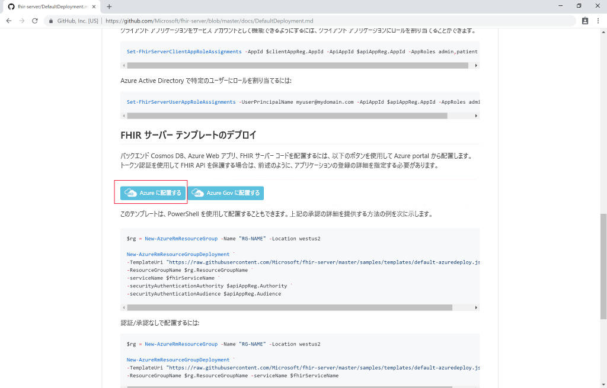
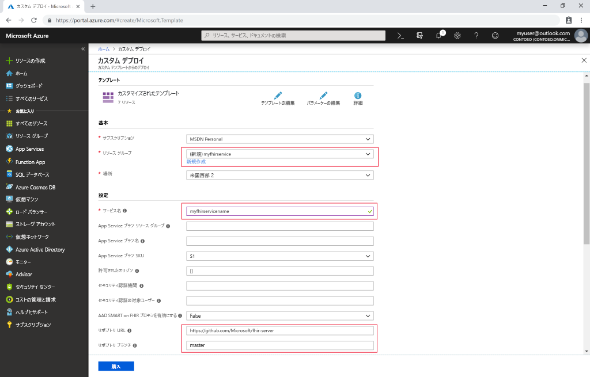

# クイック スタート:Azure portal を使用してオープンソースの FHIR サーバーをデプロイする

このクイックスタートでは、Azure portal を使用して、オープンソースの FHIR サーバーを Azure にデプロイする方法について説明します。 ここでは、[オープンソース リポジトリ](https://github.com/Microsoft/fhir-server)にある手軽なデプロイ リンクを使用します。

Azure サブスクリプションをお持ちでない場合は、開始する前に [無料アカウント](https://azure.microsoft.com/free/?WT.mc_id=A261C142F) を作成してください。

## GitHub オープンソース リポジトリ

[GitHub デプロイ ページ](https://github.com/Microsoft/fhir-server/blob/master/docs/DefaultDeployment.md)に移動し、[Deploy to Azure]\(Azure へのデプロイ\) ボタンを探します。

デプロイ ボタンをクリックすると、Azure portal が開きます。

## デプロイのパラメーターを入力する

リソース グループの新規作成を選択し、名前を付けます。 それ以外で必要なパラメーターは、サービスの名前だけです。

このデプロイでは、GitHub 上のオープンソース リポジトリから直接ソース コードがプルされることに注意してください。 リポジトリをフォークした場合は、自分のフォークと特定のブランチをポイントすることができます。

詳細を入力したら、デプロイを開始することができます。

## FHIR サーバーが実行されていることを確認する

デプロイが完了したら、ブラウザーに `https://SERVICENAME.azurewebsites.net/metadata` を指定して機能ステートメントを取得できます。 サーバーから最初の応答が返されるまでに 1 分ほど時間がかかります。

## リソースをクリーンアップする

必要がなくなったら、リソース グループおよびすべての関連リソースを削除できます。 そのためには、プロビジョニング済みのリソースがあるリソース グループを選択し、 **[リソース グループの削除]** を選択して、削除するリソース グループの名前を確認します。

## 次のステップ

このチュートリアルでは、ご利用のサブスクリプションに Microsoft Open Source FHIR Server for Azure をデプロイしました。 Postman を使用して FHIR API にアクセスする方法を学習するには、Postman のチュートリアルに進んでください。
 
>[!div class="nextstepaction"]
>[Postman を使用して FHIR API にアクセスする](access-fhir-postman-tutorial.md)