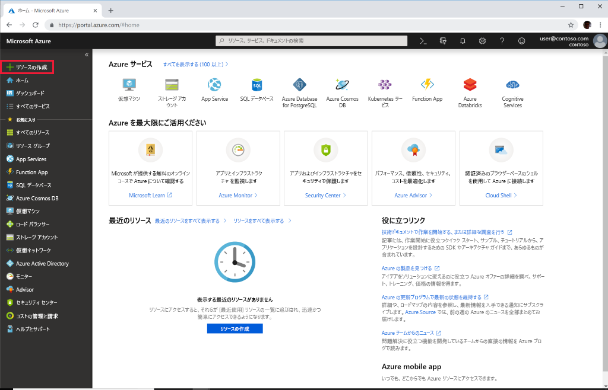
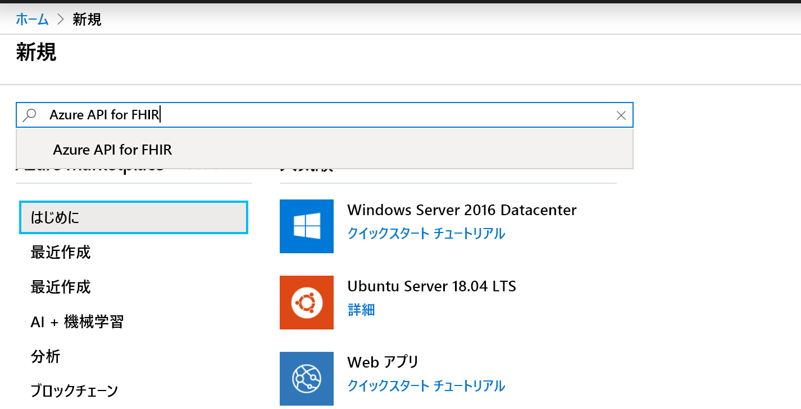
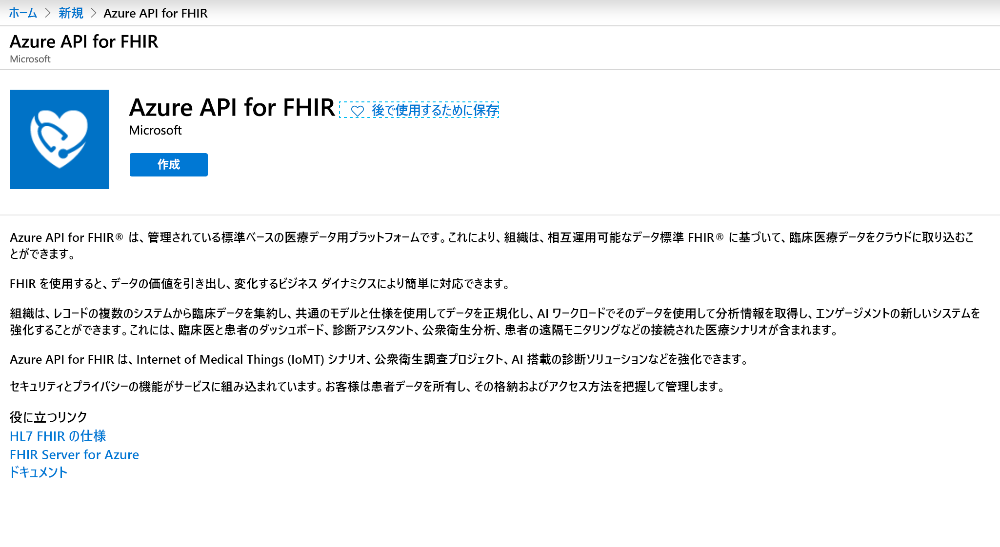
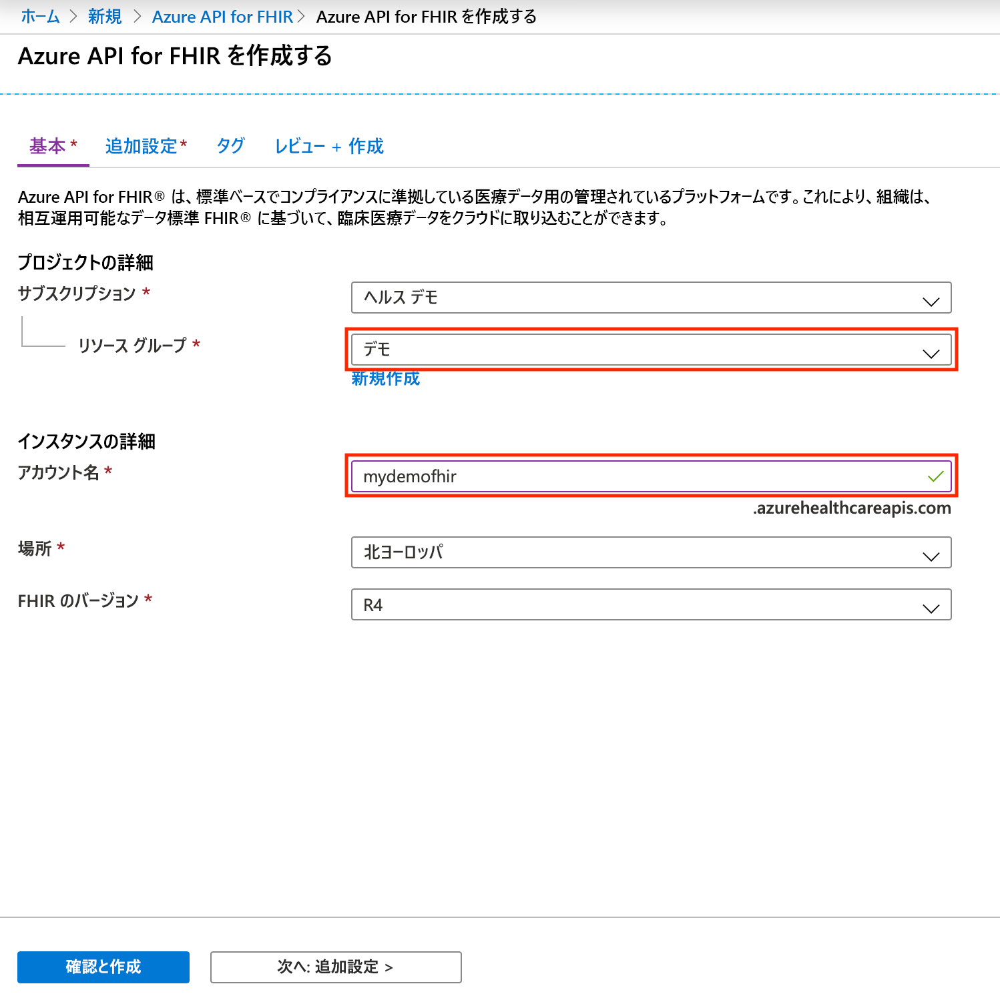

# クイック スタート:Azure portal を使用して Azure API for FHIR をデプロイする

このクイックスタートでは、Azure portal を使用して Azure API for FHIR をデプロイする方法について説明します。

Azure サブスクリプションをお持ちでない場合は、開始する前に [無料アカウント](https://azure.microsoft.com/free/?WT.mc_id=A261C142F) を作成してください。

## 新しいリソースの作成

[Azure portal](https://portal.azure.com) を開いて **[リソースの作成]** をクリックします。

## Azure API for FHIR を検索する

Azure API for FHIR は、検索ボックスに「FHIR」と入力すると見つかります。

## Azure API for FHIR アカウントを作成する

新しい Azure API for FHIR アカウントを作成するには、 **[作成]** を選択します。

## アカウントの詳細を入力する

既存のリソース グループを選択するか、リソース グループを新たに作成し、アカウントの名前を選択して、最後に **[確認と作成]** をクリックします。

作成の確認を行い、FHIR API のデプロイを待ちます。

## 追加設定

**[次へ: 追加設定]** をクリックして、機関と対象ユーザー、さらに、この Azure API for FHIR へのアクセスを許可する ID オブジェクト ID を構成し、必要に応じて SMART on FHIR を有効にして、データベース スループットを構成します。

- **機関:** サービスの認証機関としてログインしているテナントとは別の Azure AD テナントを指定できます。
- **Audience:** 対象ユーザーは、FHIR サーバーの URL に設定することをお勧めします (これが既定の設定となります)。 設定はここで変更できます。 トークンの対象となる受信者は、対象ユーザーによって識別されます。 このコンテキストでは、FHIR API 自体を表す値に設定する必要があります。
- **許可されたオブジェクト ID:** この Azure API for FHIR へのアクセスを許可する ID オブジェクト ID を指定できます。 ユーザーとサービス プリンシパルのオブジェクト ID を見つける方法について詳しくは、攻略ガイド「[ID オブジェクト ID を見つける](find-identity-object-ids.md)」を参照してください。  
- **SMART on FHIR プロキシ:** SMART on FHIR プロキシを有効にすることができます。 SMART on FHIR プロキシを構成する方法の詳細については、[Azure API for FHIR の SMART on FHIR プロキシ](https://docs.microsoft.com/azure/healthcare-apis/use-smart-on-fhir-proxy)に関するチュートリアルを参照してください。  
- **プロビジョニング スループット (RU/秒):** ここには、Azure API for FHIR の基になるデータベースのスループット設定を指定できます。 この設定は、後から [データベース] ブレードで変更できます。 詳細については、[データベース設定の構成](configure-database.md)に関するページを参照してください。

## FHIR API の機能ステートメントをフェッチする

新しい FHIR API アカウントがプロビジョニングされていることを確認するには、ブラウザーに `https://<ACCOUNT-NAME>.azurehealthcareapis.com/metadata` を指定して機能ステートメントをフェッチします。

## リソースをクリーンアップする

リソース グループ、Azure API for FHIR、およびすべての関連リソースは、不要になったら削除できます。 そのためには、Azure API for FHIR アカウントがあるリソース グループを選択し、 **[リソース グループの削除]** を選択して、削除するリソース グループの名前を確認します。

## 次のステップ

このクイックスタート ガイドでは、ご利用のサブスクリプションに Azure API for FHIR をデプロイしました。 Azure API for FHIR に対してその他の設定を行うには、追加設定の攻略ガイドに進んでください。

>[!div class="nextstepaction"]
>[Azure API for FHIR の追加設定](azure-api-for-fhir-additional-settings.md)
