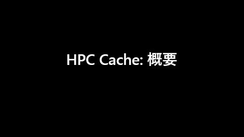

# Azure HPC Cache とは

ハイパフォーマンス コンピューティング (HPC) タスクには、Azure HPC Cache を使用することでデータへのアクセスを高速化できます。 Azure HPC Cache で Azure 内のファイルをキャッシュすることで、クラウド コンピューティングのスケーラビリティを既存のワークフローでも実現します。 このサービスは、ローカル データセンターのネットワーク接続ストレージ (NAS) 環境などの WAN リンクにデータが格納されているワークフローでも使用できます。

Azure HPC Cache は、Azure portal から簡単に立ち上げて監視することができます。 既にある NFS ストレージや新しい BLOB コンテナーをその集約された名前空間に追加できるため、バックエンドのストレージ ターゲットを変更する場合でも、クライアント アクセスはシンプルになります。

## 概要ビデオ

上の画像をクリックすると、[Azure HPC Cache の簡単な概要](https://azure.microsoft.com/resources/videos/hpc-cache-overview/)が再生されます。

## ユース ケース

Azure HPC Cache による生産性の向上は、次のようなワークフローで最大限に発揮されます。

* 読み取り負荷の高いファイル アクセス ワークフロー
* NFS でアクセスできるストレージ、Azure BLOB、またはその両方に格納されるデータ
* CPU のコア数が 75,000 個までのコンピューティング ファーム

Azure HPC Cache は、業種を越えてさまざまなワークフローに取り入れることができます。 多数のマシンが一連のファイルに低遅延で、かつ大規模にアクセスする必要のあるすべてのシステムで、このサービスは利便性を発揮します。 以降のセクションで具体的な例を示します。

### 視覚効果 (VFX) のレンダリング

メディアとエンターテイメントの分野では、タイムクリティカルなレンダリング プロジェクトのデータ アクセスを Azure HPC Cache によってスピードアップできます。 VFX レンダリング ワークフローでは、多数のコンピューティング ノードによる最終処理が必要になることが少なくありません。 そうしたワークフローに使用されるデータは通常、オンプレミスの NAS 環境に置かれます。 Azure HPC Cache では、そのファイル データをクラウドにキャッシュできるため、待ち時間が減り、柔軟性が向上して、オンデマンド レンダリングが実現します。

### ライフ サイエンス

多くのライフ サイエンス ワークフローは、スケールアウト ファイル キャッシュの恩恵を受けることができます。

ゲノム解析ワークフローを Azure に移植したいと考えている研究施設は、Azure HPC Cache を使用することで簡単にシフトすることができます。 キャッシュには POSIX ファイル アクセスが用意されているため、既存のクライアント ワークフローをクラウドで実行するためにクライアント側の変更は必要ありません。

二次解析、薬理学的シミュレーション、AI による画像分析などのタスクについても、Azure HPC Cache を活用して効率を高めることができます。

### 金融サービスの分析

Azure HPC Cache のデプロイは定量分析計算やリスク分析ワークロード、モンテカルロ シミュレーションをスピードアップするために役立ちます。これにより、金融サービス会社はより優れた分析情報を得て戦略的な決定を行えます。

## 利用可能なリージョン

Azure HPC Cache を使用できる場所については、[リージョン別の Azure グローバル インフラストラクチャ製品](https://azure.microsoft.com/global-infrastructure/services/?products=hpc-cache)に関するページを参照してください。

Azure HPC Cache は 1 つのリージョンに属します。 それを他のリージョンに置かれている BLOB コンテナーに接続すれば、他のリージョンに格納されているデータにアクセスすることができます。 このキャッシュは、顧客データを永続的には格納しません。

## 次のステップ

* [Azure HPC Cache の製品ページ](https://azure.microsoft.com/services/hpc-cache)を参照して、その機能を詳しく確認する
* 製品の[前提条件](hpc-cache-prerequisites.md)を確認する
* Azure portal から [Azure HPC Cache を作成](hpc-cache-create.md)する
