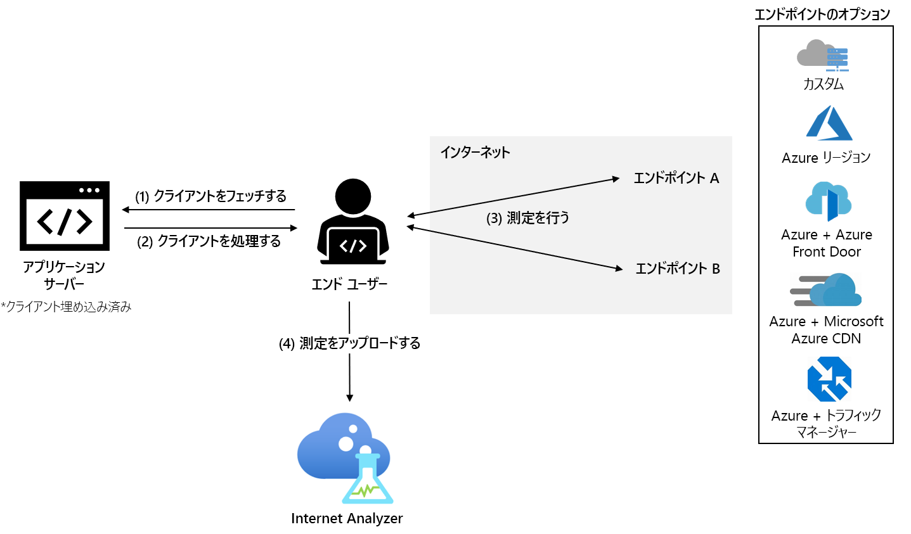

# Internet Analyzer とは (プレビュー)

Internet Analyzer は、ネットワーク インフラストラクチャの変更による顧客のパフォーマンスへの影響をテストする、クライアント側の測定プラットフォームです。 オンプレミスから Azure に移行する場合も、新しい Azure サービスを評価する場合も、Internet Analyzer を使用すると、移行前にユーザーのデータと Microsoft の豊富な分析から学習して、ネットワーク アーキテクチャについて理解を深め、Azure で最適化することができます。

Internet Analyzer は、Web アプリケーションに埋め込まれている小さな JavaScript クライアントを使用して、エンドユーザーから選択した一連のネットワーク宛先 (_エンドポイント_) に対する待機時間を測定します。 Internet Analyzer では、複数のサイドバイサイド テストを設定できます。これにより、インフラストラクチャや顧客のニーズの変化に応じてさまざまなシナリオを評価することができます。 Internet Analyzer には、カスタム エンドポイントと事前構成済みのエンドポイントが用意されており、利便性と柔軟性が得られるため、エンド ユーザーに対して信頼されるパフォーマンスを決定することができます。 

> [!IMPORTANT]
> このパブリック プレビュー版はサービス レベル アグリーメントなしで提供されています。運用環境のワークロードに使用することは避けてください。 特定の機能はサポート対象ではなく、機能が制限されることがあるか、Azure の場所によっては利用できない場合があります。 詳しくは、「[Microsoft Azure プレビューの追加使用条件](https://azure.microsoft.com/support/legal/preview-supplemental-terms/)」をご覧ください。
>

## カスタマイズ可能なクイック テスト

Internet Analyzer は、クラウドの移行、新規または追加の Azure リージョンへのデプロイ、Azure での新しいアプリケーションおよびコンテンツ配信プラットフォーム ([Azure Front Door](https://azure.microsoft.com/services/frontdoor/) や [Microsoft Azure CDN](https://azure.microsoft.com/services/cdn/) など) のテストの、パフォーマンス関連の質問に対処します。 

Internet Analyzer で作成する各テストは、エンドポイント A とエンドポイント B の 2 つのエンドポイントで構成されます。エンドポイント B のパフォーマンスは、エンドポイント A に対して相対的に分析されます。 

独自のカスタム エンドポイントを構成するか、さまざまな事前構成済みの Azure エンドポイントから選択することができます。 カスタム エンドポイントは、オンプレミスのワークロード、他のクラウド プロバイダーのインスタンス、またはカスタムの Azure 構成の評価に使用されます。 テストは、2 つのカスタム エンドポイントで構成することができます。ただし、少なくとも 1 つのカスタム エンドポイントを Azure でホストする必要があります。 事前構成済みの Azure エンドポイントを使用すると、Azure Front Door、Azure Traffic Manager、Azure CDN など、一般的な Azure ネットワーク プラットフォームのパフォーマンスをすばやく簡単に評価できます。 

プレビュー期間中は、次の事前構成済みのエンドポイントを使用できます。 

* **Azure リージョン**
    * ブラジル南部
    * インド中部
    * 米国中部
    * 東アジア
    * East US
    * 西日本
    * 北ヨーロッパ
    * 南アフリカ北部
    * 東南アジア 
    * アラブ首長国連邦北部
    * 英国西部  
    * 西ヨーロッパ
    * 米国西部 
    * 米国西部 2
* **複数の Azure リージョンの組み合わせ** 
    * 米国東部、ブラジル南部 
    * 米国東部、東アジア 
    * 西ヨーロッパ、ブラジル南部
    * 西ヨーロッパ、東南アジア
    * 西ヨーロッパ、アラブ首長国連邦北部
    * 米国西部、米国東部 
    * 米国西部、西ヨーロッパ
    * 米国西部、アラブ首長国連邦北部
    * 西ヨーロッパ、アラブ首長国連邦北部、東南アジア
    * 米国西部、西ヨーロッパ、東アジア
    * 米国西部、北ヨーロッパ、東南アジア、アラブ首長国連邦北部、南アフリカ北部 
* **Azure + Azure Front Door** - 上記のいずれか 1 つまたは複数の Azure リージョンの組み合わせに対してデプロイされます
* **Azure + Microsoft の Azure CDN** - 上記のいずれか 1 つの Azure リージョンの組み合わせに対してデプロイされます
* **Azure + Azure Traffic Manager** - 上記のいずれか複数の Azure リージョンの組み合わせに対してデプロイされます

## 推奨されるテスト シナリオ 

顧客にとって最適なパフォーマンスを決定するために、Internet Analyzer では、エンド ユーザーの特定のグループについて 2 つのエンドポイントを評価することができます。 

Internet Analyzer は多くの質問に答えることができますが、特に一般的なものは次のとおりです。 
* クラウドに移行すると、パフォーマンスにどのような影響があるか。 
    * *推奨されるテスト: カスタム (現在のオンプレミス インフラストラクチャ) vs.Azure (事前構成済みの任意のエンドポイント)*
* 自分のデータをエッジに置いた場合とデータ センターに置いた場合では、どのような価値の違いがあるか。 
    *  *推奨されるテスト: Azure vs.Azure Front Door、Azure vs. Microsoft の Azure CDN*
* Azure Front Door のパフォーマンス上の利点は何か。
    *  *推奨されるテスト: カスタム/Azure/CDN vs. Azure Front Door*
* Microsoft の Azure CDN のパフォーマンス上の利点は何か。 
    *  *推奨されるテスト: カスタム/Azure/AFD vs. Microsoft の Azure CDN*
* Microsoft の Azure CDN はどのように積み重ねられているか。 
    *  *推奨されるテスト: カスタム (他の CDN エンドポイント) vs. Microsoft の Azure CDN*
* 各リージョンの自分のエンドユーザーのグループに最適なクラウドは何か。 
    *  *推奨されるテスト: カスタム (他のクラウドサービス) vs. Azure (事前構成済みの任意のエンドポイント)*

## 動作のしくみ

Internet Analyzer を使用するには、Microsoft Azure portal で Internet Analyzer のリソースを設定し、アプリケーションに小規模な JavaScript クライアントをインストールします。 クライアントは、HTTPS 経由で 1 ピクセルのイメージをダウンロードすることにより、エンドユーザーから選択したエンドポイントまでの待機時間を測定します。 待機時間の測定値を収集すると、クライアントはその測定データを Internet Analyzer に送信します。

ユーザーが Web アプリケーションにアクセスすると、JavaScript クライアントは、構成されたすべてのテストにわたって測定を行う 2 つのエンドポイントを選択します。 クライアントは、エンドポイントごとに _コールド_ と _ウォーム_ の測定を実行します。 _コールド_ の測定では、DNS の解決、TCP 接続ハンドシェイク、SSL/TLS ネゴシエーションといった、ユーザーとエンドポイント間の純粋なネットワーク待機時間の他に追加の待機時間が発生します。 _ウォーム_ の測定は、_コールド_ の測定が完了した直後に実行され、最新のブラウザーの永続的な TCP 接続管理を利用して、エンドツーエンドの待機時間の正確な測定値を取得します。 ユーザーのブラウザーでサポートされている場合は、W3C リソース タイミング API が正確な測定タイミングに使用されます。 現時点では、分析にはウォームの待機時間測定のみが使用されます。

## スコアカード 

テストが開始されると、テレメトリ データが Internet Analyzer のリソースの [スコアカード] タブに表示されます。このデータは常に集計されます。 表示されるデータのビューを変更するには、次のフィルターを使用します。 

* **テスト:** 結果を表示するテストを選択します。 テスト データは、分析を完了するのに十分なデータがあれば、ほとんどの場合、24 時間以内に表示されます。 
* **期間と終了日:** Internet Analyzer は、1 日に 1 回、3 つのスコアカードを生成します。各スコアカードには、異なる集計期間 (24 時間前 (日)、7 日前 (週)、および 30 日前 (月)) が反映されます。 "終了日" フィルターを使用して、表示する期間を選択します。 
* **国:** このフィルターを使用して、ある国に居住するエンド ユーザーに固有のデータを表示します。 グローバル フィルターは、すべての地域にわたるデータを表示します。  

スコアカードの詳細については、「[スコアカードの解釈](internet-analyzer-scorecard.md)」のページを参照してください。 

## 次の手順

* [Internet Analyzer の最初のリソースを作成する](internet-analyzer-create-test-portal.md)方法を学習する。
* [Internet Analyzer の FAQ](internet-analyzer-faq.md) を読む。 
