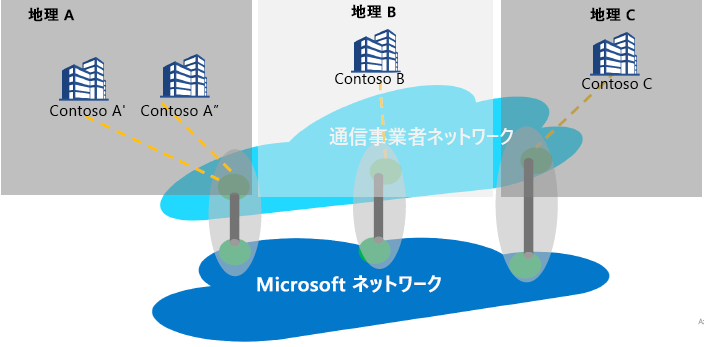

# インターネット ピアリングとPeering Service

インターネット ピアリングとは、Microsoft のグローバル ネットワーク (AS8075) と通信事業者 (またはサービス プロバイダー) のネットワークとの間の相互接続をいいます。 サービス プロバイダーは、以下に説明する Peering Service のパートナーシップ要件を満たして Peering Service パートナーになることで、カスタマーから Microsoft Network への最適なルーティングと、信頼性が高くパフォーマンスに優れたパブリック接続を提供することができます。

## Peering Service について
Peering Service は、クラス最高のパブリック インターネット接続をエンタープライズ ユーザーに提供する、主要なサービス プロバイダーとのパートナーシップ プログラムです。 プログラムに参加するパートナーは、高い可用性と geo 冗長性を備えた直接接続、そして最適化されたルーティングを Microsoft との間で利用することができます。 Peering Service は、次の Microsoft 接続ポートフォリオを補うサービスです。
*   IaaS または PaaS リソースへのプライベート接続用 ExpressRoute (プライベート IP 空間のサポート)
    *   パートナー ベースの接続
    *   Microsoft への Direct 100G 接続
*   クラウドへの VPN 接続を目的としたインターネット上の IPsec
*   Virtual WAN を介した Azure への SD-WAN 接続

Peering Service のターゲット セグメントは、SaaS 接続や、支社におけるインターネット ブレークアウトを希望する SD-WAN ユーザー、MPLS とエンタープライズ レベル インターネットの 2 方式を利用するユーザーです。

Microsoft Cloud に接続するときに最も大切なのは、ユーザー サイトから Microsoft Global Network へのラウンドトリップ時間 (RTT) を短縮して待ち時間を最小化することでしょう。Microsoft Global Network は、Microsoft のすべてのデータセンターとさまざまなクラウド アプリケーション エントリ ポイントを相互接続する Microsoft の公衆ネットワーク バックボーンです。 「[Office 365 で最適な接続性とパフォーマンスを確保する](https://techcommunity.microsoft.com/t5/Office-365-Blog/Getting-the-best-connectivity-and-performance-in-Office-365/ba-p/124694)」を参照してください。

> [!div class="mx-imgBorder"]
> 

上の図では、グローバル会社の各ブランチ オフィスが、パートナーのネットワークを介して、できる限り近い Microsoft エッジ拠点に接続しています。

**Peering Service を利用する利点:**
* Microsoft クラウド サービスへのインターネットを介した最善のパブリック ルーティングによるパフォーマンスと信頼性の最適化。
* 優先 SP を選択して Microsoft Cloud に接続する機能。
* トラフィックの分析情報 (待ち時間レポート、プレフィックス監視など)。
* Microsoft Cloud からの最適なネットワーク ホップ (AS ホップ)。
* ルートの分析と統計。Border Gateway Protocol ([BGP](https://en.wikipedia.org/wiki/Border_Gateway_Protocol)) ルーティングの異常 (漏えい、ハイジャックの検出) やルーティング不全に関するイベントを取得できます。

## Peering Service パートナーシップの要件
* 最寄りの拠点で Microsoft Cloud に接続できること。 ユーザー トラフィックは、パートナー サービス プロバイダーによって、ユーザーに最も近い Microsoft エッジにルーティングされます。 同様に、ユーザーに向かうトラフィックについても、Microsoft が (BGP タグを使用して) ユーザーに最も近いエッジ拠点にトラフィックをルーティングし、SP がそのトラフィックをユーザーに配信することになります。
* パートナーは、Microsoft Global Network との間で高可用性、高スループット、geo 冗長の接続を確保できます。
* パートナーは、要件を満たしていれば、その既存のピアリングを利用して Peering Service をサポートできます。

## よく寄せられる質問
よく寄せられる質問については、「[Peering Service に関する FAQ](service-faqs.md)」を参照してください。

## 次のステップ

* ユーザーが [Peering Service](https://docs.microsoft.com/azure/peering-service/) を使用する利点について理解を深めます。
* 「[Peering Service パートナーのチュートリアル](walkthrough-peering-service-all.md)」で、Peering Service の Direct ピアリングを有効にする手順を学習します。
