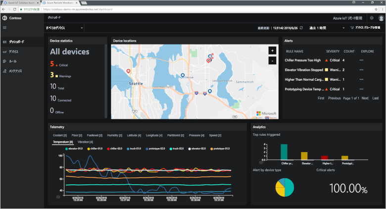
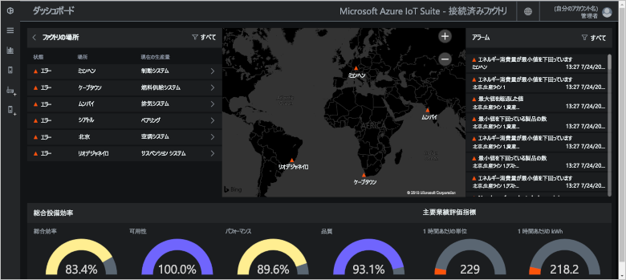
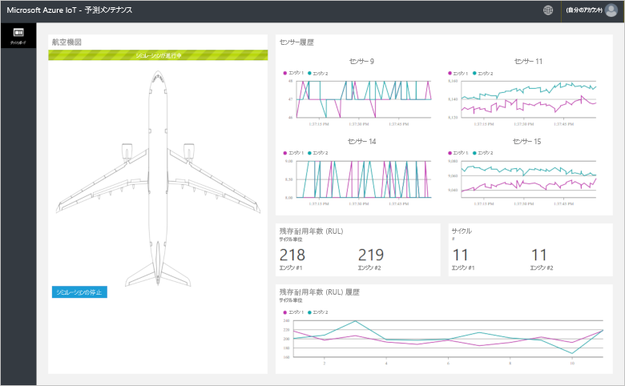
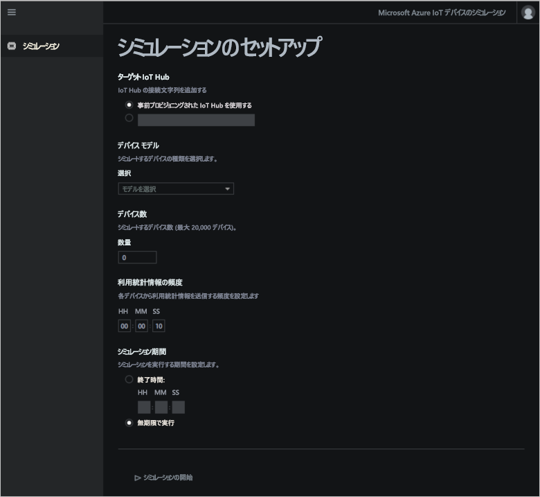

# Azure IoT ソリューション アクセラレータとは

クラウドベースの IoT ソリューションは通常、カスタム コードとクラウド サービスを使用してデバイスの接続性、データ処理と分析、プレゼンテーションを管理します。

IoT ソリューション アクセラレータは、一般的な IoT シナリオが実装され、必要な要素がすべて揃った、すぐにデプロイできる IoT ソリューションです。 これらのシナリオは、リモート監視、接続済みファクトリ、予測メンテナンス、デバイス シミュレーションをカバーしています。 ソリューション アクセラレータをデプロイすると、そのデプロイには、必要なクラウド ベースのサービスと、必要なアプリケーション コードがすべて含まれています。

ソリューション アクセラレータは、IoT ソリューションの出発点です。 すべてのソリューション アクセラレータのソース コードはオープン ソースで、GitHub で入手できます。 ソリューション アクセラレータをダウンロードし、要件に合わせてカスタマイズすることをお勧めします。

カスタムの IoT ソリューションをゼロからビルドする前の学習ツールとして、ソリューション アクセラレータを使用することもできます。 ソリューション アクセラレータには、クラウド ベースの IoT ソリューションの実証済みプラクティスが実装されており、それに従って実行できます。

各ソリューション アクセラレータのアプリケーション コードには、ソリューション アクセラレータを管理するための Web アプリが含まれています。

## サポートされる IoT のシナリオ

現時点では、次の 4 つのソリューション アクセラレータをデプロイできます。

### リモート監視

[リモート監視ソリューション アクセラレータ](iot-accelerators-remote-monitoring-sample-walkthrough.md)は、リモート デバイスからテレメトリを収集し、それらを制御するために使用します。 デバイスの例としては、オンプレミスに設置されている冷却装置や、リモートのポンプ設備に設置されているバルブなどが挙げられます。

リモート監視ダッシュボードを使用して、接続されたデバイスからのテレメトリの表示、新しいデバイスのプロビジョニング、接続されたデバイスのファームウェアのアップグレードなどを行うことができます。

### 接続済みファクトリ

[接続済みファクトリ ソリューション アクセラレータ](iot-accelerators-connected-factory-sample-walkthrough.md)は、[OPC Unified Architecture](https://opcfoundation.org/about/opc-technologies/opc-ua/) インターフェイスを使用して工業資産からテレメトリを収集し、それらを制御するために使用します。 工業資産には、工場の生産ラインで組み立てやテストを行う作業場が含まれる場合があります。

接続済みファクトリのダッシュボードを使用して、産業用デバイスを監視および管理することができます。

### 予測メンテナンス

[予測メンテナンス ソリューション アクセラレータ](iot-accelerators-predictive-walkthrough.md)は、リモート デバイスが故障する前にメンテナンスを行えるよう、その故障時期を予測するために使用します。 このソリューション アクセラレータは機械学習アルゴリズムを使用して、デバイスのテレメトリからエラーを予測します。 デバイスの例として、航空機のエンジンやエレベーターが挙げられる場合があります。

予測メンテナンス ダッシュボードを使用して、予測メンテナンス分析を表示できます。

### デバイスのシミュレーション

[デバイスのシミュレーション ソリューション アクセラレータ](iot-accelerators-device-simulation-overview.md)は、現実のテレメトリを生成する、シミュレートされたデバイスを実行するために使用します。 このソリューション アクセラレータを使用して、他のソリューション アクセラレータの動作をテストしたり、独自のカスタム IoT ソリューションをテストしたりできます。

デバイス シミュレーション Web アプリを使用して、シミュレーションを構成および実行できます。

## 設計原則

すべてのソリューション アクセラレータは同じ設計原則とゴールに従います。 次を満たすように設計されています。

* **スケーラブル**。何百万ものデバイスを接続して管理できます。
* **拡張可能**。要件に合わせてカスタマイズできるようにします。
* **わかりやすい**。そのしくみや実装方法が理解しやすくなっています。
* **モジュール式**。代替のサービスにスワップアウトできます。
* **セキュリティで保護されている**。組み込みの接続性とデバイスのセキュリティ機能を Azure のセキュリティと組み合わせています。

## アーキテクチャと言語

元のソリューション アクセラレータは、モデル ビュー コントローラー (MVC) アーキテクチャを使用して .NET で作成されています。 マイクロソフトでは、ソリューション アクセラレータを、新しいマイクロサービス アーキテクチャに更新しています。 次の表に、ソリューション アクセラレータの現在の状態と、GitHub リポジトリへのリンクを示します。

| ソリューション アクセラレータ   | アーキテクチャ  | Languages     |
| ---------------------- | ------------- | ------------- |
| リモート監視      | マイクロサービス | [Java](https://github.com/Azure/azure-iot-pcs-remote-monitoring-java) と [.NET](https://github.com/Azure/azure-iot-pcs-remote-monitoring-dotnet) |
| 予測メンテナンス | MVC           | [.NET](https://github.com/Azure/azure-iot-predictive-maintenance)          |
| 接続済みファクトリ      | MVC           | [.NET](https://github.com/Azure/azure-iot-connected-factory)          |
| デバイスのシミュレーション      | マイクロサービス | [.NET](https://github.com/Azure/device-simulation-dotnet)          |

マイクロサービス アーキテクチャの詳細については、「[Introduction to the Azure IoT reference architecture (Azure IoT リファレンス アーキテクチャの概要)](iot-accelerators-architecture-overview.md)」を参照してください。

## デプロイ オプション

ソリューション アクセラレータは、[Microsoft Azure IoT ソリューション アクセラレータ](https://www.azureiotsolutions.com/Accelerators#)のサイトからデプロイすることも、コマンド ラインを使用してデプロイすることもできます。

リモート監視ソリューション アクセラレータは、次の構成でデプロイできます。

* **Standard:** 運用環境のデプロイを開発するための拡張インフラストラクチャ デプロイ。 Azure Container Service により、マイクロサービスが複数の Azure 仮想マシンにデプロイされます。 個々のマイクロサービスをホストする Docker コンテナーは、Kubernetes によって調整されます。
* **Basic:** デモまたはデプロイ テストのための低コスト バージョン。 すべてのマイクロサービスが 1 つの Azure 仮想マシンにデプロイされます。
* **ローカル:** テストおよび開発用のローカル コンピューターのデプロイ。 このアプローチでは、マイクロサービスをローカル Docker コンテナーにデプロイし、クラウド内で IoT Hub、Azure Cosmos DB、および Azure Storage サービスに接続します。

ソリューション アクセラレータを実行するコストは、[基礎となる Azure サービスの実行コスト](https://azure.microsoft.com/pricing)の総計です。 デプロイのオプションを選択するときに、使用する Azure サービスの詳細が表示されます。

## 次の手順

IoT ソリューション アクセラレータの 1 つを試してみるには、クイック スタートを参照してください。

* [リモート監視ソリューションを試す](quickstart-remote-monitoring-deploy.md)
* [接続済みファクトリ ソリューションを試す](quickstart-connected-factory-deploy.md)
* [予測メンテナンス ソリューションを試す](quickstart-predictive-maintenance-deploy.md)
* [デバイス シミュレーション ソリューションを試す](quickstart-device-simulation-deploy.md)
