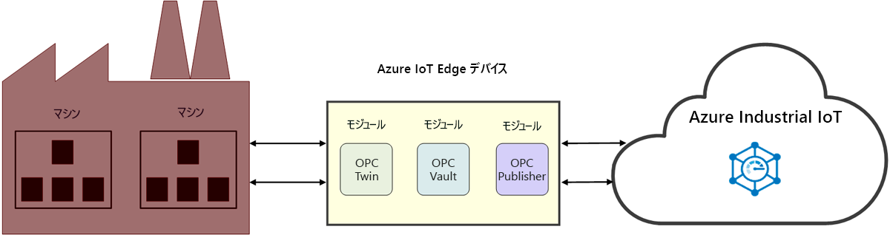

# Industrial IoT (IIoT) とは

IIoT は、Industrial Internet of Things の略です。 IIoT では、製造業に IoT を応用することで産業効率を高めます。 

## 産業効率の向上

コネクテッド ファクトリ ソリューション アクセラレータを使用して、業務の生産性や収益性を高めることができます。 既に工場現場で稼働している機械を含め、産業機器やデバイスをクラウドに接続して監視します。 IoT データを分析することで、工場現場全体の業績向上に役立つ分析情報を入手できます。

工場現場の機械にアクセスするという時間のかかるプロセスを OPC Twin で削減すれば、IIoT ソリューションの構築に時間を費やすことができます。 OPC Vault で証明書の管理および産業用資産の統合を効率化することで、資産の接続性が保護されているという確信が得られます。 これらのマイクロサービスには、[Azure Industrial IoT のコンポーネント](https://github.com/Azure/Industrial-IoT)を基盤とする、REST に似た API が用意されています。 このサービス API を通じて、エッジ モジュールの機能を制御することができます。 

> [!NOTE]
> Azure Industrial IoT サービスの詳細については、GitHub の[リポジトリ](https://github.com/Azure/Industrial-IoT)と[ドキュメント](https://azure.github.io/Industrial-IoT/)を参照してください。
Azure IoT Edge モジュールの動作に詳しくない場合は、最初に次の記事をお読みください。
- [Azure IoT Edge について](../iot-edge/about-iot-edge.md)
- [Azure IoT Edge のモジュール](../iot-edge/iot-edge-modules.md)

## コネクテッド ファクトリ

[コネクテッド ファクトリ](../iot-accelerators/iot-accelerators-connected-factory-features.md)は、Microsoft の Azure Industrial IoT のリファレンス アーキテクチャの実装であり、特定のビジネス要件を満たすようにカスタマイズできます。 完全なソリューション コードはオープンソースであり、コネクテッド ファクトリ ソリューション アクセラレータ GitHub リポジトリで入手できます。 これを商用製品の出発点として使用すれば、構築済みのソリューションをお使いの Azure サブスクリプションに数分でデプロイすることができます。 

## 工場現場の接続性

OPC Twin は IIoT コンポーネントの 1 つで、デバイスの検出と登録を自動化すると共に、REST API による産業用デバイスのリモート制御を実現します。 OPC Twin では、Azure IoT Edge と IoT Hub を使用して、クラウドと工場のネットワークとを接続します。 OPC Twin を使用すると、IIoT の開発者はオンプレミスのマシンに安全にアクセスする方法について頭を悩ませることなく、IIoT アプリケーションの構築に専念できます。

## Security

OPC Vault は、OPC UA サーバーとクライアント アプリケーションの証明書ライフサイクルの構成、登録、管理をクラウドで行える OPC UA Global Discovery Server (GDS) の実装です。 産業空間における資産の安全な接続の実装と維持が OPC Vault によって簡素化されます。 証明書の管理が OPC Vault によって自動化されることで、工場のオペレーターは、接続性と証明書の管理に伴う手動による複雑なプロセスから解放されます。

## 次のステップ

ここでは、Industrial IoT とそのコンポーネントについて説明しました。次に以下の記事を読むことをお勧めします。

> [!div class="nextstepaction"]
> [OPC Twin とは](overview-opc-twin.md)
