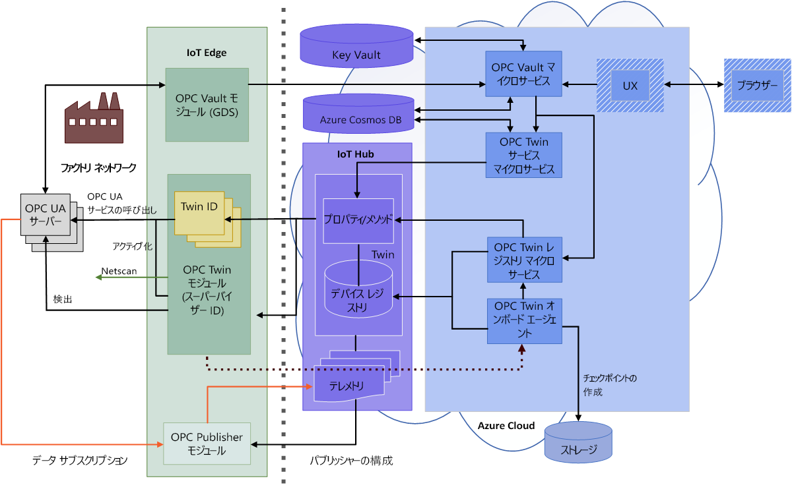

# OPC Vault のアーキテクチャ

この記事では、OPC Vault マイクロサービスおよび OPC Vault IoT Edge モジュールの概要を示します。

OPC UA アプリケーションでは、アプリケーション インスタンス証明書を使用して、アプリケーション レベルのセキュリティを提供します。 アプリケーション証明書によって公開キーと秘密キーの組が提供される非対称暗号化を使用して、セキュアな接続が確立されます。 証明書は、自己署名されてたものでも、証明機関 (CA) によって署名されたものでもかまいません。

OPC UA アプリケーションには、信頼しているアプリケーションを表す信頼済み証明書のリストがあります。 これらの証明書は、自己署名されたものでも、CA によって署名されたものでもかまいません。また、ルート CA またはサブ CA そのものでもかまいません。 信頼済みの証明書がより大規模な証明書チェーンの一部である場合、アプリケーションは、信頼リスト内のその証明書までチェーンされているすべての証明書を信頼します。 これは、証明書チェーン全体を検証できる限り、該当します。

自己署名証明書を信頼する場合と CA 証明書を信頼する場合の大きな違いは、信頼のデプロイと維持に必要なインストール作業です。 また、会社固有の CA をホストするための追加作業もあります。 

単一のクライアント アプリケーションを使用する複数のサーバーに対して自己署名証明書での信頼を配布するには、すべてのサーバー アプリケーション証明書をクライアント アプリケーションの信頼リストにインストールする必要があります。 また、クライアント アプリケーション証明書をすべてのサーバー アプリケーションの信頼リストにインストールする必要があります。 この管理作業は非常に負担であり、証明書の有効期間を考慮して証明書を更新する必要がある場合は、さらに負担が増します。

会社固有の CA を使用すると、複数のサーバーおよびクライアントでの信頼の管理を大幅に簡素化できます。 この場合、管理者は、CA 署名済みのアプリケーション インスタンス証明書を、使用されるクライアントやサーバーごとに 1 回生成します。 さらに、CA 証明書が、すべてのサーバーとクライアント上の各アプリケーション信頼リストにインストールされます。 このアプローチでは、有効期限が切れた証明書のみを更新して、影響を受けるアプリケーション用に置き換える必要があります。

Azure Industrial IoT の OPC UA 証明書管理サービスを利用すると、OPC UA アプリケーションに対する会社固有の CA を管理できます。 このサービスは、OPC Vault マイクロサービスに基づいています。 OPC Vault では、セキュアなクラウド内で会社固有の CA をホストするためのマイクロサービスが提供されています。 このソリューションは、Azure Active Directory (Azure AD)、ハードウェア セキュリティ モジュール (HSM) を利用した Azure Key Vault、Azure Cosmos DB、IoT Hub (オプション) によってセキュリティ保護されたサービスによって、アプリケーション ストアとしてサポートされています。

OPC Vault マイクロサービスは、Azure Key Vault の署名権限を持つセキュリティ管理者や承認者が要求を承認または拒否する、ロールベースのワークフローをサポートするように設計されています。

既存の OPC UA ソリューションとの互換性のために、サービスには OPC Vault マイクロサービスによって支援されるエッジ モジュールのサポートが含まれています。 これには、仕様のパート 12 に従って証明書と信頼リストを配布するために、**OPC UA Global Discovery Server および Certificate Management**  インターフェイスが実装されています。 

## Architecture

アーキテクチャは OPC Vault マイクロサービスをベースとしており、ファクトリ ネットワーク用に OPC Vault IoT Edge モジュール、ワークフローを制御するための Web サンプル UX が付属しています。

## OPC Vault マイクロサービス

OPC Vault マイクロサービスは、OPC UA アプリケーション用の会社固有の CA を分散および管理するためのワークフローを実装する、次のインターフェイスで構成されています。

### Application 
- OPC UA アプリケーションは、サーバー、クライアント、またはその両方にすることができます。 この場合、OPC Vault はアプリケーション登録機関として機能します。 
- アプリケーションの登録、更新、登録解除の基本的な操作のほかに、検索式を使用してアプリケーションを検索および照会するためのインターフェイスもあります。 
- 証明書の要求では、要求を処理し、OPC UA 固有のすべての拡張機能を備える署名済み証明書を発行するために、有効なアプリケーションを参照する必要があります。 
- アプリケーション サービスは Azure Cosmos DB にあるデータベースによって支えられています。

### 証明書グループ
- 証明書グループは、証明書に署名するための秘密キーを含む、ルート CA またはサブ CA 証明書を格納するエンティティです。 
- RSA キーの長さ、SHA-2 ハッシュの長さ、有効期間は、発行元 CA と署名済みアプリケーション証明書のどちらでも構成できます。 
- FIPS 140-2 レベル 2 の HSM によって支援されている CA 証明書を Azure Key Vault 内に格納します。 Azure AD によって保護された Key Vault の操作によって署名が行われるため、秘密キーがセキュアなストレージの外部に移動されることはありません。 
- CA 証明書は時間の経過に沿って更新でき、Key Vault 履歴によって安全なストレージ内に保持されます。 
- 各 CA 証明書の失効リストも Key Vault にシークレットとして格納されます。 アプリケーションの登録が解除されると、管理者によって証明書失効リスト (CRL) にあるアプリケーション証明書も失効されます。
- 1 つの証明書だけでなく、証明書をまとめて失効させることができます。

### 証明書の要求
証明書の要求では、OPC UA アプリケーションに対して証明書署名要求 (CSR) を使用して、新しいキーの組または署名済み証明書を生成するワークフローを実装します。 
- 要求は、サブジェクトや CSR などの付随情報と OPC UA アプリケーションへの参照と共に、データベースに格納されます。 
- サービスのビジネス ロジックによって、アプリケーション データベースに格納されている情報に対して要求が検証されます。 たとえば、データベース内のアプリケーション URI は CSR 内のアプリケーション URI と一致する必要があります。
- 署名権限 (つまり、承認者ロール) を備えるセキュリティ管理者が、要求を承認または拒否します。 要求が承認されると、新しいキーの組または署名済み証明書 (あるいは両方) が生成されます。 新しい秘密キーは KeyVault 内に安全に保存されるのに対し、新しい署名済み公開証明書は証明書要求データベースに格納されます。
- 要求者は、要求が承認または取り消されるまで要求状態をポーリングできます。 要求が承認された場合は、秘密キーと証明書をダウンロードして、OPC UA アプリケーションの証明書ストアにインストールできます。
- これで、要求者は要求を受理して、要求データベースから不要な情報を削除できるようになります。 

署名済み証明書の有効期間を通じて、アプリケーションが削除されたり、キーが侵害されたりする可能性があります。 そのような場合、CA マネージャーは次のことが可能です。
- アプリケーションを削除します。これにより、アプリの保留中および承認済みの証明書の要求もすべて削除されます。 
- 1 つのキーのみが更新または侵害された場合、1 つの証明書の要求のみを削除します。

侵害された承認済みおよび受理済みの証明書の要求が、削除済みとしてマークされます。

管理者は、発行者 CA の CRL を定期的に更新できます。 更新時には、削除された証明書の要求すべてが取り消され、証明書のシリアル番号が CRL 失効リストに追加されます。 取り消された証明書の要求は取り消し済みとしてマークされます。 緊急時には、1 つの証明書の要求を取り消すこともできます。

最後に、更新された CRL は、参加している OPC UA クライアントおよびサーバーへ分散することができます。

## OPC Vault IoT Edge モジュール
ファクトリ ネットワークの Global Discovery Server をサポートするために、エッジに OPC Vault モジュールをデプロイできます。 それをローカルの .NET Core アプリケーションとして実行するか、または、Docker コンテナー内で開始します。 現在の OPC UA .NET Standard スタックでは、Auth2 認証がサポートされていないため、OPC Vault エッジ モジュールの機能は閲覧者ロールに制限されていることに注意してください。 OPC UA GDS の標準インターフェイスを使用して、ユーザーをエッジ モジュールからマイクロサービスに借用することはできません。

## 次のステップ

ここでは、OPC Vault アーキテクチャについて学習しました。以下に進むことができます。

> [!div class="nextstepaction"]
> [OPC Vault を構築してデプロイする](howto-opc-vault-deploy.md)
