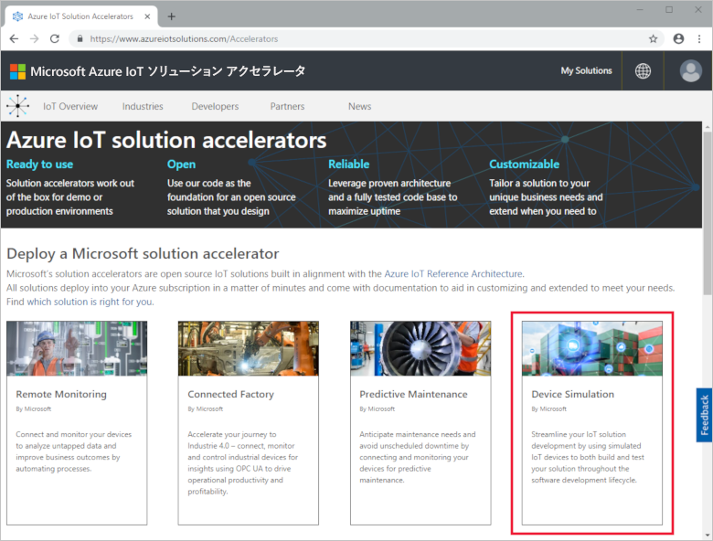
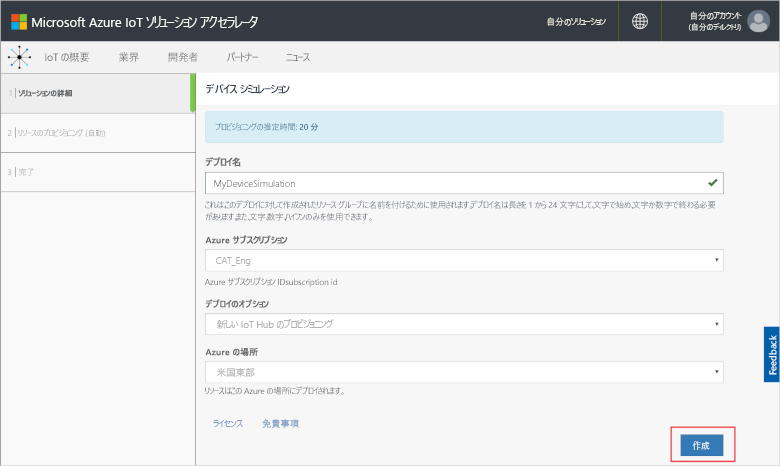
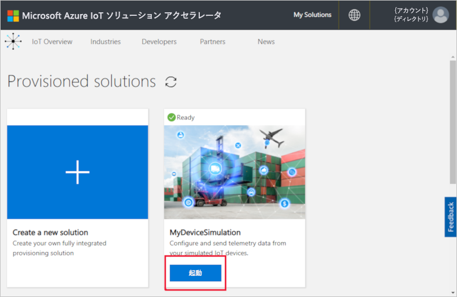
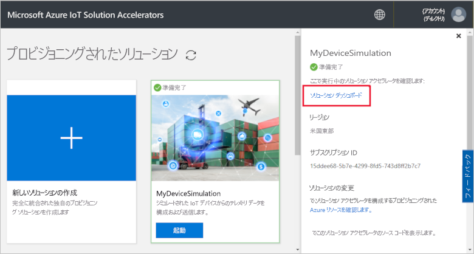
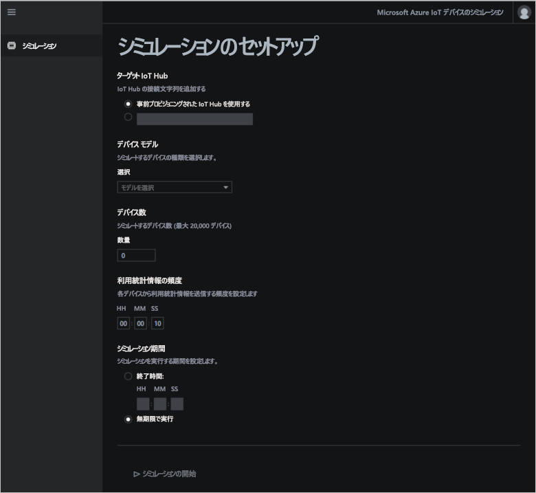
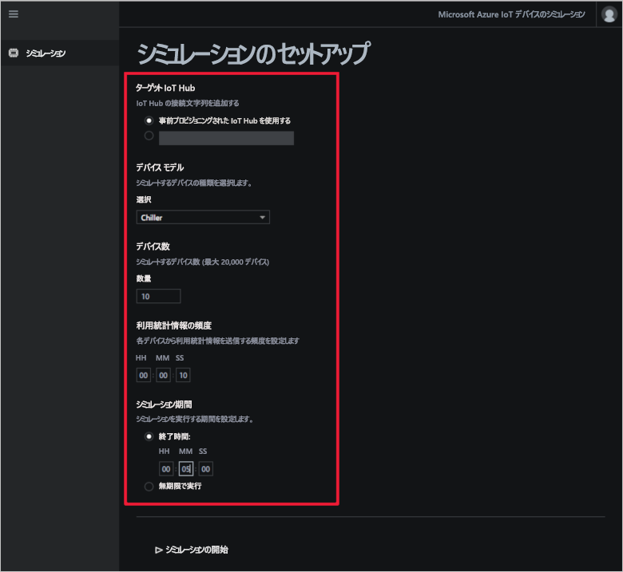
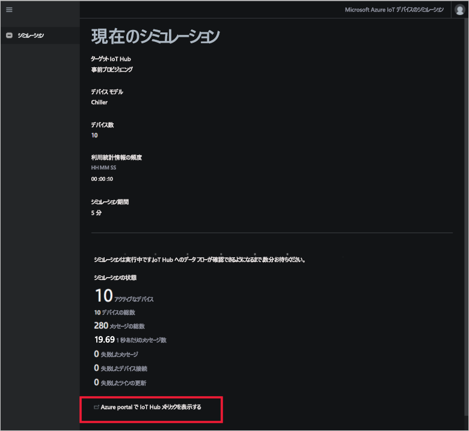
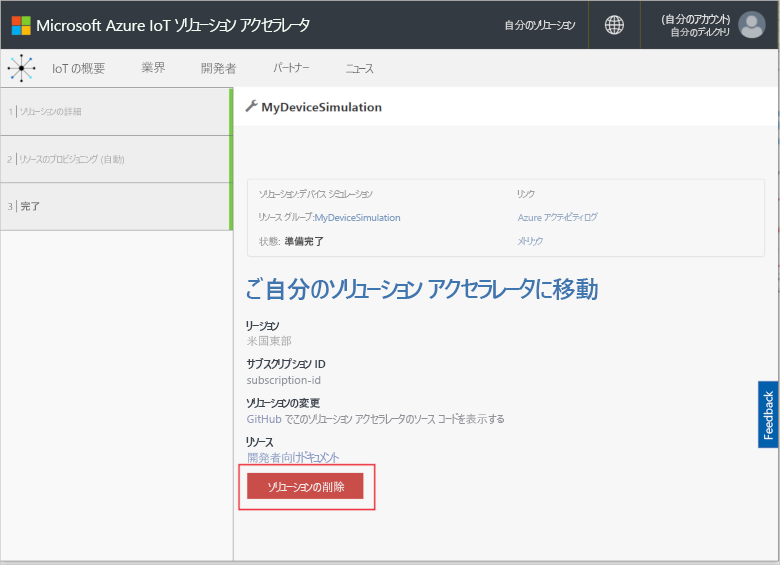

# クイック スタート: クラウドベースのデバイス シミュレーション ソリューションをデプロイして実行する

このクイック スタートでは、IoT ソリューションのテストに使用する Azure IoT デバイス シミュレーション ソリューション アクセラレータをデプロイする方法を示します。 ソリューション アクセラレータをデプロイした後、**[シミュレーション]** ページを使用し、シミュレーションを作成して実行します。

このクイック スタートを完了するには、アクティブな Azure サブスクリプションが必要です。

Azure サブスクリプションをお持ちでない場合は、開始する前に [無料アカウント](https://azure.microsoft.com/free/?WT.mc_id=A261C142F) を作成してください。

## ソリューションのデプロイ方法

ソリューション アクセラレータを Azure サブスクリプションにデプロイするときは、いくつかの構成オプションを設定する必要があります。

Azure アカウントの資格情報を使用して、[azureiotsolutions.com](https://www.azureiotsolutions.com/Accelerators) にサインインします。

**[デバイス シミュレーション]** タイルで **[今すぐ試す]** をクリックします。

**[Create Device Simulation solution]\(デバイス シミュレーション ソリューションの作成\)** ページで、一意の **[Solution name]\(ソリューション名\)** を入力します。 ソリューション名を書き留めておきます。この名前は、すべてのソリューションのリソースを含む Azure リソース グループの名前です。

ソリューション アクセラレータのデプロイに使用する**サブスクリプション**と**リージョン**を選択します。 通常は、最も近いリージョンを選択します。 サブスクリプションの[グローバル管理者またはユーザー](iot-accelerators-permissions.md)である必要があります。

ボックスをオンにして、デバイス シミュレーション ソリューションで使用する IoT ハブをデプロイします。 シミュレーションが使用する IoT ハブは、後でいつでも変更できます。

**[ソリューションの作成]** をクリックして、ソリューションのプロビジョニングを始めます。 このプロセスを実行するには、少なくとも 5 分かかります。

## ソリューションにサインインします。

プロビジョニング プロセスが完了すると、デバイス シミュレーション ソリューション アクセラレータ ダッシュボードにサインインできます。

**[プロビジョニングされたソリューション]** ページで、新しいデバイス シミュレーション ソリューション アクセラレータをクリックします。

表示されるパネルで、デバイス シミュレーション ソリューション アクセラレータに関する情報を確認できます。 **[ソリューション ダッシュボード]** を選択して、デバイス シミュレーション ソリューション アクセラレータを表示します。

**[同意]** をクリックしてアクセス許可の要求を受け入れると、ブラウザーにデバイス シミュレーション ソリューション ダッシュボードが表示されます。

## シミュレーションを構成する

ダッシュボードからシミュレーションを構成して実行します。 次の表の値を使用して、シミュレーションを構成します。

| Setting             | 値                       |
| ------------------- | --------------------------- |
| IoT Hub を対象にする      | Use pre-provisioned IoT Hub (事前プロビジョニングされた IoT Hub を使用する) |
| デバイスのモデル        | 冷却装置                     |
| Number of devices (デバイス数)   | 10                          |
| Telemetry frequency (テレメトリ頻度) | 10 秒                  |
| シミュレーション期間 | 5 分                   |

[シミュレーションの構成](./media/quickstart-device-simulation-deploy/simulationconfig-expanded.png#lightbox)

## シミュレーションを実行する

**[シミュレーションの開始]** をクリックします。 選択した時間だけシミュレーションが実行します。 いつでも、**[シミュレーションの停止]** をクリックしてシミュレーションを停止できます。 シミュレーションで、現在の実行の統計情報が表示されます。 IoT ハブによって報告されたメトリックを表示するには、**[View IoT Hub metrics in the Azure portal]\(Azure portal で IoT Hub メトリックを表示する\)** をクリックします。

[シミュレーションの実行](./media/quickstart-device-simulation-deploy/simulationrun-expanded.png#lightbox)

ソリューション アクセラレータのプロビジョニング済みインスタンスから実行できるシミュレーションは、一度に 1 つだけです。

## リソースのクリーンアップ

さらに調べる場合は、デバイス シミュレーション ソリューション アクセラレータをデプロイしたままにします。

ソリューション アクセラレータが不要になった場合は、[[プロビジョニングされたソリューション]](https://www.azureiotsolutions.com/Accelerators#dashboard) ページでそれを選択し、**[ソリューションの削除]** をクリックして削除してください。

## 次の手順

このクイック スタートでは、デバイス シミュレーション ソリューション アクセラレータをデプロイし、IoT デバイスのシミュレーションを実行しました。

シミュレーションで既存の IoT Hub を使用する方法については、次のハウツー ガイドを参照してください。

> [!div class="nextstepaction"]
> [デバイス シミュレーション ソリューション アクセラレータで既存の IoT ハブを使用する](iot-accelerators-device-simulation-choose-hub.md)
