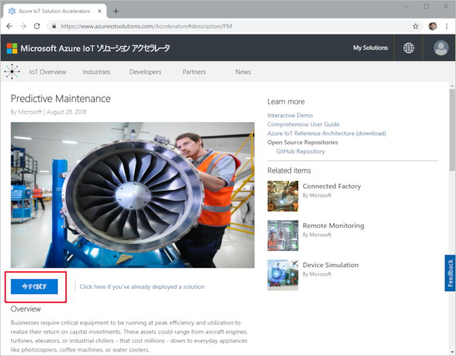
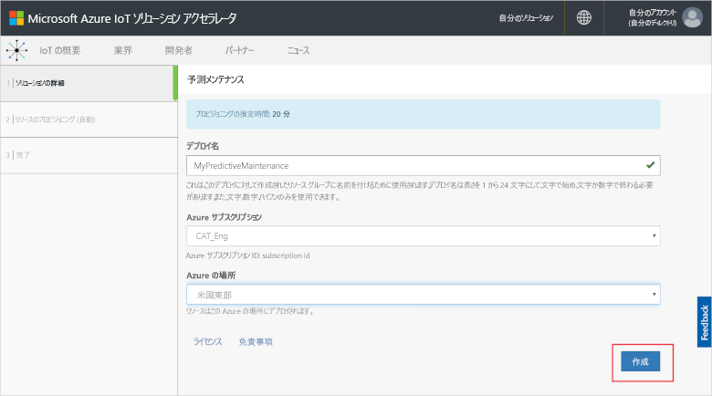
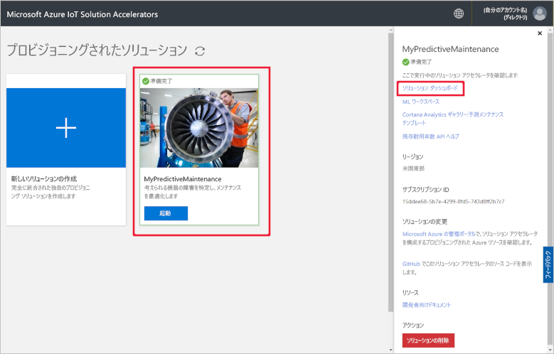
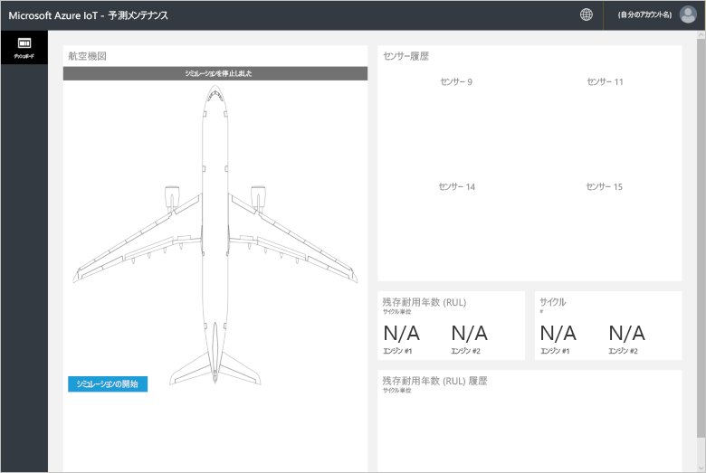
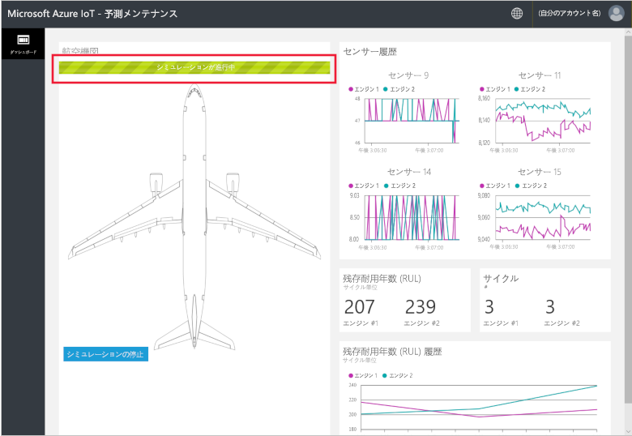
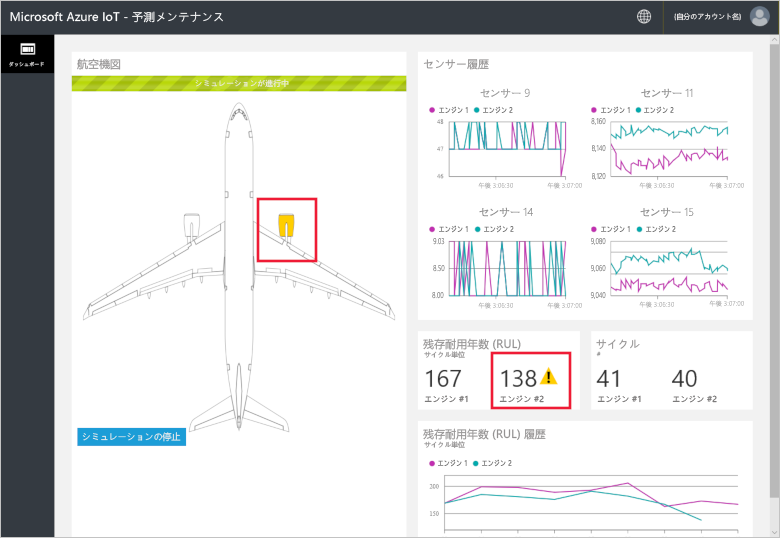
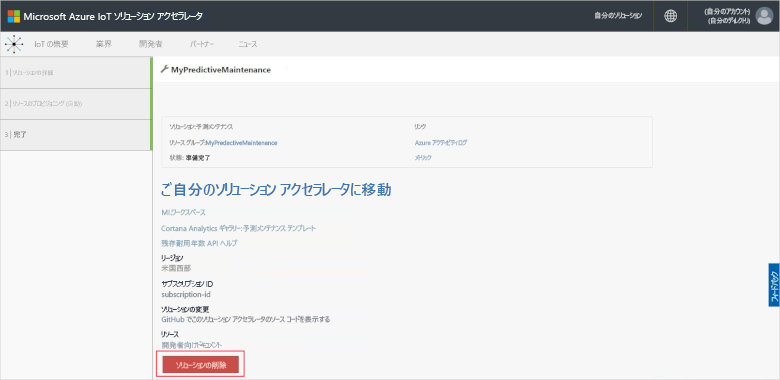

# クイック スタート: コネクテッド デバイスの予測メンテナンス分析を実行するクラウドベースのソリューションを試す

このクイック スタートでは、Azure IoT 予測メンテナンス ソリューション アクセラレータをデプロイして、予測メンテナンスをクラウドベースで行うシミュレーションの実行方法を紹介しています。 ソリューション アクセラレータのデプロイ後、シミュレートされた航空機エンジンのデータに対して、ソリューションの **[ダッシュボード]** ページを使って予測メンテナンス分析を実行します。 このソリューション アクセラレータは、独自に実装を行う際の出発点として、または学習用ツールとしてご利用ください。

このシミュレーションに登場する Fabrikam は、競争力のある価格での優れたカスタマー エクスペリエンスの提供に取り組んでいる地域航空会社です。 フライトの遅延の原因の 1 つは、メンテナンスです。また、航空機のエンジンのメンテナンスは特に困難です。 Fabrikam では、飛行中のエンジンの故障は、いかなる代価を払っても避ける必要があります。そのため、定期的にエンジンを検査し、計画に従ってメンテナンスのスケジュールを設定しています。 ただし、航空機のエンジンがすべて同じように損耗するわけではありません。 エンジンに対して、必要のないメンテナンスが実行される場合もあります。 さらに重要なことは、問題が発生すると、メンテナンスが実行されるまでは、航空機は飛行禁止になるということです。 適切な技術者がいなかったり予備の部品がなかったりする場所に航空機がある場合、このような問題では特に費用がかかることがあります。

Fabrikam の航空機のエンジンは、飛行中のエンジンの状態を監視するセンサーを搭載しています。 長年にわたり、エンジンの運用データと障害データを蓄積した後、Fabrikam のデータ サイエンティストは、航空機エンジンの残存耐用年数 (RUL) を予測する方法をモデル化しました。 このモデルでは、4 つのエンジン センサーからのデータと最終的な障害につながるエンジンの損耗との相関関係を使用しています。 Fabrikam は、安全性を確保するための通常の検査を継続しつつ、このモデルにより、毎回の飛行後にそれぞれのエンジンの RUL を計算できるようになりました。 Fabrikam は将来の故障個所を予測し、メンテナンスを計画することで、乗客と乗組員の安全を確保しながら、航空機の飛行禁止時間を最小限に抑え、運用コストを削減することができるようになりました。

このクイック スタートを完了するには、アクティブな Azure サブスクリプションが必要です。

Azure サブスクリプションをお持ちでない場合は、開始する前に [無料アカウント](https://azure.microsoft.com/free/?WT.mc_id=A261C142F) を作成してください。

## ソリューションのデプロイ方法

ソリューション アクセラレータを Azure サブスクリプションにデプロイするときは、いくつかの構成オプションを設定する必要があります。

Azure アカウントの資格情報を使用して、[azureiotsolutions.com](https://www.azureiotsolutions.com/Accelerators) にサインインします。

**[予測メンテナンス]** タイルで **[今すぐ試す]** をクリックします。

**[Create Predictive Maintenance solution]\(予測メンテナンス ソリューションの作成\)** ページで予測メンテナンス ソリューション アクセラレータの一意の**ソリューション名**を入力します。 このクイック スタートでは、**MyPredictiveMaintenance** を使用します。

ソリューション アクセラレータのデプロイに使用する**サブスクリプション**と**リージョン**を選択します。 通常は、最も近いリージョンを選択します。 このクイック スタートでは、**[Visual Studio Enterprise]** と **[米国東部]** を使用します。 サブスクリプションの[グローバル管理者またはユーザー](iot-accelerators-permissions.md)である必要があります。

**[ソリューションの作成]** をクリックして、デプロイを開始します。 このプロセスを実行するには、少なくとも 5 分かかります。

## ソリューションにサインインします。

Azure サブスクリプションへのデプロイが完了すると、ソリューション タイルに緑色のチェックマークと "**準備完了**" のメッセージが表示されます。 これで、予測メンテナンス ソリューション アクセラレータ ダッシュボードにサインインすることができます。

**[プロビジョニングされたソリューション]** ページで、新しい予測メンテナンス ソリューション アクセラレータをクリックします。 表示されるパネルで、ソリューション アクセラレータに関する情報を確認できます。 **[ソリューション ダッシュボード]** を選択して、予測メンテナンス ソリューション アクセラレータを表示します。

**[同意]** をクリックしてアクセス許可の要求を受け入れると、お使いのブラウザーに予測メンテナンス ソリューションのダッシュボードが表示されます。

**[シミュレーションの開始]** をクリックすると、シミュレーションが開始されます。 センサー履歴、RUL、サイクル数、および RUL 履歴がダッシュボードに入力されます。

RUL が (デモンストレーション用に選択した任意のしきい値である) 160 未満の場合、ソリューション ポータルには RUL の表示の横に警告記号が示されます。 ソリューション ポータルには、航空機エンジンも黄色で強調表示されます。 RUL 値は、全体的には一般的な下降傾向を示していますが、上下する傾向があることがわかります。 この動きはさまざまな長さのサイクルとモデル精度が含まれていることの結果です。

148 サイクルの完全なシミュレーションの完了には約 35 分かかります。 160 の RUL のしきい値には約 5 分で最初に達し、両エンジンがしきい値に達するのは、約 8 分後です。

148 サイクルの完全なデータセットのシミュレーションが実行され、最終的な RUL とサイクル数が出されます。

シミュレーションは任意のポイントで停止できますが、**[Start Simulation (シミュレーションの開始)]** をクリックすると、データセットの先頭からシミュレーションが再実行されます。

## リソースのクリーンアップ

さらに調べる場合は、予測メンテナンス ソリューション アクセラレータをデプロイしたままにします。

ソリューション アクセラレータが不要になった場合は、[[プロビジョニングされたソリューション]](https://www.azureiotsolutions.com/Accelerators#dashboard) ページでそれを選択し、**[ソリューションの削除]** をクリックして削除してください。

## 次の手順

このクイック スタートでは、予測メンテナンス ソリューション アクセラレータをデプロイし、シミュレーションを実行しました。

ソリューション アクセラレータとシミュレートされた航空機エンジンについて詳しくは、次の記事を参照してください。

> [!div class="nextstepaction"]
> [予測メンテナンスのソリューション アクセラレータの概要](iot-accelerators-predictive-walkthrough.md)
