# クイック スタート: クラウドベースのリモート監視ソリューションを試す

このクイック スタートでは、Azure IoT リモート監視ソリューション アクセラレータをデプロイして、リモート監視をクラウドベースで行うシミュレーションの実行方法を紹介しています。 ソリューション アクセラレータをデプロイしたら、ソリューションの **[ダッシュボード]** ページを使用して、シミュレートされたデバイスをマップ上に視覚化します。また、**[メンテナンス]** ページを使用して、シミュレートされた冷却装置デバイスからの圧力アラートに応答します。 このソリューション アクセラレータは、独自に実装を行う際の出発点として、または学習用ツールとしてご利用ください。

初期デプロイでは、Contoso という名前の会社のリモート監視ソリューション アクセラレータが構成されます。 Contoso では、異なる物理環境にデプロイされた冷却装置など、さまざまな種類のデバイスを管理しています。 冷却装置デバイスは、温度、湿度、および圧力テレメトリをリモート監視ソリューション アクセラレータに送信します。

このクイック スタートを完了するには、アクティブな Azure サブスクリプションが必要です。

Azure サブスクリプションをお持ちでない場合は、開始する前に [無料アカウント](https://azure.microsoft.com/free/?WT.mc_id=A261C142F) を作成してください。

## ソリューションのデプロイ方法

ソリューション アクセラレータを Azure サブスクリプションにデプロイするときは、いくつかの構成オプションを設定する必要があります。

Azure アカウントの資格情報を使用して、[azureiotsolutions.com](https://www.azureiotsolutions.com/Accelerators) にサインインします。

**[リモート監視]** タイルで **[Try Now]** (今すぐ試す) を選択します。

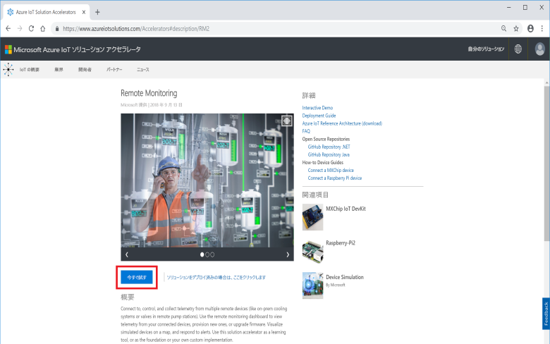

**[Create Remote Monitoring solution]\(リモート監視ソリューションの作成\)** ページで、**[Basic]** デプロイを選択します。 しくみについて学ぶ、またはデモを実行するためにソリューション アクセラレータをデプロイする場合、**[Basic]** を選択すると費用を最小限に抑えられます。

言語として **[.NET]** を選択します。 Java と .NET の実装は、同じ機能を備えています。

リモート監視ソリューション アクセラレータの一意の**ソリューション名**を入力します。 このクイック スタートでは、**contoso-rm2** という名前を使用します。

ソリューション アクセラレータのデプロイに使用する**サブスクリプション**と**リージョン**を選択します。 通常は、最も近いリージョンを選択します。 このクイック スタートでは、**[Visual Studio Enterprise]** と **[西ヨーロッパ]** を使用します。 サブスクリプションの[グローバル管理者またはユーザー](iot-accelerators-permissions.md)である必要があります。

**[ソリューションの作成]** をクリックして、デプロイを開始します。 このプロセスを実行するには、少なくとも 5 分かかります。

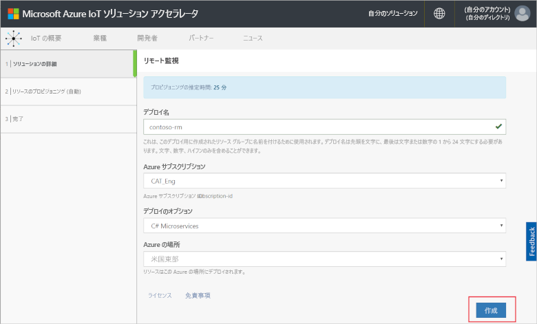

## ソリューションにサインインします。

Azure サブスクリプションへのデプロイが完了すると、ソリューション タイルに緑色のチェックマークと "**準備完了**" のメッセージが表示されます。 これで、リモート監視ソリューション アクセラレータ ダッシュボードにサインインすることができます。

**[プロビジョニングされたソリューション]** ページで、新しいリモート監視ソリューション アクセラレータをクリックします。

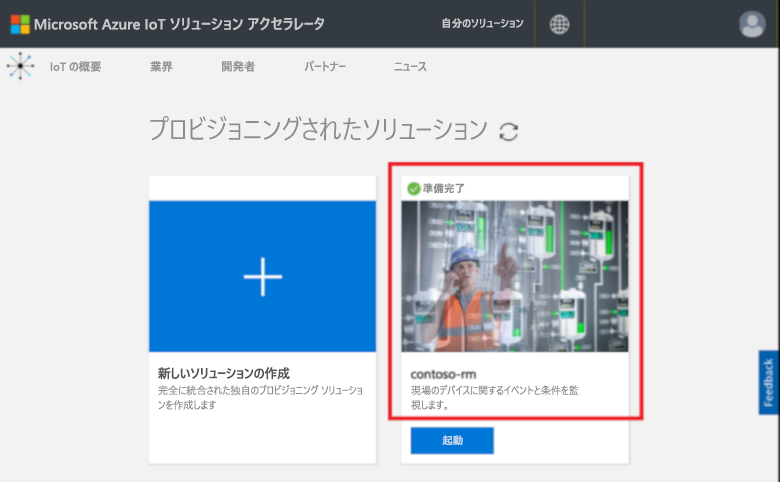

表示されるパネルで、リモート監視ソリューション アクセラレータに関する情報を確認できます。 **[ソリューション ダッシュボード]** を選択して、リモート監視ソリューション アクセラレータを表示します。

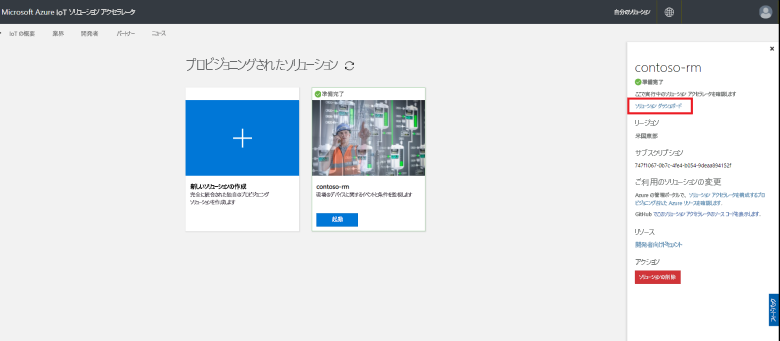

**[同意]** をクリックしてアクセス許可の要求を受け入れると、お使いのブラウザーにリモート監視ソリューションのダッシュボードが表示されます。

[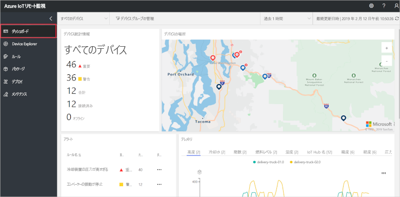](./media/quickstart-remote-monitoring-deploy/solutiondashboard-expanded.png#lightbox)

## デバイスを表示する

ソリューション ダッシュボードには、シミュレートされた Contoso のデバイスに関する次の情報が表示されます。

* **[Device statistics]\(デバイス統計情報\)** には、アラートに関する概要情報とデバイスの合計数が表示されます。 既定のデプロイでは、Contoso には種類が異なる 10 個のシミュレートされたデバイスがあります。

* **[Device locations]\(デバイスの場所\)** には、デバイスが物理的に配置されている場所が表示されます。 ピンの色は、デバイスからのアラートがあることを示します。

* **[アラート]** には、デバイスからのアラートの詳細が表示されます。

* **[テレメトリ]** には、デバイスからのテレメトリが表示されます。 上部にあるテレメトリの種類をクリックすると、さまざまなテレメトリ ストリームを表示できます。

* **[分析]** には、デバイスからのアラートに関する情報が統合されて表示されます。

## アラートに対処する

Contoso のオペレーターは、ソリューション ダッシュボードからデバイスを監視できます。 **[Device statistics]\(デバイス統計情報\)** パネルを見ると、多数の重大なアラートがあることがわかります。**[アラート]** パネルを見ると、そのほとんどが冷却装置デバイスからのアラートであることがわかります。 Contoso の冷却装置デバイスの場合、内部圧力が 250 PSI を超えるとデバイスが正常に動作していないと見なされます。

### 問題を特定する

**[ダッシュボード]** ページの **[アラート]** パネルに、**[Chiller pressure too high]\(冷却装置の圧力が高すぎる\)** アラートが表示されています。 冷却装置はマップ上に赤いピンで示されています (場合により、マップをパンおよび拡大縮小する必要があります)。

[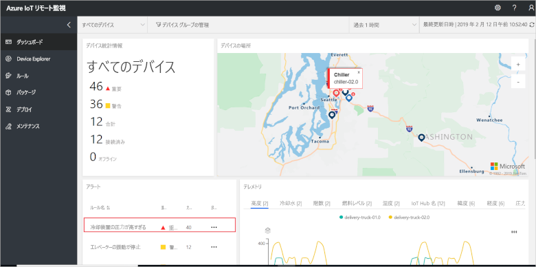](./media/quickstart-remote-monitoring-deploy/dashboardalarm-expanded.png#lightbox)

**[アラート]** パネルで、**[Chiller pressure too high]\(冷却装置の圧力が高すぎる\)** 規則の横にある **[探索]** 列の **[...]** をクリックします。 この操作により **[メンテナンス]** ページが表示され、アラートをトリガーした規則の詳細を確認できます。

**[Chiller pressure too high]\(冷却装置の圧力が高すぎる\)** メンテナンス ページには、アラートをトリガーした規則の詳細が表示されます。 このページには、アラートが発生した時刻とアラートをトリガーしたデバイスも表示されます。

[![[メンテナンス] ページにトリガーされたアラートの一覧が表示される](./media/quickstart-remote-monitoring-deploy/maintenancealarmlist-inline.png)](./media/quickstart-remote-monitoring-deploy/maintenancealarmlist-expanded.png#lightbox)

これで、アラートをトリガーした問題と、関連するデバイスを特定できました。 次にオペレーターが実行する手順は、アラートの確認と問題の修正です。

### 問題を修正する

これからアラートに対処することを他のオペレーターに示すために、そのアラートを選択し、**[アラートの状態]** を **[確認済み]** に変更します。

[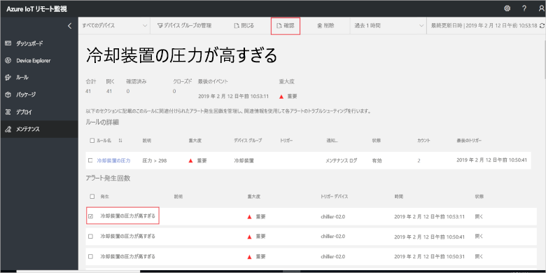](./media/quickstart-remote-monitoring-deploy/maintenanceacknowledge-expanded.png#lightbox)

[状態] 列の値が **[確認済み]** に変わります。

冷却装置を操作するために、**[関連情報]** まで下へスクロールし、**[Alerted devices]\(アラートが発生したデバイス\)** の一覧で冷却装置デバイスを選択し、**[ジョブ]** を選択します。

[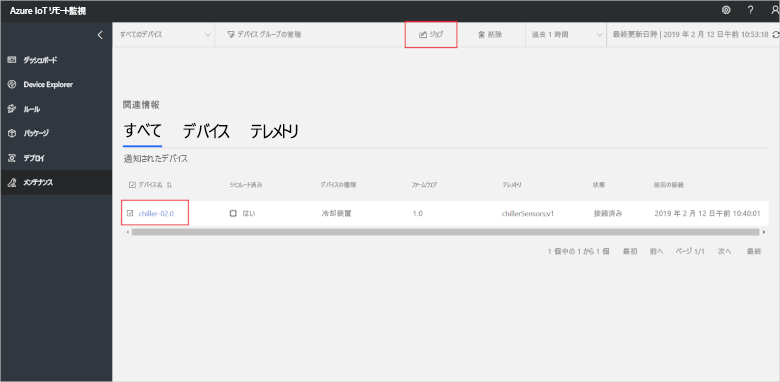](./media/quickstart-remote-monitoring-deploy/maintenanceschedule-expanded.png#lightbox)

**[ジョブ]** パネルで、**[Run method]\(実行メソッド\)**、**[EmergencyValveRelease]** メソッドの順に選択します。 ジョブ名 **ChillerPressureRelease** を追加し、**[適用]** をクリックします。 これらの設定により、すぐに実行されるジョブが作成されます。

ジョブの状態を確認するには、**[メンテナンス]** ページに戻り、**ジョブ** ビューでジョブの一覧を確認します。 場合によっては、冷却装置で弁の圧力を解放するジョブが実行されたことを確認できるまでに数秒待つ必要があります。

[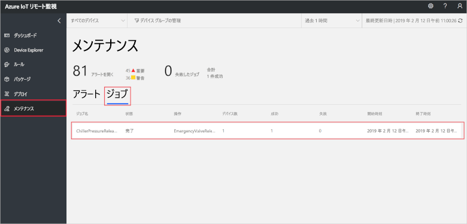](./media/quickstart-remote-monitoring-deploy/maintenancerunningjob-expanded.png#lightbox)

### 圧力が正常に戻っていることを確認する

冷却装置の圧力テレメトリを表示するために、**[ダッシュボード]** ページに移動し、[テレメトリ] パネルの **[Pressure]\(圧力\)** を選択します。**chiller-02.0** の圧力が正常に戻っていることを確認します。

[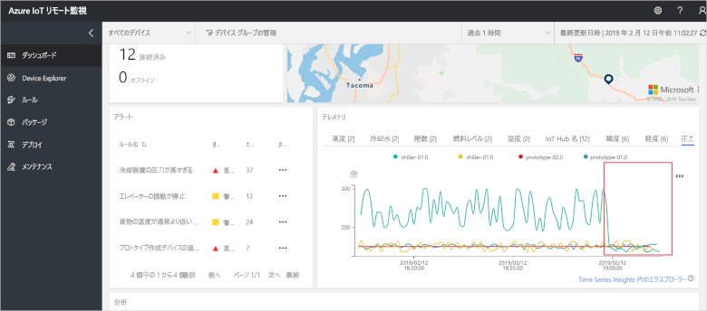](./media/quickstart-remote-monitoring-deploy/pressurenormal-expanded.png#lightbox)

インシデントを閉じるには、**[メンテナンス]** ページに移動し、アラートを選択して状態を **[Closed] (解決済み)** に設定します。

[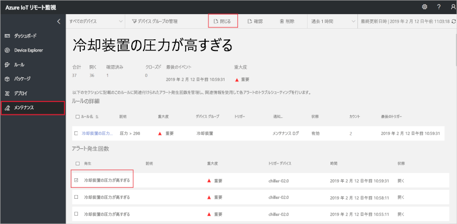](./media/quickstart-remote-monitoring-deploy/maintenanceclose-expanded.png#lightbox)

[状態] 列の値が **[Closed]\(解決済み\)** に変わります。

## リソースのクリーンアップ

チュートリアルに進む場合は、リモート監視ソリューション アクセラレータをデプロイしたままにしておきます。

ソリューション アクセラレータが不要になった場合は、[[プロビジョニングされたソリューション]](https://www.azureiotsolutions.com/Accelerators#dashboard) ページでそれを選択し、**[ソリューションの削除]** をクリックして削除してください。

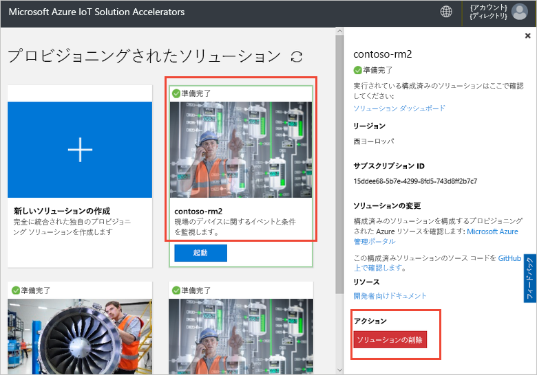

## 次の手順

このクイック スタートでは、リモート監視ソリューション アクセラレータをデプロイし、既定の Contoso デプロイのシミュレートされたデバイスを使用して監視タスクを完了しました。

シミュレートされたデバイスを使ったソリューション アクセラレータについて詳しくは、引き続き次のチュートリアルをご覧ください。

> [!div class="nextstepaction"]
> [チュートリアル: IoT デバイスの監視](iot-accelerators-remote-monitoring-monitor.md)