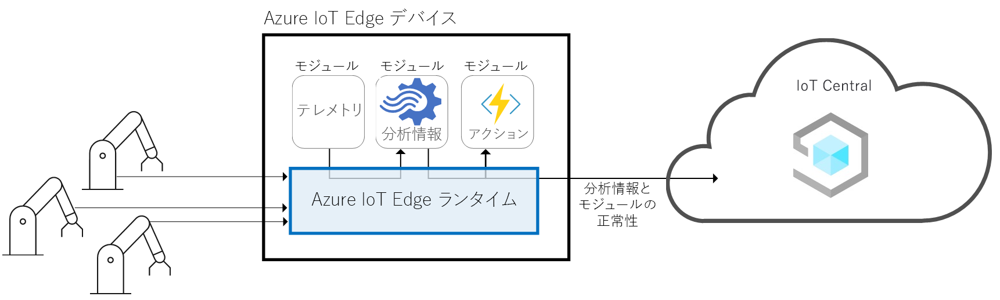
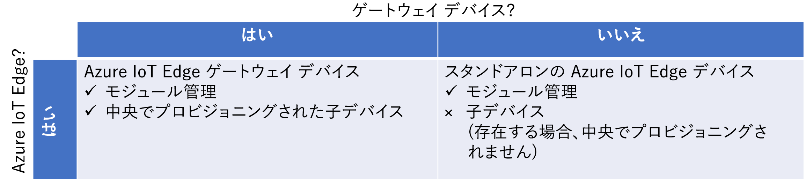
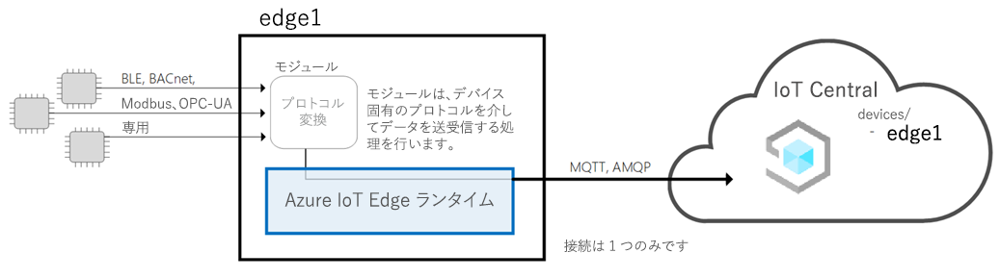
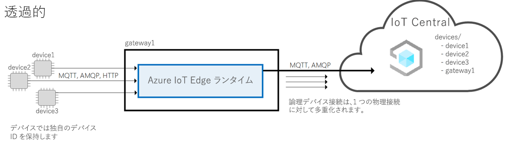
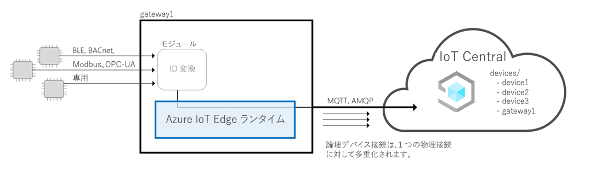
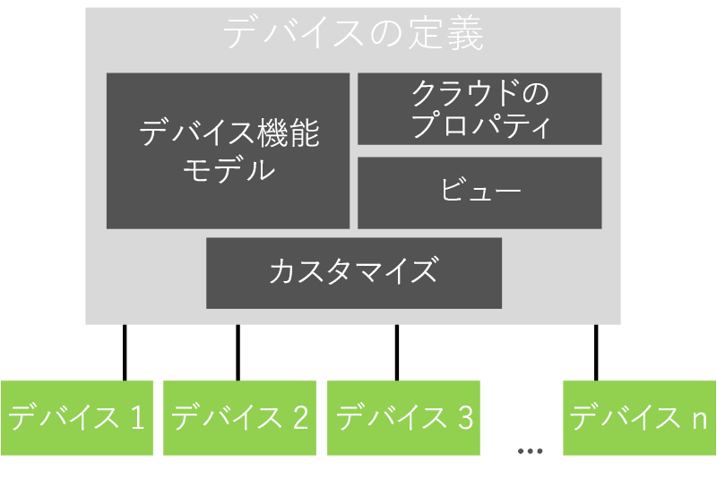

# Azure IoT Central のアーキテクチャ

この記事では、Microsoft Azure IoT Central のアーキテクチャの概要について説明します。

## デバイス

デバイスは、Azure IoT Central アプリケーションとデータを交換します。 デバイスは次のことを実行できます。

- テレメトリなどの測定を送信します。
- アプリケーションと設定を同期します。

Azure IoT Central では、デバイスがアプリケーションと交換できるデータはデバイス テンプレートで指定されます。 デバイス テンプレートの詳細については、「[メタデータ管理](#metadata-management)」を参照してください。

Azure IoT Central アプリケーションへのデバイスの接続方法の詳細については、[デバイス接続](concepts-get-connected.md)に関するページを参照してください。

## Azure IoT Edge デバイス

[Azure IoT SDK](https://github.com/Azure/azure-iot-sdks) を使用して作成されたデバイスと同様に、[Azure IoT Edge デバイス](../../iot-edge/about-iot-edge.md)を IoT Central アプリケーションに接続することもできます。 IoT Edge を使用すると、IoT Central によって管理されている IoT デバイスで、クラウド インテリジェンスやカスタム ロジックを直接実行できます。 IoT Edge ランタイムによって以下が可能となります。

- デバイスにワークロードをインストールし、更新する。
- デバイス上の IoT Edge のセキュリティ標準を維持する。
- IoT Edge モジュールの実行状態を絶えず確保する。
- モジュールの正常性をクラウドにレポートしてリモート監視を可能にする。
- ダウンストリームのリーフ デバイスと IoT Edge デバイス間、IoT Edge デバイス上のモジュール間、IoT Edge デバイスとクラウド間の通信を管理する。

IoT Central により、IoT Edge デバイスで次の機能を使用できるようになります。

- 次のような IoT Edge デバイスの機能を記述するデバイス テンプレート。
  - 配置マニフェストのアップロード機能。これは、デバイスのマニフェストを管理するのに役立ちます。
  - IoT Edge デバイスで実行されるモジュール。
  - 各モジュールが送信するテレメトリ。
  - 各モジュールによって報告されるプロパティ。
  - 各モジュールが応答するコマンド。
  - IoT Edge ゲートウェイ デバイス機能モデルとダウンストリーム デバイス機能モデル間の関係。
  - IoT Edge デバイスに格納されていないクラウド プロパティ。
  - カスタマイズ、ダッシュボード、およびフォーム: ご利用の IoT Central アプリケーションの一部を成します。

  詳細については、記事「[Azure IoT Edge デバイスを Azure IoT Central アプリケーションに接続する](./concepts-iot-edge.md)」を参照してください。

- Azure IoT のデバイス プロビジョニング サービスを使用して大規模に IoT Edge デバイスをプロビジョニングする機能
- ルールとアクション。
- カスタム ダッシュボードと分析。
- IoT Edge デバイスからのテレメトリの連続データ エクスポート。

### IoT Edge デバイスの種類

IoT Central は、IoT Edge デバイスの種類を次のように分類します。

- リーフ デバイス。 IoT Edge デバイスはダウンストリームのリーフ デバイスを持つことができますが、それらのデバイスは IoT Central にはプロビジョニングされません。
- ダウンストリーム デバイスがあるゲートウェイ デバイス。 ゲートウェイ デバイスとダウンストリーム デバイスは、どちらも IoT Central にプロビジョニングされます

### IoT Edge のパターン

IoT Central は、次の IoT Edge デバイス パターンをサポートしています。

#### リーフ デバイスとしての IoT Edge

IoT Edge デバイスは、IoT Central にプロビジョニングされ、ダウンストリーム デバイスとそれらのテレメトリは、IoT Edge デバイスからのものとして表されます。 IoT Edge デバイスに接続されているダウンストリーム デバイスは、IoT Central にはプロビジョニングされません。

#### ID を使用してダウンストリーム デバイスに接続されている IoT Edge ゲートウェイ デバイス

IoT Edge デバイスは、IoT Edge デバイスに接続されているダウンストリーム デバイスと共に IoT Central にプロビジョニングされます。 ゲートウェイ経由でダウンストリーム デバイスをプロビジョニングするためのランタイム サポートは、現在サポートされていません。

#### IoT Edge ゲートウェイによって提供される ID を使用してダウンストリーム デバイスに接続されている IoT Edge ゲートウェイ デバイス

IoT Edge デバイスは、IoT Edge デバイスに接続されているダウンストリーム デバイスと共に IoT Central にプロビジョニングされます。 ダウンストリーム デバイスに ID を提供するゲートウェイのランタイム サポートおよびダウンストリーム デバイスのプロビジョニングは、現在サポートされていません。 独自の ID 変換モジュールを使用すると、IoT Central はこのパターンをサポートできます。

## クラウド ゲートウェイ

Azure IoT Central は、デバイス接続を可能にするクラウド ゲートウェイとして Azure IoT Hub を使用します。 IoT Hub では、次のことが可能になります。

- クラウド内での大規模なデータ インジェスト。
- デバイスの管理。
- セキュリティ保護されたデバイス接続。

IoT Hub の詳細については、[Azure IoT Hub](https://docs.microsoft.com/azure/iot-hub/) に関するページを参照してください。

Azure IoT Central でのデバイス接続の詳細については、[デバイス接続](concepts-get-connected.md)に関するページを参照してください。

## データ ストア

Azure IoT Central は、クラウド内にアプリケーション データを格納します。 格納されるアプリケーション データには、次のものがあります。

- デバイス テンプレート。
- デバイス ID。
- デバイス メタデータ。
- ユーザーおよびロール データ。

Azure IoT Central は、デバイスから送信された測定データのために時系列ストアを使用します。 分析サービスによって使用されるデバイスからの時系列データ。

## Analytics

分析サービスは、アプリケーションが表示するカスタム レポート データを生成する役割を果たします。 オペレーターは、アプリケーションに表示される[分析をカスタマイズする](howto-create-analytics.md)ことができます。 分析サービスは [Azure Time Series Insights](https://azure.microsoft.com/services/time-series-insights/) 上に構築されており、デバイスから送信された測定データを処理します。

## ルールとアクション

[ルールとアクション](tutorial-create-telemetry-rules.md)は、アプリケーション内のタスクを自動化するために緊密に連携します。 開発者は、定義されたしきい値を超える温度などのデバイス テレメトリに基づいてルールを定義できます。 Azure IoT Central は、ストリーム プロセッサを使用して、ルールの条件がいつ満たされるかを判定します。 ルールの条件が満たされると、開発者によって定義されたアクションがトリガーされます。 たとえば、アクションは、デバイス内の温度が高すぎることをエンジニアに通知するために電子メールを送信できます。

## メタデータ管理

Azure IoT Central アプリケーションでは、デバイス テンプレートによって各種のデバイスの動作や機能が定義されます。 たとえば、冷蔵庫デバイス テンプレートは、冷蔵庫がアプリケーションに送信するテレメトリを指定します。

IoT Central アプリケーションのデバイス テンプレートには、次のものが含まれます。

- **デバイス機能モデル**では、デバイスの機能 (送信するテレメトリ、デバイスの状態を定義するプロパティ、デバイスが応答するコマンドなど) を指定します。 デバイスの機能は、1つ以上のインターフェイスに編成されています。 デバイス機能モデルの詳細については、[IoT プラグ アンド プレイ (プレビュー)](../../iot-pnp/overview-iot-plug-and-play.md) に関するドキュメントを参照してください。
- **クラウド プロパティ**では、IoT Central がデバイス用に格納するプロパティを指定します。 これらのプロパティは IoT Central にのみ格納され、デバイスに送信されることはありません。
- **ビュー**では、オペレーターがデバイスを監視および管理できるように、ビルダーが作成するダッシュボードとフォームを指定します。
- **カスタマイズ**により、ビルダーはデバイス機能モデルの定義の一部をオーバーライドして、IoT Central アプリケーションに対する関連性を高めることができます。

アプリケーションには、各デバイス テンプレートに基づいて 1 つ以上のシミュレートされた実デバイスを割り当てることができます。

## データのエクスポート

Azure IoT Central アプリケーションでは、独自の Azure Event Hubs と Azure Service Bus のインスタンスに[データを継続的にエクスポート](howto-export-data.md)できます。 また、データをご自分の Azure BLOB ストレージ アカウントに定期的にエクスポートすることもできます。 IoT Central では、測定、デバイス、デバイス テンプレートをエクスポートできます。

## デバイスの一括更新

Azure IoT Central アプリケーションでは、接続されたデバイスを管理するための[ジョブを作成して実行](howto-run-a-job.md)できます。 これらのジョブを使用すると、デバイスのプロパティや設定を一括更新したり、コマンドを実行したりできます。 たとえば、複数の冷蔵自動販売機のファン速度を上げるジョブを作成できます。

## ロール ベースのアクセス制御 (RBAC)

事前定義済みロールの 1 つを使用して、あるいはカスタム ロールを作成することで、Azure IoT Central アプリケーションの[アクセス ルールを管理者は定義できます](howto-manage-users-roles.md)。 ユーザーにアクセスが許可されるアプリケーションの領域とユーザーが実行できるアクションがロールにより決定されます。

## Security

Azure IoT Central 内のセキュリティ機能には、次のものがあります。

- データは、転送中および保存時に暗号化されます。
- 認証は、Azure Active Directory または Microsoft アカウントのどちらかによって提供されます。 2 要素認証がサポートされています。
- テナントの完全な分離。
- デバイス レベルのセキュリティ。

## UI シェル

UI シェルは、最新の、応答性に優れた、HTML5 ブラウザー ベースのアプリケーションです。
管理者は、カスタム テーマを適用したり、独自のカスタム ヘルプ リソースを指すようにヘルプのリンクを変更したりして、アプリケーションの UI をカスタマイズできます。 UI カスタムの詳細については、記事「[Azure IoT Central の UI をカスタマイズする](howto-customize-ui.md)」を参照してください。

オペレーターは、パーソナライズされたアプリケーション ダッシュボードを作成できます。 別のデータを表示する複数のダッシュボードを持っておいて切り替えることができます。

## 次のステップ

ここでは、Azure IoT Central のアーキテクチャについて学習しました。推奨される次の手順は、Azure IoT Central での[デバイス接続](concepts-get-connected.md)の学習です。
