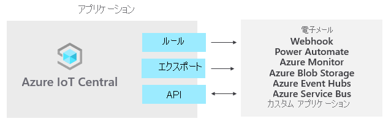

# Azure IoT Central とは

IoT Central は、エンタープライズ レベルの IoT ソリューションの開発、管理、および保守の負担とコストを削減する IoT アプリケーション プラットフォームです。 IoT Central を使用して構築することを選択すると、複雑で絶えず進化する IoT インフラストラクチャをただ維持し、更新するだけでなく、IoT データによってビジネスを変革することに時間、予算、エネルギーを集中させる機会が得られます。

Web UI では、デバイスの状態を監視し、ルールを作成し、ライフ サイクル全体を通して何百万ものデバイスとそのデータを管理することができます。 さらに、IoT インテリジェンスを基幹業務アプリケーションまで拡張することで、デバイスの分析情報に従って行動できるようになります。

この記事では、IoT Central に関して以下の概要を説明します。

- プロジェクトに関連する代表的なペルソナ。
- アプリケーションを作成する方法。
- デバイスをアプリケーションに接続する方法。
- アプリケーションを管理する方法。
- IoT Central での Azure IoT Edge 機能。
- Azure IoT Edge ランタイム搭載デバイスをアプリケーションに接続する方法。

## ペルソナ

この IoT Central ドキュメントでは、IoT Central アプリケーションと対話する 4 種類のペルソナに言及しています。

- "_ソリューション ビルダー_": アプリケーションに接続するデバイスの種類を定義したり、オペレーター向けにアプリケーションをカスタマイズしたりする役割を担います。
- "_オペレーター_": アプリケーションに接続されたデバイスを管理します。
- "_管理者_": 管理タスクを担います (アプリケーション内での[ユーザー ロールとアクセス許可](howto-administer.md)の管理など)。
- "_デバイス開発者_": アプリケーションに接続されるデバイスまたは IoT Edge モジュールで実行するコードを作成します。

## IoT Central アプリケーションを作成する

クラウドでホストされる自社のカスタム IoT ソリューションは、ソリューション ビルダーが IoT Central を使用して作成します。 通常、カスタム IoT ソリューションは次の要素から成ります。

- クラウドベースのアプリケーション。このアプリケーションによってデバイスからテレメトリを受信し、それらのデバイスの管理が可能となります。
- カスタム コードを実行する複数のデバイス。これらのデバイスが、クラウドベースのアプリケーションに接続されます。

新しい IoT Central アプリケーションは、ブラウザーからすばやくデプロイし、具体的な要件に合わせてカスタマイズすることができます。 汎用の "_アプリケーション テンプレート_"、または[小売業](../retail/overview-iot-central-retail.md)、[エネルギー](../energy/overview-iot-central-energy.md)、[政府機関](../government/overview-iot-central-government.md)、[医療](../healthcare/overview-iot-central-healthcare.md)の各業界にフォーカスしたアプリケーション テンプレートのいずれかを使用して開始できます。

ソリューション ビルダーは、自社アプリケーションに接続するデバイス用に、Web ベースのツールを使って "_デバイス テンプレート_" を作成します。 デバイス テンプレートは、特定の種類のデバイスについて、その特性と動作を定義するブループリントです。次に示したのは、その例です。

- 送信するテレメトリ。
- オペレーターによる変更が可能なビジネス プロパティ。
- デバイスによって設定され、かつアプリケーションでは読み取り専用となるデバイス プロパティ。
- オペレーターが設定する、デバイスの動作を決めるプロパティ。

このデバイス テンプレートには、次のものが含まれています。

- "_デバイス機能モデル_": デバイスから送信されるテレメトリやデバイスからレポートされるプロパティなど、デバイスが実装する必要がある機能を記述します
- クラウド プロパティ: これらはデバイスには格納されません。
- カスタマイズ、ダッシュボード、およびフォーム: ご利用の IoT Central アプリケーションの一部を成します。

### デバイス テンプレートを作成する

[IoT プラグ アンド プレイ (プレビュー)](../../iot-pnp/overview-iot-plug-and-play.md) を使用すると、埋め込みデバイス コードを記述せずに、IoT Central でデバイスを統合できます。 IoT プラグ アンド プレイ (プレビュー) の中核となるのは、デバイスの機能を記述するデバイス機能モデル スキーマです。 IoT Central アプリケーション内のデバイス テンプレートでは、これらの IoT プラグ アンド プレイ (プレビュー) デバイス機能モデルを使用しています。

ソリューション ビルダーには、デバイス テンプレート作成のためのオプションがいくつか用意されています。

- [Azure Certified for IoT デバイス カタログ](https://aka.ms/iotdevcat)からデバイス機能モデルをインポートし、次に、IoT Central アプリケーションで必要とされるクラウド プロパティ、カスタマイズ、およびダッシュボードを追加します。
- IoT Central でデバイス テンプレートを設計してから、そのデバイス機能モデルをデバイス コードに実装します。
- Visual Studio Code を使用してデバイス機能モデルを作成し、モデルをリポジトリに発行します。 モデルからデバイス コードを実装し、デバイスを IoT Central アプリケーションに接続します。 IoT Central によって、リポジトリからデバイス機能モデルが検索され、シンプルなデバイス テンプレートが自動的に作成されます。
- Visual Studio Code を使用してデバイス機能モデルを作成します。 ご利用のデバイス コードをモデルから実装します。 ご利用の IoT Central アプリケーションにデバイス機能モデルを手動でインポートしてから、IoT Central アプリケーションに必要なクラウド プロパティ、カスタマイズ、およびダッシュボードを追加します。

ソリューション ビルダーは、IoT Central を使用して、デバイス テンプレートを検証するためのテスト デバイス用コードを生成できます。

デバイス開発者の方は、これらのデバイス テンプレートを使用するデバイスの実装の概要について、「[IoT Central デバイスの開発の概要](./overview-iot-central-developer.md)」を参照してください。

### UI のカスタマイズ

ソリューション ビルダーは、アプリケーションの使用を日常的に担当するオペレーターに向けて、IoT Central アプリケーションの UI をカスタマイズすることもできます。 ソリューション ビルダーが行うことのできるカスタマイズの例を次に示します。

- プロパティと設定のレイアウトをデバイス テンプレートで定義する。
- オペレーターによる分析情報の検出と問題の解決を迅速化するカスタム ダッシュボードを構成する。
- 接続されているデバイスから時系列データを探すカスタム分析を構成する。

## デバイスを管理する

IoT Central ソリューションのデバイスは、オペレーターが IoT Central アプリケーションを使用して管理します。 オペレーターは、次のようなタスクを実行します。

- アプリケーションに接続されたデバイスを監視する。
- デバイスの問題をトラブルシューティングして修復する。
- 新しいデバイスをプロビジョニングする。

ソリューション ビルダーは、接続デバイスからのデータ ストリーミングに対して作用するカスタム ルールやカスタム アクションを定義できます。 それらのルールをオペレーターがデバイス レベルで有効または無効にすることで、アプリケーション内のタスクを制御したり自動化したりすることができます。

IoT ソリューションを大規模に運用するには、デバイス管理に対するアプローチが構造化されていることが重要です。 デバイスをクラウドに接続するだけでは十分ではありません。デバイスを常に正常な接続状態に保つ必要があります。 オペレーターは、次の IoT Central 機能を使用することで、アプリケーション ライフ サイクル全体を通じてデバイスを管理できます。

### ダッシュボード

組み込みの[ダッシュボード](./howto-set-up-template.md#generate-default-views)は、デバイスの正常性とテレメトリを監視するための、カスタマイズ可能な UI を備えています。 [アプリケーション テンプレート](howto-use-app-templates.md)のあらかじめ構築されたダッシュボードを利用して開始するか、オペレーターのニーズに合わせた独自のダッシュボードを作成します。 ダッシュボードは、アプリケーション内のすべてのユーザーと共有することも、非公開に保つこともできます。

### ルールとアクション

デバイスの状態とテレメトリに基づいて[カスタム規則](tutorial-create-telemetry-rules.md)を作成することで、注意を要するデバイスを迅速に特定します。 適切なユーザーに通知するアクションを構成し、適切なタイミングで是正措置が講じられるようにします。

### ジョブ

[ジョブ](howto-run-a-job.md)を使用すると、プロパティを設定したりコマンドを呼び出したりして、デバイスに単独または一括の更新を実行できます。

## 他のサービスとの統合

IoT Central ではアプリケーション プラットフォームとして、IoT データを、アクションにつながる結果をもたらすビジネス分析情報に変換できます。 IoT Central を基幹業務アプリケーションに統合する方法の例としては、[規則](./tutorial-create-telemetry-rules.md)、[データのエクスポート](./howto-export-data.md)、[パブリック REST API](https://docs.microsoft.com/learn/modules/manage-iot-central-apps-with-rest-api/) があります。

カスタムの分析パイプラインを構築してデバイスからのテレメトリを処理し、結果を格納することにより、工場現場における機械の効率性の傾向を判断したり、将来の電力使用量を予測したりするなど、ビジネス分析情報を生成できます。 IoT Central アプリケーションでデータのエクスポートを構成して、テレメトリ、デバイス プロパティの変更、デバイス テンプレートの変更を他のサービスにエクスポートします。このサービスでは、任意のツールを使用してデータを分析、保存、および視覚化することができます。

### REST API を使用してカスタムの IoT ソリューションと統合を構築する

次のような IoT ソリューションを構築します。

- デバイスをリモートで設定および制御できるモバイル コンパニオン アプリ。
- 既存の基幹業務アプリケーションが IoT デバイスやデータと対話できるようにするカスタム統合。
- デバイスのモデル化、オンボード、管理、およびデータ アクセスを行うためのデバイス管理アプリケーション。

## アプリケーションの管理

IoT Central アプリケーションは、Microsoft によって完全にホストされるため、アプリケーションの管理オーバーヘッドが軽減されます。 アプリケーションへのアクセスは、管理者が[ユーザー ロールとアクセス許可](howto-administer.md)を使って管理します。

## 価格

7 日間の無料試用版を使用して IoT Central アプリケーションを作成することも、標準の料金プランを使用することもできます。

- "*無料*" のプランを使用して作成したアプリケーションは 7 日間無料で、最大 5 台のデバイスがサポートされます。 期限切れになるまでは、いつでも標準の料金プランを使用するように変換できます。
- "*標準*" のプランを使用して作成したアプリケーションは、デバイス単位で課金されます。**Standard 1** または **Standard 2** 料金プランから選択でき、どちらも最初の 2 つのデバイスが無料となります。 [IoT Central の価格](https://aka.ms/iotcentral-pricing) についての詳細をご覧ください。

## Quotas (クォータ)

各 Azure サブスクリプションには既定のクォータが設けられており、IoT ソリューションの範囲に影響する可能性があります。 現在、IoT Central では、サブスクリプションでデプロイできるアプリケーションの数が 10 に制限されています。 この制限を引き上げる必要がある場合は、[Microsoft サポート](https://azure.microsoft.com/support/options/)にお問い合わせください。

## 既知の問題

- 継続的データ エクスポートで Avro 形式がサポートされていない (互換性がない)。
- GeoJSON は現在サポートされていない。
- マップ タイルは現在サポートされていない。
- 配列スキーマの種類はサポートされていない。
- C デバイス SDK と Node.js のデバイス SDK、サービス SDK のみがサポートされている。
- 現在、IoT Central は、米国、ヨーロッパ、アジア太平洋、オーストラリア、英国、日本で使用できます。
- 場所が英国の場合および日本の場合、**カスタム アプリケーション (レガシ)** アプリケーション テンプレートは使用できません。
- デバイス機能モデルには、すべてのインターフェイスが同じファイル内にインラインで定義されている必要があります。
- [IoT プラグ アンド プレイ](../../iot-pnp/overview-iot-plug-and-play.md)のサポートはプレビュー段階であり、一部のリージョンでのみサポートされています。

## 次のステップ

これで IoT Central の概要を把握できました。推奨される次の手順のいくつかを次に示します。

- [IoT ソリューションを作成するための Azure のテクノロジとサービス](../../iot-fundamentals/iot-services-and-technologies.md)を把握する。
- [Azure IoT Central の UI](overview-iot-central-tour.md) に慣れる。
- 実際に [Azure IoT Central アプリケーションを作成](quick-deploy-iot-central.md)してみる。
- [IoT プラグ アンド プレイ (プレビュー)](../../iot-pnp/overview-iot-plug-and-play.md)の詳細を確認する。
- [Azure IoT Edge デバイスを接続する](./tutorial-add-edge-as-leaf-device.md)方法について学習する。
- [Azure IoT のテクノロジとサービス](../../iot-fundamentals/iot-services-and-technologies.md)の詳細を確認する。

デバイス開発者がコードの内容を詳しく知りたい場合は、次の手順として、[クライアント アプリケーションを作成して Azure IoT Central アプリケーションに接続する](./tutorial-connect-device-nodejs.md)ことをお勧めします。
