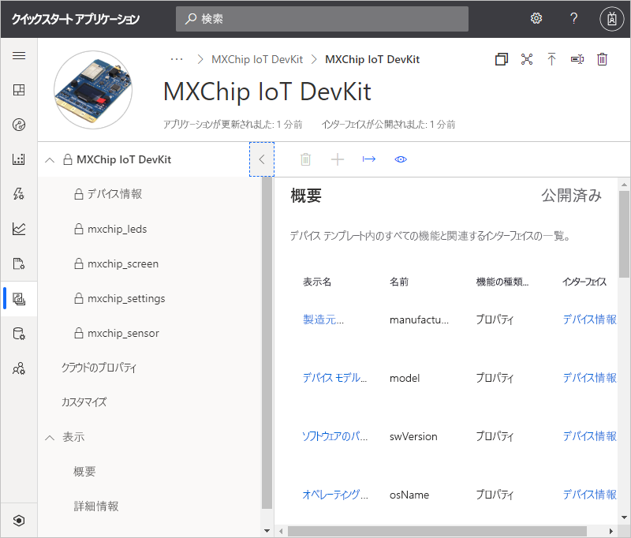
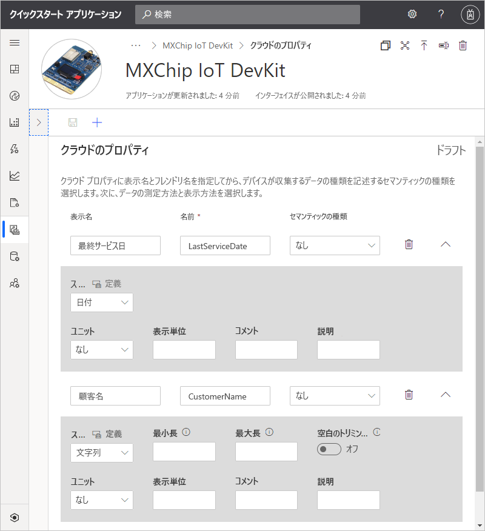
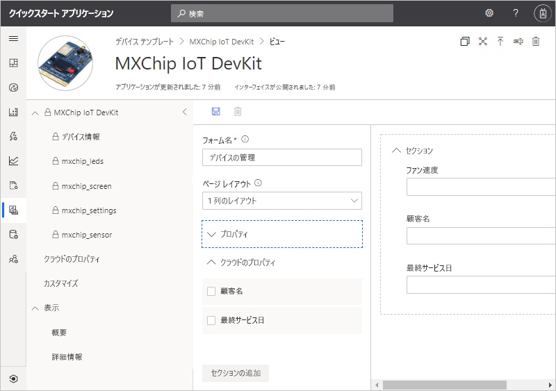
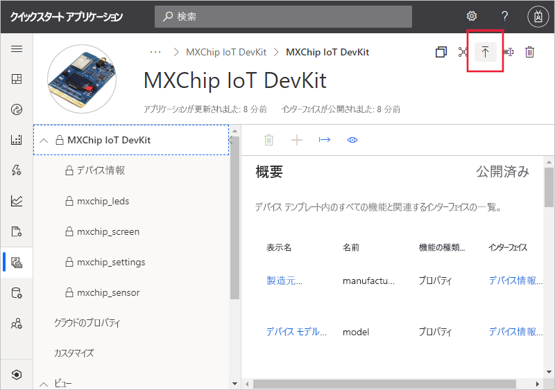
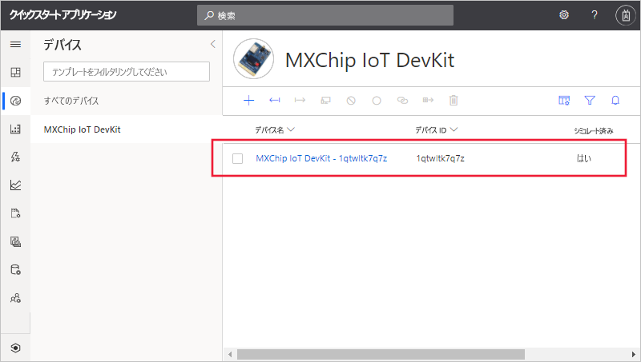
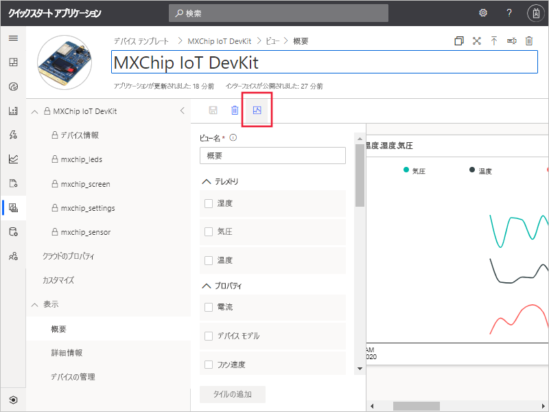

# クイック スタート:IoT Central アプリケーションにシミュレートされたデバイスを追加する

*この記事は、オペレーター、ビルダー、および管理者に適用されます。*

デバイス テンプレートは、IoT Central アプリケーションに接続するデバイスの機能を定義します。 機能には、デバイスが送信するテレメトリ、デバイスのプロパティ、デバイスが反応するコマンドなどがあります。 デバイス テンプレートから、ビルダーまたはオペレーターは、実際のデバイスとシミュレートされたデバイスの両方をアプリケーションに追加できます。 シミュレートされたデバイスは、実際のデバイスを接続する前に、IoT Central アプリケーションの動作をテストするのに役立ちます。

このクイックスタートでは、*MXChip IoT DevKit* (DevKit) ボードのデバイス テンプレートを追加し、シミュレートされたデバイスを作成します。 このクイックスタートを完了するために、実際のデバイスは必要ありません。デバイスのシミュレーションを使用します。 DevKit デバイスは、次のことを実行します。

* 温度などのテレメトリを送信する。
* 輝度など、デバイス固有のプロパティをレポートする。
* 電源オンやオフなどのコマンドに反応する。
* ファームウェア バージョンやシリアル番号など、一般的なデバイス プロパティをレポートする。

## 前提条件

**[カスタム アプリ] > [カスタム アプリケーション]** テンプレートを使用して IoT Central アプリケーションを作成するには、「[Azure IoT Central アプリケーションの作成](./quick-deploy-iot-central.md)」クイックスタートを完了します。

## テンプレートの作成

ビルダーは、IoT Central アプリケーションでデバイス テンプレートを作成および編集できます。 デバイス テンプレートを発行した後は、デバイス テンプレートからシミュレートされたデバイスを生成したり、実際のデバイスを接続したりできます。 シミュレートされたデバイスを使用すると、実デバイスを接続する前にアプリケーションの動作をテストできます。

新しいデバイス テンプレートをアプリケーションに追加するには、左ペインで **[デバイス テンプレート]** タブを選択します。

![[デバイス テンプレート] ページ](./media/quick-create-pnp-device/devicedefinitions.png)

デバイス テンプレートには、デバイスが送信するテレメトリ、デバイスのプロパティ、およびデバイスが応答するコマンドを定義するデバイス機能モデルが含まれています。

### デバイス機能モデルを追加する

IoT Central アプリケーションにデバイス機能モデルを追加する場合、いくつかのオプションがあります。 モデルをゼロから作成することも、ファイルからモデルをインポートすることも、デバイス カタログからデバイスを選択することもできます。 また、IoT Central では "*デバイス優先*" アプローチもサポートしています。このアプローチでは、デバイスが初めて接続されたときにリポジトリからモデルが自動的にインポートされます。 このクイックスタートでは、デバイス カタログからデバイスを選択して、そのデバイス機能モデルをインポートします。

次の手順では、デバイス カタログを使用して、**MXChip IoT DevKit** デバイスの機能モデルをインポートする方法について説明します。 これらのデバイスは、温度などのテレメトリをアプリケーションに送信します。

1. 新しいデバイス テンプレートを追加するには、 **[デバイス テンプレート]** ページで **+** を選択します。

1. **[テンプレートの種類の選択]** ページで、 **[MXChip IoT DevKit]** タイルが表示されるまで下にスクロールします。

1. **[MXChip IoT DevKit]** タイルを選択し、 **[次のステップ: カスタマイズ]** を選択します。

1. **[Review]\(レビュー\)** ページで、 **[Create]\(作成\)** を選択します。

1. 数秒後に、新しいデバイス テンプレートが表示されます。

    

    MXChip IoT DevKit 機能モデルには、 **[mxchip_sensor]** 、 **[mxchip_settings]** 、 **[デバイス情報]** などのインターフェイスが含まれています。 これらのインターフェイスによって、MXChip IoT DevKit デバイスの機能が定義されます。 機能には、デバイスが送信するテレメトリ、デバイスがレポートするプロパティ、デバイスが反応するコマンドなどがあります。

### クラウド プロパティを追加する

デバイス テンプレートにはクラウド プロパティを含めることができます。 クラウド プロパティは IoT Central アプリケーション内のみに存在しており、デバイスとの間で送受信されることはありません。

1. **[クラウド プロパティ]** 、 **[+ クラウド プロパティの追加]** の順に選択します。 下表の情報に従って、デバイス テンプレートに 2 つのクラウド プロパティを追加します。

    | 表示名      | セマンティックの種類 | スキーマ |
    | ----------------- | ------------- | ------ |
    | Last Service Date | なし          | Date   |
    | Customer Name     | なし          | String |

1. **[保存]** を選択して変更を保存します。

    

## ビュー

ビルダーは、アプリケーションをカスタマイズして、デバイスの関連情報がオペレーターに表示されるようにすることができます。 カスタマイズを行うことで、オペレーターがアプリケーションに接続されたデバイスを管理できるようになります。 オペレーター向けのデバイス操作用のビューを 2 種類作成できます。

* デバイス プロパティとクラウド プロパティを表示および編集するためのフォーム。
* デバイスとデバイスから送信されたテレメトリスを視覚化するダッシュボード。

### 既定のビュー

既定のビューを使用すると、重要なデバイス情報の視覚化をすばやく開始できます。 デバイス テンプレートごとに生成できる既定のビューは、最大で 3 つです。

* **[コマンド]** ビューでは、オペレーターがデバイスにコマンドを送信できます。
* **[概要]** ビューでは、グラフとメトリックを利用してデバイスのテレメトリが表示されます。
* **[詳細]** ビューには、デバイスのプロパティが表示されます。

デバイス テンプレートで **[ビュー]** ノードを選択します。 テンプレートを追加すると、IoT Central によって **[概要]** および **[詳細]** ビューが自動的に生成されます。

オペレーターがデバイスを管理するために使用できる新しい **[デバイスの管理]** フォームを追加するには、次のようにします。

1. **[ビュー]** ノードを選択し、 **[デバイスとクラウドのデータの編集]** タイルを選択して新しいビューを追加します。

1. フォーム名を「**デバイスの管理**」に変更します。

1. **[カスタマー名]** および **[Last Service Date]\(前回点検日\)** クラウド プロパティと、 **[ファン速度]** プロパティを選択します。 次に、 **[セクションの追加]** を選択します。

    

1. **[保存]** を選択して新しいフォームを保存します。

## デバイス テンプレートの公開

シミュレートされたデバイスを作成したり、実物のデバイスを接続したりする前に、デバイス テンプレートを発行する必要があります。 最初に作成したテンプレートは IoT Central によって発行されましたが、更新したバージョンを発行する必要があります。

デバイス テンプレートを公開するには:

1. **[デバイス テンプレート]** ページで、作成したデバイス テンプレートに移動します。

1. **[発行]** を選択します。

    

1. **[このデバイス テンプレートのアプリケーションへの発行]** ダイアログで、 **[発行]** を選択します。 

デバイス テンプレートを発行すると、 **[デバイス]** ページに表示されます。 公開済みのデバイス テンプレートで、新しいバージョンを作成せずにデバイス機能モデルを編集することはできません。 ただし、公開済みのデバイス テンプレートでも、クラウド プロパティ、カスタマイズ、ビューについては、新バージョンを作成することなく更新できます。 変更完了後に **[公開]** を選択すると、変更内容がオペレーターにプッシュされます。

## シミュレートされたデバイスの追加

シミュレートされたデバイスをアプリケーションに追加するには、作成した **MXChip IoT DevKit** デバイス テンプレートを使用します。

1. オペレーターが新しいデバイスを追加するには、左側のウィンドウで **[デバイス]** を選択します。 **[デバイス]** タブには、 **[すべてのデバイス]** および **[MXChip IoT DevKit]** デバイス テンプレートが表示されます。 **[MXChip IoT DevKit]** を選択します。

1. シミュレートされた DevKit デバイスを追加するには、 **+** を選択します。 推奨される**デバイス ID** を使用するか、独自の小文字の**デバイス ID** を入力します。 新しいデバイスの名前を入力することもできます。 **[シミュレート済み]** トグルが **[オン]** になっていることを確認し、 **[作成]** を選択します。

    

これで、ビルダーがデバイス テンプレート用に作成したビューを、シミュレートされたデータを使用して操作できるようになりました。

1. **[デバイス]** ページで、シミュレートされたデバイスを選択します。

1. **[概要]** ビューには、シミュレートされたテレメトリのプロットが表示されます。

    ![[概要] ビュー](./media/quick-create-pnp-device/simulated-telemetry.png)

1. **[詳細]** ビューには、ビューに追加したクラウド プロパティを含むプロパティ値が表示されます。

1. **[コマンド]** ビューでは、デバイスでの**点滅**などのコマンドを実行できます。

1. **[デバイスの管理]** ビューは、オペレーターがデバイスを管理できるようにするために作成したフォームです。

## シミュレートされたデバイスを使用してビューを改善する

新しいシミュレートされたデバイスを作成した後、作成者はこのデバイスを使用して、デバイス テンプレートのビューを引き続き改善し、構築することができます。

1. 左側のペインで **[デバイス テンプレート]** を選択し、 **[MXChip IoT DevKit]** テンプレートを選択します。

1. 編集するビューを選択するか、新しいビューを作成します。 **[Configure preview device]\(プレビュー デバイスの構成\)** 、 **[Select from a running device]\(実行中のデバイスから選択する\)** の順に選択します。 ここでは、プレビュー デバイスを使用しないか、テスト用に構成された実際のデバイスを使用するか、IoT Central に追加した既存のデバイスを使用するかを選択できます。

1. 一覧からシミュレートされたデバイスを選択します。 次に、 **[適用]** を選択します。 これで、デバイス テンプレート ビューの作成エクスペリエンスで、同じシミュレートされたデバイスを確認できるようになりました。 このビューは、グラフやその他の視覚化に役立ちます。

    

## 次のステップ

このクイックスタートでは、**MXChip IoT DevKit** デバイス テンプレートを作成し、シミュレートされたデバイスをアプリケーションに追加する方法について説明しました。

アプリケーションに接続されているデバイスの監視の詳細については、以下のクイックスタートをご覧ください。

> [!div class="nextstepaction"]
> [規則とアクションを構成する](./quick-configure-rules.md)
