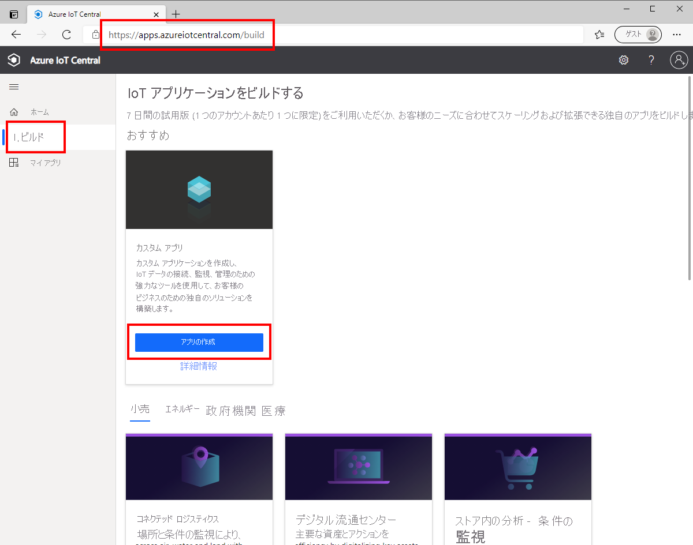
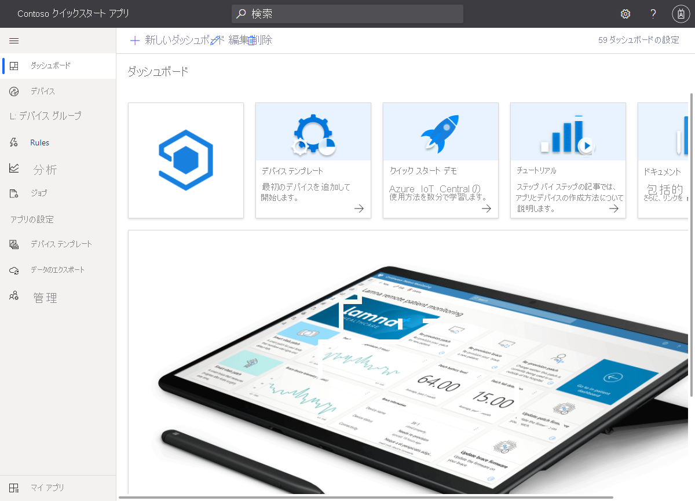

# Azure IoT Central アプリケーションの作成

このクイックスタートでは、Azure IoT Central アプリケーションを作成する方法を説明します。

## アプリケーションの作成

[Azure IoT Central ビルド](https://aka.ms/iotcentral) Web サイトに移動します。 次に、Microsoft 個人アカウントか、職場または学校アカウントを使用してサインインします。

アプリケーションを作成するには、業界に関連する IoT Central テンプレートの一覧を参照して、すばやく作業を開始するか、**カスタム アプリケーション テンプレート** を使用してゼロから始めることができます。 このクイックスタートでは、**カスタム アプリ** テンプレートを使用します。

**カスタム アプリ** テンプレートから新しい Azure IoT Central アプリケーションを作成するには:

1. **[ビルド]** ページに移動します。

    

1. **[カスタム アプリ]** を選択し、**カスタム アプリケーション** テンプレートが選択されていることを確認します。

1. Azure IoT Central によって、選択したアプリケーション テンプレートに基づいて **アプリケーション名** が自動的に提案されます。 この名前をそのまま使用することも、独自のわかりやすいアプリケーション名を入力することもできます。

1. また、Azure IoT Central は、アプリケーション名に基づいて、一意の **アプリケーション URL** プレフィックスも生成します。 この URL は、アプリケーションにアクセスするために使用します。 必要に応じて、この URL プレフィックスをもっと覚えやすいものに変更します。

    ![Azure IoT Central の [アプリケーションの作成] ページ](media/quick-deploy-iot-central/iotcentralcreate-custom.png)

    

    > [!NOTE]
    > 前のページで **[カスタム アプリ]** を選択した場合は、 **[アプリケーション テンプレート]** ドロップダウンが表示されます。 ここから、カスタム テンプレートとレガシ テンプレートを切り替えることができます。 組織で新たに使用可能になった他のテンプレートが表示される場合もあります。

1. 7 日間の無料試用料金プラン、またはいずれかの標準料金プランを使用して、アプリケーションを作成することを選択します。

    - "*無料*" のプランを使用して作成したアプリケーションは 7 日間無料で、最大 5 台のデバイスがサポートされます。 期限切れになるまでは、いつでも標準の料金プランを使用するように変換できます。
    - "*標準*" のプランを使用して作成したアプリケーションは、デバイス単位で課金されます。**Standard 1** または **Standard 2** 料金プランから選択でき、どちらも最初の 2 つのデバイスが無料となります。 無料および標準の料金プランの詳細については、[Azure IoT Central の価格に関するページ](https://azure.microsoft.com/pricing/details/iot-central/)を参照してください。 標準アプリケーションを作成する場合は、"*ディレクトリ*"、"*Azure サブスクリプション*"、および "*場所*" を選択する必要があります。
        - "*ディレクトリ*" は、アプリケーションを作成する Azure Active Directory です。 Azure Active Directory には、ユーザー ID、資格情報、およびその他の組織情報が含まれています。 Azure Active Directory を持っていない場合は、Azure サブスクリプションを作成するときに自動的に作成されます。
        - "*Azure サブスクリプション*" を使用すると、Azure サービスのインスタンスを作成できます。 IoT Central では、リソースが自分のサブスクリプション内にプロビジョニングされます。 Azure サブスクリプションがない場合は、[Azure サインアップ ページ](https://aka.ms/createazuresubscription)で無料で作成できます。 Azure サブスクリプションを作成したら、 **[新しいアプリケーション]** ページに戻ります。 新しいサブスクリプションが **[Azure サブスクリプション]** ドロップダウンに表示されるようになりました。
        - "*場所*" は、アプリケーションを作成する[地域](https://azure.microsoft.com/global-infrastructure/geographies/)です。 通常、最適なパフォーマンスを得るには、ご利用のデバイスに物理的に最も近い場所を選択する必要があります。 いったん場所を選択すると、後でアプリケーションを別の場所に移動することはできません。

1. 使用条件を確認し、ページの下部にある **[作成]** を選択します。 数分後に、IoT Central アプリケーションを使用できるようになります。

    

## 次のステップ

このクイック スタートでは、IoT Central アプリケーションを作成しました。 推奨される次の手順は、以下のとおりです。

> [!div class="nextstepaction"]
> [Azure IoT Central アプリケーションにシミュレートされたデバイスを追加する](./quick-create-pnp-device.md)
