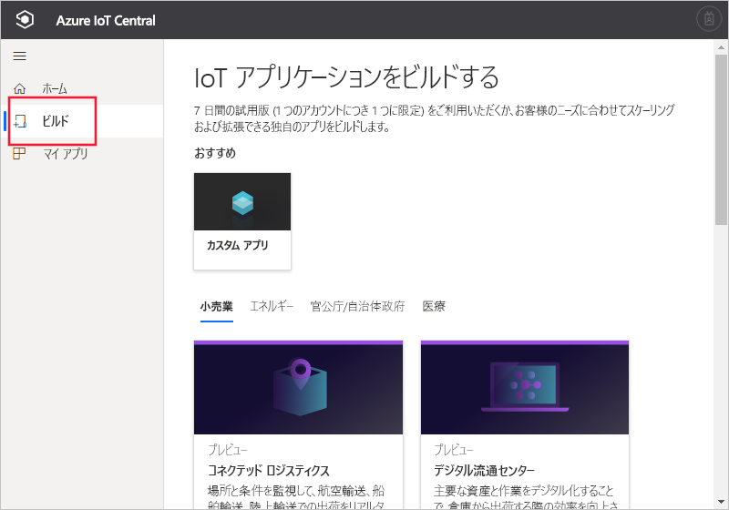

# Azure IoT Central アプリケーションの作成

[!INCLUDE [iot-central-original-pnp](../../../includes/iot-central-original-pnp-note.md)]

"_ビルダー_" は、Azure IoT Central の UI を使用して、Microsoft Azure IoT Central アプリケーションを定義します。 このクイックスタートでは、サンプル "_デバイス テンプレート_" を含む Azure IoT Central アプリケーションを作成する方法について説明します。 作成するアプリケーションでは、プレビュー機能は使用されません。

## アプリケーションの作成

[Azure IoT Central ビルド](https://aka.ms/iotcentral) Web サイトに移動します。 次に、Microsoft 個人アカウントか、職場または学校アカウントを使用してサインインします。

プレビュー機能が有効になっていない Azure IoT Central アプリケーションの作成を開始するには、 **[ビルド]** を選択します。 このリンクをクリックすると、**IoT アプリケーションのビルド**に関するページが表示されます。

そして、 **[カスタムアプリ]** を選択します。

新しい Azure IoT Central アプリケーションを作成するには:

1. Azure IoT Central によって、選択したアプリケーション テンプレートに基づいてアプリケーション名が自動的に提案されます。 この名前をそのまま使用することも、独自のわかりやすいアプリケーション名を入力することもできます (**Contoso IoT** など)。 また、Azure IoT Central は、アプリケーション名に基づいて、一意の URL も生成します。 この URL プレフィックスは、もっと覚えやすいものに変更することもできます。

1. プレビュー機能を使用していないアプリケーション テンプレートを選択してください。 アプリケーション テンプレートには、使用開始に役立つデバイス テンプレートやダッシュボードなどの事前に定義された項目を含めることができます。

    | アプリケーション テンプレート | 説明 |
    | -------------------- | ----------- |
    | サンプル Contoso       | Refrigerated Vending Machine 用に既に作成したデバイス テンプレートを含むアプリケーションを作成します。 このテンプレートは、Azure IoT Central の調査を開始するために使用します。 |
    | サンプル Devkit       | MXChip または Raspberry Pi デバイスを接続するための準備ができたデバイス テンプレートを含むアプリケーションを作成します。 このテンプレートは、これらのいずれかのデバイスで実験しているデバイス開発者が使用します。 |
    | カスタム アプリケーション   | 独自のデバイス テンプレートおよびデバイスにデータを入力するための空のアプリケーションを作成します。 |

1. 以下の支払プランを選択します。
   - **7 日間の無料試用版**アプリケーションは、有効期限が切れるまでの 7 日間は無料となります。 有効期限内で、いつでも**従量課金制**に変更することができます。 **試用版**アプリケーションを作成する場合は、連絡先情報を入力し、Microsoft から情報やヒントを受信するかどうかを選択します。
   - **従量課金制**アプリケーションは、デバイスごとに課金され、最初の 5 個のデバイスは無料です。 **従量課金制**アプリケーションを作成する場合は、"*ディレクトリ*"、"*Azure サブスクリプション*"、および "*場所*" を選択する必要があります。
        - "*ディレクトリ*" は、アプリケーションを作成する Azure Active Directory (AD) です。 ユーザー ID、資格情報、およびその他の組織情報が含まれています。 Azure AD を持っていない場合は、Azure サブスクリプションを作成するときに自動的に作成されます。
        - "*Azure サブスクリプション*" を使用すると、Azure サービスのインスタンスを作成できます。 IoT Central では、リソースが自分のサブスクリプション内にプロビジョニングされます。 Azure サブスクリプションがない場合は、[Azure サインアップ ページ](https://aka.ms/createazuresubscription)で作成できます。 Azure サブスクリプションを作成したら、 **[アプリケーションの作成]** ページに戻ります。 新しいサブスクリプションが **[Azure サブスクリプション]** ドロップダウンに表示されます。
        - "*場所*" は、アプリケーションを作成する[地域](https://azure.microsoft.com/global-infrastructure/geographies/)です。 通常、最適なパフォーマンスを得るには、ご利用のデバイスに物理的に最も近い場所を選択する必要があります。 現在、Azure IoT Central は、**米国**、**オーストラリア**、**アジア太平洋**、または**ヨーロッパ**で使用できます。  いったん場所を選択すると、後でアプリケーションを別の場所に移動することはできません。

        価格の詳細については、[Azure IoT Central の価格に関するページ](https://azure.microsoft.com/pricing/details/iot-central/)を参照してください。

1. 前に手順 1. で選択した支払いプランのために必要な追加情報を指定します。

1. ページの下部にある **[作成]** を選択します。

## 次の手順

このクイック スタートでは、IoT Central アプリケーションを作成しました。 推奨される次の手順は、以下のとおりです。

> [!div class="nextstepaction"]
> [Azure IoT Central アプリケーションで新しいデバイスの種類を定義する](./tutorial-define-device-type.md)
