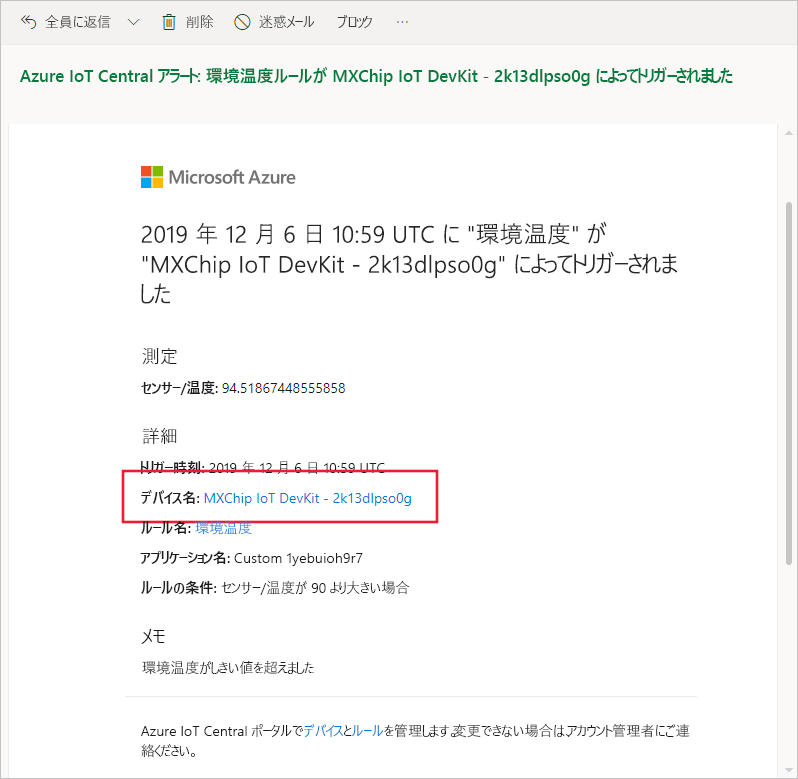
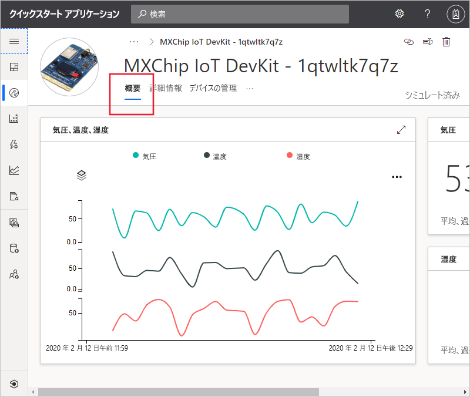
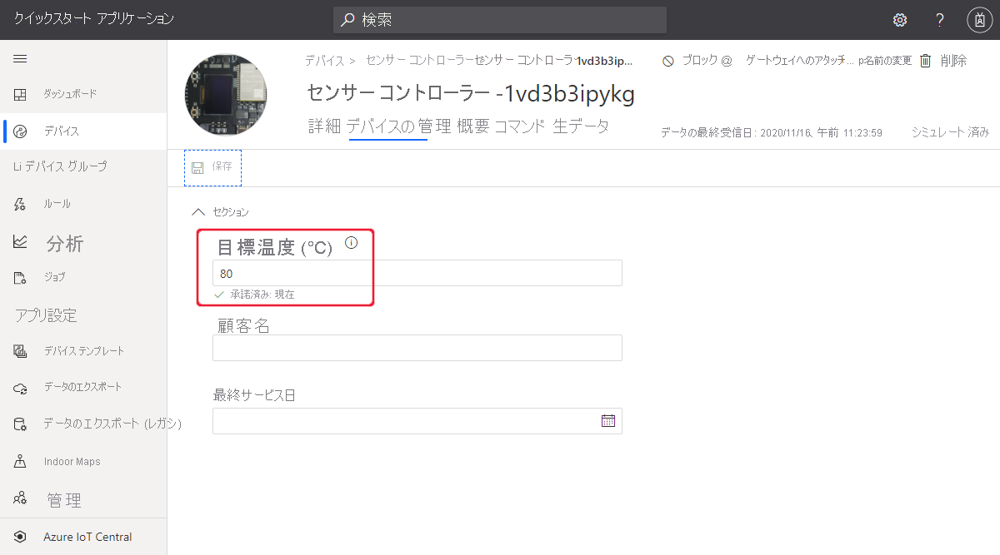

# クイック スタート:Azure IoT Central を使用してデバイスを監視する

*この記事は、オペレーター、ビルダー、および管理者に適用されます。*

このクイックスタートでは、オペレーター向けに Microsoft Azure IoT Central アプリケーションを使用して、デバイスを監視し、設定を変更する方法について説明します。

## 前提条件

作業を開始する前に、「[Azure IoT Central アプリケーションを作成する](./quick-deploy-iot-central.md)」、「[シミュレーションされたデバイスを IoT Central アプリケーションに追加する](./quick-create-simulated-device.md)」、「[デバイスのルールとアクションを構成する](quick-configure-rules.md)」の 3 つのクイックスタートを完了する必要があります。

## 通知の受信

Azure IoT Central では、デバイスに関する通知を電子メール メッセージとして送信します。 ビルダーは、コネクテッド デバイス センサーの温度がしきい値を超えたときに通知を送信する規則を追加しました。 作成者が通知の受信用に選択したアカウントに送信された電子メールを確認してください。

「[デバイスのルールとアクションを構成する](quick-configure-rules.md)」クイックスタートの最後で受信した電子メール メッセージを開きます。 メール内のデバイスへのリンクを選択します。

前のクイックスタートで作成したシミュレートされたデバイスの **[概要]** ページがブラウザーで開きます。

## 問題の調査

オペレーターは、 **[概要]** 、 **[詳細]** 、および **[コマンド]** の各ページでデバイスに関する情報を確認できます。 ビルダーは、オペレーターがデバイス情報を編集したりデバイス プロパティを設定したりできるように、 **[デバイスの管理]** ビューを作成しました。

ダッシュボードのグラフには、デバイスの温度のプロットが表示されます。 デバイスの温度が高すぎると判断したとしましょう。

## 問題の修復

デバイスに変更を加えるには、 **[デバイスの管理]** ページを使用します。

デバイスを冷却するために、 **[ファン速度]** を 500 に変更します。 **[保存]** を選択してデバイスを更新します。 デバイスで設定の変更が確認されると、プロパティの状態が **[同期済み]** に変わります。

## 次のステップ

このクイック スタートでは、次の方法について説明しました。

* 通知の受信
* 問題の調査
* 問題の修復

ここでは、デバイスを監視する方法について説明しました。推奨される次の手順は次のとおりです。

> [!div class="nextstepaction"]
> [デバイス テンプレートの構築および管理](howto-set-up-template.md)。
