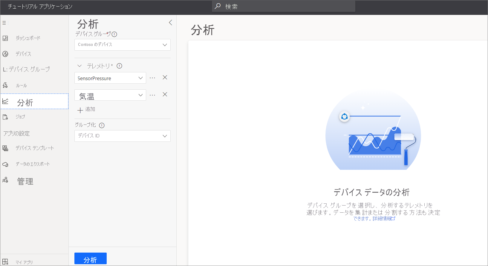

# チュートリアル:デバイス グループを使用してデバイス テレメトリを分析する

この記事では、オペレーターとしてデバイス グループを使用して Azure IoT Central アプリケーションでデバイス テレメトリを分析する方法について説明します。

デバイス グループは、指定されたいくつかの条件に一致しているためにグループ化されたデバイスの一覧です。 デバイス グループは、デバイスをより小さい論理グループにグループ化することで、デバイスを大規模に管理、視覚化、および分析するのに役立ちます。 たとえば、シアトルのすべてのエアコン デバイス グループの一覧を作成して、技術者が自分の担当するデバイスを検索できるようにできます。

このチュートリアルでは、以下の内容を学習します。

> [!div class="checklist"]
> * デバイス グループを作成する
> * デバイス グループを使用してデバイス テレメトリを分析する

## 前提条件

作業を開始する前に、「[Azure IoT Central アプリケーションを作成する](./quick-deploy-iot-central.md)」と「[シミュレートされたデバイスを IoT Central アプリケーションに追加する](./quick-create-pnp-device.md)」のクイックスタートを完了して、作業に使用する**環境センサー** デバイス テンプレートを作成する必要があります。

## シミュレートされたデバイスを作成する

デバイス グループを作成する前に、このチュートリアルで使用する**環境センサー** デバイス テンプレートから、少なくとも 5 つのシミュレートされたデバイスを追加します。

4 つの環境センサー デバイスについては、 **[Environmental Sensor properties]\(環境センサーのプロパティ\)** ビューを使用して、顧客名を **Contoso** に設定します。

## デバイス グループを作成する

デバイス グループを作成するには、次の手順を実行します。

1. 左側のウィンドウで **[Device Groups]\(デバイス グループ\)** を選択します。

1. **[+新規]** を選択します。

    

1. デバイス グループに "**Contoso デバイス**" のような名前を付けます。 説明を追加することもできます。 デバイス グループに含めることができるのは、1 つのデバイス テンプレートのデバイスだけです。 このグループに使用する**環境センサー** デバイス テンプレートを選択します。

1. **[Customer Name]\(顧客名\)** プロパティを選択し、 **[Equals]\(次の値と等しい\)** 比較演算子、および値として **[Contoso]** を選択して、デバイス グループの **Contoso** に属するデバイスを識別するためのクエリを作成します。 デバイス グループに配置する**すべての**条件を満たす複数のクエリとデバイスを追加できます。 作成したデバイス グループには、アプリケーションにアクセスできるすべてのユーザーがアクセスできるため、だれでもデバイス グループを表示、変更、または削除できます。

    

    > [!NOTE]
    > デバイス グループは動的なクエリです。 デバイスの一覧を表示するたびに、一覧内のデバイスが異なることがあります。 一覧は、現在クエリの条件を満たしているデバイスによって異なります。

1. **[保存]** を選択します。

> [!NOTE]
> Azure IoT Edge デバイスの場合、Azure IoT Edge テンプレートを選択してデバイス グループを作成します。

## Analytics

**Analytics** をデバイス グループと共に使用して、グループ内のデバイスからのテレメトリを分析することができます。 たとえば、すべての Contoso 環境センサーによってレポートされた平均温度をプロットできます。

デバイス グループのテレメトリを分析するには、次のようにします。

1. 左側のウィンドウで **[Analytics]** を選択します。

1. 作成した **[Contoso デバイス]** デバイス グループを選択します。 次に、 **[温度]** と **[湿度]** 両方のテレメトリの種類を追加します。

    

    テレメトリの種類の横にある歯車アイコンを使用して、集計の種類を選択します。 既定値は、 **[平均]** です。 **[分割基準]** を使用して、集計データの表示方法を変更します。 たとえば、デバイス ID で分割する場合、 **[分析]** を選択するとデバイスごとにプロットが表示されます。

1. 平均テレメトリ値を表示するには、 **[分析]** を選択します。

    

    ビューをカスタマイズしたり、表示される期間を変更したり、データをエクスポートしたりすることができます。

## 次のステップ

ここでは、Azure IoT Central アプリケーションでデバイス グループを使用する方法について説明しました。推奨される次の手順は以下のとおりです。

> [!div class="nextstepaction"]
> [テレメトリのルールを作成する方法](tutorial-create-telemetry-rules.md)
