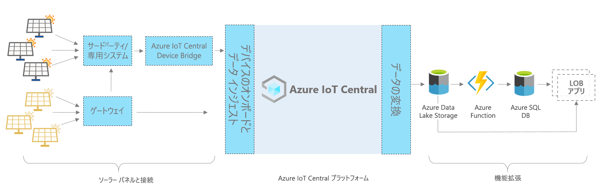

# Azure IoT Central - ソーラー パネル アプリのアーキテクチャ

この記事では、ソーラー パネル監視アプリ テンプレートのアーキテクチャの概要について説明します。 次の図は、IoT Central プラットフォームを使用した Azure 上のソーラー パネル アプリに一般的に使用されるアーキテクチャを示しています。

> [!div class="mx-imgBorder"]
> 

このアーキテクチャは、次のコンポーネントで構成されます。 アプリケーションの中には、以下に一覧表示するすべてのコンポーネントを必要としないものもあります。

## ソーラー パネルと接続 

ソーラー パネルは、再生可能エネルギーの重要なソースの 1 つです。 ソーラー パネルの種類と設定に応じて、ゲートウェイまたは他の中間デバイスや独自のシステムを使用して接続できます。 直接接続できないデバイスを接続するように IoT Central デバイス ブリッジを構築する必要がある場合があります。 IoT Central デバイス ブリッジはオープン ソース ソリューションであり、詳細については[こちら](https://docs.microsoft.com/azure/iot-central/core/howto-build-iotc-device-bridge)で確認できます。 

## IoT Central プラットフォーム
Azure IoT Central は、IoT ソリューションの構築を簡素化し、IoT の管理、運用、開発の負担とコストを削減するために役立つプラットフォームです。 IoT Central を使用すると、大規模なモノのインターネット (IoT) アセットを簡単に接続、監視、管理できます。 ソーラー パネルを IoT Central に接続すると、アプリ テンプレートにはデバイス モデル、コマンド、ダッシュボードなどの組み込みの機能が使用されます。 また、アプリ テンプレートには、ほぼリアルタイムのメーター データの監視、分析、ルール、視覚化など、ウォーム パス シナリオにも IoT Central ストレージが使用されます。

## IoT Central を使用して構築する拡張オプション
IoT Central プラットフォームには、次の 2 つの拡張オプションがあります。継続的データ エクスポート (CDE) と API。 顧客とパートナーは、特定のニーズに合わせてこれらのオプションのいずれかを選択し、ソリューションをカスタマイズすることができます。 たとえば、あるパートナーは Azure Data Lake Storage (ADLS) を使用して CDE を構成しました。 バッチ処理、監査、報告などの目的で、長期的なデータ保持やその他のコールド パス ストレージ シナリオに ADLS が使用されています。 

## 次のステップ

* アーキテクチャについて学習したので、次は[ソーラー パネル アプリを無料で作成](https://apps.azureiotcentral.com/build/new/solar-panel-monitoring)します。
* IoT Central の詳細については、[IoT Central の概要](https://docs.microsoft.com/azure/iot-central/)に関する記事を参照してください