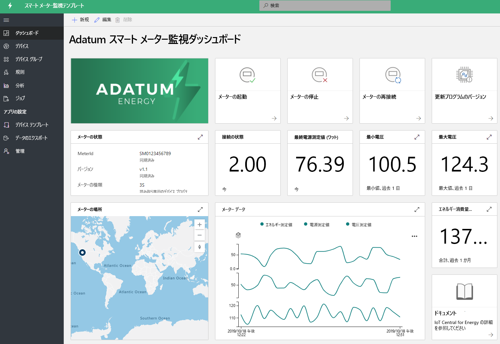
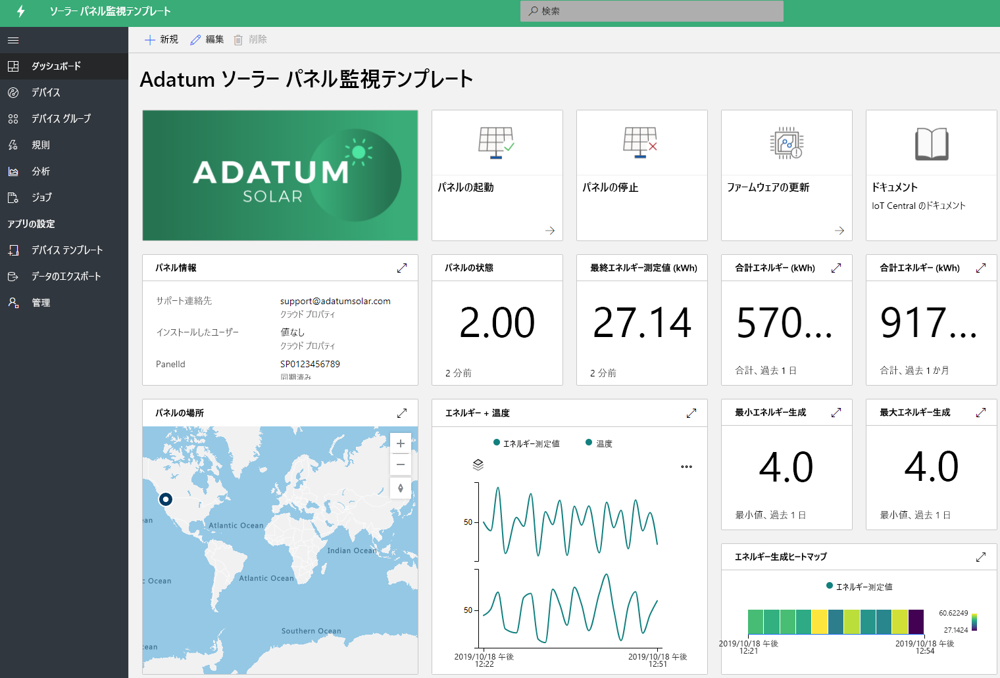

# IoT Central を使用してエネルギー ソリューションを構築する 

[!INCLUDE [iot-central-pnp-original](../../../includes/iot-central-pnp-original-note.md)]

スマート メーターとソーラー パネルは、エネルギー業界の変革において重要な役割を果たしています。 スマート メーターを使うと、エネルギー消費を細かく制御し、リアルタイムの分析情報を得ることができます。また、ソーラー パネルの増加が再生可能エネルギー生成の飛躍的な進歩を促進しています。 スマート メーターおよびソーラー パネル監視アプリは、さまざまな機能を紹介するサンプル テンプレートです。 パートナーは、これらのテンプレートを活用して、特定のニーズに応じて IoT Central を使ったエネルギー ソリューションを構築できます。 新しいコーディングは不要であり、これらのアプリケーションをデプロイして使用するための追加コストは必要ありません。 エネルギー アプリケーション テンプレートとその機能について説明します。

## スマート メーター監視アプリケーションとは
 スマート メーターを使うと、自動請求だけでなく、リアルタイムの測定値や双方向通信などの高度な測定のユース ケースも実現できます。 公共事業体とパートナーは、スマート メーターアプリ テンプレートを使ってスマート メーターの状態とデータを監視し、アラームと通知を定義できます。 切断メーターや更新ソフトウェアなどのサンプル コマンドが用意されています。 メーター データは、他のビジネス アプリケーションに送信するように設定したり、カスタム ソリューションを開発したりすることができます。 

アプリの主な機能: 

* メーター サンプル デバイス モデル 
* メーター情報とライブ状態 
* エネルギー、電力、電圧などのメーターの測定値
* メーター コマンドのサンプル 
* 組み込みの視覚化とダッシュボード
* カスタム ソリューション開発のための拡張機能

Azure サブスクリプションやコミットメントなしで、[無料でスマート メーター監視アプリを](https://apps.azureiotcentral.com/build/new/smart-meter-monitoring)試用できます。

アプリをデプロイすると、次の図に示すように、シミュレートされたメーター データがダッシュボードに表示されます。 このテンプレートは、特定のユース ケースに合わせて簡単に拡張およびカスタマイズできるサンプル アプリです。

> [!div class="mx-imgBorder"]
> 

## ソーラー パネル監視アプリケーションとは
公共事業体とパートナーは、ソーラー パネル監視アプリを使って、エネルギー生成や接続状態など、ソーラー パネルをほぼリアルタイムで監視できます。 定義したしきい値条件に基づいて通知を送信できます。 ファームウェアの更新やその他のプロパティなどのサンプル コマンドが用意されています。 ソーラー パネル データは、他のビジネス アプリケーションに送信するように設定したり、カスタム ソリューションを開発したりすることができます。 

アプリの主な機能: 

* ソーラー パネルのサンプル デバイス モデル 
* ソーラー パネルの情報とライブ状態
* 太陽エネルギーの生成とその他の測定値
* コマンドとコントロールのサンプル
* 組み込みの視覚化とダッシュボード
* カスタム ソリューション開発のための拡張機能

Azure サブスクリプションやコミットメントなしで、[無料でソーラー パネル監視アプリを](https://apps.azureiotcentral.com/build/new/solar-panel-monitoring)試用できます。

アプリをデプロイすると、次のダッシュボードに示すように、シミュレートされたソーラー パネル データが 1、2 分以内に表示されます。 このテンプレートは、特定のユース ケースに合わせて簡単に拡張およびカスタマイズできるサンプル アプリです。 

> [!div class="mx-imgBorder"]
> 

## 次の手順
エネルギー ソリューションの構築を始めるには:
* アプリケーション テンプレートを無料で作成する: [スマート メーター アプリ](https://apps.azureiotcentral.com/build/new/smart-meter-monitoring)、[ソーラー パネル アプリ](https://apps.azureiotcentral.com/build/new/solar-panel-monitoring)
* [スマート メーター監視アプリの概念](https://docs.microsoft.com/azure/iot-central/energy/concept-iot-central-smart-meter-app)を確認します
* [ソーラー パネル監視アプリの概念](https://docs.microsoft.com/azure/iot-central/energy/concept-iot-central-solar-panel-app)を確認します
* [IoT Central プラットフォーム](https://docs.microsoft.com/azure/iot-central/)を確認します
