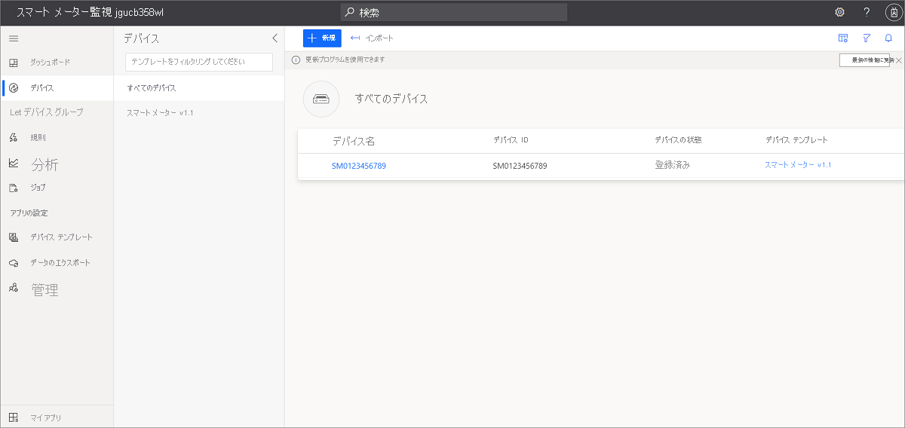
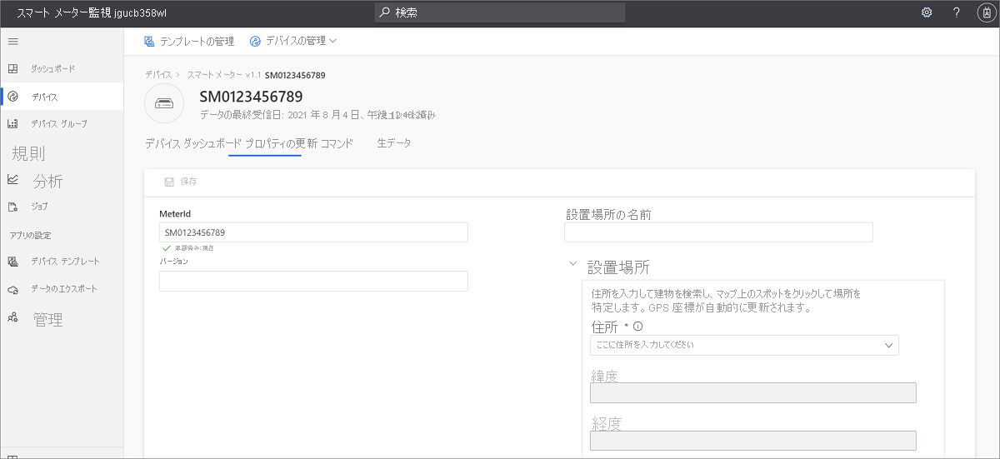
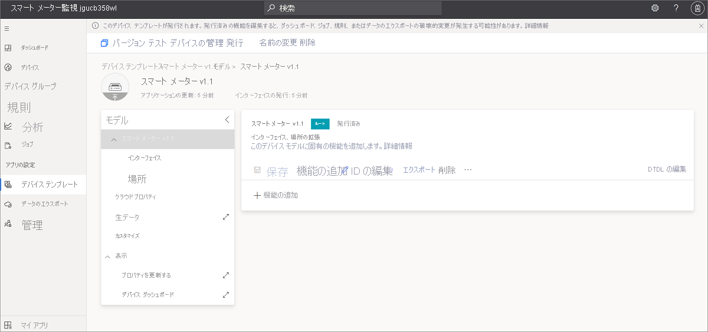
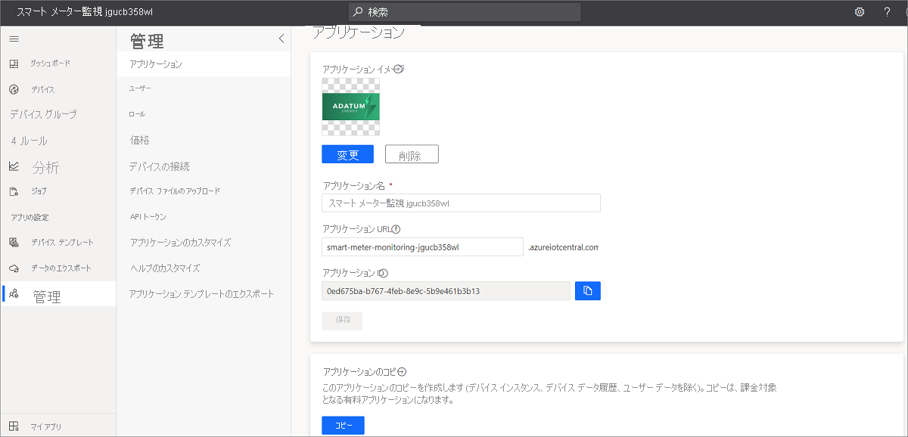

# チュートリアル:スマート メーター監視アプリ テンプレートを作成して操作する 

このチュートリアルでは、スマート メーター監視アプリケーションの作成プロセスについて説明します。これには、シミュレートされたデータを含むサンプル デバイス モデルが含まれます。 このチュートリアルでは、次のことについて説明します。

> [!div class="checklist"]
> * スマート メーター アプリを無料で作成する
> * アプリケーションのチュートリアル
> * リソースをクリーンアップする

サブスクリプションをお持ちでない場合は、[無料試用版アカウントを作成](https://azure.microsoft.com/free)します

## 前提条件
- なし
- Azure サブスクリプションをお勧めしますが、試すことは必須ではありません。

## スマート メーター監視アプリを作成する 

このアプリケーションは、次の 3 つの簡単な手順で作成できます。

1. [Azure IoT Central のホーム ページ](https://apps.azureiotcentral.com)を開き、 **[ビルド]** をクリックして新しいアプリケーションを作成します。 

2. **[エネルギー]** タブを選択し、 **[Smart meter monitoring]\(スマート メーター監視\)** アプリケーション タイルの下にある **[アプリの作成]** をクリックします。

    > [!div class="mx-imgBorder"]
    > 
    

3. **[アプリの作成]** を選択すると、 **[新しいアプリケーション]** フォームが開きます。 次の図に示すように、必要な詳細を入力します。
    * **アプリケーション名**:IoT Central アプリケーションの名前を選択します。 
    * **URL**: IoT Central URL を選択すると、プラットフォームによってその一意性が検証されます。
    * **7 日間の無料試用版**:Azure サブスクリプションが既にある場合は、既定の設定をお勧めします。 Azure サブスクリプションをお持ちでない場合は、無料試用版から始めてください。
    * **課金情報**:アプリケーション自体は無料です。 アプリのリソースをプロビジョニングするには、ディレクトリ、Azure サブスクリプション、リージョンの詳細が必要です。
    * ページの下部にある **[作成]** ボタンをクリックすると、アプリが 1 分ほどで作成されます。

        ![[新しいアプリケーション] フォーム](media/tutorial-iot-central-smart-meter/smart-meter-create-new-app.png)

        ![[新しいアプリケーション] フォームの課金情報](media/tutorial-iot-central-smart-meter/smart-meter-create-new-app-billinginfo.png)

### アプリケーションとシミュレートされたデータを検証する

新しく作成されたスマート メーター アプリは自分のアプリなので、いつでも変更できます。 変更する前に、アプリがデプロイされ、期待どおりに動作することを確認しましょう。

アプリの作成とデータのシミュレーションを確認するには、 **[ダッシュボード]** にアクセスします。 いくつかのデータを含むタイルが表示される場合、アプリのデプロイは成功しています。 データのシミュレーションには、データの生成に数分かかる場合があるため、1 から 2 分待ちます。 

## アプリケーションのチュートリアル
正常にデプロイされたアプリ テンプレートには、サンプルのスマート メーター デバイス、デバイス モデル、およびダッシュボードが付属しています。 

Adatum は、スマート メーターを監視および管理する架空のエネルギー会社です。 スマート メーター監視ダッシュボードには、スマート メーターのプロパティ、データ、サンプル コマンドが表示されます。 これにより、オペレーターおよびサポート チームは、サポート インシデントに備えて、事前に次のアクティビティを実行できます。 
* マップ上の最新のメーター情報とその設置場所を確認する
* メーター ネットワークと接続の状態を事前に確認する 
* ネットワークの正常性の最小および最大の電圧の測定値を監視する 
* エネルギー、電力、および電圧の傾向を確認して、異常なパターンを把握する 
* 計画と課金のためのエネルギー総消費量を追跡する
* 再接続メーターやファームウェア バージョンの更新などのコマンドと制御操作。 テンプレートでは、コマンド ボタンには使用可能な機能が表示され、実際のコマンドは送信されません。 

> [!div class="mx-imgBorder"]
> 

### デバイス
アプリには、サンプルのスマート メーター デバイスが付属しています。 デバイスの詳細を確認するには、 **[デバイス]** タブをクリックします。

> [!div class="mx-imgBorder"]
> 

サンプル デバイス **SM0123456789** リンクをクリックすると、デバイスの詳細が表示されます。 **[プロパティの更新]** ページ上でデバイスの書き込み可能なプロパティを更新し、ダッシュボードで更新された値を視覚化できます。

> [!div class="mx-imgBorder"]
> 

### デバイス テンプレート
**[デバイス テンプレート]** タブをクリックして、スマート メーター デバイス モデルを表示します。 モデルには、データ、プロパティ、コマンド、およびビューの事前定義インターフェイスがあります。

> [!div class="mx-imgBorder"]
> 

## リソースをクリーンアップする
このアプリケーションの引き続き使用しない場合は、次の手順でアプリケーションを削除します。

1. 左側のペインで、[管理] タブを開きます。
2. [アプリケーションの設定] を選択し、ページの下部にある [削除] ボタンをクリックします。 

    > [!div class="mx-imgBorder"]
    > 

## 次のステップ
* スマート メーター アプリのアーキテクチャの詳細については[概念](https://docs.microsoft.com/azure/iot-central/energy/concept-iot-central-smart-meter-app)に関する記事を参照してください。
* スマート メーター アプリケーション テンプレートを無料で作成する: [スマート メーター アプリ](https://apps.azureiotcentral.com/build/new/smart-meter-monitoring)
* IoT Central の詳細について、[IoT Central の概要](https://docs.microsoft.com/azure/iot-central/)を参照する
