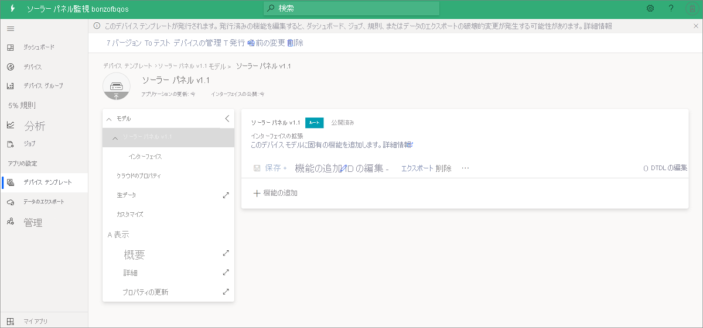

# チュートリアル:ソーラー パネル監視アプリ テンプレートの作成と確認 

このチュートリアルでは、ソーラー パネル監視アプリケーションの作成プロセスについて説明します。これには、シミュレートされたデータを含むサンプル デバイス モデルが含まれます。 このチュートリアルでは、次の方法について説明します。

> [!div class="checklist"]
> * ソーラー パネル アプリを無料で作成する
> * アプリケーションを調べる
> * リソースをクリーンアップする

サブスクリプションをお持ちでない場合は、[無料試用版アカウントを作成](https://azure.microsoft.com/free)します。

## 前提条件

このチュートリアルを完了するのに前提条件はありません。 Azure のサブスクリプションはお勧めしますが、必須ではありません。

## ソーラー パネル監視アプリを作成する 

このアプリケーションは、次の 3 つの簡単な手順で作成できます。

1. [Azure IoT Central](https://apps.azureiotcentral.com) に移動します。 新しいアプリケーションを作成するために、 **[ビルド]** を選択します。 

1. **[エネルギー]** タブを選択します。 **[ソーラー パネルの監視]** の **[アプリの作成]** を選択します。 

    > [!div class="mx-imgBorder"]
    > ![Azure IoT Central の [ビルド] オプションのスクリーンショット。](media/tutorial-iot-central-solar-panel/solar-panel-build.png)
  
1. **[新しいアプリケーション]** ダイアログ ボックスに、求められた情報を入力し、 **[作成]** を選択します。
    * **アプリケーション名**:自分の Azure IoT Central アプリケーションの名前を選択します。 
    * **URL**: Azure IoT Central の URL を選択します。 その一意性がプラットフォームによって検証されます。
    * **価格プラン**: Azure サブスクリプションが既にある場合は、既定の設定をお勧めします。 Azure サブスクリプションをお持ちでない場合は、無料試用版から始めてください。
    * **課金情報**: アプリケーション自体は無料です。 アプリのリソースをプロビジョニングするには、ディレクトリ、Azure サブスクリプション、リージョンの詳細が必要です。
        
        
        

### アプリケーションとシミュレートされたデータを検証する

新しいソーラー パネル アプリには、いつでも変更を加えることができます。 変更する前に、アプリがデプロイされ、期待どおりに動作することを確認しておきましょう。

アプリの作成とデータのシミュレーションを確認するには、 **[ダッシュボード]** にアクセスします。 いくつかのデータを含むタイルが表示される場合、アプリのデプロイは成功しています。 データのシミュレーションには、データの生成に数分かかる場合があります。 

## アプリケーションのチュートリアル
アプリ テンプレートのデプロイに成功したら、アプリについてもう少し詳しく調べてみましょう。 サンプルのスマート メーター デバイス、デバイス モデル、ダッシュボードが付属していることに注目してください。

Adatum は、ソーラー パネルを監視および管理する架空のエネルギー会社です。 ソーラー パネル監視ダッシュボードには、ソーラー パネルのプロパティ、データ、およびサンプル コマンドが表示されます。 このダッシュボードでは、お客様またはそのサポート チームが次のアクティビティを行って、問題に追加のサポートが必要となる前にプロアクティブに対応できます。
* マップ上の最新のパネル情報とその設置場所を確認する。
* パネルの状態と接続の状態を確認する。
* エネルギー生成と温度の傾向を確認して異常なパターンをキャッチする。
* 計画と課金のためにエネルギー生成の合計を追跡する。
* パネルをアクティブにして、ファームウェア バージョンを更新する (必要な場合)。 テンプレートのコマンド ボタンは使用可能な機能を表示するだけで、実際のコマンドは送信されません。

> [!div class="mx-imgBorder"]
> 

### デバイス
このアプリには、サンプルのソーラー パネル デバイスが付属しています。 デバイスの詳細を表示するには、 **[デバイス]** を選択します。

> [!div class="mx-imgBorder"]
> ![ソーラー パネルの監視テンプレートの [デバイス] のスクリーンショット。](media/tutorial-iot-central-solar-panel/solar-panel-device.png)

サンプル デバイス (**SP0123456789**) を選択します。 **[プロパティの更新]** タブからデバイスの書き込み可能なプロパティを更新し、更新した値をダッシュボードで視覚的に確認できます。 

> [!div class="mx-imgBorder"]
> ![ソーラー パネルの監視テンプレートの [プロパティの更新] タブのスクリーンショット。](media/tutorial-iot-central-solar-panel/solar-panel-device-properties.png)

### デバイス テンプレート
ソーラー パネルのデバイス モデルを確認するには、 **[デバイス テンプレート]** タブを選択します。モデルには、データ、プロパティ、コマンド、およびビューの事前定義インターフェイスがあります。

> [!div class="mx-imgBorder"]
> 

## リソースをクリーンアップする
今後このアプリケーションを使用しない場合は、次の手順でアプリケーションを削除します。

1. 左ペインから **[管理]** を選択します。
1. **[アプリケーションの設定]**  >  **[削除]** の順に選択します。 

    > [!div class="mx-imgBorder"]
    > ![ソーラー パネルの監視テンプレートの [管理] のスクリーンショット。](media/tutorial-iot-central-solar-panel/solar-panel-delete-app.png)

## 次のステップ
 
> [!div class="nextstepaction"]
> [Azure IoT Central - ソーラー パネル アプリのアーキテクチャ](./concept-iot-central-solar-panel-app.md)

