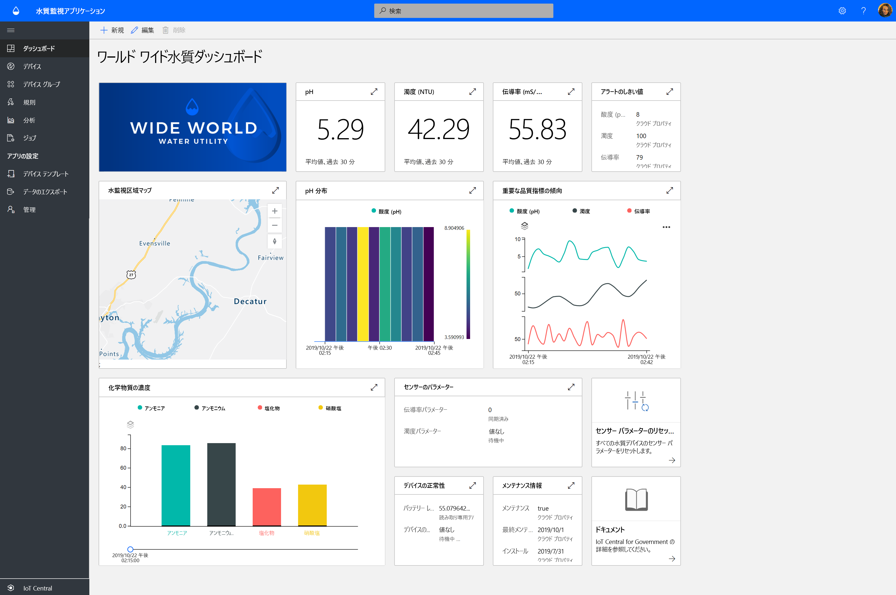
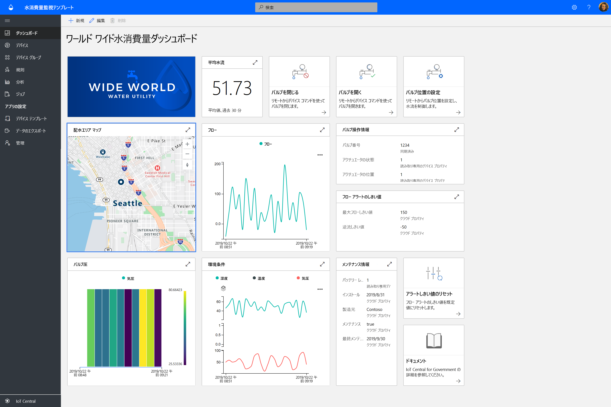
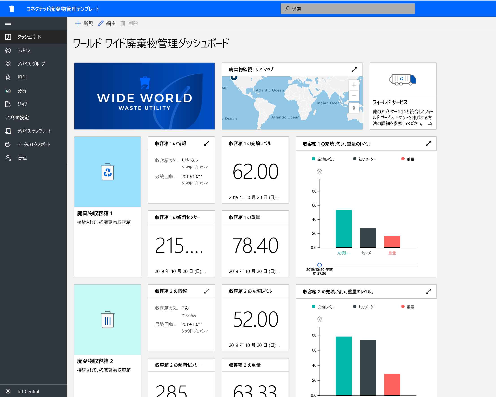

# Azure IoT Central を使用した政府機関ソリューションの構築

Azure IoT Central アプリケーション テンプレートを使用してスマート シティ ソリューションを構築します。 まず、**水質のモニタリング**、**水消費量のモニタリング**、**接続された廃棄物管理**を使用します。

## 水質のモニタリング アプリケーション テンプレートとは   

従来の水質のモニタリングは、時間とコストがかかる手作業のサンプリング手法と現場の実験分析に依存していました。 水質をリモートでリアルタイムにモニタリングすることで、市民に影響が及ぶ前に水質の問題を管理できます。 さらに、高度な分析により、水道施設や環境機関は水質に関する潜在的な問題が発生した際に早期に対処し、前もって水処理を計画することができます。  

水質のモニタリング　アプリは、IoT ソリューションの開発を始め、水道施設がスマート シティの水質をデジタルでモニタリングできるようにするための IoT Central アプリ テンプレートです。 

アプリ テンプレートには次が含まれます。
* オペレーター ダッシュボードのサンプル
* 水質のモニタリング デバイス テンプレートのサンプル
* シミュレートされた水質のモニタリング デバイス
* 事前構成済みの規則とジョブ
* ホワイト ラベルを使用したブランド化 

[水質のモニタリング アプリケーションのチュートリアル](./tutorial-water-quality-monitoring.md)をご覧ください。

## 水消費量のモニタリング アプリケーション テンプレートとは 

従来の水消費量のモニタリングでは、水道会社が水道メーターを手動で読み取っていました。 従来のメーターを高度なスマート メーターに置き換える都市が増えたことで、消費量をリモート監視し、バルブをリモート制御して水流を制御することができるようになりました。 水消費量のモニタリングと市民へのデジタル フィードバック メッセージを組み合わせることで、水の消費量削減について周知することができます。 

水消費のモニタリングアプリは、IoT ソリューションの開発を始め、水道施設がリモートで水流をのモニタリングおよび制御して水消費量を削減する IoT Central アプリ テンプレートです。 

  

水消費量のモニタリング アプリ テンプレートは、事前構成済みの以下の項目で構成されています。
* オペレーター ダッシュボードのサンプル
* 水質のモニタリング デバイス テンプレートのサンプル
* シミュレートされた水質のモニタリング デバイス
* 事前構成済みの規則とジョブ
* ホワイト ラベルを使用したブランド化 

 [水消費量のモニタリング アプリケーションのチュートリアル](./tutorial-water-consumption-monitoring.md)をご覧ください。

## 接続された廃棄物管理アプリケーション テンプレートとは 

接続された廃棄物管理アプリは、IoT ソリューションの開発を始め、スマート シティで排水収集の効率を最大化するようモニタリングすることができる IoT Central アプリ テンプレートです。 

 

接続された廃棄物管理アプリ テンプレートは、事前構成済みの以下の項目で構成されています。
* オペレーター ダッシュボードのサンプル
* 接続された廃棄物処理デバイス テンプレートのサンプル
* シミュレートされた接続された廃棄物処理デバイス
* 事前構成済みの規則とジョブ
* ホワイト ラベルを使用したブランド化 

[接続された廃棄物管理アプリケーションのチュートリアル](./tutorial-connected-waste-management.md)をご覧ください。

## 次のステップ

* IoT Central で政府アプリケーション テンプレートを無料でお試しください[アプリを作成する](https://apps.azureiotcentral.com/build/government)
* [水質のモニタリングの概念](./concepts-waterqualitymonitoring-architecture.md)について
* [水消費量のモニタリングの概念](./concepts-waterconsumptionmonitoring-architecture.md)について
* [接続された廃棄物管理の概念](./concepts-connectedwastemanagement-architecture.md)について  
* IoT Central の詳細については、[IoT Central の概要](https://docs.microsoft.com/azure/iot-central/core/overview-iot-central)を参照してください
 