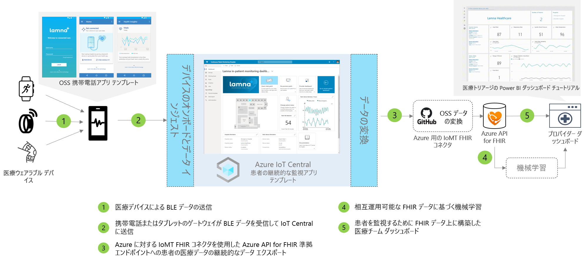

# 患者の継続的なモニタリングのアーキテクチャ

継続的な患者のモニタリング ソリューションを構築するには、提供されているアプリ テンプレートを使用し、以下に説明するアーキテクチャをガイダンスとして使用します。

>[!div class="mx-imgBorder"] 
>

1. Bluetooth Low Energy (BLE) を使用して通信する医療機器
1. 携帯電話ゲートウェイが BLE データを受信して IoT Central に送信
1. 患者の健康データを Azure API for FHIR&reg; に継続的にエクスポート
1. 相互運用可能なデータに基づく機械学習
1. FHIR データ上に構築した医療チーム ダッシュボード

## 詳細
このセクションでは、アーキテクチャ図の各部について詳しく説明します。

### BLE 医療機器
医療の IoT スペースで使用される多くの医療ウェアラブルは、Bluetooth Low Energy デバイスです。 クラウドと直接通信することができず、ゲートウェイを通過する必要があります。 このアーキテクチャでは、このゲートウェイとして携帯電話アプリケーションを使用することをお勧めします。

### 携帯電話ゲートウェイ
携帯電話アプリケーションの主な機能は、医療機器から BLE データを取り込み、それを Azure IoT Central に伝達することです。 さらに、アプリは、機器のセットアップとプロビジョニングのフローを通じて患者をガイドしたり、個人の健康データのビューを表示したりするのに役立ちます。 他のソリューションでは、病院の部屋にいる場合、同じ通信フローを実現するためにタブレット ゲートウェイまたは静的ゲートウェイを使用できます。

### Azure API for FHIR にエクスポートする&reg;
Azure IoT Central は HIPAA 準拠で、HITRUST&reg; 認定を受けていますが、患者の健康に関連するデータを Azure API for FHIR に送信することもできます。 [Azure API for FHIR](../../healthcare-apis/overview.md) は、医療上の健康データ向けのフル マネージドで標準ベースに準拠した API です。このデータを使用すると、健康データを使用した新しいエンゲージメント システムを作成できます。 これを使用すると、FHIR API を通して迅速にデータを交換できます。クラウド上でマネージドの サービスとしてのプラットフォーム (PaaS) オファリングによってサポートされます。 IoT Central の継続的なデータ エクスポート機能を使用すると、Azure API for FHIR にデータを送信できます。

### 機械学習
データを集計して FHIR 形式に変換した後は、機械学習モデルを構築して洞察を強化し、医療チームにとってより賢明な意思決定を可能にすることができます。 機械学習モデルの構築、トレーニング、デプロイには、さまざまな種類のサービスを使用できます。 Azure の機械学習サービスの使用方法の詳細については、[機械学習のドキュメント](../../machine-learning/index.yml)を参照してください。

### プロバイダー ダッシュボード
Azure API for FHIR にあるデータを使用して、患者の詳細情報ダッシュボードを作成したり、直接 EMR に統合して医療チームが患者の状態を視覚化するのをサポートしたりすることができます。 医療チームは、このダッシュボードを使用して、サポートが必要な患者の世話をしたり、早い段階で悪化の兆候を発見したりできます。 Power BI リアルタイム プロバイダー ダッシュボードを構築する方法については、[ハウツーガイド](howto-health-data-triage.md)を参照してください。

## 次のステップ
* [患者の継続的なモニタリング アプリケーション テンプレートのデプロイ方法の説明](tutorial-continuous-patient-monitoring.md)