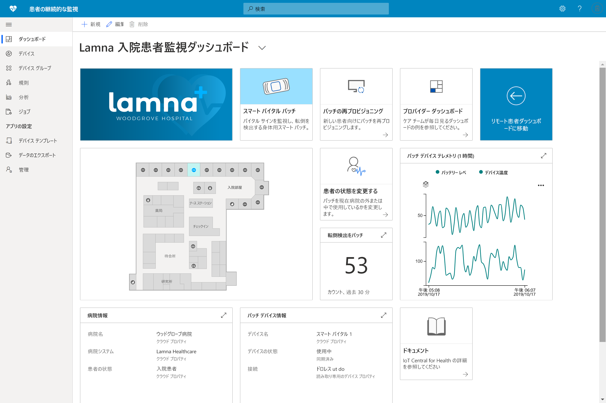

# Azure IoT Central を使用したヘルスケア ソリューションの構築 

Azure IoT Central でアプリケーション テンプレートを使用してヘルスケア ソリューションを構築する方法について説明します。

## 患者の継続的なモニタリング テンプレートとは

医療の IoT スペースでは、継続的な患者のモニタリングは、再入院のリスクを軽減し、慢性疾患をより効果的に管理し、患者の治療結果を改善するための重要なイネーブラー (可能にするもの) の 1 つです。 患者な継続的のモニタリングは、次の 2 つの主なカテゴリに分けることができます。

1. **入院患者のモニタリング**:医療チームは、医療ウェアラブルや病院内のその他のデバイスを使用して、患者の重要な兆候や症状をモニタリングできます。患者の状態を確認するため、1 日に複数回看護師を送る必要はありません。 医療チームは、通知によって患者に特別な注意が必要なときを知ることができるので、効率的に時間の優先順位付けを行うことができます。
1. **リモート患者モニタリング**:医療ウェアラブルと患者報告結果 (PRO) を使用して病院外の患者を監視すると、再入院のリスクを下げることができます。 慢性疾患患者やリハビリテーション患者のデータを収集し、患者が医療計画に従っていることや、患者が重篤な状態になる前に悪化の警告を医療チームに通知することを保証できます。

このアプリケーション テンプレートを使用すると、患者の継続的なモニタリングの両方のカテゴリのソリューションを構築できます。 次の利点があります。

* さまざまな種類の医療ウェアラブルを IoT Central インスタンスにシームレスに接続する。
* デバイスを監視および管理し、正常な状態を維持する。
* デバイス データに関連するカスタム ルールを作成し、適切なアラートをトリガーする。
* 患者の健康データを準拠データ ストアである Azure API for FHIR にエクスポートする。
* 集計された分析情報を、既存または新規のビジネス アプリケーションにエクスポートする。

>[!div class="mx-imgBorder"] 
>

## 次のステップ

患者の継続的なモニタリング ソリューションの構築を開始するには:

* [アプリケーション テンプレートをデプロイする](tutorial-continuous-patient-monitoring.md)
* [サンプル アーキテクチャを確認する](concept-continuous-patient-monitoring-architecture.md)