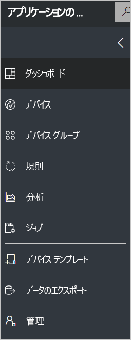
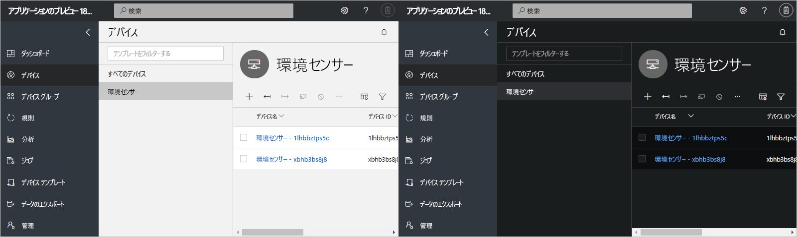
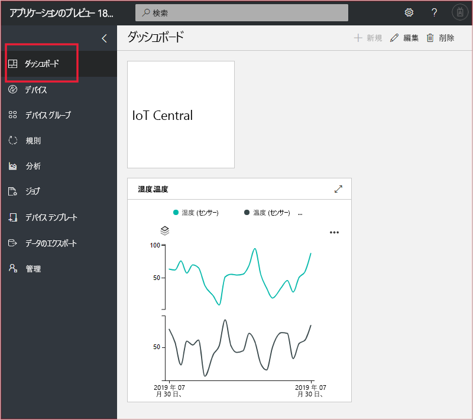

# Azure IoT Central の UI のツアーを見る (プレビュー機能)

[!INCLUDE [iot-central-pnp-original](../../includes/iot-central-pnp-original-note.md)]

この記事では、Microsoft Azure IoT Central の UI について取り上げます。 Azure IoT Central のソリューションとそこに接続されるデバイスは、UI を使用して作成、管理、使用することができます。

"_ビルダー_" は、Azure IoT Central の UI を使用して、Azure IoT Central ソリューションを定義します。 この UI を使用して次の作業を行うことができます。

* ソリューションに接続するデバイスの種類を定義します。
* デバイスのルールとアクションを構成します。
* ソリューションを使用する "_オペレーター_" 向けに UI をカスタマイズします。

"_オペレーター_" は、Azure IoT Central の UI を使用して、Azure IoT Central ソリューションを管理します。 この UI を使用して次の作業を行うことができます。

* デバイスを監視します。
* デバイスを構成します。
* デバイスの問題をトラブルシューティングして修復します。
* 新しいデバイスをプロビジョニングします。

## 左側のナビゲーション メニューの使用

アプリケーションのさまざまな領域には、左側のナビゲーション メニューを使用してアクセスします。 **<** または **>** を選択すると、ナビゲーション バーを展開したり、折りたたんだりできます。

| メニュー | 説明 |
| ---- | ----------- |
|  | <ul><li>**[ダッシュボード]** ページには、アプリケーション ダッシュボードが表示されます。 このダッシュボードは、オペレーター向けにビルダーがカスタマイズできます。 また、ユーザーが自分でダッシュボードを作成することもできます。</li><li>**[デバイス]** ページには、アプリケーションの各デバイス テンプレートに関連付けられている、シミュレートされたデバイスと実際のデバイスの一覧が表示されます。 接続されているデバイスは、オペレーターが **[デバイス]** を使用して管理できます。</li><li>**[デバイス グループ]** ページでは、デバイス グループを表示および作成できます。 デバイス グループは、クエリによって指定されたデバイスの論理上のコレクションとしてオペレーターが作成できます。</li><li>**[ルール]** ページでは、デバイスのテレメトリに基づいて実行され、カスタマイズ可能なアクションのトリガーとなるルールを編集できます。</li><li>デバイスおよびデバイス グループのデバイス テレメトリから得られた分析結果は、 **[分析]** ページに表示されます。 オペレーターは、デバイス データに基づくカスタム ビューを作成することで、アプリケーションから分析情報を取得することができます。</li><li>**[ジョブ]** ページを使用すると、デバイスを大規模に更新するジョブを作成して実行することで、デバイスを一括管理できます。</li><li>**[デバイス テンプレート]** ページには、デバイス テンプレートの作成と管理にビルダーで使用されるツールが表示されます。</li><li>**[データのエクスポート]** ページを使用すると、管理者はストレージやキューなどの他の Azure サービスへの連続エクスポートを構成できます。</li><li>管理者がアプリケーションの設定やユーザー、役割を管理するためのアプリケーション管理ページは、 **[管理]** ページに表示されます。</li></ul> |

## 検索、ヘルプ、サポート

すべてのページには、次のトップ メニューが表示されます。

* デバイス テンプレートやデバイスを検索するには、 **[検索]** に値を入力します。
* UI の言語またはテーマを変更するには、 **[設定]** アイコンを選択します。
* アプリケーションからサインアウトするには、 **[アカウント]** アイコンを選択します。
* ヘルプやサポートを利用するには、 **[ヘルプ]** ドロップダウンを選択するとリソースが一覧表示されます。 試用版アプリケーションでは、サポート リソースに[ライブ チャット](howto-show-hide-chat.md?toc=/azure/iot-central-pnp/toc.json&bc=/azure/iot-central-pnp/breadcrumb/toc.json)へのアクセスが含まれています。

UI 用に淡色テーマまたは濃色テーマを選ぶことができます。

> [!NOTE]
> 管理者がアプリケーションのカスタム テーマを構成している場合、淡色と濃色のテーマから選択するオプションは使用できません。

## ダッシュボード

* ダッシュボードは、Azure IoT Central アプリケーションにサインインしたときに最初に表示されるページです。 アプリケーション ダッシュボードは、ビルダーがタイルを追加することによって他のユーザー向けにカスタマイズできます。 詳細については、[デバイス テンプレートの設定](tutorial-define-device-type-pnp.md?toc=/azure/iot-central-pnp/toc.json&bc=/azure/iot-central-pnp/breadcrumb/toc.json)に関するチュートリアルをご覧ください。

* オペレーターは、個人用に設定したダッシュボードを作成し、それらと既定のダッシュボードを切り替えることができます。 詳細については、ハウツー記事「[個人用ダッシュボードの作成と管理](howto-personalize-dashboard.md?toc=/azure/iot-central-pnp/toc.json&bc=/azure/iot-central-pnp/breadcrumb/toc.json)」を参照してください。

## デバイス

![[デバイス] ページ](media/overview-iot-central-tour-pnp/explorer.png)

エクスプローラー ページには、お使いの Azure IoT Central アプリケーションの "_デバイス_" が "_デバイス テンプレート_" のグループごとに表示されます。

* アプリケーションに接続できるデバイスの種類は、デバイス テンプレートによって定義されます。 詳細については、「[Define a new device type in your Azure IoT Central application (Azure IoT Central アプリケーションに新しいデバイスの種類を定義する)](tutorial-define-device-type-pnp.md?toc=/azure/iot-central-pnp/toc.json&bc=/azure/iot-central-pnp/breadcrumb/toc.json)」を参照してください。
* デバイスとは、対象アプリケーションにおける実デバイスまたはシミュレートされたデバイスを表します。 詳細については、[Azure IoT Central アプリケーションへの新しいデバイスの追加](tutorial-add-device-pnp.md?toc=/azure/iot-central-pnp/toc.json&bc=/azure/iot-central-pnp/breadcrumb/toc.json)に関するページを参照してください。

## デバイス グループ

![[デバイス グループ] ページ](media/overview-iot-central-tour-pnp/devicesets.png)

_[デバイス グループ]_ ページには、ビルダーによって作成されたデバイス グループが表示されます。 デバイス グループは、関連するデバイスのコレクションです。 デバイス グループに含まれるデバイスは、ビルダーがクエリを定義することによって識別します。 デバイス グループは、対象アプリケーションにおける分析をカスタマイズするときに使用します。 詳細については、「[Azure IoT Central アプリケーションにおけるデバイス グループの使用](howto-use-device-groups-pnp.md?toc=/azure/iot-central-pnp/toc.json&bc=/azure/iot-central-pnp/breadcrumb/toc.json)」を参照してください。

## ルール

![[ルール] ページ](media/overview-iot-central-tour-pnp/rules.png)

[ルール] ページでは、テレメトリ、デバイスの状態、またはデバイスのイベントに基づいてルールを定義できます。 ルールが実行されると、オペレーターにメールを送信するなどのアクションをトリガーできます。 ビルダーでは、このページを使用してルールの作成および管理が行われます。 詳細については、「[Azure IoT Central でデバイスのルールとアクションを構成する](tutorial-configure-rules-pnp.md?toc=/azure/iot-central-pnp/toc.json&bc=/azure/iot-central-pnp/breadcrumb/toc.json)」チュートリアルを参照してください。

## Analytics

![[分析] ページ](media/overview-iot-central-tour-pnp/analytics.png)

[分析] ページには、対象アプリケーションに接続されているデバイスの動作をわかりやすく示したグラフが表示されます。 オペレーターは、このページを使用して、接続されているデバイスの問題を監視したり調査したりします。 このページに表示されるグラフは、ビルダーが定義できます。 詳細については、[Azure IoT Central アプリケーションに使用するカスタム分析の作成](howto-use-device-groups-pnp.md?toc=/azure/iot-central-pnp/toc.json&bc=/azure/iot-central-pnp/breadcrumb/toc.json)に関する記事を参照してください。

## [ジョブ]

![[ジョブ] ページ](media/overview-iot-central-tour-pnp/jobs.png)

[ジョブ] ページでは、自分のデバイスに対してデバイス管理操作を一括で実行できます。 ビルダーでは、デバイスのプロパティ、設定、およびコマンドの更新にこのページが使用されます。 詳細については、[ジョブの実行](howto-run-a-job.md?toc=/azure/iot-central-pnp/toc.json&bc=/azure/iot-central-pnp/breadcrumb/toc.json)に関するページを参照してください。

## デバイス テンプレート

![[デバイス テンプレート] ページ](media/overview-iot-central-tour-pnp/templates.png)

[デバイス テンプレート] ページでは、ビルダーがアプリケーションに含まれるデバイス テンプレートの作成と管理を行います。 デバイス テンプレートでは、次のようなデバイスの特性を指定します。

* テレメトリ、状態、イベントの測定値。
* プロパティ。
* コマンド。

ビルダーでは、オペレーターがデバイスの管理に使用するフォームとダッシュボードを作成することもできます。

詳細については、「[Define a new device type in your Azure IoT Central application (Azure IoT Central アプリケーションに新しいデバイスの種類を定義する)](tutorial-define-device-type-pnp.md?toc=/azure/iot-central-pnp/toc.json&bc=/azure/iot-central-pnp/breadcrumb/toc.json)」のチュートリアルを参照してください。

## データのエクスポート

![[データのエクスポート] ページ](media/overview-iot-central-tour-pnp/export.png)

[データのエクスポート] ページでは、管理者がテレメトリなどのデータをアプリケーションからストリーム配信する方法を定義します。 他のサービスで、エクスポートされたデータを格納したり、分析に使用したりできます。 詳しくは、「[Azure IoT Central でデータをエクスポートする](howto-export-data.md?toc=/azure/iot-central-pnp/toc.json&bc=/azure/iot-central-pnp/breadcrumb/toc.json)」をご覧ください。

## 管理

![[管理] ページ](media/overview-iot-central-tour-pnp/administration.png)

[管理] ページには、アプリケーションのユーザーや役割の定義や UI のカスタマイズなど、管理者が使うツールへのリンクが表示されます。 詳細については、[Azure IoT Central アプリケーションの管理](howto-administer-pnp.md?toc=/azure/iot-central-pnp/toc.json&bc=/azure/iot-central-pnp/breadcrumb/toc.json)に関するページを参照してください。

## 次の手順

これで Azure IoT Central の概要と UI のレイアウトに関する説明は終了です。推奨される次の手順として、「[Create an Azure IoT Central application (Azure IoT Central アプリケーションの作成)](quick-deploy-iot-central-pnp.md?toc=/azure/iot-central-pnp/toc.json&bc=/azure/iot-central-pnp/breadcrumb/toc.json)」クイック スタートに進みましょう。
