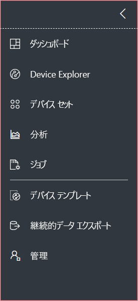
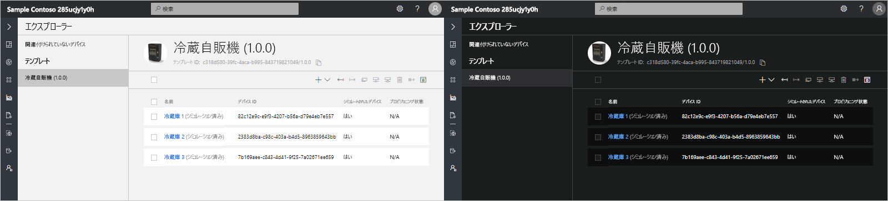
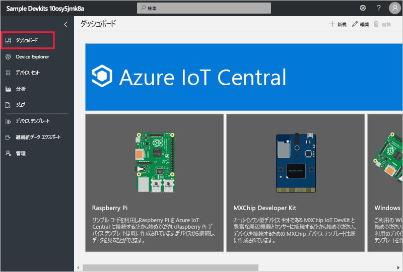

# ツアー: Azure IoT Central の UI

この記事では、Microsoft Azure IoT Central の UI について取り上げます。 Azure IoT Central のソリューションとそこに接続されるデバイスは、UI を使用して作成、管理、使用することができます。

"_ビルダー_" は、Azure IoT Central の UI を使用して、Azure IoT Central ソリューションを定義します。 この UI を使用して次の作業を行うことができます。

- ソリューションに接続するデバイスの種類を定義します。
- デバイスのルールとアクションを構成します。
- ソリューションを使用する "_オペレーター_" 向けに UI をカスタマイズします。

"_オペレーター_" は、Azure IoT Central の UI を使用して、Azure IoT Central ソリューションを管理します。 この UI を使用して次の作業を行うことができます。

- デバイスを監視します。
- デバイスを構成します。
- デバイスの問題をトラブルシューティングして修復します。
- 新しいデバイスをプロビジョニングします。

## 左側のナビゲーション メニューの使用

アプリケーションのさまざまな領域には、左側のナビゲーション メニューを使用してアクセスします。 **<** または **>** を選択すると、ナビゲーション バーを展開したり、折りたたんだりできます。

| メニュー | 説明 |
| ---- | ----------- |
|  | <ul><li>**[ダッシュボード]** ボタンを使用すると、アプリケーション ダッシュボードが表示されます。 このダッシュボードは、オペレーター向けにビルダーがカスタマイズできます。 また、ユーザーが自分でダッシュボードを作成することもできます。</li><li>**[Device Explorer]** ボタンでは、アプリケーションの各デバイス テンプレートに関連付けられているシミュレートされたデバイスと実際のデバイスの一覧が表示されます。 接続されているデバイスは、オペレーターが **Device Explorer** を使用して管理できます。</li><li>**[Device Sets]\(デバイス セット\)** ボタンを使用すると、デバイス セットを表示したり作成したりすることができます。 デバイス セットは、クエリによって指定されたデバイスの論理上のコレクションとしてオペレーターが作成できます。</li><li>デバイスやデバイス セットのデバイス テレメトリから得られた分析結果は、**[分析]** ボタンで表示します。 オペレーターは、デバイス データに基づくカスタム ビューを作成することで、アプリケーションから分析情報を取得することができます。</li><li>**[ジョブ]** ボタンを使用すると、大規模な更新を実行するジョブを作成し、実行することで、デバイスを一括管理できます。</li><li>**[デバイス テンプレート]** ボタンでは、デバイス テンプレートの作成と管理にビルダーで使用されるツールが表示されます。</li><li>**[継続的データ エクスポート]** ボタンを使用すると、管理者はストレージやキューなどの他の Azure サービスへの連続エクスポートを構成できます。</li><li>管理者がアプリケーションの設定やユーザー、役割を管理するためのアプリケーション管理ページは、**[管理]** ボタンで表示します。</li></ul> |

## 検索、ヘルプ、サポート

すべてのページには、次のトップ メニューが表示されます。

- デバイス テンプレートやデバイスを検索するには、**[検索]** に値を入力します。
- UI の言語またはテーマを変更するには、**[設定]** アイコンを選択します。
- アプリケーションからサインアウトするには、**[アカウント]** アイコンを選択します。
- ヘルプやサポートを利用するには、**[ヘルプ]** ドロップダウンを選択するとリソースが一覧表示されます。

UI 用に淡色テーマまたは濃色テーマを選ぶことができます。

## ダッシュボード

ダッシュボードは、Azure IoT Central アプリケーションにサインインしたときに最初に表示されるページです。 アプリケーション ダッシュボードは、ビルダーがタイルを追加することによって他のユーザー向けにカスタマイズできます。 詳細については、「[Customize the Azure IoT Central operator's view (Azure IoT Central オペレーター ビューのカスタマイズ)](tutorial-customize-operator.md)」のチュートリアルを参照してください。 また、ユーザーが[個人用ダッシュボードを自分で作成](howto-personalize-dashboard.md)することもできます。

## デバイス エクスプローラー

![[エクスプローラー] ページ](media/overview-iot-central-tour/explorer.png)

エクスプローラー ページには、お使いの Azure IoT Central アプリケーションの "_デバイス_" が "_デバイス テンプレート_" のグループごとに表示されます。

* アプリケーションに接続できるデバイスの種類は、デバイス テンプレートによって定義されます。 詳細については、「[Define a new device type in your Azure IoT Central application (Azure IoT Central アプリケーションに新しいデバイスの種類を定義する)](tutorial-define-device-type.md)」を参照してください。
* デバイスとは、対象アプリケーションにおける実デバイスまたはシミュレートされたデバイスを表します。 詳細については、[Azure IoT Central アプリケーションへの新しいデバイスの追加](tutorial-add-device.md)に関するページを参照してください。

## デバイス セット

![[Device Sets]\(デバイス セット\) ページ](media/overview-iot-central-tour/devicesets.png)

_[device sets]\(デバイス セット\)_ ページには、ビルダーによって作成されたデバイス セットが表示されます。 デバイス セットは、関連するデバイスのコレクションです。 デバイス セットに含まれるデバイスは、ビルダーがクエリを定義することによって識別します。 デバイス セットは、対象アプリケーションにおける分析をカスタマイズするときに使用します。 詳細については、「[Use device sets in your Azure IoT Central application (Azure IoT Central アプリケーションにおけるデバイス セットの使用)](howto-use-device-sets.md)」を参照してください。

## Analytics

![[分析] ページ](media/overview-iot-central-tour/analytics.png)

[分析] ページには、対象アプリケーションに接続されているデバイスの動作をわかりやすく示したグラフが表示されます。 オペレーターは、このページを使用して、接続されているデバイスの問題を監視したり調査したりします。 このページに表示されるグラフは、ビルダーが定義できます。 詳細については、[Azure IoT Central アプリケーションに使用するカスタム分析の作成](howto-use-device-sets.md)に関する記事を参照してください。

## [ジョブ]

![[ジョブ] ページ](media/overview-iot-central-tour/jobs.png)

[ジョブ] ページでは、デバイスに対して一括のデバイス管理操作を実行できます。 ビルダーでは、デバイスのプロパティ、設定、およびコマンドの更新にこのページが使用されます。 詳細については、[ジョブの実行](howto-run-a-job.md)に関するページを参照してください。

## デバイス テンプレート

![[デバイス テンプレート] ページ](media/overview-iot-central-tour/templates.png)

[デバイス テンプレート] ページでは、ビルダーがアプリケーションに含まれるデバイス テンプレートの作成と管理を行います。 詳細については、「[Define a new device type in your Azure IoT Central application (Azure IoT Central アプリケーションに新しいデバイスの種類を定義する)](tutorial-define-device-type.md)」のチュートリアルを参照してください。

## 継続的データ エクスポート

![[継続的データ エクスポート] ページ](media/overview-iot-central-tour/export.png)

[継続的データ エクスポート] ページでは、管理者がテレメトリなどのデータをアプリケーションからエクスポートする方法を定義します。 他のサービスで、エクスポートされたデータを格納したり、分析に使用したりできます。 詳しくは、「[Azure IoT Central でデータをエクスポートする](howto-export-data.md)」をご覧ください。

## 管理

![[管理] ページ](media/overview-iot-central-tour/administration.png)

[Administration]\(管理\) ページには、アプリケーションのユーザーや役割を定義するためのツールなど、管理者が使うツールへのリンクが表示されます。 詳細については、[Azure IoT Central アプリケーションの管理](howto-administer.md)に関するページを参照してください。

## 次の手順

これで Azure IoT Central の概要と UI のレイアウトに関する説明は終了です。推奨される次の手順として、「[Create an Azure IoT Central application (Azure IoT Central アプリケーションの作成)](quick-deploy-iot-central.md)」クイック スタートに進みましょう。