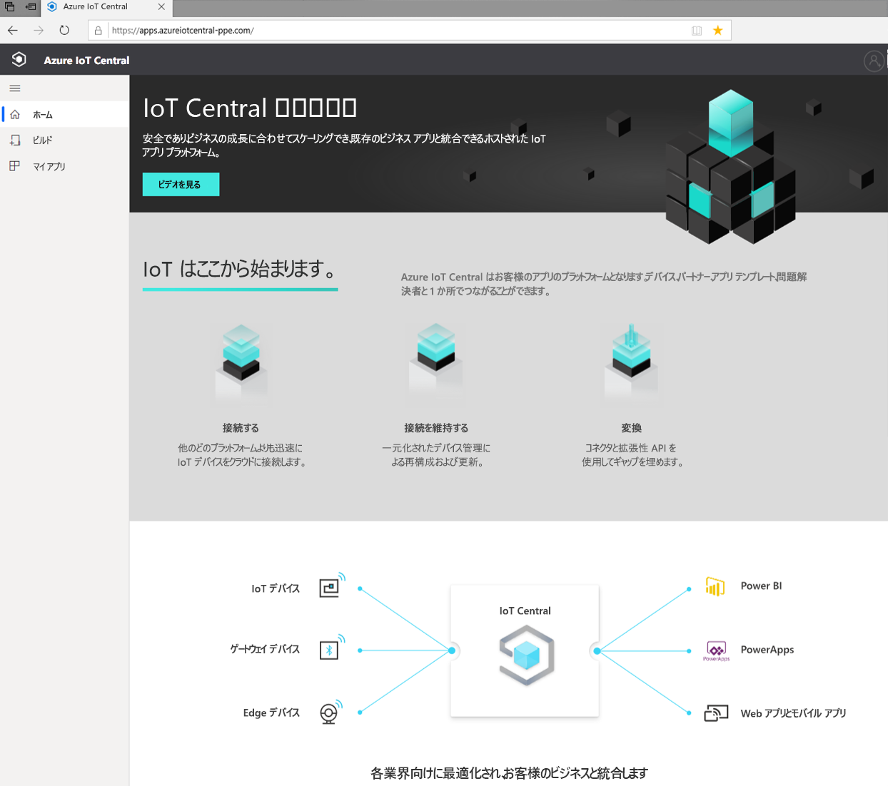
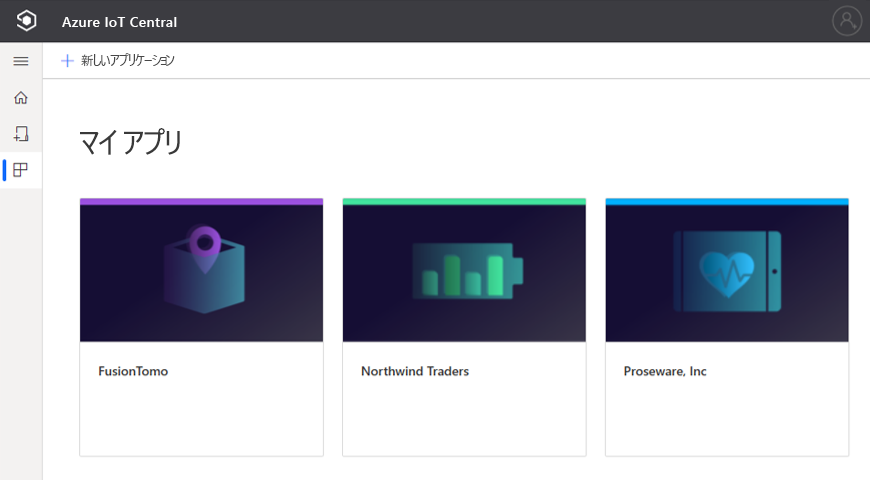
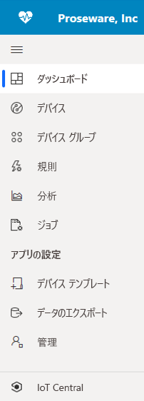
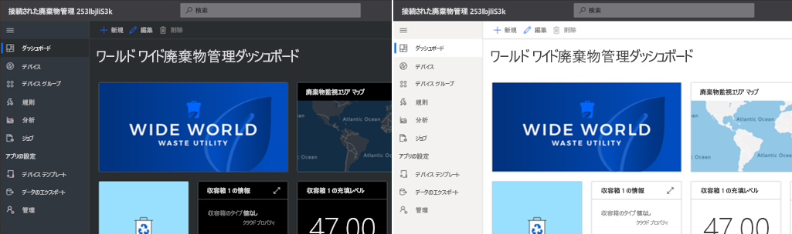
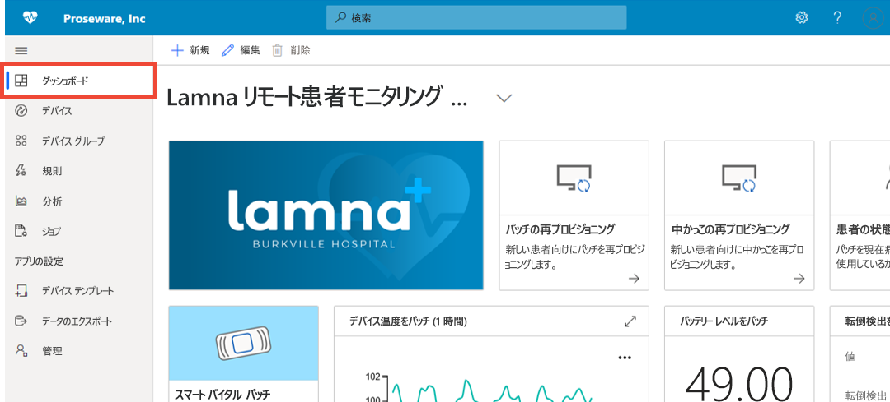

# Azure IoT Central の UI のツアーを見る (プレビュー機能)

[!INCLUDE [iot-central-pnp-original](../../../includes/iot-central-pnp-original-note.md)]

この記事では、Microsoft Azure IoT Central の UI について取り上げます。 Azure IoT Central のソリューションとそこに接続されるデバイスは、UI を使用して作成、管理、使用することができます。

"_ソリューション ビルダー_" は、Azure IoT Central の UI を使用して、Azure IoT Central ソリューションを定義します。 この UI を使用して次の作業を行うことができます。

* ソリューションに接続するデバイスの種類を定義します。
* デバイスのルールとアクションを構成します。 
* ソリューションを使用する "_オペレーター_" 向けに UI をカスタマイズします。

"_オペレーター_" は、Azure IoT Central の UI を使用して、Azure IoT Central ソリューションを管理します。 この UI を使用して次の作業を行うことができます。

* デバイスを監視します。
* デバイスを構成します。
* デバイスの問題をトラブルシューティングして修復します。
* 新しいデバイスをプロビジョニングします。

## IoT Central ホームページ

[IoT Central ホームページ](https://aka.ms/iotcentral-get-started)のページでは、IoT Central で利用できる最新のニュースと機能の詳細を確認したり、新しいアプリケーションを作成したり、既存のアプリケーションを表示および起動したりできます。

> [!div class="mx-imgBorder"]
> 

### アプリケーションの作成

[ビルド] セクションでは、業界に関連する IoT Central テンプレートの一覧を参照して、すばやく作業を開始したり、カスタム アプリケーション テンプレートを使用してゼロから始めることができます。  
> [!div class="mx-imgBorder"]
> ![IoT Central の [ビルド] ページ](media/overview-iot-central-tour/iot-central-build-pnp.png)

詳細については、クイックスタートの「[Azure IoT Central アプリケーションの作成](quick-deploy-iot-central.md)」を参照してください。

### アプリケーションの起動

IoT Central アプリケーションを起動するには、自分またはソリューション ビルダーがアプリの作成時に選択した URL に移動します。 [IoT Central アプリ マネージャー](https://aka.ms/iotcentral-apps)で、アクセス権を持つすべてのアプリケーションの一覧を表示することもできます。

> [!div class="mx-imgBorder"]
> 

## アプリケーションのナビゲート

IoT アプリケーション内では、左側のウィンドウを使用してさまざまな領域にアクセスします。 ナビゲーション バーの上部にある 3 本線のアイコンを選択すると、ナビゲーション バーを展開または折りたたむことができます。

> [!NOTE]
> ナビゲーション バーに表示される項目は、ユーザー ロールによって異なります。 詳細については、[ユーザーとロールの管理](howto-manage-users-roles.md)に関するページを参照してください。 

:::row:::
  :::column span="":::
      > [!div class="mx-imgBorder"]
      > 
  :::column-end:::
  :::column span="2":::
     **[ダッシュボード]** には、ご利用のアプリケーション ダッシュボードが表示されます。 このグローバル ダッシュボードは、オペレーター向けに*ソリューション ビルダー*がカスタマイズできます。 オペレーターは、ユーザー ロールに応じて、独自の個人用ダッシュボードを作成することもできます。
     
     **[デバイス]** を使用すると、接続されているデバイスを実際に管理し、シミュレートすることができます。

     **[デバイス グループ]** を使用すると、クエリによって指定されたデバイスの論理上のコレクションを表示および作成できます。 このクエリを保存し、アプリケーションを介してデバイス グループを使用して、一括操作を実行することができます。

     **[ルール]** を使用すると、デバイスを監視するためのルールを作成および編集できます。 ルールは、デバイスのテレメトリに基づいて評価され、カスタマイズ可能なアクションをトリガーします。

     **[Analytics]** を使用すると、デバイス データに基づくカスタム ビューを作成して、アプリケーションから分析情報を取得することができます。

     **[ジョブ]** を使用すると、一括操作を実行してデバイスを大規模に管理できます。

     **[デバイス テンプレート]** は、アプリケーションに接続するデバイスの特性を作成および管理する場所です。

     **[データのエクスポート]** を使用すると、ストレージやキューなどの外部サービスへの連続エクスポートを構成できます。

     **[管理]** は、アプリケーションの設定、カスタマイズ、課金、ユーザー、およびロールを管理する場所です。

     **[IoT Central]** を使用すると、*管理者*は IoT Central のアプリ マネージャーに戻ることができます。
     
   :::column-end:::
:::row-end:::

### 検索、ヘルプ、テーマ、およびサポート

すべてのページには、次のトップ メニューが表示されます。

> [!div class="mx-imgBorder"]
> 

* デバイス テンプレートやデバイスを検索するには、 **[検索]** に値を入力します。
* UI の言語またはテーマを変更するには、 **[設定]** アイコンを選択します。 詳細については、「[アプリケーションのユーザー設定を管理する](../core/howto-manage-preferences.md?toc=/azure/iot-central/preview/toc.json&bc=/azure/iot-central/preview/breadcrumb/toc.json)」を参照してください。
* アプリケーションからサインアウトするには、 **[アカウント]** アイコンを選択します。
* ヘルプやサポートを利用するには、 **[ヘルプ]** ドロップダウンを選択するとリソースが一覧表示されます。 試用版アプリケーションでは、サポート リソースに[ライブ チャット](../core/howto-show-hide-chat.md?toc=/azure/iot-central/preview/toc.json&bc=/azure/iot-central/preview/breadcrumb/toc.json)へのアクセスが含まれています。

UI 用に淡色テーマまたは濃色テーマを選ぶことができます。

> [!NOTE]
> 管理者によってアプリケーションのカスタム テーマが構成されている場合、淡色と濃色のテーマから選択するオプションは使用できません。

> [!div class="mx-imgBorder"]
> 

### ダッシュボード
> [!div class="mx-imgBorder"]
> 

* ダッシュボードは、Azure IoT Central アプリケーションにサインインしたときに最初に表示されるページです。 *ソリューション ビルダー*は、他のユーザー用に複数のグローバル アプリケーション ダッシュボードを作成してカスタマイズすることができます。 詳細については、[ダッシュボードへのタイルの追加](../core/howto-add-tiles-to-your-dashboard.md?toc=/azure/iot-central/preview/toc.json&bc=/azure/iot-central/preview/breadcrumb/toc.json)に関するページを参照してください。

* *オペレーター*は、ユーザー ロールで許可されている場合、自分が関心のあるものを監視するための個人用ダッシュボードを作成できます。 詳細については、ハウツー記事にある [Azure IoT Central の個人用ダッシュボードの作成](../core/howto-create-personal-dashboards.md?toc=/azure/iot-central/preview/toc.json&bc=/azure/iot-central/preview/breadcrumb/toc.json)に関するページを参照してください。

### デバイス

> [!div class="mx-imgBorder"]
> ![[デバイス] ページ](media/overview-iot-central-tour/devices-pnp.png)

エクスプローラー ページには、お使いの Azure IoT Central アプリケーションの "_デバイス_" が "_デバイス テンプレート_" のグループごとに表示されます。 

* アプリケーションに接続できるデバイスの種類は、デバイス テンプレートによって定義されます。
* デバイスとは、対象アプリケーションにおける実デバイスまたはシミュレートされたデバイスを表します。

詳細については、クイックスタートの[デバイスの監視](./quick-monitor-devices.md)に関するページを参照してください。 

### デバイス グループ

> [!div class="mx-imgBorder"]
> ![[デバイス グループ] ページ](media/overview-iot-central-tour/device-groups-pnp.png)

デバイス グループは、関連するデバイスのコレクションです。 デバイス グループに含まれるデバイスは、*ソリューション ビルダー*がクエリを定義することによって識別します。 デバイス グループを使用して、アプリケーションで一括操作を実行します。 詳細については、「[Azure IoT Central アプリケーションにおけるデバイス グループの使用](tutorial-use-device-groups.md)」を参照してください。

### ルール
> [!div class="mx-imgBorder"]
> ![[ルール] ページ](media/overview-iot-central-tour/rules-pnp.png)

[ルール] ページでは、デバイスのテレメトリ、状態、またはイベントに基づいてルールを定義できます。 ルールが実行されると、メールの送信や、webhook アラートを使用した外部システムへの通知など、1 つ以上のアクションをトリガーできます。詳細については、チュートリアルの[ルールの構成](tutorial-create-telemetry-rules.md)に関するページを参照してください。 

### Analytics

> [!div class="mx-imgBorder"]
> ![[Analytics] ページ](media/overview-iot-central-tour/analytics-pnp.png)

[Analytics] を使用すると、デバイス データに基づくカスタム ビューを作成して、アプリケーションから分析情報を取得することができます。 詳細については、[Azure IoT Central アプリケーションに使用する分析の作成](howto-create-analytics.md)に関するページを参照してください。

### ジョブ

> [!div class="mx-imgBorder"]
> ![[ジョブ] ページ](media/overview-iot-central-tour/jobs-pnp.png)

[ジョブ] ページでは、自分のデバイスに対してデバイス管理操作を一括で実行できます。 デバイスのプロパティと設定を更新し、デバイス グループに対してコマンドを実行できます。 詳細については、[ジョブの実行](../core/howto-run-a-job.md?toc=/azure/iot-central/preview/toc.json&bc=/azure/iot-central/preview/breadcrumb/toc.json)に関するページを参照してください。

### デバイス テンプレート

> [!div class="mx-imgBorder"]
> ![[デバイス テンプレート] ページ](media/overview-iot-central-tour/templates-pnp.png)

[デバイス テンプレート] ページでは、ビルダーがアプリケーションに含まれるデバイス テンプレートの作成と管理を行います。 デバイス テンプレートでは、次のようなデバイスの特性を指定します。

* テレメトリ、状態、イベントの測定値
* Properties
* コマンド
* ビュー

*ソリューション ビルダー*は、オペレーターがデバイスの管理に使用するフォームとダッシュボードを作成することもできます。

詳細については、「[Define a new device type in your Azure IoT Central application (Azure IoT Central アプリケーションに新しいデバイスの種類を定義する)](howto-set-up-template.md)」のチュートリアルを参照してください。 

### データのエクスポート
> [!div class="mx-imgBorder"]
> ![[データのエクスポート] ページ](media/overview-iot-central-tour/export-pnp.png)

[データのエクスポート] を使用すると、テレメトリなどのデータのストリームをアプリケーションから外部システムに設定できます。 詳しくは、「[Azure IoT Central でデータをエクスポートする](./howto-export-data.md)」をご覧ください。

### 管理
> [!div class="mx-imgBorder"]
> ![[管理] ページ](media/overview-iot-central-tour/administration-pnp.png)

[管理] ページでは、IoT Central アプリケーションの構成とカスタマイズを行うことができます。 ここでは、アプリケーション名、URL、テーマを変更したり、ユーザーとロールを管理したり、API トークンを作成したり、アプリケーションをエクスポートしたりできます。 詳細については、[Azure IoT Central アプリケーションの管理](howto-administer.md)に関するページを参照してください。

## 次のステップ

これで Azure IoT Central の概要と UI のレイアウトに関する説明は終了です。推奨される次の手順として、「[Create an Azure IoT Central application (Azure IoT Central アプリケーションの作成)](quick-deploy-iot-central.md)」クイック スタートに進みましょう。
