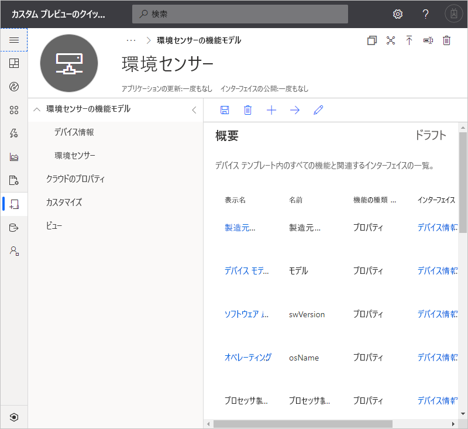
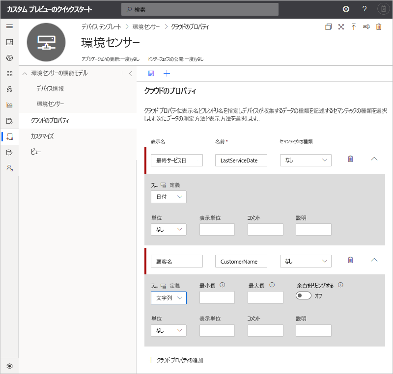
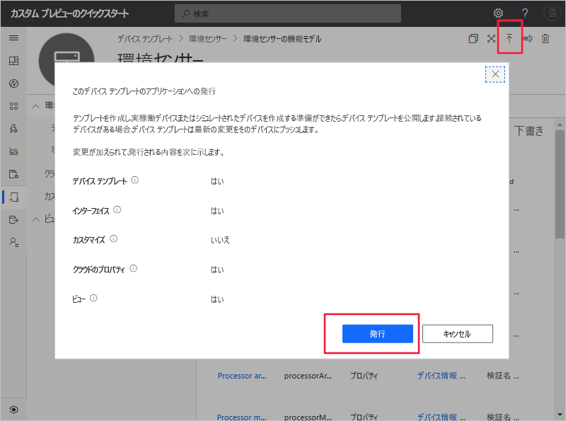
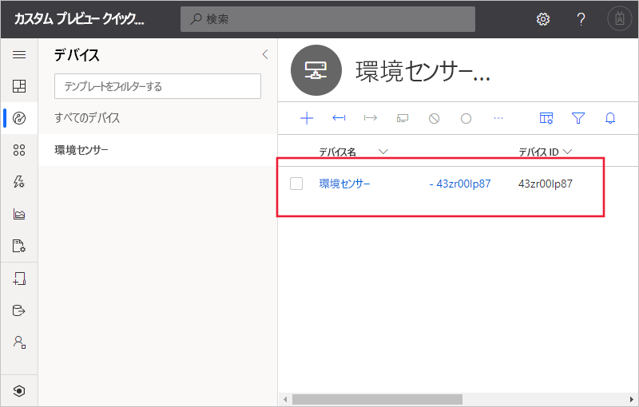
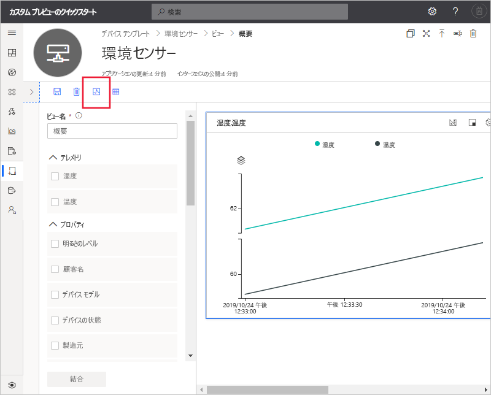

# クイック スタート:シミュレートされたデバイスを IoT Central アプリケーションに追加する (プレビュー機能)

*この記事は、オペレーター、ビルダー、および管理者に適用されます。*

[!INCLUDE [iot-central-pnp-original](../../../includes/iot-central-pnp-original-note.md)]

デバイス テンプレートは、IoT Central アプリケーションに接続するデバイスの機能を定義します。 機能には、デバイスが送信するテレメトリ、デバイスのプロパティ、デバイスが反応するコマンドなどがあります。 デバイス テンプレートから、ビルダーまたはオペレーターは、実際のデバイスとシミュレートされたデバイスの両方をアプリケーションに追加できます。 シミュレートされたデバイスは、実際のデバイスを接続する前に、IoT Central アプリケーションの動作をテストするのに役立ちます。

このクイックスタートでは、**環境センサー** デバイス テンプレートを作成し、シミュレートされたデバイスを追加します。 環境センサー デバイス:

* 温度などのテレメトリを送信する。
* 輝度など、デバイス固有のプロパティをレポートする。
* 電源オンやオフなどのコマンドに反応する。
* ファームウェア バージョンやシリアル番号など、一般的なデバイス プロパティをレポートする。

## 前提条件

**[カスタム アプリ] > [プレビュー アプリケーション]** テンプレートを使用して IoT Central アプリケーションを作成するには、「[Azure IoT Central アプリケーションを作成する (プレビュー機能)](./quick-deploy-iot-central.md)」クイックスタートを完了します。

また、[IoT プラグ アンド プレイ](../../iot-pnp/overview-iot-plug-and-play.md) デバイス機能モデルが記載されている **EnvironmentalSensorInline.capabilitymodel.json** ファイルのローカル コピーが必要です。 [ここ](https://raw.githubusercontent.com/Azure/IoTPlugandPlay/master/samples/EnvironmentalSensorInline.capabilitymodel.json)からダウンロードできます。 ページ上で右クリックして、 **[名前を付けて保存]** を選択します。

ファイルをダウンロードしたら、テキスト エディターで開き、2 つある `<YOUR_COMPANY_NAME_HERE>` を自分の名前で置き換えます。 英数字 (a から z、A から Z、0 から 9) とアンダースコアのみを使用してください。

## テンプレートの作成

作成者は、アプリケーションでデバイス テンプレートを作成および編集できます。 デバイス テンプレートを公開した後で、シミュレートされたデバイスの生成や、デバイス テンプレートが実装された実デバイスの接続を行えます。 シミュレートされたデバイスを使用すると、実デバイスを接続する前にアプリケーションの動作をテストできます。

新しいデバイス テンプレートをアプリケーションに追加するには、 **[デバイス テンプレート]** ページに移動します。 そのためには、左側のペインで **[デバイス テンプレート]** タブを選択します。

![[デバイス テンプレート] ページ](./media/quick-create-pnp-device/devicedefinitions.png)

### デバイス機能モデルを追加する

IoT Central でデバイス機能モデルを作成する場合、選択肢は複数あります。 カスタム モデルをゼロから作成する方法、ファイルからインポートする方法、デバイス カタログから選択する方法、デバイス機能モデルをパブリック リポジトリに公開したときのデバイス優先接続を使用して IoT プラグ アンド プレイ デバイスを接続する方法から選べます。 このチュートリアルでは、ファイルからデバイス機能モデルをインポートします。

以下の手順で、**環境センサー** デバイスの機能モデルをインポートする方法について説明します。 これらのデバイスは、温度などのテレメトリをアプリケーションに送信します。

1. 新しいデバイス テンプレートを追加するために、 **[デバイス テンプレート]** ページで **+** を選択します。

1. カスタム デバイス テンプレートの一覧から **IoT デバイス** を選択し、**Next:Customize** (次へ: カスタマイズ) を選択し、次に **Next:Review** (次へ: レビュー) を選択し、**作成** を選択します。

1. デバイス テンプレートの名前として、「**Environmental Sensor**」と入力します。

1. **[機能モデルのインポート]** を選択して、JSON ファイルから新しいデバイス機能モデルを作成します。 ローカル コンピューター上にある、**EnvironmentalSensorInline.capabilitymodel.json** ファイルを保存したフォルダーを参照します。 **EnvironmentalSensorInline.capabilitymodel.json** ファイルを選択して、 **[開く]** を選択します。 環境センサーの機能モデルには、**環境センサー** インターフェイスと**デバイス情報**インターフェイスが含まれています。

    

    これらのインターフェイスにより、**環境センサー** デバイスの機能が定義されます。 機能には、デバイスが送信するテレメトリ、デバイスがレポートするプロパティ、デバイスが反応するコマンドなどがあります。

### クラウド プロパティを追加する

デバイス テンプレートにはクラウド プロパティを含めることができます。 クラウド プロパティは IoT Central アプリケーション内のみに存在しており、デバイスとの間で送受信されることはありません。

1. **[クラウド プロパティ]** 、 **[+ クラウド プロパティの追加]** の順に選択します。 下表の情報に従って、デバイス テンプレートにクラウド プロパティを追加します。

    | 表示名      | セマンティックの種類 | スキーマ |
    | ----------------- | ------------- | ------ |
    | Last Service Date | なし          | Date   |
    | Customer Name     | なし          | String |

1. **[保存]** を選択して変更を保存します。

    

## ビューの作成

作成者は、環境センサー デバイスの関連情報がオペレーターに表示されるよう、アプリケーションをカスタマイズできます。 カスタマイズを行うことで、オペレーターがアプリケーションに接続された環境センサー デバイスを管理できるようになります。 オペレーター向けのデバイス操作用のビューを 2 種類作成できます。

* デバイス プロパティとクラウド プロパティを表示および編集するためのフォーム。
* デバイスを視覚化するためのダッシュボード。

### 既定のビューを生成する

既定のビューを生成すると、重要なデバイス情報の視覚化をすばやく開始することができます。 デバイス テンプレートごとに生成できる既定のビューは、最大で 3 つです。

* **[コマンド]** ビューでは、オペレーターがデバイスにコマンドを送信できます。
* **[概要]** ビューでは、グラフとメトリックを利用してデバイスのテレメトリが表示されます。
* **[詳細]** ビューには、デバイスのプロパティが表示されます。

**[ビュー]** を選択し、**既定のビューを生成します**。

### ビューを構成してデバイスを視覚化する

オペレーターは、デバイス ダッシュボードでグラフやメトリックを利用してデバイスを視覚化できます。 作成者はデバイス ダッシュボードに表示される情報を定義できます。 デバイスに対し、複数のダッシュボードを定義することができます。 環境センサーのテレメトリを視覚化するダッシュボードを作成するために、 **[ビュー]** 、 **[デバイスの視覚化]** の順に選択します。

1. **[プロパティ]** に、すべてのデバイス プロパティ、クラウド プロパティ、テレメトリ、および静的オプションの一覧が表示されます。 これらの項目はいずれもビューにドラッグ アンド ドロップできます。 **[明るさのレベル]** プロパティをビューにドラッグします。 タイルは、歯車アイコンを使用して構成できます。

1. テレメトリをプロットするグラフを追加するために、 **[湿度]** と **[温度]** を選択してから **[結合]** を選択します。 このグラフを円グラフや横棒グラフなどの別の形式で表示するには、タイル上部にある **[ビジュアル化の変更]** ボタンを選択します。

1. **[保存]** を選択してビューを保存します。

別のプロパティやテレメトリ値を表示するタイルをさらに追加できます。 また、静的テキストやリンク、画像も追加できます。 ダッシュボード上のタイルを移動したり、そのサイズを変更したりするには、そのタイルの上にマウス ポインターを移動して、タイルを新しい場所にドラッグするか、そのサイズを変更します。

### デバイス フォームを追加する

デバイス フォームでは、オペレーターが、書き込み可能なデバイス プロパティとクラウド プロパティを編集できます。 作成者は複数のフォームを定義し、各フォームに表示するデバイス プロパティとクラウド プロパティを選択することができます。 フォームには、読み取り専用のデバイス プロパティを表示することもできます。

環境センサーのプロパティを確認および編集するためのビューを作成には:

1. **[環境センサー]** テンプレートの **[ビュー]** に移動します。 **[デバイスとクラウドのデータの編集]** タイルを選択し、新しいビューを追加します。

1. フォーム名として「**環境センサーのプロパティ**」と入力します。

1. **[顧客名]** と **[Last service date]\(前回点検日\)** の各クラウド プロパティを、フォームの既存のセクションにドラッグします。

1. **[Brightness Level]\(輝度\)** と **[デバイスの状態]** の各デバイス プロパティを選択します。 次に、 **[セクションの追加]** を選択します。 セクションのタイトルを編集して、**センサーのプロパティ**に変更します。 **[適用]** を選択します。

1. **[デバイス モデル]** 、 **[ソフトウェア バージョン]** 、 **[製造元]** 、および **[プロセッサの製造元]** の各デバイス プロパティを選択します。 次に、 **[セクションの追加]** を選択します。 セクションのタイトルを編集して、**デバイスのプロパティ**に変更します。 **[適用]** を選択します。

1. **[保存]** を選択してビューを保存します。

## デバイス テンプレートの公開

シミュレートされた環境センサーの作成や、実物の環境センサーの接続を行うには、デバイス テンプレートを公開する必要があります。

デバイス テンプレートを公開するには:

1. **[デバイス テンプレート]** ページで、作成したデバイス テンプレートに移動します。

1. **[発行]** を選択します。

1. **[Publish a Device Template]\(デバイス テンプレートの公開\)** ダイアログで、 **[公開]** を選択します。

    

デバイス テンプレートを公開すると、 **[デバイス]** ページに表示され、オペレーターが確認できるようになります。 公開済みのデバイス テンプレートで、新しいバージョンを作成せずにデバイス機能モデルを編集することはできません。 ただし、公開済みのデバイス テンプレートでも、クラウド プロパティ、カスタマイズ、ビューについては、新バージョンを作成することなく更新できます。 変更完了後に **[公開]** を選択すると、変更内容がオペレーターにプッシュされます。

## シミュレートされたデバイスの追加

シミュレートされたデバイスをアプリケーションに追加するには、作成した **環境センサー** デバイス テンプレートを使用します。

1. オペレーターが新しいデバイスを追加するには、左側のウィンドウで **[デバイス]** を選択します。 **[デバイス]** タブには、 **[すべてのデバイス]** および **[環境センサー]** デバイス テンプレートが表示されます。 **[環境センサー]** を選択します。

1. シミュレートされた環境センサー デバイスを追加するには、 **[+ 新規]** を選択します。 推奨される**デバイス ID** を使用するか、独自の小文字の**デバイス ID** を入力します。 新しいデバイスの名前を入力することもできます。 **[シミュレート済み]** トグルを **[オン]** に切り替え、 **[作成]** を選択します。

    

これで、シミュレートされたデータを使用してデバイス テンプレート用に作成者によって作成されたビューを操作できるようになりました。

## シミュレートされたデバイスを使用してビューを改善する

新しいシミュレートされたデバイスを作成した後、作成者はこのデバイスを使用して、デバイス テンプレートのビューを引き続き改善し、構築することができます。

1. 左側のウィンドウで **[デバイス テンプレート]** を選択し、 **[環境センサー]** テンプレートを選択します。

1. 編集するビューを選択するか、新しいビューを作成します。 **[プレビュー デバイスの構成]** を、次に **[実行中のデバイスから選択します]** をクリックします。 ここでは、プレビュー デバイスを使用しないか、テスト用に構成できる実際のデバイスを使用するか、IoT Central に追加した既存のデバイスを使用するかを選択できます。

1. 一覧からシミュレートされたデバイスを選択します。 次に、 **[適用]** を選択します。 これで、デバイス テンプレート ビューの作成エクスペリエンスで、同じシミュレートされたデバイスを確認できるようになりました。 このビューは、グラフやその他の視覚化に役立ちます。

    

## 次のステップ

このクイックスタートでは、**環境センサー** デバイス テンプレートを作成し、シミュレートされたデバイスをアプリケーションに追加する方法について説明しました。

アプリケーションに接続されているデバイスの監視の詳細については、以下のクイックスタートをご覧ください。

> [!div class="nextstepaction"]
> [規則とアクションを構成する](./quick-configure-rules.md)
