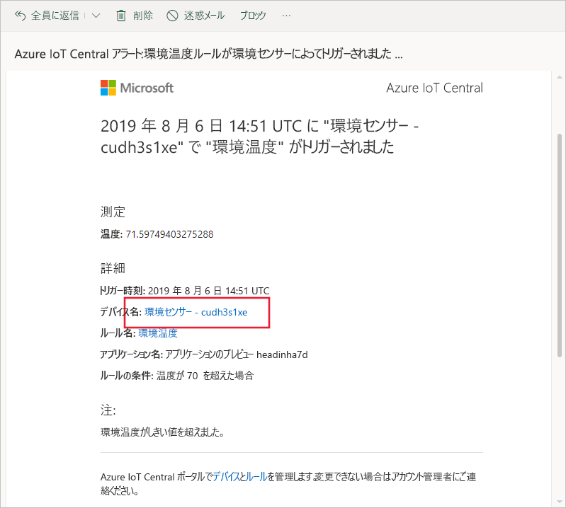
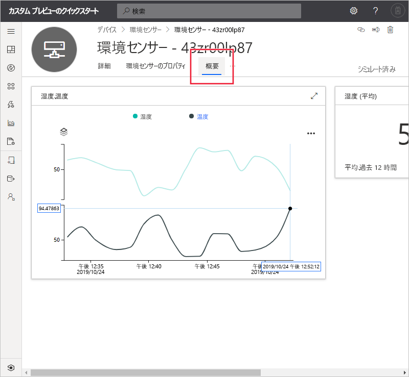
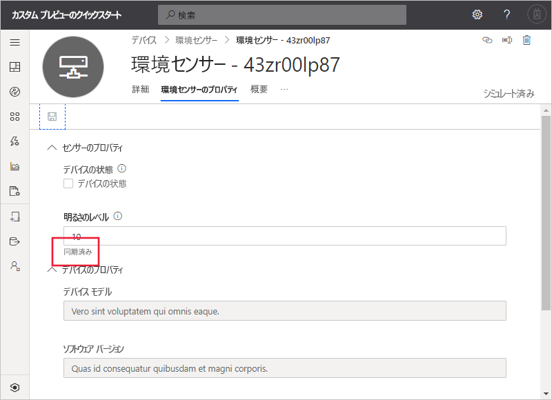

# クイック スタート:Azure IoT Central を使用してデバイスを監視する (プレビュー機能)

*この記事は、オペレーター、ビルダー、および管理者に適用されます。*

[!INCLUDE [iot-central-pnp-original](../../../includes/iot-central-pnp-original-note.md)]

このクイックスタートでは、オペレーター向けに Microsoft Azure IoT Central アプリケーションを使用して、デバイスを監視し、設定を変更する方法について説明します。

## 前提条件

作業を開始する前に、「[Azure IoT Central アプリケーションを作成する](./quick-deploy-iot-central.md)」、「[シミュレーションされたデバイスを IoT Central アプリケーションに追加する](./quick-create-pnp-device.md)」、「[デバイスのルールとアクションを構成する](quick-configure-rules.md)」の 3 つのクイックスタートを完了する必要があります。

## 通知の受信

Azure IoT Central では、デバイスに関する通知を電子メール メッセージとして送信します。 作成者は、接続された環境センサー デバイスの温度がしきい値を超えたときに通知を送信するルールを追加しました。 作成者が通知の受信用に選択したアカウントに送信された電子メールを確認してください。

「[デバイスのルールとアクションを構成する](quick-configure-rules.md)」クイックスタートの最後で受信した電子メール メッセージを開きます。 メール内のデバイスへのリンクを選択します。

前のクイックスタートで作成した "環境センサー" シミュレートされたデバイスの **[ダッシュボード]** ページがブラウザーで開きます。

## 問題の調査

オペレーターは、 **[概要]** 、 **[Environmental Sensor のプロパティ]** 、および **[コマンド]** の各ページでデバイスに関する情報を確認できます。 作成者は、接続された環境センサー デバイスに関する重要な情報が表示されるよう、 **[ダッシュボード]** および **[Environmental Sensor のプロパティ]** ページをカスタマイズしました。

**[概要]** ビューを選択すると、デバイスに関する情報が表示されます。

ダッシュボードのグラフには、デバイスの温度のプロットが表示されます。 デバイスの温度が高すぎると判断したとしましょう。

## 問題の修復

デバイスに変更を加えるには、 **[Environmental Sensor のプロパティ]** ページを使用します。

**[Environmental Sensor のプロパティ]** を選択します。 **[Brightness Level]\(輝度\)** を 10 に変更します。 **[保存]** を選択してデバイスを更新します。 デバイスで設定の変更が確認されると、プロパティの状態が **[同期済み]** に変わります。

## 次の手順

このクイック スタートでは、次の方法について説明しました。

* 通知の受信
* 問題の調査
* 問題の修復

ここでは、デバイスを監視する方法について説明しました。推奨される次の手順は次のとおりです。

> [!div class="nextstepaction"]
> [デバイス テンプレートの構築および管理](howto-set-up-template.md)。
