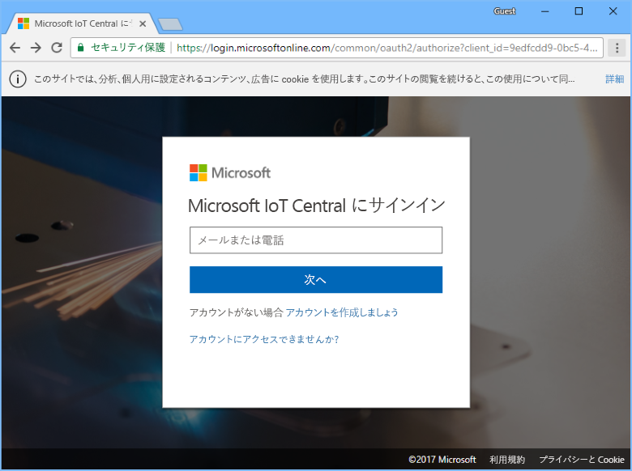

# Azure IoT Central アプリケーションの作成

"_ビルダー_" は、Azure IoT Central の UI を使用して、Microsoft Azure IoT Central アプリケーションを定義します。 このクイックスタートでは、次の方法について説明します。

- サンプル "_デバイス テンプレート_" およびシミュレートされた "_デバイス_" を含んだ Azure IoT Central アプリケーションを作成します。
- アプリケーションの **Refrigerated Vending Machine** デバイス テンプレートの機能を表示します。
- シミュレートされた **Refrigerator** デバイスからのテレメトリと分析を表示します。

このクイック スタートでは、デバイス テンプレートに含まれているシミュレートされた **Refrigerator** デバイスを表示します。 このシミュレートされたデバイスの機能を次に示します。

* 温度や気圧などのテレメトリをアプリケーションに送信します。
* デバイス プロパティの値 (振動警告など) をアプリケーションにレポートします。
* アプリケーションから設定できるデバイス設定 (ファン速度など) を備えています。

Azure IoT Central アプリケーションでは、デバイス テンプレートからシミュレートされたデバイスを作成すると、実デバイスを接続する前に、シミュレートされたデバイスでアプリケーションをテストすることができます。

## アプリケーションを作成する

このクイック スタートの作業を行うためには、**Sample Contoso** アプリケーション テンプレートから Azure IoT Central アプリケーションを作成する必要があります。

Azure IoT Central の [[Application Manager]\(アプリケーション マネージャー\)](https://aka.ms/iotcentral) ページに移動します。 次に、Azure サブスクリプションへのアクセスに使用するメール アドレスとパスワードを入力します。

新しい Azure IoT Central アプリケーションの作成を開始するには、**[New Application]\(新しいアプリケーション\)** を選択します。

![Azure IoT Central の [Application Manager]\(アプリケーション マネージャー\) ページ](media/quick-deploy-iot-central/iotcentralhome.png)

新しい Azure IoT Central アプリケーションを作成するには:

1. **[Free Trial Application]\(無料試用版アプリケーション\)** 支払プランを選択します。
1. わかりやすいアプリケーション名を選びます (**Contoso IoT** など)。 Azure IoT Central によって、一意の URL プレフィックスが自動的に生成されます。 この URL プレフィックスは、もっと覚えやすいものに変更することができます。
1. **[Sample Contoso]\(サンプル Contoso\)** アプリケーション テンプレートを選択します。
1. **[作成]** を選択します。

![Azure IoT Central の [Create Application]\(アプリケーションの作成\) ページ](media/quick-deploy-iot-central/iotcentralcreate.png)

## 次の手順

このクイック スタートでは、**Refrigerated Vending Machine** デバイス テンプレートとシミュレートされたデバイスを含んだ事前設定済みの Azure IoT Central アプリケーションを作成しました。 ビルダーとして独自のデバイス テンプレートを定義する方法について詳しくは、[アプリケーションに新しいデバイス テンプレートを定義する方法](tutorial-define-device-type.md)に関するページをご覧ください。
