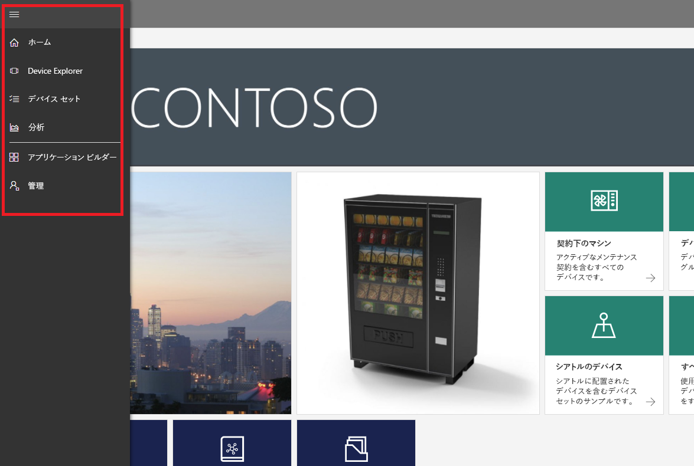
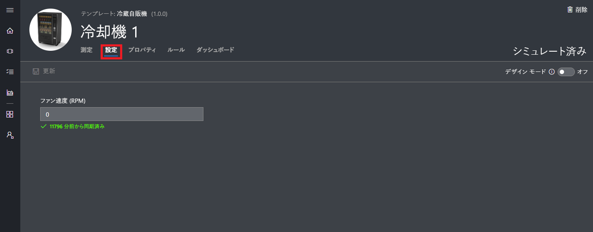
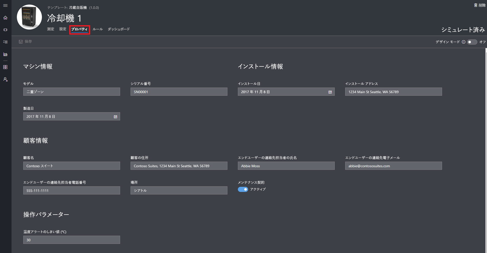
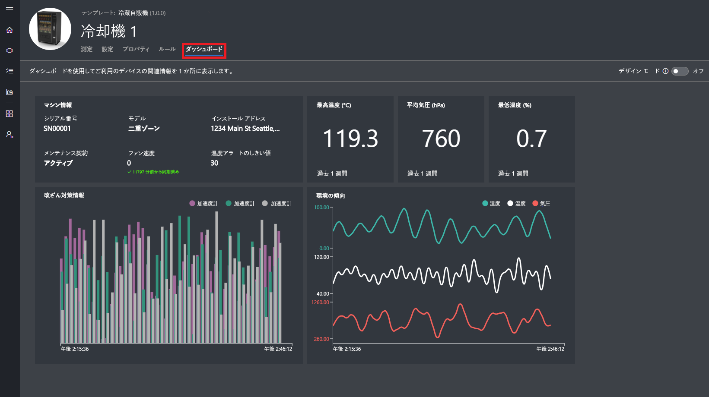
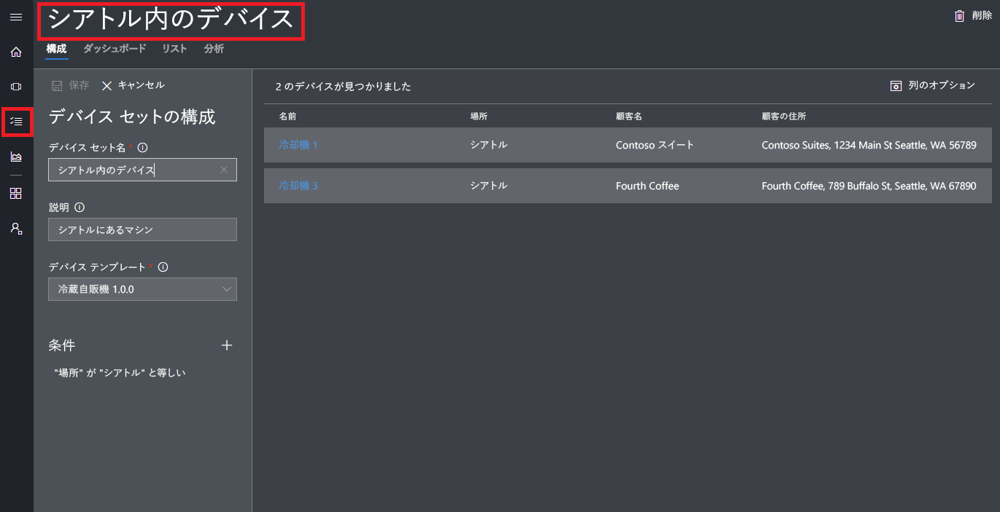
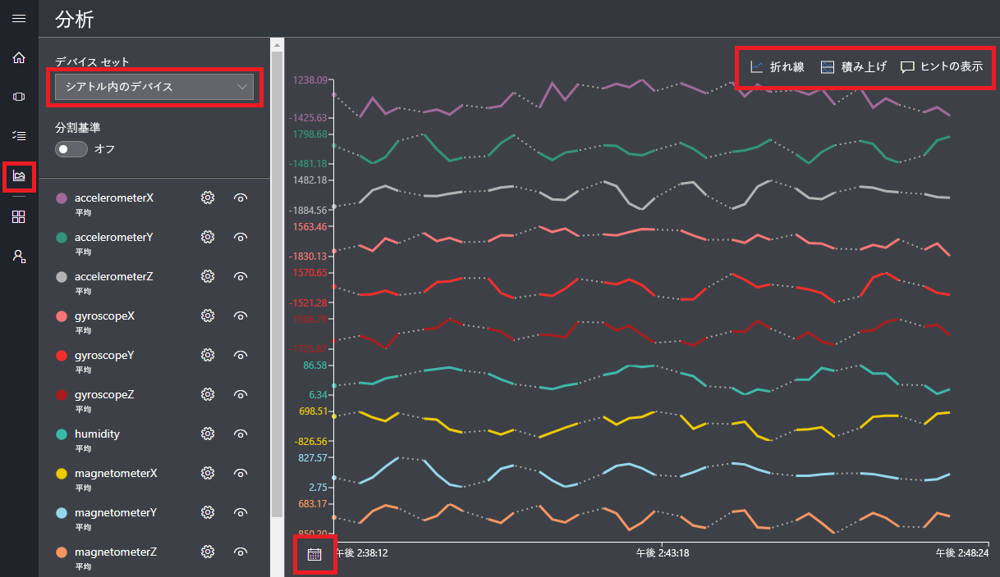

# Azure IoT Central アプリケーションの作成

"_ビルダー_" は、Azure IoT Central の UI を使用して、Microsoft Azure IoT Central アプリケーションを定義します。 このクイックスタートでは、次の方法について説明します。

- サンプル "_デバイス テンプレート_" およびシミュレートされた "_デバイス_" を含んだ Azure IoT Central アプリケーションを作成します。
- アプリケーションの **Refrigerated Vending Machine** デバイス テンプレートの機能を表示します。
- シミュレートされた **Refrigerator** デバイスからのテレメトリと分析を表示します。

このクイック スタートでは、デバイス テンプレートに含まれているシミュレートされた **Refrigerator** デバイスを表示します。 このシミュレートされたデバイスの機能を次に示します。

* 温度や気圧などのテレメトリをアプリケーションに送信します。
* デバイス プロパティの値 (振動警告など) をアプリケーションにレポートします。
* アプリケーションから設定できるデバイス設定 (ファン速度など) を備えています。

Azure IoT Central アプリケーションでは、デバイス テンプレートからシミュレートされたデバイスを作成すると、実デバイスを接続する前に、シミュレートされたデバイスでアプリケーションをテストすることができます。

## アプリケーションを作成する

このクイック スタートの作業を行うためには、**Sample Contoso** アプリケーション テンプレートから Azure IoT Central アプリケーションを作成する必要があります。

Azure IoT Central の [[Application Manager]\(アプリケーション マネージャー\)](https://aka.ms/iotcentral) ページに移動します。 次に、Azure サブスクリプションへのアクセスに使用するメール アドレスとパスワードを入力します。

新しい Azure IoT Central アプリケーションの作成を開始するには、**[New Application]\(新しいアプリケーション\)** を選択します。

![Azure IoT Central の [Application Manager]\(アプリケーション マネージャー\) ページ](media/quick-deploy-iot-central/iotcentralhome.png)

新しい Azure IoT Central アプリケーションを作成するには:

1. **[Free Trial Application]\(無料試用版アプリケーション\)** 支払プランを選択します。
1. わかりやすいアプリケーション名を選びます (**Contoso IoT** など)。 Azure IoT Central によって、一意の URL プレフィックスが自動的に生成されます。 この URL プレフィックスは、もっと覚えやすいものに変更することができます。
1. **[Sample Contoso]\(サンプル Contoso\)** アプリケーション テンプレートを選択します。
1. **[作成]** を選択します。

![Azure IoT Central の [Create Application]\(アプリケーションの作成\) ページ](media/quick-deploy-iot-central/iotcentralcreate.png)

## アプリケーションへの移動

アプリケーションの準備が完了すると、その **[Homepage]\(ホーム ページ\)** が表示されます。 このホーム ページは、右上にある _[Design Mode]\(デザイン モード\)_ を切り替えることで編集することができます。 アプリケーションの URL は、前の手順で指定した URL です。

![[Application Builder]\(アプリケーション ビルダー\) ページ](media/quick-deploy-iot-central/apphome.png)

新しい Azure IoT Central アプリケーションのさまざまな領域には、_左側のナビゲーション メニュー_を使用してアクセスします。

アプリケーションのデバイス テンプレートやデバイスを表示するには、左側のナビゲーション メニューの **[Device Explorer]** を選択します。 サンプル アプリケーションには、**Refrigerated Vending Machine** デバイス テンプレートが含まれています。 このデバイス テンプレートを基に作成されたシミュレートされたデバイスがあらかじめ 3 つ存在しています。

## デバイス テンプレートとデバイスの表示

**Refrigerated Vending Machine** デバイス テンプレートから作成された冷蔵装置を表示するには、次の手順に従います。 デバイス テンプレートによって定義される事柄は次のとおりです。

* デバイスから送信される "_測定値_" (温度のテレメトリなど)。
* デバイスの制御を可能にする "_設定_" (ファン速度など)。
* デバイスに関する情報を格納する "_プロパティ_" (シリアル番号など)。
* デバイスの動作に基づくアクションの自動化を可能にする "[ルール](howto-create-telemetry-rules.md)"。
* デバイスに関する情報を表示するカスタマイズ可能な "_ダッシュボード_"。

シミュレートされたデバイスと実デバイスは、どちらもデバイス テンプレートから作成できます。

### 測定

**Refrigerator 1** デバイスの **[Measurements]\(測定\)** ページが表示されます。 シミュレートされたデバイスから送信された測定値を一覧表示することができます。 このページには、測定値がひとめでわかるカスタマイズ可能なグラフも表示されます。

![[Measurements]\(測定\) ページ](media/quick-deploy-iot-central/measurements.png)

個々の要素の表示と非表示を切り替えてグラフをカスタマイズすることができます。 現在のグラフには、シミュレートされたデバイスからのテレメトリが表示されています。 適切なアクセス許可があれば、デバイス テンプレートに新しい測定値を追加することができます。

> [!NOTE]
> シミュレートされたデータがグラフに現れるまで少し待たなければならない場合があります。

### 設定

**[設定]** を選択します。 **[設定]** ページでは、デバイスを制御することができます。 たとえば、冷蔵庫のファン速度を更新することができます。

その変更がデバイスによって確認されると、設定に "**同期済み**" として表示されます。

### Properties

**[Properties]\(プロパティ\)** を選択します。 **[Properties]\(プロパティ\)** ページでは、次の操作を実行できます。

* デバイスに関する情報 (顧客名など) をメンテナンスします。
* デバイスからレポートされたプロパティ値を表示します (振動警告など)。

### ダッシュボード

**[Dashboard]\(ダッシュボード\)** を選択します。 ダッシュボードは、測定値、プロパティ、KPI など、デバイスに関する情報を表示するカスタマイズ可能なビューです。

## 分析結果の表示

前のセクションでは、個々のデバイスに関する情報を表示する方法を見てきました。 [デバイス セット](howto-use-device-sets.md)と[分析](howto-create-analytics.md)を使用すると、複数のデバイスからの連結した情報を表示することができます。

デバイス セットは、クエリを使用して、抽出条件と一致する一連のデバイスを動的に選択します。 たとえば、**Machines in Seattle** というデバイス セットでは、設置場所がシアトルである冷蔵庫デバイスが選択されます。 **Machines in Seattle** デバイス セットを表示するには、左側のナビゲーション メニューから **[Device Sets]\(デバイス セット\)** を選択し、**[Machines in Seattle]\(シアトルにあるマシン\)** を選択します。

デバイス セットに含まれるデバイスの分析データは、**[Analytics]\(分析\)** ページで確認できます。

## 次の手順

このクイック スタートでは、**Refrigerated Vending Machine** デバイス テンプレートとシミュレートされたデバイスを含んだ事前設定済みの Azure IoT Central アプリケーションを作成しました。 ビルダーとして独自のデバイス テンプレートを定義する方法について詳しくは、[アプリケーションに新しいデバイス テンプレートを定義する方法](tutorial-define-device-type.md)に関するページをご覧ください。
