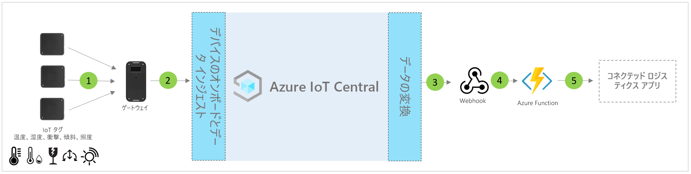

# IoT Central のコネクテッド ロジスティクス アプリケーション テンプレートのアーキテクチャ

[!INCLUDE [iot-central-pnp-original](../../../includes/iot-central-pnp-original-note.md)]

パートナーと顧客は、アプリ テンプレートと以下のガイダンスを利用して、エンドツーエンドの**コネクテッド ロジスティクス** ソリューションを開発することができます。

> [!div class="mx-imgBorder"]
> 

1. ゲートウェイ デバイスにテレメトリ データを送信している IoT タグのセット
2. テレメトリと集計された分析情報を IoT Central に送信しているゲートウェイ デバイス
3. データは、操作のために目的の Azure サービスにルーティングされます
4. ASA や Azure Functions などの Azure サービスを利用して、データ ストリームの形式を再設定し、目的のストレージ アカウントに送信できます 
5. エンド ユーザーのビジネス アプリケーションでさまざまなビジネス ワークフローを利用できます

## 詳細
次のセクションでは、IoT タグとゲートウェイからのテレメトリ インジェストの概念アーキテクチャの各部分の概要について説明します

## IoT タグ
IoT タグを使うと、温度、湿度、ショック、チルト、光など、物理的、アンビエント、環境センサーの機能が提供されます。 IoT タグは、通常、Zigbee (802.15.4) 経由でゲートウェイ デバイスに接続されます。 タグは安価なセンサーであるため、リバース ロジスティクスでの課題を避けるため、一般的なロジスティクス過程の最後に破棄することができます。

## Gateway
また、ゲートウェイは、アンビエント検出機能を備えた IoT タグとして機能することもできます。 ゲートウェイにより、携帯電話の Wi-Fi チャネルを使用して、アップストリームの Azure IoT クラウド接続 (MQTT) が有効になります。  IoT タグとのダウンストリーム通信には、Bluetooth、NFC、および 802.15.4 ワイヤレス センサー ネットワーク (WSN) モードが使用されます。 ゲートウェイでは、エンドツーエンドのセキュリティで保護されたクラウド接続、IoT タグのペアリング、センサー データの集計、データの保持、およびアラームしきい値の構成機能が提供されます。

## IoT Central によるデバイス管理 
Azure IoT Central はソリューション開発プラットフォームであり、IoT デバイスの接続、構成、管理が簡単になります。 このプラットフォームを使うと、IoT デバイスの管理、運用、関連開発の負担とコストが大幅に削減されます。 顧客とパートナーは、エンドツーエンドのエンタープライズ ソリューションを構築し、ロジスティクスでデジタル フィードバック ループを実現できます。

## データ エグレスによるビジネスの分析情報とアクション 
IoT Central プラットフォームを使うと、継続的データ エクスポート (CDE) と API によって豊富な機能拡張オプションが提供されます。 一般に、テレメトリ データ処理または未加工のテレメトリに基づくビジネス分析情報は、優先される基幹業務アプリケーションにエクスポートされます。 Webhook、サービス バス、イベント ハブ、または Blob Storage を使用して、機械学習モデルを構築、トレーニング、デプロイし、分析情報をさらに補強することによって、これを実現できます。

## 次の手順
* [コネクテッド ロジスティクス ソリューション テンプレート](./tutorial-iot-central-connected-logistics-pnp.md)のデプロイ方法を学習します
* [IoT Central 小売りテンプレート](./overview-iot-central-retail-pnp.md)についてさらに詳しく学習します
* [IoT Central の概要](../preview/overview-iot-central.md)に関する記事を参照し、IoT Central についてさらに詳しく学習します
