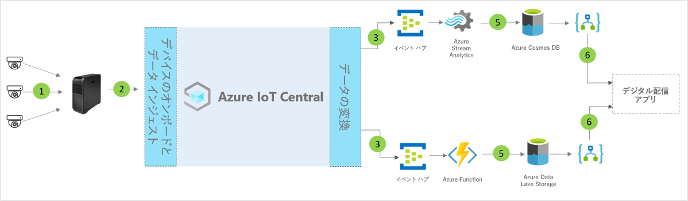

# IoT Central のデジタル配布センター アプリケーション テンプレートのアーキテクチャ

パートナーと顧客は、アプリ テンプレートと以下のガイダンスを使用して、エンド ツー エンドの**デジタル配布センター** ソリューションを開発することができます。

> [!div class="mx-imgBorder"]
> 

1. ゲートウェイ デバイスにテレメトリ データを送信している IoT センサーのセット
2. テレメトリと集計された分析情報を IoT Central に送信しているゲートウェイ デバイス
3. データは、操作のために目的の Azure サービスにルーティングされます
4. ASA や Azure Functions などの Azure サービスを使用して、データ ストリームの形式を再設定し、目的のストレージ アカウントに送信できます 
5. 処理されたデータは、ほぼリアルタイムのアクションのためにホット ストレージに格納されるか、ML やバッチ分析に基づいて分析情報をさらに拡充するためにコールド ストレージに格納されます。 
6. Logic Apps を使用すると、エンド ユーザーのビジネス アプリケーションでさまざまなビジネス ワークフローを利用できます

## 詳細
次のセクションでは、概念アーキテクチャの各部分の概要を説明します

## ビデオ カメラ 
ビデオ カメラは、このデジタル接続されたエンタープライズ規模のエコシステムにおける主要なセンサーです。 機械学習と人工知能の進歩によって、ビデオを構造化データに変換し、クラウドに送信する前にエッジで処理できるようになります。 IP カメラを使用して画像をキャプチャし、カメラで圧縮してから、エッジ コンピューティング経由で圧縮データをビデオ分析パイプラインに送信できます。または、GigE ビジョン カメラを使用してセンサー上の画像をキャプチャした後、これらの画像を直接 Azure IoT Edge に送信し、ビデオ分析パイプラインで処理する前に圧縮することができます。 

## Azure IoT Edge ゲートウェイ
"センサーとしてのカメラ" およびエッジ ワークロードは Azure IoT Edge によってローカルに管理され、カメラ ストリームは分析パイプラインによって処理されます。 Azure IoT Edge のビデオ分析処理パイプラインには、応答時間の短縮や帯域幅の低消費などのさまざまな利点があり、低遅延になってデータ処理が迅速になります。 最も重要なメタデータ、分析情報、アクションだけがクラウドに送信され、さらに処理または調査されます。 

## IoT Central によるデバイス管理 
Azure IoT Central はソリューション開発プラットフォームであり、IoT デバイスや Azure IoT Edge ゲートウェイの接続、構成、管理が簡単になります。 このプラットフォームを使うと、IoT デバイスの管理、運用、関連開発の負担とコストが大幅に削減されます。 顧客とパートナーは、エンドツーエンドのエンタープライズ ソリューションを構築し、配布センターでデジタル フィードバック ループを実現できます。

## データ エグレスを使用したビジネスの分析情報とアクション 
IoT Central プラットフォームでは、継続的データ エクスポート (CDE) と API を通じて豊富な機能拡張オプションが提供されます。 一般に、テレメトリ データ処理または未加工のテレメトリに基づくビジネス分析情報は、優先される基幹業務アプリケーションにエクスポートされます。 Webhook、サービス バス、イベント ハブ、または BLOB ストレージを使用して、機械学習モデルを構築、トレーニング、デプロイし、分析情報をさらに補強することによって、これを実現できます。

## 次のステップ
* [デジタル配布センター テンプレート](./tutorial-iot-central-digital-distribution-center-pnp.md)のデプロイ方法を学習します
* [IoT Central 小売りテンプレート](./overview-iot-central-retail-pnp.md)についてさらに詳しく学習します
* [IoT Central の概要](../core/overview-iot-central.md)に関する記事を参照し、IoT Central についてさらに詳しく学習します
