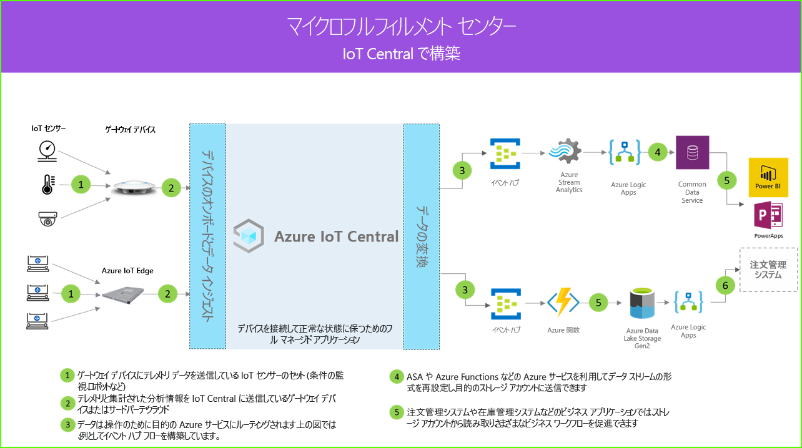

# マイクロフルフィルメント センターのアーキテクチャ

[!INCLUDE [iot-central-pnp-original](../../../includes/iot-central-pnp-original-note.md)]

マイクロフルフィルメント センター ソリューションを使用すると、完全に自動化されたフルフィルメント センターのすべての側面をデジタル接続、監視、および管理できます。これにより、ダウンタイムを排除する一方でセキュリティと全体的な効率を高めることが可能になり、コストを削減できます。 これらのソリューションは、IoT Central のいずれかのアプリケーション テンプレートと以下のアーキテクチャ ガイダンスを利用して構築できます。

- ゲートウェイ デバイスにテレメトリ データを送信している IoT センサーのセット
- テレメトリと集計された分析情報を IoT Central に送信しているゲートウェイ デバイス
- 操作のために目的の Azure サービスへの継続的データ エクスポート
- データを必要な形式で構造化し、ストレージ サービスに送信できます
- ビジネス アプリケーションを使って、データのクエリを実行し、小売りの活動に役立つ分析情報を生成することができます
 
マイクロフルフィルメント センター ソリューションで一般的に役立つ主要なコンポーネントについて見ていきましょう。

## 搬送ロボット

マイクロフルフィルメント センター ソリューションには、さまざまなテレメトリ信号を生成する搬送ロボットの大規模なセットがあることでしょう。 これらの信号は、アーキテクチャ図の左側に示されているように、ゲートウェイ デバイスによって取り込まれ、集約された後、IoT Central に送信されます。  

## 状況監視センサー

IoT ソリューションは、フルフィルメント センター内から意味のある信号をキャプチャするセンサーのセットから始まります。 これは、上のアーキテクチャ図の左端にあるさまざまなセンサーによって反映されています。

## ゲートウェイ デバイス

多くの IoT センサーでは、未加工の信号を、直接クラウドに、または近くにあるゲートウェイ デバイスにフィードできます。 ゲートウェイ デバイスでは、概要分析情報を IoT Central アプリケーションに送信する前に、エッジでデータの集計が実行されます。 ゲートウェイ デバイスは、必要に応じて、センサー デバイスに対してコマンドと制御操作を中継する役割も担います。 

## IoT Central アプリケーション

Azure IoT Central アプリケーションにより、フルフィルメント センター環境内のさまざまな IoT センサー、ロボット、およびゲートウェイ デバイスからデータが取り込まれ、意味のある分析情報のセットが生成されます。

また、Azure IoT Central では、ストアオ ペレーターがインフラストラクチャ デバイスをリモートで監視および管理できるように、カスタマイズされたエクスペリエンスが提供されます。

## データの変換
ソリューション内の Azure IoT Central アプリケーションは、一連の Azure PaaS (サービスとしてのプラットフォーム) サービスに対して、未加工または集計済みの分析情報をエクスポートするように構成できます。これらのサービスでは、データの操作を実行し、分析情報を補強してから、ビジネス アプリケーションに渡すことができます。 

## ビジネス アプリケーション
IoT データを使用して、小売り環境内に展開されたさまざまなビジネス アプリケーションを強化することができます。 フルフィルメント センターのマネージャーまたは従業員は、これらのアプリケーションを利用して、ビジネス分析情報を視覚化し、意味のあるアクションをリアルタイムで実行できます。 小売りチーム向けのリアルタイム Power BI ダッシュボードを作成する方法については、[こちらのチュートリアル](./tutorial-in-store-analytics-create-app-pnp.md)を参照してください。

## 次のステップ
* [マイクロフルフィルメント センター](https://aka.ms/checkouttemplate) アプリケーション テンプレートを使ってみる。 
* マイクロフルフィルメント センター アプリ テンプレートを利用してソリューションを構築する方法が説明されている[チュートリアル](https://aka.ms/mfc-tutorial)を見てみる。
