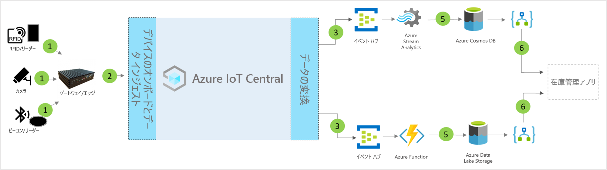

# IoT Central のスマート インベントリの管理アプリケーション テンプレートのアーキテクチャ

パートナーと顧客は、アプリ テンプレートと以下のガイダンスを利用して、エンドツーエンドの**スマート インベントリの管理**ソリューションを開発することができます。

> [!div class="mx-imgBorder"]
> 

1. ゲートウェイ デバイスにテレメトリ データを送信している IoT センサーのセット
2. テレメトリと集計された分析情報を IoT Central に送信しているゲートウェイ デバイス
3. データは、操作のために目的の Azure サービスにルーティングされます
4. ASA や Azure Functions などの Azure サービスを利用して、データ ストリームの形式を再設定し、目的のストレージ アカウントに送信できます 
5. 処理されたデータは、ほぼリアルタイムのアクションのためにホット ストレージに格納されるか、ML やバッチ分析を利用して分析情報をさらに拡充するためにコールド ストレージに格納されます。 
6. Logic Apps を使用すると、エンド ユーザーのビジネス アプリケーションでさまざまなビジネス ワークフローを利用できます

## 詳細
次のセクションでは、無線自動識別 (RFID) タグと Bluetooth Low Energy (BLE) タグからのテレメトリ インジェストの概念アーキテクチャの各部分の概要を説明します

## RFID タグ
RFID タグは、アイテムに関するデータを無線で送信します。 通常、RFID タグは、指定されている場合を除き、バッテリを持っていません。 タグは、リーダーによって生成された無線波からエネルギーを受け取り、RFID リーダーに対して信号を送り返します。

## BLE タグ
エネルギー ビーコンは、一定の間隔でデータのパケットをブロードキャストします。 ビーコン データは、BLE リーダーまたはスマートフォンにインストールされたサービスによって検出され、クラウドに転送されます。

## RFID および BLE リーダー
RFID リーダーは、無線波をより使いやすい形式のデータに変換します。 タグから収集された情報は、ローカル エッジ サーバーに格納されるか、JSON-RPC 2.0 over MQTT 経由でクラウドに送信されます。
アクセス ポイント (AP) とも呼ばれる BLE リーダーは、RFID リーダーに似ています。 これらにより、近くの Bluetooth 信号が検出され、そのメッセージが JSON-RPC 2.0 over MQTT 経由でローカル Azure IoT Edge またはクラウドに中継されされます。
多くのリーダーは、RFID およびビーコン信号を読み取るだけでなく、温度、湿度、加速度計、ジャイロに関連する追加のセンサー機能を提供できます。

## Azure IoT Edge ゲートウェイ
Azure IoT Edge サーバーを使うと、クラウドに送信される前のデータをローカルに前処理できます。 また、クラウド ワークロードの人工知能、Azure およびサードパーティのサービス、ビジネス ロジックを標準のコンテナーを介してデプロイすることもできます。

## IoT Central によるデバイス管理 
Azure IoT Central はソリューション開発プラットフォームであり、IoT デバイスの接続、構成、管理が簡単になります。 このプラットフォームを使うと、IoT デバイスの管理、運用、関連開発の負担とコストが大幅に削減されます。 顧客とパートナーは、エンドツーエンドのエンタープライズ ソリューションを構築し、インベントリ管理でデジタル フィードバック ループを実現できます。

## データ エグレスによるビジネスの分析情報とアクション 
IoT Central プラットフォームを使うと、継続的データ エクスポート (CDE) と API によって豊富な機能拡張オプションが提供されます。 一般に、テレメトリ データ処理または未加工のテレメトリに基づくビジネス分析情報は、優先される基幹業務アプリケーションにエクスポートされます。 Webhook、サービス バス、イベント ハブ、または Blob Storage を使用して、機械学習モデルを構築、トレーニング、デプロイし、分析情報をさらに補強することによって、これを実現できます。

## 次の手順
* [スマート インベントリの管理テンプレート](./tutorial-iot-central-smart-inventory-management-pnp.md)のデプロイ方法を学習します
* [IoT Central 小売りテンプレート](./overview-iot-central-retail-pnp.md)についてさらに詳しく学習します
* [IoT Central の概要](../core/overview-iot-central-pnp.md)に関する記事を参照し、IoT Central についてさらに詳しく学習します
