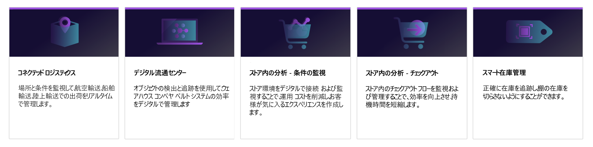
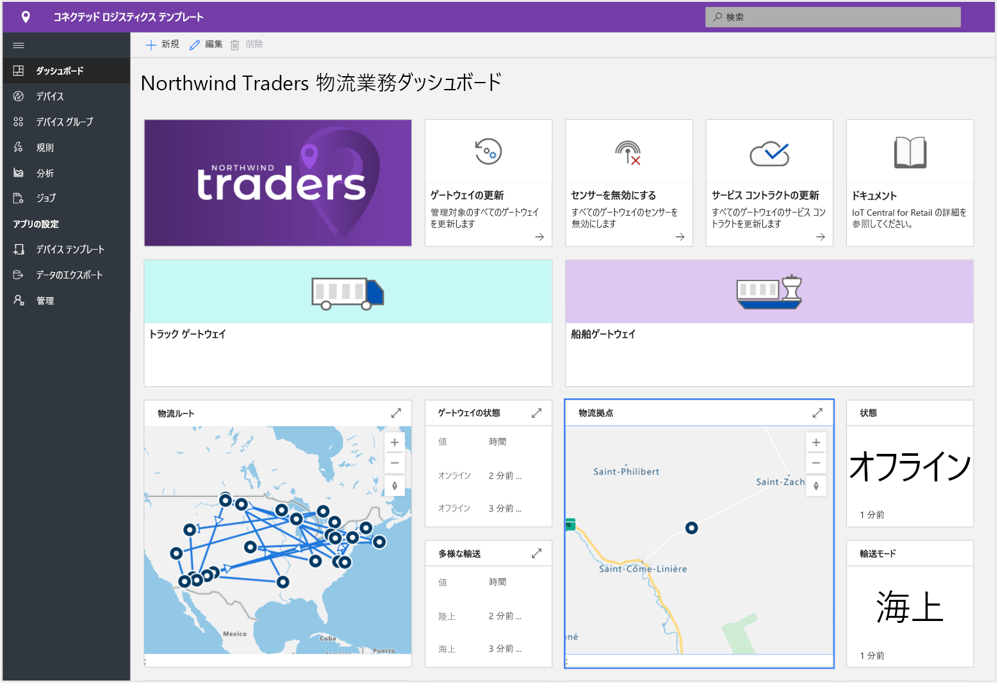
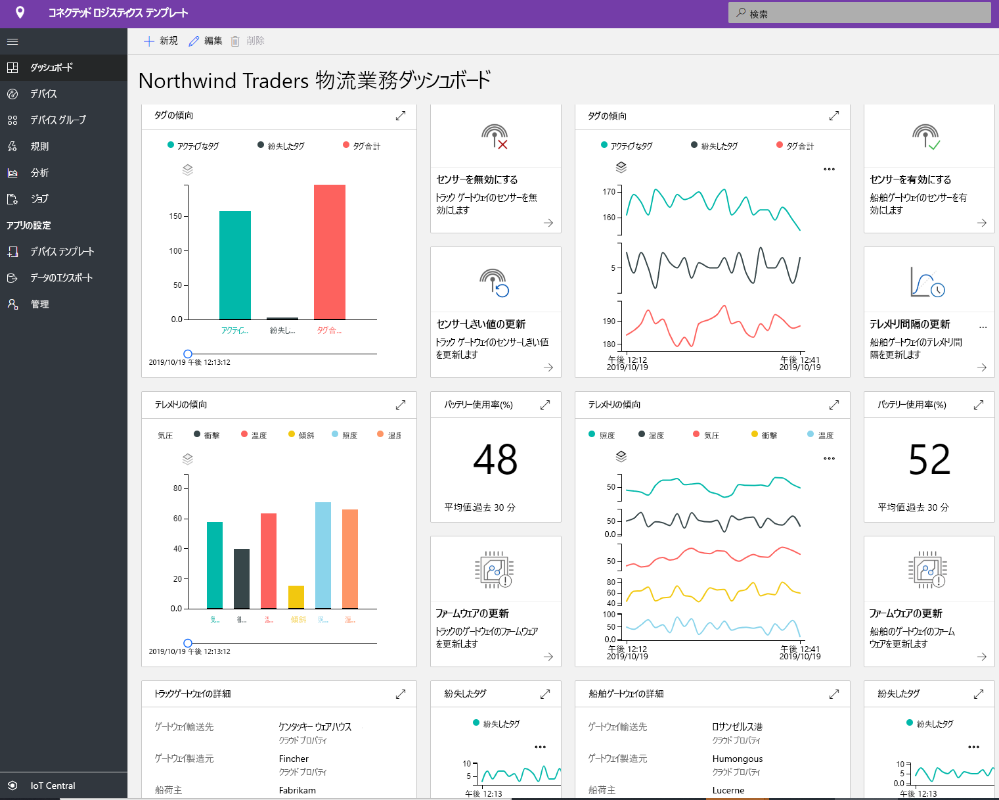
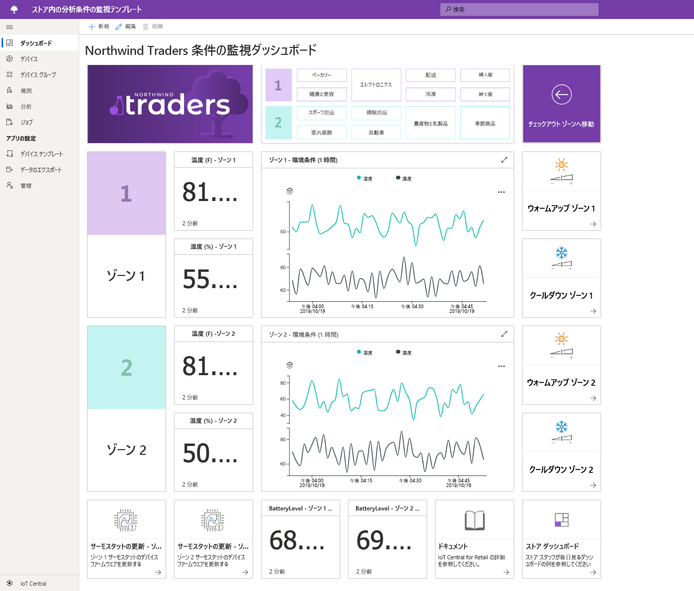
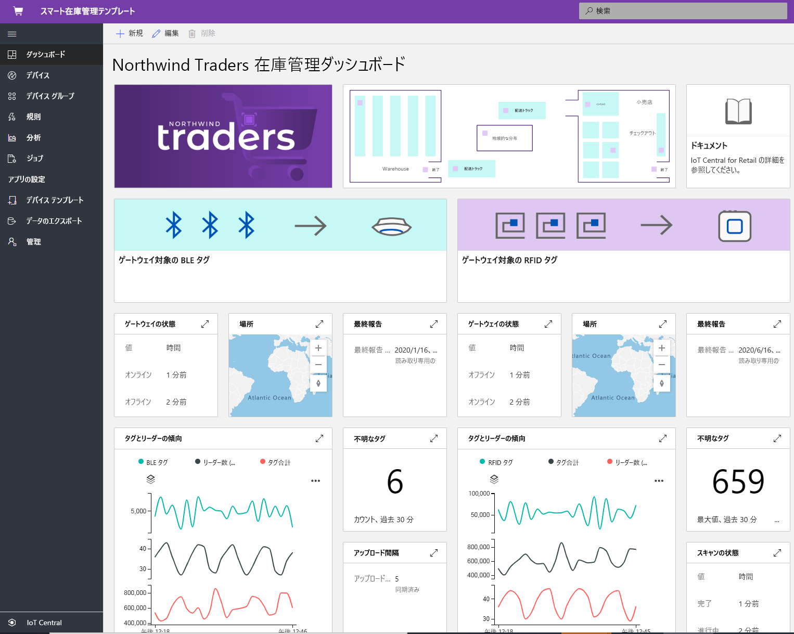

# Azure IoT Central を使用した小売ソリューションの構築

IoT Central は、エンタープライズ レベルの IoT ソリューションの開発、管理、および保守に関連する負担とコストを削減する IoT アプリ プラットフォームです。 Azure IoT Central を使用して構築することを選択すると、複雑で絶えず進化する IoT インフラストラクチャをただ維持し、更新するだけでなく、IoT データによってビジネスを変革することに時間、予算、エネルギーを集中させる機会が得られます。

この記事では、小売業向けに特化したいくつかの IoT Central アプリケーション テンプレートについて説明します。 ソリューション ビルダーは、これらのテンプレートを活用することで、サプライ チェーンの最適化、顧客の店舗内エクスペリエンスの向上、より効率的な在庫追跡を実現する IoT ソリューションを構築できます。

> [!div class="mx-imgBorder"]
> 

以下のセクションでは、これらのアプリケーション テンプレートの機能について説明します。

## コネクテッド ロジスティクス

グローバルな物流にかかる支出は、2020 年には 10 兆 6,000 億ドルに達することが予想されます。 この支出の大半は商品の輸送費で占められており、輸送業者は厳しい競争圧力と制約にさらされています。

IoT センサーを使用すると、気温、湿度、傾き、衝撃、光、積み荷の位置などの環境条件を収集して監視できます。 IoT センサーおよびデバイスから収集されたテレメトリは、クラウドベースのビジネス インテリジェンス システム内で、天気や交通情報などの他のデータ ソースと組み合わせることができます。

コネクテッド ロジスティクス ソリューションの利点は次のとおりです。

* リアルタイムでのトレースと追跡を使用した積み荷の監視。 
* リアルタイムでの環境条件監視を使用した積み荷の保護。
* 積み荷の盗難、紛失、破損に対するセキュリティ。
* ジオフェンシング、ルートの最適化、フリート管理、車両分析。
* 予測可能な積み荷の発送と到着の予測。

次のスクリーンショットでは、アプリケーション テンプレートですぐに使えるダッシュボードを示しています。 このダッシュボードは、特定のソリューションの要件に合わせて全面的にカスタマイズできます。

> [!div class="mx-imgBorder"]
> 

> [!div class="mx-imgBorder"]
> 

詳細については、[コネクテッド ロジスティクス アプリケーション テンプレートのデプロイと説明](./tutorial-iot-central-connected-logistics.md)に関するページを参照してください。

## デジタル流通センター

製造元と小売業者が世界各地で存在感を確立するにつれて、それぞれのサプライ チェーンは事業を拡大し、ますます複雑になります。 消費者は、多彩な商品が提供されることや、それらの商品が購入後 1 日か 2 日で手元に届くことを期待するようになっています。 流通センターは、このような傾向に順応すると同時に、抱えている非効率性の問題を克服することを求められています。 

現在、手作業に頼っている場合は、流通センターのコストの 55% から 65% を選別と梱包が占めることになります。 さらに、手動による選別と梱包は、通常、自動化されたシステムよりも時間がかかるうえ、スタッフ配置のニーズの急速な変動により、出荷量に対する対応はさらに困難になります。 この季節変動により、スタッフの離職率が高まり、コストのかかるエラーも発生しやすくなります。

IoT 対応カメラを活用したソリューションでは、デジタル フィードバック ループが可能になり、革新的なベネフィットを実現できます。 流通センター全体のデータを集約することにより、アクションにつながる分析情報を得ることができ、結果として、さらに良いデータが得られます。

デジタル流通センターの利点は次のとおりです。

* 商品の到着からコンベヤ システムを移動する間、カメラが商品を監視。
* 問題のある商品の自動識別。
* 効率的な注文の追跡。
* コストの削減、生産性の向上、使用率の最適化。

次のスクリーンショットでは、アプリケーション テンプレートですぐに使えるダッシュボードを示しています。 このダッシュボードは、特定のソリューションの要件に合わせて全面的にカスタマイズできます。 

> [!div class="mx-imgBorder"]
> 

詳細については、[デジタル流通センター アプリケーション テンプレートのデプロイと説明](./tutorial-iot-central-digital-distribution-center.md)に関するページを参照してください。

## ストア内分析 - 条件監視

多くの小売業者にとって、店舗内の環境条件は、競合他社との重要な差別化要因になります。 小売業者は、顧客のために、店舗内を快適な状態に維持したいと考えています。  

ソリューション ビルダーは、IoT Central のストア内分析条件監視アプリケーション テンプレートを使用して、エンドツーエンド ソリューションを構築できます。 このアプリケーション テンプレートを使用すると、さまざまな種類のセンサー デバイスを使用して、小売店の環境にデジタル接続して監視できます。 これらのセンサー デバイスは、ビジネス上の分析情報に変換できるテレメトリを生成し、小売業者の運営コストの削減と顧客向けの優れたエクスペリエンスの作成を支援します。

アプリケーション テンプレートは次の目的で使用できます。

* さまざまな IoT センサーを IoT Central アプリケーション インスタンスに接続する。
* 環境内のセンサー ネットワークとあらゆるゲートウェイ デバイスの正常性を監視および管理する。
* 店舗内の環境条件に関するカスタム ルールを作成し、ストア マネージャー向けのアラートをトリガーする。
* 店舗内の環境条件を、小売店チームがカスタマー エクスペリエンスの向上に使用できる分析情報に変換する。
* 集約された分析情報を既存または新規のビジネス アプリケーションにエクスポートして、販売スタッフに有益かつタイムリーな情報を提供する。

アプリケーション テンプレートには一連のデバイス テンプレートが付属しており、一連のシミュレートされたデバイスを使用してダッシュボードにデータを設定します。 

次のスクリーンショットでは、アプリケーション テンプレートですぐに使えるダッシュボードを示しています。 このダッシュボードは、特定のソリューションの要件に合わせて全面的にカスタマイズできます。 

> [!div class="mx-imgBorder"]
> 

詳細については、[Azure IoT Central でのストア内分析アプリケーションの作成](./tutorial-in-store-analytics-create-app.md)に関するページを参照してください。

## ストア内分析 - レジ

一部の小売業者では、店舗内での清算方法が、競合他社との重要な差別化要因になっています。 小売店では、店舗内でのスムーズな清算方法を提供することで、顧客の再訪を促そうとしています。  

ソリューション ビルダーは、IoT Central のストア内分析清算アプリケーション テンプレートを使用して、店舗の清算エリアに関する分析情報を販売スタッフに提供するソリューションを構築できます。 たとえば、センサーでは、各レジの列の長さと平均待ち時間に関する情報を提供できます。

アプリケーション テンプレートは次の目的で使用できます。

* さまざまな IoT センサーを IoT Central アプリケーション インスタンスに接続する。
* 環境内のセンサー ネットワークとあらゆるゲートウェイ デバイスの正常性を監視および管理する。
* 店舗内の清算条件に関するカスタム ルールを作成し、販売スタッフ向けのアラートをトリガーする。
* 店舗内の清算条件を、小売店チームがカスタマー エクスペリエンスの向上に使用できる分析情報に変換する。
* 集約された分析情報を既存または新規のビジネス アプリケーションにエクスポートして、販売スタッフに有益かつタイムリーな情報を提供する。

アプリケーション テンプレートには一連のデバイス テンプレートが付属しており、一連のシミュレートされたデバイスを使用して、ダッシュボードにレジの混雑状況データを設定します。 

次のスクリーンショットでは、アプリケーション テンプレートですぐに使えるダッシュボードを示しています。 このダッシュボードは、特定のソリューションの要件に合わせて全面的にカスタマイズできます。 

> [!div class="mx-imgBorder"]
> 

詳細については、[Azure IoT Central でのストア内分析アプリケーションの作成](./tutorial-in-store-analytics-create-app.md)に関するページを参照してください。

## スマート在庫管理

在庫とは、小売業者が抱える商品在庫のことです。 適切な製品を適切な場所に適切なタイミングで配置するためには、在庫管理が不可欠です。 小売業者は、在庫を抱えすぎた場合のコストと、需要を満たすには在庫品が足りない場合のコストのバランスを取る必要があります。

無線自動識別 (RFID) タグ、ビーコン、カメラから生成された IoT データにより、在庫管理プロセスを改善する機会が得られます。 IoT センサーおよびデバイスから収集されたテレメトリは、クラウドベースのビジネス インテリジェンス システム内で、天気や交通情報などの他のデータ ソースと組み合わせることができます。

スマート在庫管理の利点は次のとおりです。

* 商品の在庫切れリスクの軽減と目標とするカスタマー サービス レベルをの実現。 
* ほぼリアルタイムでの在庫精度の詳細な分析と分析情報。
* 顧客の注文に対応できる適切な在庫量を決定するのに役立つツール。

このアプリケーション テンプレートは、デバイスの接続性と、RFID および Bluetooth Low Energy (BLE) リーダー デバイスの構成と管理に重点を置いています。

次のスクリーンショットでは、アプリケーション テンプレートですぐに使えるダッシュボードを示しています。 このダッシュボードは、特定のソリューションの要件に合わせて全面的にカスタマイズできます。

> [!div class="mx-imgBorder"]
> 

詳細については、[スマート インベントリの管理アプリケーション テンプレートのデプロイと説明](./tutorial-iot-central-smart-inventory-management.md)に関するページを参照してください。

## マイクロフルフィルメント センター

ますます競争が激化する小売業界では、小売業者は常に需要とフルフィルメントのギャップを埋める必要に迫られています。 増加する消費者の需要に対応するため、新しいトレンドとして、エンド カスタマーとその訪問先の店舗の近くに在庫を保管するという新しいトレンドが出現しました。

ソリューション ビルダーは、IoT Central のマイクロフルフィルメント センター アプリケーション テンプレートを使用して、完全に自動化されたフルフィルメント センターのあらゆる側面を監視および管理できます。 このテンプレートには、ソリューションの開発プロセスを高速化するための、一連のシミュレートされた条件監視センサーと搬送ロボットが含まれています。 これらのセンサー デバイスがキャプチャする意味のある信号をビジネス上の分析情報に変換することにより、小売業者は運営コストを削減し、顧客に合わせたエクスペリエンスを実現できます。

このアプリケーション テンプレートを使用すると、次のことができます。 

- ロボットや状態監視センサーなどのさまざまな種類の IoT センサーを IoT Central アプリケーション インスタンスにシームレスに接続する。
- 環境内のセンサー ネットワークの正常性とあらゆるゲートウェイ デバイスを監視および管理する。
- フルフィルメント センター内の環境条件に関するカスタム ルールを作成し、適切なアラートをトリガーする。
- フルフィルメント センター内の環境条件を、小売倉庫のチームが活用できる分析情報に変換する。
- 販売スタッフ メンバーのために、集計された分析情報を既存または新規のビジネス アプリケーションにエクスポートする。

次のスクリーンショットでは、アプリケーション テンプレートですぐに使えるダッシュボードを示しています。 このダッシュボードは、特定のソリューションの要件に合わせて全面的にカスタマイズできます。

> [!div class="mx-imgBorder"]
> 

詳細については、[マイクロフルフィルメント センター アプリケーション テンプレートのデプロイと説明](./tutorial-micro-fulfillment-center.md)に関するページを参照してください。

## 次のステップ

流通ソリューションの構築を開始するには:

* ストア内分析アプリケーション テンプレートのいずれかを使用してソリューションを構築する方法について説明する、[Azure IoT Central でのストア内分析アプリケーションの作成](./tutorial-in-store-analytics-create-app.md)に関するチュートリアルから始める。
* [コネクテッド ロジスティクス アプリケーション テンプレートをデプロイして調べる](./tutorial-iot-central-connected-logistics.md)。
* [デジタル流通センター アプリケーション テンプレートをデプロイして調べる](./tutorial-iot-central-digital-distribution-center.md)。
* [スマート インベントリの管理アプリケーション テンプレートをデプロイして調べる](./tutorial-iot-central-smart-inventory-management.md)。
* [マイクロフルフィルメント センター アプリケーション テンプレートをデプロイして調べる](./tutorial-micro-fulfillment-center.md)。
* [IoT Central の概要](../preview/overview-iot-central.md)に関するページで、IoT Central の詳細について確認する。
