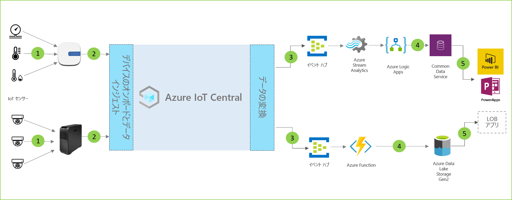

# ストア内の分析のアーキテクチャ

ストア内の分析ソリューションを使うと、小売店環境内でさまざまな条件を監視できます。 これらのソリューションは、IoT Central のいずれかのアプリケーション テンプレートと以下のアーキテクチャ ガイダンスを使用して構築できます。

- ゲートウェイ デバイスにテレメトリ データを送信している IoT センサーのセット
- テレメトリと集計された分析情報を IoT Central に送信しているゲートウェイ デバイス
- 操作のために目的の Azure サービスへの継続的データ エクスポート
- データを必要な形式で構造化し、ストレージ サービスに送信できます
- ビジネス アプリケーションを使って、データのクエリを実行し、小売りの活動に役立つ分析情報を生成することができます
 
ストア内の分析ソリューションで一般的に役立つ主要なコンポーネントについて見ていきましょう。

## 状況監視センサー

IoT ソリューションは、小売店環境内から意味のある信号をキャプチャするセンサーのセットから始まります。 これは、上のアーキテクチャ図の左端にあるさまざまな種類のセンサーによって反映されています。

## ゲートウェイ デバイス

多くの IoT センサーでは、未加工の信号を、直接クラウドに、または近くにあるゲートウェイ デバイスにフィードできます。 ゲートウェイ デバイスでは、概要分析情報を IoT Central アプリケーションに送信する前に、エッジでデータの集計が実行されます。 ゲートウェイ デバイスは、必要に応じて、センサー デバイスに対してコマンドと制御操作を中継する役割も担います。 

## IoT Central アプリケーション

Azure IoT Central アプリケーションにより、小売店環境内のさまざまな種類の IoT センサーやゲートウェイ デバイスからデータが取り込まれて、意味のある分析情報のセットが生成されます。

また、Azure IoT Central では、ストアオ ペレーターがインフラストラクチャ デバイスをリモートで監視および管理できるように、カスタマイズされたエクスペリエンスが提供されます。

## データの変換
ソリューション内の Azure IoT Central アプリケーションは、一連の Azure PaaS (サービスとしてのプラットフォーム) サービスに対して、未加工または集計済みの分析情報をエクスポートするように構成できます。これらのサービスでは、データの操作を実行し、分析情報を補強してから、ビジネス アプリケーションに渡すことができます。 

## ビジネス アプリケーション
IoT データを使用して、小売り環境内に展開されたさまざまな種類のビジネス アプリケーションを強化することができます。 小売店のマネージャーまたはスタッフ メンバーは、これらのアプリケーションを使用して、ビジネス分析情報を視覚化し、意味のあるアクションをリアルタイムで実行できます。 小売りチーム向けのリアルタイム Power BI ダッシュボードを作成する方法については、[こちらのチュートリアル](./tutorial-in-store-analytics-create-app-pnp.md)を参照してください。

## 次のステップ
* [ストア内の分析 - チェックアウト](https://aka.ms/checkouttemplate)および[ストア内の分析 - 条件の監視](https://aka.ms/conditiontemplate)アプリケーション テンプレートの使用を始めます。 
* ストア内の分析アプリケーション テンプレートの 1 つを使用してソリューションを構築する方法が説明されている[エンド ツー エンドのチュートリアル](https://aka.ms/storeanalytics-tutorial)を調べます。
